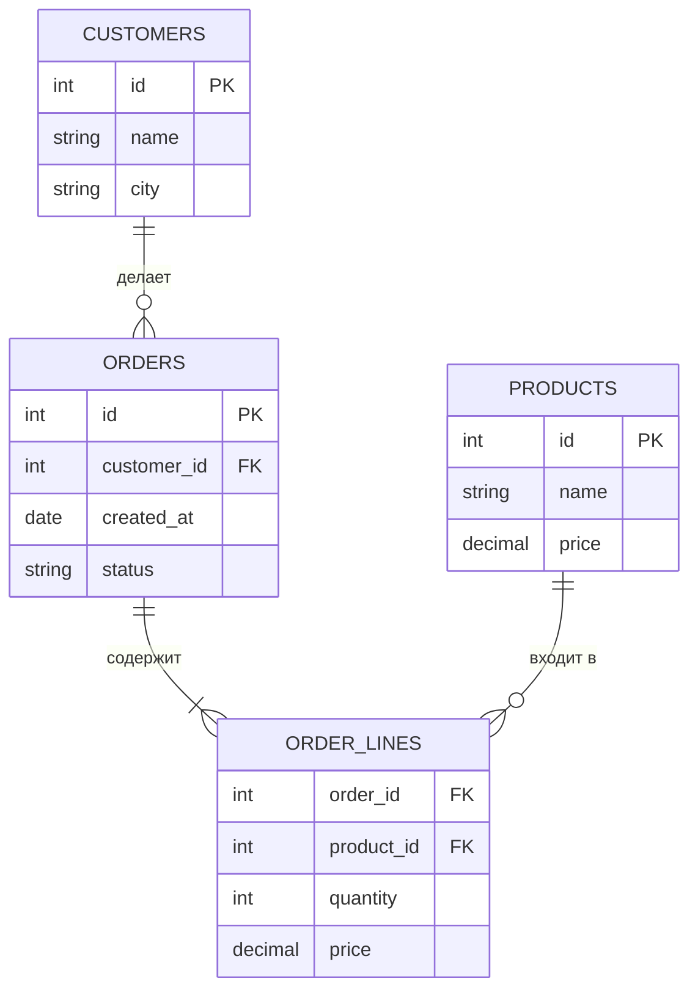
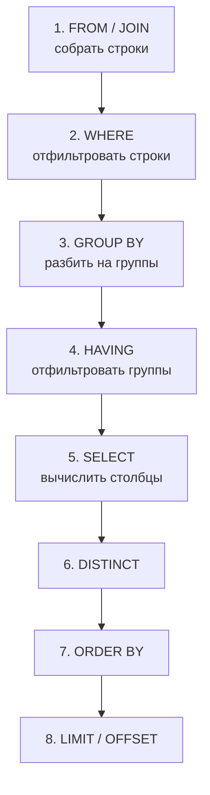

:::tldr
- Реляционная БД хранит данные в **таблицах** (строки и столбцы). **Первичный ключ** (PK) однозначно идентифицирует строку, **внешний ключ** (FK) ссылается на строку другой таблицы и обеспечивает целостность связей.
- Основа запроса: `SELECT столбцы FROM таблица WHERE условие GROUP BY ... HAVING ... ORDER BY ... LIMIT/OFFSET`.
- **Логический порядок выполнения** отличается от порядка записи: `FROM/JOIN → WHERE → GROUP BY → HAVING → SELECT → DISTINCT → ORDER BY → LIMIT`. Поэтому псевдоним из `SELECT` нельзя использовать в `WHERE`, но можно в `ORDER BY`.
- **WHERE** фильтрует строки **до** группировки, **HAVING** — группы **после** (условия на агрегаты: `HAVING COUNT(*) > 5`).
- **NULL** — «неизвестно»: `NULL = NULL` не истина; проверка только `IS NULL` / `IS NOT NULL`; агрегаты (кроме `COUNT(*)`) игнорируют NULL.
- Команды: **DML** (`SELECT`, `INSERT`, `UPDATE`, `DELETE`), **DDL** (`CREATE`, `ALTER`, `DROP`), **DCL** (`GRANT`, `REVOKE`), **TCL** (`BEGIN`, `COMMIT`, `ROLLBACK`).
:::

## Пример схемы



```sql Создание таблиц
CREATE TABLE customers (
    id       SERIAL PRIMARY KEY,
    name     VARCHAR(200) NOT NULL,
    email    VARCHAR(320) NOT NULL UNIQUE,
    city     VARCHAR(100)
);

CREATE TABLE orders (
    id          SERIAL PRIMARY KEY,
    customer_id INT NOT NULL REFERENCES customers(id),     -- внешний ключ
    created_at  TIMESTAMPTZ NOT NULL DEFAULT now(),
    status      VARCHAR(20) NOT NULL DEFAULT 'New',
    total       NUMERIC(12, 2) NOT NULL CHECK (total >= 0)
);
```

## SELECT и WHERE

```sql
SELECT id, name, city
FROM customers
WHERE city = 'Ташкент'
  AND email LIKE '%@gmail.com'          -- шаблон: % — любые символы, _ — один символ
ORDER BY name
LIMIT 20 OFFSET 40;                     -- 3-я страница по 20 (SQL Server: OFFSET ... FETCH)

SELECT * FROM orders WHERE status IN ('New', 'Paid');
SELECT * FROM orders WHERE total BETWEEN 100000 AND 500000;
SELECT * FROM customers WHERE city IS NULL;            -- НЕ city = NULL
```

## Агрегаты, GROUP BY и HAVING

```sql Выручка по городам, только города с более чем 10 заказами
SELECT c.city,
       COUNT(*)          AS orders_count,
       SUM(o.total)      AS revenue,
       AVG(o.total)      AS avg_check
FROM orders o
JOIN customers c ON c.id = o.customer_id
WHERE o.status = 'Paid'                 -- фильтр строк ДО группировки
GROUP BY c.city
HAVING COUNT(*) > 10                    -- фильтр групп ПОСЛЕ группировки
ORDER BY revenue DESC;
```



Следствия порядка:
- `WHERE revenue > 1000` — ошибка: `revenue` вычисляется в `SELECT`, позже `WHERE`. Нужно `HAVING SUM(o.total) > 1000`.
- `ORDER BY revenue` — работает: сортировка после `SELECT`.
- В `SELECT` с `GROUP BY` можно указывать только столбцы группировки и агрегаты.

| Агрегат | Что считает | NULL |
|---|---|---|
| `COUNT(*)` | Число строк | Учитывает все строки |
| `COUNT(col)` | Число не-NULL значений | Игнорирует NULL |
| `SUM`, `AVG` | Сумма, среднее | Игнорируют NULL |
| `MIN`, `MAX` | Минимум, максимум | Игнорируют NULL |

## NULL

```sql
SELECT NULL = NULL;                 -- NULL (не TRUE!)
SELECT * FROM customers WHERE city <> 'Ташкент';   -- строки с city = NULL НЕ попадут
SELECT * FROM customers WHERE city <> 'Ташкент' OR city IS NULL;

SELECT name, COALESCE(city, 'не указан') AS city FROM customers;   -- замена NULL
```

`NULL` означает «значение неизвестно», поэтому любое сравнение с ним даёт «неизвестно» (трёхзначная логика: TRUE, FALSE, UNKNOWN), и строка не проходит фильтр.

## INSERT, UPDATE, DELETE

```sql
INSERT INTO customers (name, email, city) VALUES ('Анна', 'anna@mail.uz', 'Самарканд')
RETURNING id;                                  -- PostgreSQL: получить сгенерированный id

UPDATE orders SET status = 'Cancelled' WHERE id = 42;     -- без WHERE изменятся ВСЕ строки!

DELETE FROM orders WHERE status = 'Draft' AND created_at < now() - INTERVAL '30 days';

BEGIN;                                         -- транзакция: всё или ничего
UPDATE accounts SET balance = balance - 100 WHERE id = 1;
UPDATE accounts SET balance = balance + 100 WHERE id = 2;
COMMIT;
```

:::warning UPDATE и DELETE без WHERE
Самая дорогая ошибка новичка. Перед выполнением в продакшене: проверьте условие тем же `SELECT ... WHERE`, работайте в транзакции (`BEGIN` → проверка → `COMMIT`/`ROLLBACK`), используйте учётную запись с минимальными правами.
:::

## Подзапросы и EXISTS

```sql Клиенты без заказов
SELECT c.*
FROM customers c
WHERE NOT EXISTS (SELECT 1 FROM orders o WHERE o.customer_id = c.id);

-- Заказы дороже среднего
SELECT * FROM orders WHERE total > (SELECT AVG(total) FROM orders);
```

## Типы команд SQL

| Группа | Команды | Назначение |
|---|---|---|
| DML | `SELECT`, `INSERT`, `UPDATE`, `DELETE`, `MERGE` | Работа с данными |
| DDL | `CREATE`, `ALTER`, `DROP`, `TRUNCATE` | Структура БД |
| DCL | `GRANT`, `REVOKE` | Права доступа |
| TCL | `BEGIN`, `COMMIT`, `ROLLBACK`, `SAVEPOINT` | Транзакции |

## Вопросы на засыпку

:::qa Чем WHERE отличается от HAVING?
`WHERE` фильтрует отдельные строки до группировки и не может содержать агрегаты. `HAVING` фильтрует уже сформированные группы и работает с агрегатами (`HAVING SUM(total) > 1000`). Условия, не зависящие от агрегатов, лучше писать в `WHERE` — так меньше строк попадает в группировку.
:::

:::qa Чем DELETE отличается от TRUNCATE?
`DELETE` удаляет строки по условию, построчно, срабатывают триггеры, можно откатить. `TRUNCATE` очищает всю таблицу целиком, гораздо быстрее, без условия, сбрасывает счётчики идентификаторов; в PostgreSQL выполняется в транзакции и откатывается, в SQL Server тоже, но требует других прав.
:::

:::qa Почему COUNT(column) может быть меньше COUNT(*)?
`COUNT(*)` считает все строки, а `COUNT(column)` — только строки, где значение столбца не `NULL`.
:::

:::qa Что такое первичный и внешний ключ и зачем они нужны?
Первичный ключ уникально идентифицирует строку (не NULL, уникален, автоматически индексируется). Внешний ключ гарантирует, что ссылка указывает на существующую строку другой таблицы: нельзя создать заказ для несуществующего клиента или удалить клиента с заказами (если не задано `ON DELETE CASCADE`).
:::

## Итог

SQL-запрос читается как «что выбрать, откуда, с каким условием, как сгруппировать и отсортировать», но выполняется в порядке FROM → WHERE → GROUP BY → HAVING → SELECT → ORDER BY → LIMIT. `WHERE` фильтрует строки, `HAVING` — группы; `NULL` проверяется только через `IS NULL`. Ключи обеспечивают целостность данных, а изменения выполняйте осторожно — с условием и в транзакции.
