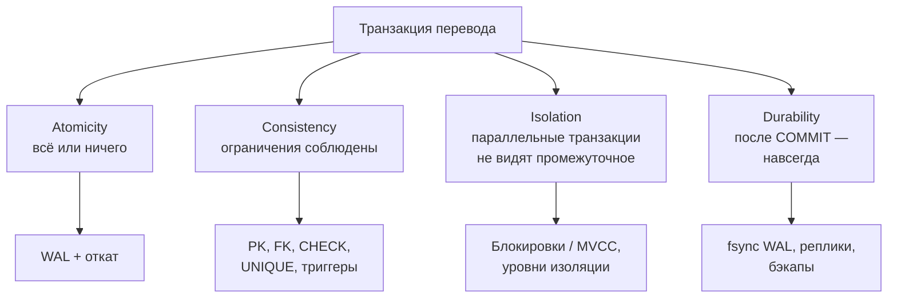
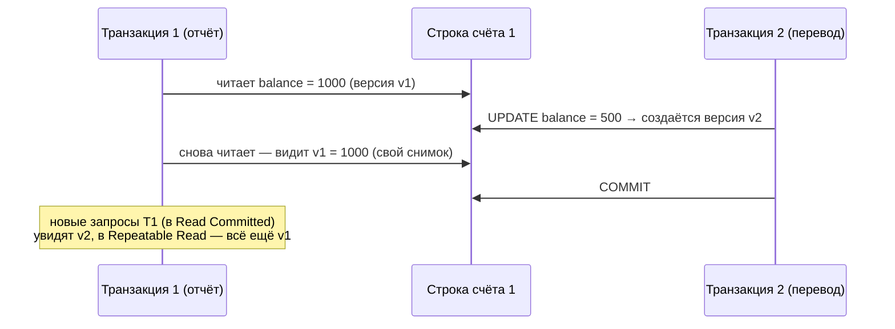
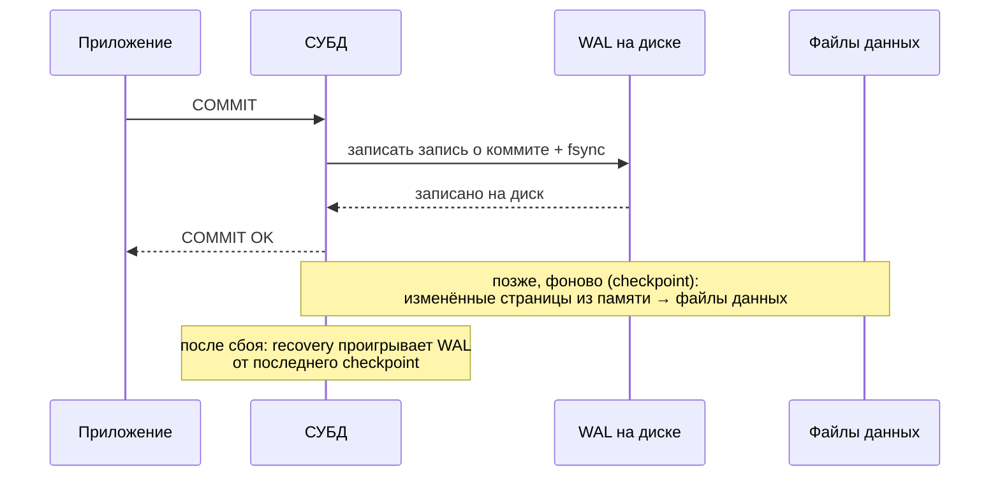

:::tldr
- **Atomicity (атомарность)** — транзакция выполняется **целиком или никак**. Обеспечивается журналом (WAL/transaction log) и механизмом отката (undo / версии строк).
- **Consistency (согласованность)** — транзакция переводит БД из одного **корректного** состояния в другое: соблюдаются ограничения (PK, FK, UNIQUE, CHECK, NOT NULL), триггеры. Бизнес-инварианты — ответственность приложения.
- **Isolation (изоляция)** — параллельные транзакции не мешают друг другу так, будто выполнялись по очереди (в разной степени — **уровни изоляции**). Обеспечивается **блокировками** и/или **MVCC**.
- **Durability (долговечность)** — после `COMMIT` данные не пропадут даже при сбое питания. Обеспечивается записью **WAL на диск** (fsync) до подтверждения коммита, репликацией, бэкапами.
- ACID — свойство **одной** базы данных. Между сервисами и базами действует другая модель — **eventual consistency** (BASE), Saga, Outbox.
:::

## Пример: перевод денег

```sql
BEGIN;
UPDATE accounts SET balance = balance - 500 WHERE id = 1;   -- списание
UPDATE accounts SET balance = balance + 500 WHERE id = 2;   -- зачисление
INSERT INTO transfers (from_id, to_id, amount) VALUES (1, 2, 500);
COMMIT;
```

Что может пойти не так без ACID:
- Сбой после первого `UPDATE` — деньги списаны, но не зачислены (**атомарность**).
- Баланс ушёл в минус, хотя правило запрещает (**согласованность**).
- Параллельный отчёт видит сумму на счетах на 500 меньше реальной (**изоляция**).
- Сервер «упал» через секунду после «успешного» ответа, и перевод пропал (**долговечность**).



## Atomicity

Каждое изменение сначала описывается в **журнале предзаписи** (Write-Ahead Log в PostgreSQL, transaction log в SQL Server). Если транзакция откатывается (явно `ROLLBACK`, ошибкой или сбоем), СУБД отменяет её изменения:

- **PostgreSQL** хранит новые версии строк рядом со старыми (MVCC); у незафиксированной транзакции статус «aborted», её версии просто невидимы и позже удаляются VACUUM-ом.
- **SQL Server / Oracle** используют записи undo в журнале/сегментах отката, чтобы вернуть страницы к исходному состоянию.

Поведение при ошибке внутри транзакции различается: в PostgreSQL после ошибки транзакция переходит в состояние «aborted» и ждёт `ROLLBACK`; в SQL Server по умолчанию откатывается только упавшая команда (`SET XACT_ABORT ON` меняет это на откат всей транзакции — рекомендуется).

## Consistency

```sql
CREATE TABLE accounts (
    id       bigint PRIMARY KEY,
    owner_id bigint NOT NULL REFERENCES customers(id),
    balance  numeric(18,2) NOT NULL CHECK (balance >= 0),   -- баланс не может быть отрицательным
    currency char(3) NOT NULL
);
```

Если после списания баланс станет `-100`, `CHECK` отклонит команду, и транзакция не сможет зафиксироваться. База гарантирует **декларативные** ограничения; более сложные бизнес-правила («не больше 3 переводов в день») обеспечивает приложение — желательно тоже внутри транзакции.

:::note C в ACID и C в CAP — разные вещи
В ACID «согласованность» — соблюдение ограничений целостности. В CAP-теореме «consistency» — все узлы распределённой системы видят одни и те же данные (линеаризуемость). Путать их — частая ошибка на собеседованиях.
:::

## Isolation

Полная изоляция (serializable) дорога, поэтому СУБД предлагают **уровни** — компромисс между корректностью и параллелизмом: Read Uncommitted, Read Committed, Repeatable Read, Serializable. Подробно — в следующем вопросе.

Механизмы:
- **Блокировки (2PL)**: читатели и писатели блокируют друг друга (классический SQL Server без snapshot).
- **MVCC** (Multi-Version Concurrency Control): каждая транзакция видит **снимок** данных; читатели не блокируют писателей и наоборот (PostgreSQL, Oracle, SQL Server с `READ_COMMITTED_SNAPSHOT`).



## Durability



- Данные в файлах таблиц обновляются **лениво** (страницы в памяти — shared buffers / buffer pool). Долговечность обеспечивает именно **журнал**: он пишется последовательно и синхронизируется с диском до ответа клиенту.
- Настройки, ослабляющие durability ради скорости: `synchronous_commit = off` (PostgreSQL), `DELAYED_DURABILITY` (SQL Server) — можно потерять последние миллисекунды транзакций при сбое.
- Защита от потери **сервера/диска** — синхронная репликация и бэкапы с архивом WAL (point-in-time recovery).

## ACID в распределённых системах

Как только данные распределены по нескольким сервисам или базам, одна ACID-транзакция невозможна (или слишком дорога — 2PC). Используют:

| Подход | Суть |
|---|---|
| **BASE** | Basically Available, Soft state, Eventually consistent |
| **Saga** | Цепочка локальных транзакций с компенсациями |
| **Outbox** | Атомарная запись данных и события в одну БД + асинхронная доставка |
| **Идемпотентность** | Повторная обработка сообщения не меняет результат |

## Вопросы на засыпку

:::qa Все ли NoSQL-базы не поддерживают ACID?
Нет. MongoDB с 4.0 поддерживает многодокументные ACID-транзакции, у многих NoSQL-баз атомарны операции над одним документом/ключом. Некоторые распределённые SQL-базы (CockroachDB, YugabyteDB, Spanner) дают ACID в кластере. Граница проходит по гарантиям конкретной системы, а не по «SQL/NoSQL».
:::

:::qa Что такое WAL и почему последовательная запись быстрее?
Write-Ahead Log — журнал, куда изменения пишутся **до** изменения страниц данных. Запись в конец файла последовательная — диск (и особенно HDD) выполняет её намного быстрее случайной записи в разные страницы таблиц и индексов. Страницы данных сбрасываются потом пакетами.
:::

:::qa Гарантирует ли ACID, что в БД не будет «грязных» бизнес-данных?
Нет. БД гарантирует свои ограничения и атомарность. Если приложение в одной транзакции записало логически неверные данные, ACID их не исправит. Поэтому инварианты стоит выражать ограничениями БД, где возможно (CHECK, UNIQUE, FK).
:::

:::qa Что такое autocommit?
Режим, в котором каждая отдельная команда — это своя транзакция, фиксируемая автоматически. Большинство драйверов и СУБД работают так по умолчанию, пока не вызван явный `BEGIN`. EF Core оборачивает `SaveChanges` в транзакцию сам.
:::

## Итог

ACID — четыре гарантии транзакции: всё или ничего (журнал и откат), соблюдение ограничений, изоляция параллельных транзакций (блокировки и MVCC) и сохранность после коммита (WAL с fsync). Это основа надёжности реляционных баз; за пределами одной базы её заменяют Saga, Outbox и eventual consistency.
