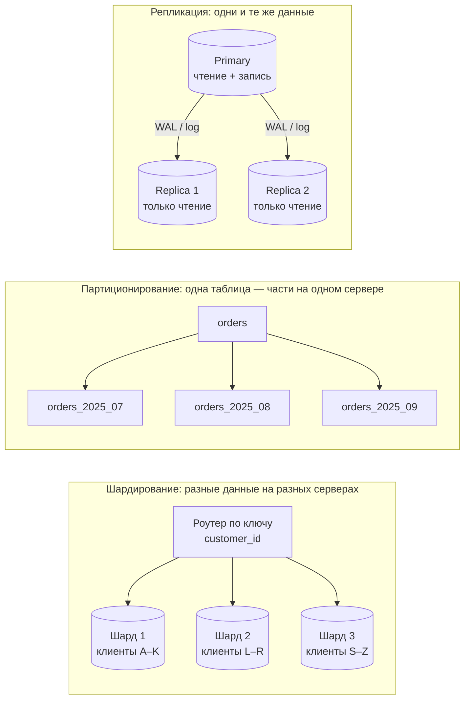
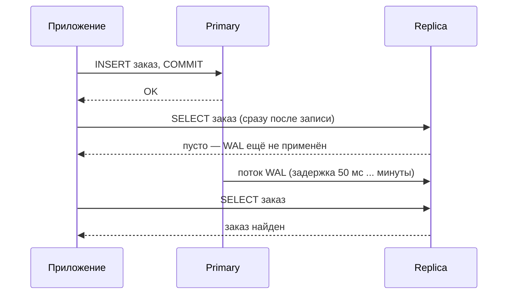
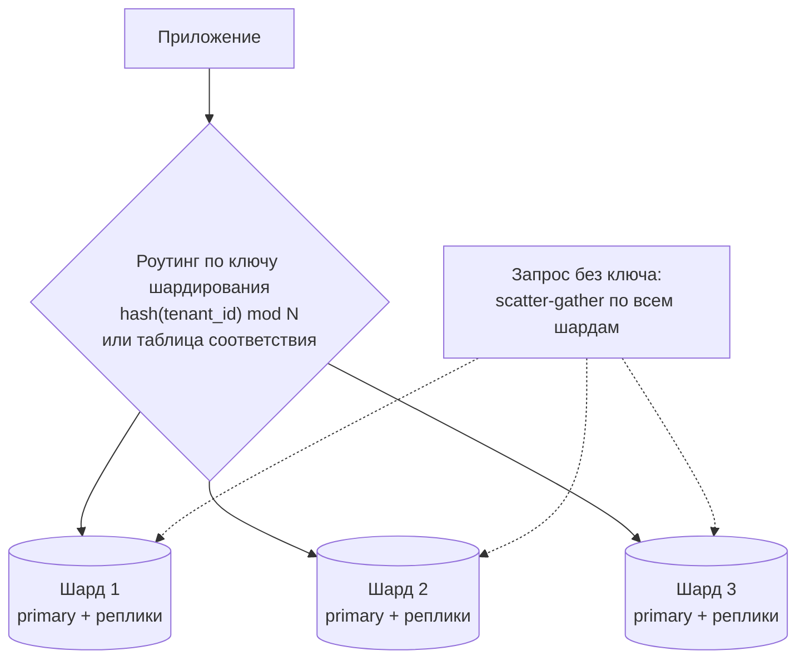
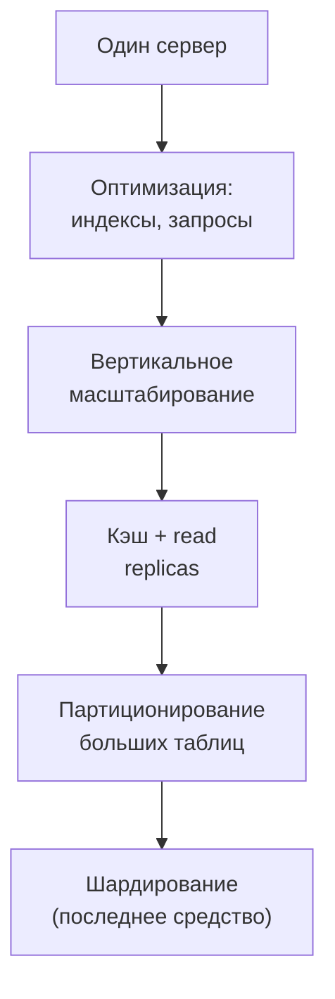

:::tldr
- **Репликация** — **копии одних и тех же данных** на нескольких серверах. Цели: **отказоустойчивость** (failover) и **масштабирование чтения** (read replicas). Запись обычно идёт в один **primary**. Бывает синхронной (нет потерь, медленнее) и асинхронной (быстро, **replication lag**, возможна потеря последних транзакций).
- **Партиционирование** — деление **одной таблицы** на части (партиции) **внутри одного сервера** по ключу (диапазон дат, список регионов, хэш). Цели: быстрое удаление старых данных, **partition pruning** в запросах, обслуживание по частям.
- **Шардирование** — распределение **разных данных** по **разным серверам** (шардам) по ключу шардирования. Цель — масштабирование **записи и объёма** за пределы одного сервера. Цена — кросс-шардовые запросы и транзакции, перебалансировка, сложность.
- Обычный порядок роста: вертикальное масштабирование → индексы и оптимизация → read replicas + кэш → партиционирование → шардирование (последнее средство).
:::

## Три подхода на одной картинке



| | Репликация | Партиционирование | Шардирование |
|---|---|---|---|
| Что делим | Ничего — копируем | Таблицу на части | Данные между серверами |
| Где | Несколько серверов | Один сервер | Несколько серверов |
| Масштабирует чтение | **Да** | Частично (pruning) | Да |
| Масштабирует запись | Нет | Нет | **Да** |
| Отказоустойчивость | **Да** | Нет | Частично (каждый шард — ещё и реплицируют) |
| Прозрачность для приложения | Почти (разделение чтения/записи) | **Полная** | Низкая (ключ, роутинг, кросс-шардовые запросы) |
| Сложность | Средняя | Низкая–средняя | Высокая |

## Репликация



| Режим | Гарантия | Цена |
|---|---|---|
| **Асинхронная** | Primary не ждёт реплику | Lag, потеря последних транзакций при падении primary |
| **Синхронная** | Коммит подтверждается после записи на реплику(и) | Задержка каждой записи, зависимость от доступности реплики |
| **Полусинхронная / кворум** | Ждём N из M реплик | Компромисс |

Типы: **физическая** (поток WAL/страниц, реплика — точная копия; PostgreSQL streaming replication, SQL Server Always On AG) и **логическая** (поток изменений строк; можно реплицировать часть таблиц, между версиями, в другую систему — CDC, Debezium).

### Проблема «read your writes»

Пользователь сохранил профиль, страница перезагрузилась — и показывает старые данные с реплики. Решения:
- Читать с **primary** сразу после записи (на время сессии/несколько секунд).
- Читать с реплики, только если её позиция WAL ≥ позиции записи (LSN).
- Отправлять на реплики только отчёты и некритичное чтение.

```csharp Разделение чтения и записи в .NET
builder.Services.AddDbContext<WriteDbContext>(o => o.UseNpgsql(cfg.GetConnectionString("Primary")));
builder.Services.AddDbContext<ReadDbContext>(o => o
    .UseNpgsql(cfg.GetConnectionString("Replica"))
    .UseQueryTrackingBehavior(QueryTrackingBehavior.NoTracking));

// Npgsql умеет и сам: несколько хостов и балансировка чтения
// "Host=pg1,pg2,pg3;Target Session Attributes=prefer-standby;Load Balance Hosts=true"
```

### Failover

При падении primary одна из реплик **повышается** (promotion) до primary. Автоматически это делают Patroni (PostgreSQL), Always On (SQL Server), облачные managed-сервисы. Опасность — **split brain** (два primary одновременно) — решается кворумом и fencing.

## Партиционирование

```sql PostgreSQL: декларативное партиционирование по диапазону
CREATE TABLE orders (
    id          bigint GENERATED ALWAYS AS IDENTITY,
    customer_id bigint NOT NULL,
    created_at  timestamptz NOT NULL,
    total       numeric(18,2) NOT NULL,
    PRIMARY KEY (id, created_at)                         -- ключ партиционирования входит в PK
) PARTITION BY RANGE (created_at);

CREATE TABLE orders_2025_09 PARTITION OF orders FOR VALUES FROM ('2025-09-01') TO ('2025-10-01');
CREATE TABLE orders_2025_10 PARTITION OF orders FOR VALUES FROM ('2025-10-01') TO ('2025-11-01');

-- Запрос за сентябрь читает ТОЛЬКО orders_2025_09 (partition pruning)
SELECT SUM(total) FROM orders WHERE created_at >= '2025-09-01' AND created_at < '2025-10-01';

-- Удаление старых данных — мгновенно, без DELETE миллионов строк и раздувания таблицы
ALTER TABLE orders DETACH PARTITION orders_2023_01;
DROP TABLE orders_2023_01;
```

Стратегии: **RANGE** (даты — самый частый), **LIST** (регион, тенант), **HASH** (равномерное распределение). Автоматизация создания партиций — `pg_partman`, задания по расписанию.

Подводные камни:
- Запрос **без ключа партиционирования** в `WHERE` читает все партиции.
- Уникальность и PK должны включать ключ партиционирования.
- Слишком много партиций (тысячи) замедляет планирование.

## Шардирование



**Выбор ключа шардирования** — главное решение:
- Большинство запросов должны содержать ключ (иначе — запрос ко всем шардам).
- Связанные данные — на одном шарде (все заказы тенанта вместе с тенантом).
- Равномерное распределение без «горячих» шардов (крупный клиент может перегрузить свой шард).

| Стратегия | Плюсы | Минусы |
|---|---|---|
| **Диапазон** ключа | Эффективные диапазонные запросы | Горячие шарды (новые данные в последнем) |
| **Хэш** ключа | Равномерность | Перебалансировка при изменении N (решает consistent hashing) |
| **Справочник** (directory) | Гибко, можно переносить тенантов | Отдельный сервис-роутер — точка отказа |
| По **тенанту / географии** | Изоляция, соответствие законам о данных | Неравномерность размеров |

Цена шардирования: нет JOIN-ов и ACID-транзакций между шардами (нужны Saga/2PC), сложные глобальные агрегаты и уникальность, перебалансировка данных, резервное копирование и миграции схемы на N серверов. Готовые решения: **Citus** (PostgreSQL), **Vitess** (MySQL), распределённые SQL-базы (CockroachDB, YugabyteDB), встроенное шардирование MongoDB/Cassandra.

## Путь масштабирования



## Вопросы на засыпку

:::qa Может ли реплика заменить бэкап?
Нет. Реплика мгновенно повторит ошибочный `DELETE` или `DROP TABLE`. Бэкапы с архивом WAL позволяют восстановиться на момент времени до ошибки (PITR). Для защиты от ошибок иногда используют отложенную реплику (`recovery_min_apply_delay`).
:::

:::qa Что такое consistent hashing?
Схема распределения, при которой ключи и серверы размещаются на «кольце» хэшей, и ключ принадлежит ближайшему серверу по часовой стрелке. При добавлении сервера перемещается лишь ~1/N ключей, а не почти все, как при `hash mod N`.
:::

:::qa Чем партиционирование отличается от шардирования, если и там, и там данные делятся по ключу?
Партиции живут на **одном** сервере и управляются одной СУБД прозрачно для приложения (обычный SQL, транзакции, JOIN-ы работают). Шарды — **разные** серверы, приложение или промежуточный слой должен знать, куда идти, а межшардовые операции ограничены.
:::

:::qa Как генерировать уникальные идентификаторы при шардировании?
Автоинкремент одного сервера не подходит. Используют UUID (лучше v7 — упорядоченный по времени), Snowflake-подобные ID (время + id узла + счётчик), или диапазоны последовательностей, выделяемые каждому шарду.
:::

## Итог

Репликация копирует данные ради отказоустойчивости и масштабирования чтения (помните про lag), партиционирование делит большую таблицу на части внутри сервера ради обслуживания и pruning, шардирование распределяет данные по серверам ради масштабирования записи — и приносит самую большую сложность. Применяйте их по мере роста, начиная с простого.
