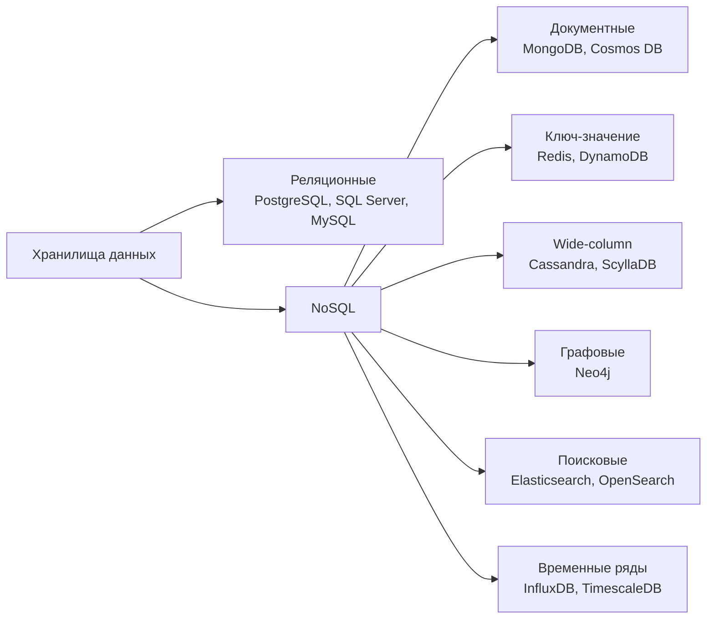
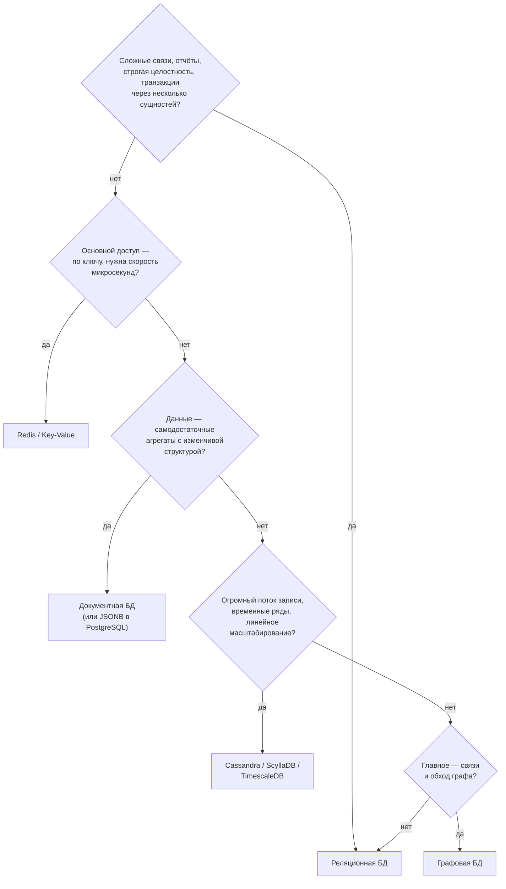
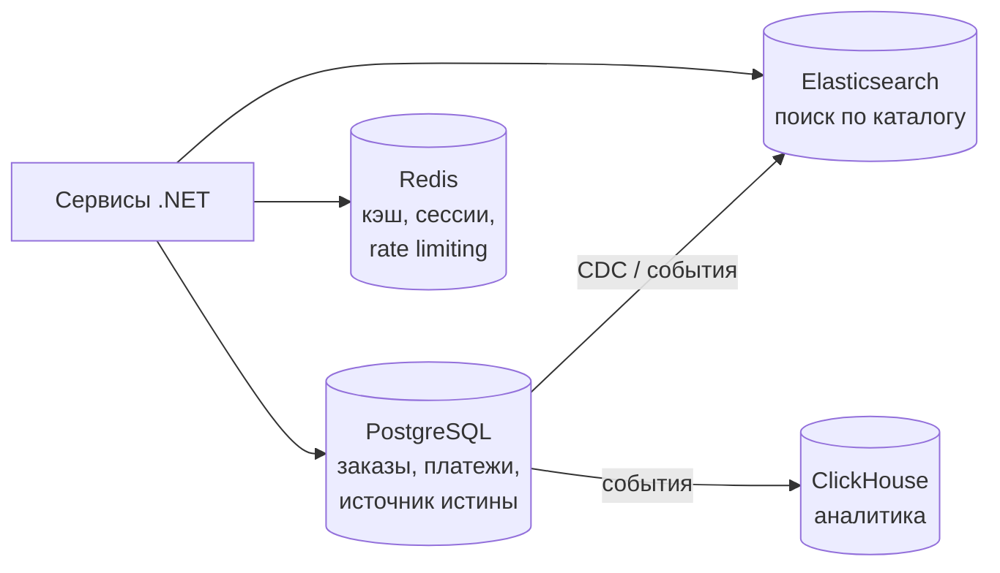

:::tldr
- **SQL (реляционные)**: данные в таблицах со **строгой схемой**, связи через внешние ключи, мощный язык запросов с JOIN-ами и агрегатами, **ACID-транзакции**. PostgreSQL, SQL Server, MySQL, Oracle.
- **NoSQL** — общее название нереляционных моделей: **документные** (MongoDB, Couchbase), **ключ-значение** (Redis, DynamoDB), **колоночные / wide-column** (Cassandra, ScyllaDB, HBase), **графовые** (Neo4j), **поисковые** (Elasticsearch), **временные ряды** (InfluxDB, TimescaleDB).
- NoSQL обычно выигрывает в **горизонтальном масштабировании**, гибкости схемы и скорости для **конкретного паттерна доступа**, но жертвует универсальностью запросов, JOIN-ами и (часто) строгой согласованностью.
- Выбор — от **паттернов доступа** и требований к согласованности. Реляционная БД — разумный **выбор по умолчанию**; NoSQL добавляют для конкретных задач (кэш, поиск, огромные потоки записи, графы) — **polyglot persistence**.
:::

## Модели данных



### Один заказ в разных моделях

```sql Реляционная: нормализованные таблицы
customers(id, name, email)
orders(id, customer_id, created_at, status)
order_items(order_id, product_id, qty, price)
-- чтение заказа целиком = JOIN трёх таблиц
```

```json Документная: агрегат одним документом
{
  "_id": "ord_1042",
  "customer": { "id": "c_7", "name": "Ann" },
  "createdAt": "2025-09-30T10:15:00Z",
  "status": "paid",
  "items": [
    { "sku": "PHONE-1", "qty": 1, "price": 7990000 },
    { "sku": "CASE-2",  "qty": 2, "price": 150000 }
  ]
}
```

```text Ключ-значение: быстрый доступ по ключу
GET cart:user:7        → {"items":[...], "updatedAt": ...}
SET session:abc123 {...} EX 1800
```

```text Wide-column (Cassandra): таблица под конкретный запрос
CREATE TABLE orders_by_customer (
  customer_id text, created_at timestamp, order_id text, total decimal,
  PRIMARY KEY ((customer_id), created_at)      -- partition key + clustering key
) WITH CLUSTERING ORDER BY (created_at DESC);
-- эффективно: «последние заказы клиента»; неэффективно: «все заказы дороже X»
```

## Сравнение

| Критерий | SQL | Документные | Key-Value | Wide-column | Графовые |
|---|---|---|---|---|---|
| Схема | Строгая | Гибкая (schema-on-read) | Нет | Таблицы под запросы | Узлы и связи |
| Запросы | Любые (SQL, JOIN) | По документу, индексы, агрегации | Только по ключу | По partition key | Обход связей |
| Транзакции | ACID | Документ атомарен; мульти — ограниченно | Операции над ключом | Лёгкие (LWT) | ACID (Neo4j) |
| Масштабирование записи | Вертикально, шардирование сложно | Горизонтально (шардинг встроен) | Горизонтально | **Горизонтально, линейно** | Ограничено |
| Сильная сторона | Целостность, отчёты, сложные связи | Агрегаты, изменчивая структура | Кэш, сессии, счётчики | Огромные потоки записи, time-series | Рекомендации, соцграфы, фрод |
| Слабая сторона | Горизонтальное масштабирование | JOIN-ы, дублирование | Нет запросов по значению | Моделирование под каждый запрос | Массовая аналитика |

## Как выбирать



Практические соображения:
- **Паттерны доступа известны и стабильны** → NoSQL можно спроектировать под них. **Паттерны меняются, нужны ad-hoc запросы и отчёты** → SQL.
- **Объём и нагрузка**: один хороший сервер PostgreSQL обслуживает десятки тысяч транзакций в секунду и терабайты данных. «Нам нужен NoSQL для масштаба» часто преждевременно.
- **Компетенции команды и экосистема**: миграции, бэкапы, мониторинг, ORM.

## PostgreSQL как «немного NoSQL»

Современные реляционные СУБД размывают границу:
- **JSONB** с GIN-индексами — документы внутри реляционной БД с транзакциями и JOIN-ами.
- Полнотекстовый поиск, массивы, `hstore`, геоданные (PostGIS), временные ряды (TimescaleDB), векторы для AI (pgvector).

```sql
CREATE TABLE products (id bigint PRIMARY KEY, name text, attributes jsonb);
CREATE INDEX ix_products_attrs ON products USING GIN (attributes);
SELECT * FROM products WHERE attributes @> '{"color": "black", "ram_gb": 8}';
```

```csharp EF Core + JSON-столбец
modelBuilder.Entity<Product>().OwnsOne(p => p.Attributes, a => a.ToJson());
var black = await db.Products.Where(p => p.Attributes.Color == "black").ToListAsync();
```

## Polyglot persistence



Каждое хранилище — для своей задачи, но у каждого — стоимость эксплуатации и синхронизации. Источник истины обычно один (реляционная БД), остальные — производные, обновляемые через события/CDC.

## Вопросы на засыпку

:::qa Правда ли, что у NoSQL нет схемы?
Схема есть всегда — вопрос, где она проверяется. В SQL — при записи (schema-on-write). В документных БД — в коде приложения при чтении (schema-on-read). Без дисциплины (версионирование документов, валидация) это превращается в хаос из разных форматов.
:::

:::qa Почему в Cassandra моделируют «таблицу на запрос»?
Данные распределены по узлам по partition key, и эффективны только запросы, указывающие его. JOIN-ов нет. Поэтому под каждый паттерн чтения создают свою денормализованную таблицу и пишут в несколько таблиц сразу.
:::

:::qa Поддерживает ли MongoDB транзакции?
Да: операции над одним документом атомарны всегда, многодокументные ACID-транзакции — с версии 4.0 (реплика-сеты) и 4.2 (шардированные кластеры). Но они дороже, чем в реляционных СУБД, и модель данных стараются строить так, чтобы транзакция укладывалась в один документ.
:::

:::qa Когда Redis может быть основной базой?
Когда данные помещаются в память, допустима модель ключ-значение/структур, а потеря последних изменений при сбое приемлема или компенсирована настройками персистентности (AOF с fsync, репликация). Обычно Redis — кэш и вспомогательное хранилище, а не источник истины.
:::

## Итог

Реляционные БД — универсальный выбор по умолчанию: строгая схема, SQL, JOIN-ы и ACID. NoSQL-хранилища оптимизированы под конкретные паттерны: ключ-значение для скорости, документы для агрегатов, wide-column для огромных потоков записи, графы для связей. Выбирайте по паттернам доступа и требованиям согласованности, а при необходимости комбинируйте хранилища с одним источником истины.
