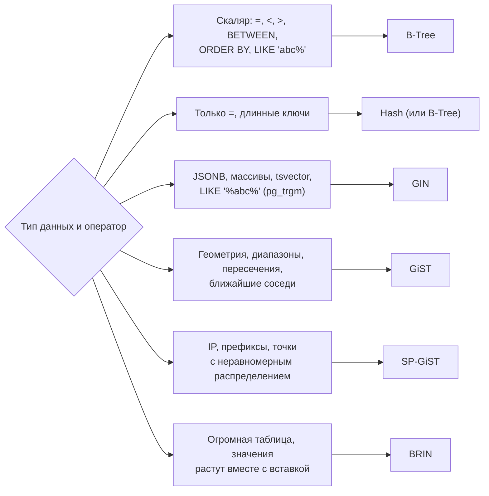
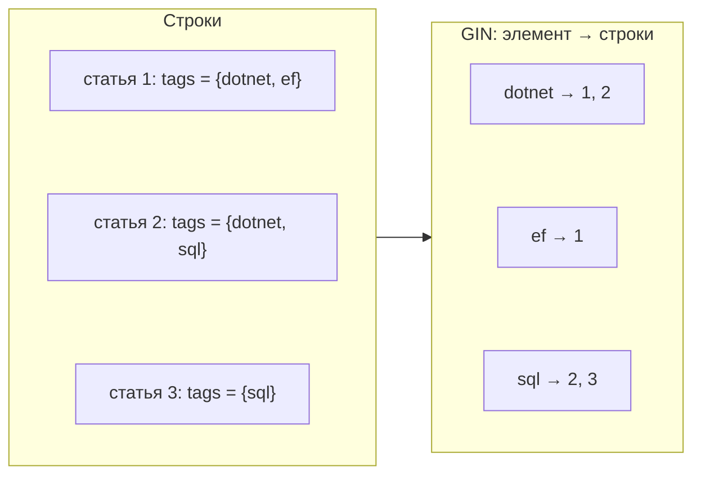
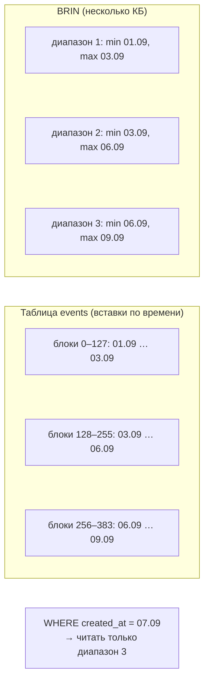

:::tldr
- **B-Tree** (по умолчанию) — равенство, диапазоны, сортировка. Подходит в 90% случаев.
- **Hash** — только `=`; компактнее B-Tree для длинных ключей. С PostgreSQL 10 журналируется и безопасен, но выигрыш редко существенен.
- **GIN** (Generalized Inverted Index) — **инвертированный индекс** «элемент → список строк»: для составных значений — **JSONB** (`@>`, `?`), **массивы** (`@>`, `&&`), **полнотекстовый поиск** (`tsvector @@`), **триграммы** (`pg_trgm` для `LIKE '%...%'`). Быстрый поиск, медленнее вставка.
- **GiST** (Generalized Search Tree) — дерево для **пересекающихся/многомерных** данных: геометрия и геоданные (PostGIS), **диапазоны** (`tstzrange`, пересечения, `EXCLUDE`-ограничения), ближайшие соседи (`ORDER BY <->`), полнотекстовый поиск (компактнее GIN, медленнее).
- **SP-GiST** — для неравномерно разбиваемых пространств: квадродеревья, префиксные деревья (IP-адреса, телефоны).
- **BRIN** (Block Range Index) — хранит **min/max на диапазон блоков**. Крошечный, эффективен для огромных таблиц, где значения **коррелируют с физическим порядком** (логи, события по времени).
:::

## Карта выбора



## GIN — инвертированный индекс

Идея как в поисковике: для каждого **элемента** (ключа JSON, слова, триграммы, элемента массива) хранится список строк, где он встречается.



```sql
-- JSONB: поиск по содержимому документа
CREATE INDEX ix_products_attrs ON products USING GIN (attributes jsonb_path_ops);   -- компактнее, только @>
SELECT * FROM products WHERE attributes @> '{"brand": "Apple", "color": "black"}';

-- Массивы
CREATE INDEX ix_posts_tags ON posts USING GIN (tags);
SELECT * FROM posts WHERE tags @> ARRAY['dotnet', 'ef'];      -- содержит все
SELECT * FROM posts WHERE tags && ARRAY['sql', 'nosql'];      -- пересекается

-- Полнотекстовый поиск
CREATE INDEX ix_articles_fts ON articles USING GIN (to_tsvector('russian', title || ' ' || body));

-- Поиск подстроки и «похожих» строк (опечатки)
CREATE EXTENSION IF NOT EXISTS pg_trgm;
CREATE INDEX ix_customers_name_trgm ON customers USING GIN (name gin_trgm_ops);
SELECT * FROM customers WHERE name ILIKE '%шариф%';           -- использует триграммный индекс
SELECT * FROM customers WHERE name % 'Шарифжанов' ORDER BY similarity(name, 'Шарифжанов') DESC;
```

Особенности GIN:
- Поиск очень быстрый, но **вставка/обновление дорогие** (одна строка обновляет много элементов индекса). Смягчается механизмом **fastupdate** (буфер отложенных вставок, pending list) — ценой периодической «догонки».
- Индекс может быть большим.

## GiST — дерево для «перекрывающихся» данных

GiST хранит в узлах **обобщение** дочерних элементов (например, ограничивающий прямоугольник для геометрий, объединение диапазонов). Поиск спускается во все поддеревья, чьё обобщение пересекается с условием.

```sql
-- Бронирования: запрет пересекающихся интервалов для одной комнаты
CREATE EXTENSION IF NOT EXISTS btree_gist;
CREATE TABLE bookings (
    room_id int NOT NULL,
    during  tstzrange NOT NULL,
    EXCLUDE USING GIST (room_id WITH =, during WITH &&)     -- БД сама не допустит двойное бронирование
);

INSERT INTO bookings VALUES (1, '[2025-10-01 10:00, 2025-10-01 12:00)');
INSERT INTO bookings VALUES (1, '[2025-10-01 11:00, 2025-10-01 13:00)');   -- ОШИБКА: conflicting key value

-- Геоданные (PostGIS): 10 ближайших магазинов
CREATE INDEX ix_shops_location ON shops USING GIST (location);
SELECT name FROM shops ORDER BY location <-> ST_SetSRID(ST_MakePoint(69.2401, 41.2995), 4326) LIMIT 10;
```

`EXCLUDE`-ограничение — мощный способ выразить инвариант «интервалы не пересекаются» на уровне БД, без гонок в коде приложения.

## BRIN — индекс диапазонов блоков



```sql
CREATE INDEX ix_events_created_brin ON events USING BRIN (created_at) WITH (pages_per_range = 64);
```

| | B-Tree | BRIN |
|---|---|---|
| Размер для 1 млрд строк | Десятки ГБ | Мегабайты |
| Точность | Точный указатель на строку | «Кандидатные» блоки, дальше проверка |
| Требование | Нет | Корреляция значений с физическим порядком |
| Вставка | Дороже | Почти бесплатно |
| Подходит для | Любые OLTP-запросы | Логи, телеметрия, аудит, append-only таблицы |

Если данные вставляются в случайном порядке (или часто обновляются), min/max всех диапазонов перекрываются и BRIN бесполезен.

## Hash

```sql
CREATE INDEX ix_sessions_token ON sessions USING HASH (token);
SELECT * FROM sessions WHERE token = @token;
```

Хранит хэш значения, а не само значение → для длинных строк (токены, URL) индекс меньше B-Tree. Не поддерживает диапазоны, сортировку, уникальность, составные ключи. На практике B-Tree почти всегда достаточно.

## Сводная таблица

| Индекс | Операторы | Типичные данные | Размер | Вставка |
|---|---|---|---|---|
| B-Tree | `= < > BETWEEN ORDER BY LIKE 'x%'` | Числа, строки, даты | Средний | Быстро |
| Hash | `=` | Длинные ключи | Меньше B-Tree | Быстро |
| GIN | `@> ? ?& && @@ %` | JSONB, массивы, tsvector, триграммы | Большой | **Медленно** |
| GiST | `&& @> <@ <-> ~=` | Геометрия, диапазоны, tsvector | Средний | Средне |
| SP-GiST | `<< >> ~ <->` | IP (inet), точки, префиксы | Средний | Средне |
| BRIN | `= < >` (по диапазонам) | Append-only по времени | **Крошечный** | Почти бесплатно |

## Использование из .NET

```csharp EF Core + Npgsql
modelBuilder.Entity<Product>().HasIndex(p => p.Attributes).HasMethod("gin");
modelBuilder.Entity<Customer>().HasIndex(c => c.Name).HasMethod("gin").HasOperators("gin_trgm_ops");
modelBuilder.Entity<Event>().HasIndex(e => e.CreatedAt).HasMethod("brin");

var apple = await db.Products.Where(p => EF.Functions.JsonContains(p.Attributes, """{"brand":"Apple"}""")).ToListAsync();
var similar = await db.Customers.Where(c => EF.Functions.TrigramsAreSimilar(c.Name, term)).ToListAsync();
```

## Вопросы на засыпку

:::qa Почему GIN медленный на вставку?
Одна строка содержит много элементов (все ключи JSON, все слова текста, все триграммы) — каждый нужно добавить в свой список. Fastupdate откладывает вставки в pending list, но тогда поиск должен просматривать и его, а периодическая очистка создаёт всплески нагрузки.
:::

:::qa GIN или GiST для полнотекстового поиска?
GIN — быстрее поиск, больше размер и медленнее обновление; стандартный выбор для часто читаемых данных. GiST — компактнее и быстрее обновляется, но поиск медленнее (lossy, требует перепроверки). Для часто меняющихся текстов с редким поиском — GiST.
:::

:::qa Что такое jsonb_path_ops?
Альтернативный класс операторов GIN для JSONB: индексирует хэши путей к значениям, поддерживает только оператор `@>`, зато индекс заметно меньше и быстрее стандартного `jsonb_ops`.
:::

:::qa Как проверить, что BRIN подходит таблице?
Посмотреть корреляцию физического порядка и значений: `SELECT correlation FROM pg_stats WHERE tablename = 'events' AND attname = 'created_at';` — значения, близкие к 1 или -1, означают, что BRIN будет эффективен.
:::

## Итог

B-Tree — универсальный выбор, но PostgreSQL предлагает специализированные индексы: GIN — для «множеств внутри значения» (JSONB, массивы, текст, триграммы), GiST — для пересечений, диапазонов и геоданных (включая `EXCLUDE`-ограничения), BRIN — для огромных таблиц с естественным порядком, Hash — для равенства длинных ключей. Выбирайте по операторам, которые реально используются в запросах.
