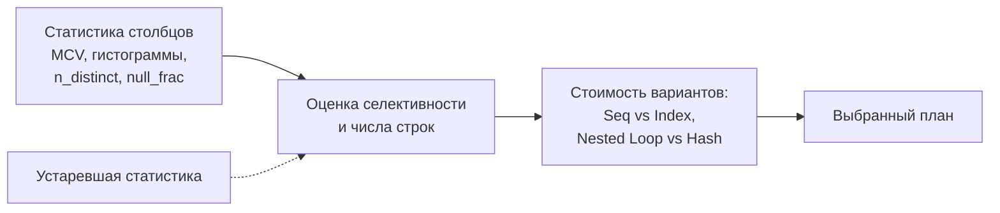
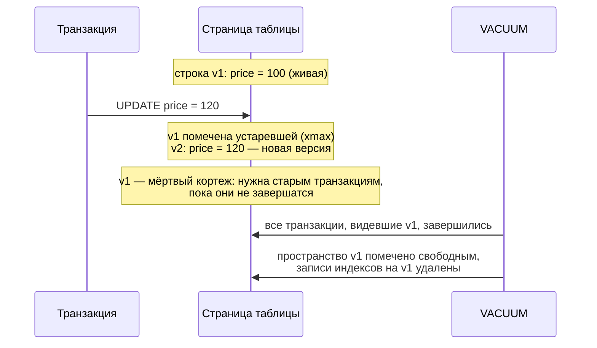

:::tldr
- **Статистика** — сводка о распределении данных в столбцах: число строк, доля NULL, число различных значений, **самые частые значения** (MCV), **гистограмма**, корреляция с физическим порядком. Оптимизатор по ней **оценивает число строк** и выбирает план.
- Устаревшая статистика → неверные оценки → плохие планы (Nested Loop на миллион строк, Seq Scan вместо индекса). Обновление: `ANALYZE` (PostgreSQL), `UPDATE STATISTICS` (SQL Server); обычно автоматически — **autovacuum/autoanalyze** и **AUTO_UPDATE_STATISTICS**.
- **VACUUM** (PostgreSQL) — следствие MVCC: `UPDATE`/`DELETE` не удаляют старые версии строк сразу, а оставляют **мёртвые кортежи**. VACUUM освобождает место для повторного использования, обновляет visibility map (для Index Only Scan) и защищает от **transaction ID wraparound**.
- Без VACUUM таблицы и индексы **раздуваются** (bloat), запросы замедляются. `VACUUM FULL` возвращает место ОС, но **блокирует таблицу** — в продакшене вместо него `pg_repack`.
- В SQL Server аналогов VACUUM нет (версии строк — в tempdb при snapshot-изоляции), но есть обслуживание индексов (REORGANIZE/REBUILD) и статистики.
:::

## Зачем оптимизатору статистика

```sql
SELECT * FROM orders WHERE status = 'refunded' AND created_at > now() - interval '1 day';
```

Выбор между Index Scan и Seq Scan, Nested Loop и Hash Join зависит от того, сколько строк вернёт условие: 10 или 10 миллионов. Оптимизатор **не выполняет** запрос заранее — он **оценивает** по статистике.



## Что хранится

```sql PostgreSQL: посмотреть статистику столбца
SELECT attname, null_frac, n_distinct, most_common_vals, most_common_freqs, histogram_bounds, correlation
FROM pg_stats
WHERE tablename = 'orders' AND attname = 'status';
```

| Поле | Смысл | Пример |
|---|---|---|
| `null_frac` | Доля NULL | 0.0 |
| `n_distinct` | Число различных значений (отрицательное — доля от числа строк) | 5 |
| `most_common_vals` / `freqs` | Самые частые значения и их доли | `{paid, new, shipped}` / `{0.7, 0.2, 0.08}` |
| `histogram_bounds` | Границы корзин равной «населённости» для остальных значений | Для дат, сумм |
| `correlation` | Корреляция значений с физическим порядком строк | 0.98 для `created_at` в append-only таблице |

Для `status = 'refunded'` (не входит в MCV) оптимизатор оценит долю как «остаток / число редких значений».

### Расширенная статистика

Оптимизатор по умолчанию считает условия **независимыми**: `city = 'Tashkent' AND country = 'UZ'` оценивается как произведение вероятностей — сильная недооценка, ведь город определяет страну.

```sql
CREATE STATISTICS st_addr_city_country (dependencies, ndistinct, mcv) ON city, country FROM addresses;
ANALYZE addresses;
```

В SQL Server многостолбцовая статистика создаётся для составных индексов или вручную `CREATE STATISTICS ... ON (city, country)`.

## Как статистика устаревает

- Массовая загрузка или удаление данных.
- Новые значения за пределами гистограммы: оптимизатор думает, что строк с `created_at > вчера` почти нет, потому что статистика собрана неделю назад («ascending key problem»).
- Изменение распределения (новый крупный клиент).

```sql
-- PostgreSQL
ANALYZE orders;                                   -- собрать статистику (выборка строк, быстро)
ALTER TABLE orders ALTER COLUMN status SET STATISTICS 1000;   -- детальнее (больше MCV/корзин)
SELECT relname, last_analyze, last_autoanalyze, n_mod_since_analyze FROM pg_stat_user_tables;

-- SQL Server
UPDATE STATISTICS dbo.Orders WITH FULLSCAN;
SELECT name, STATS_DATE(object_id, stats_id) AS last_updated FROM sys.stats WHERE object_id = OBJECT_ID('dbo.Orders');
```

:::tip После массовой загрузки — ANALYZE
Автоматический анализ срабатывает по порогу изменённых строк и не сразу. После ETL/миграции данных запускайте `ANALYZE` явно — иначе первые запросы получат план по статистике «пустой таблицы».
:::

## VACUUM и MVCC в PostgreSQL



Что делает обычный `VACUUM` (и autovacuum):
1. Находит мёртвые кортежи, невидимые ни одной активной транзакции, и **освобождает место** внутри страниц для новых вставок (файл обычно не уменьшается).
2. Удаляет ссылки на них из **индексов**.
3. Обновляет **visibility map** — страницы, где все строки видимы всем; без этого Index Only Scan вынужден ходить в таблицу.
4. **Замораживает** старые идентификаторы транзакций (freeze) — защита от **wraparound**: счётчик транзакций 32-битный, и без заморозки через ~2 млрд транзакций старые данные «исчезли» бы. При угрозе PostgreSQL принудительно запускает агрессивный vacuum, а в крайнем случае перестаёт принимать запись.

| Команда | Что делает | Блокировки |
|---|---|---|
| `VACUUM` | Освобождает место для повторного использования | Не блокирует чтение и запись |
| `VACUUM ANALYZE` | + собирает статистику | То же |
| `VACUUM FULL` | Переписывает таблицу целиком, возвращает место ОС | **Эксклюзивная** блокировка таблицы |
| `pg_repack` (расширение) | То же, что FULL, но онлайн | Короткие блокировки |

### Autovacuum и его настройка

Autovacuum запускается для таблицы, когда число мёртвых строк превышает `autovacuum_vacuum_threshold + autovacuum_vacuum_scale_factor × число строк` (по умолчанию 50 + 20%). Для таблицы в 100 млн строк это **20 млн** мёртвых строк — слишком поздно.

```sql
-- Для больших часто обновляемых таблиц — агрессивнее
ALTER TABLE orders SET (
    autovacuum_vacuum_scale_factor = 0.01,
    autovacuum_analyze_scale_factor = 0.005,
    autovacuum_vacuum_cost_limit = 2000
);

-- Мониторинг раздувания и работы autovacuum
SELECT relname, n_live_tup, n_dead_tup, last_autovacuum, last_autoanalyze
FROM pg_stat_user_tables ORDER BY n_dead_tup DESC LIMIT 10;
```

### Что мешает VACUUM

- **Долгие транзакции** (в том числе «idle in transaction» — приложение открыло транзакцию и забыло): VACUUM не может удалить версии, которые могут понадобиться этой транзакции → bloat растёт по всей базе. Лечится `idle_in_transaction_session_timeout` и дисциплиной в коде.
- Забытые **слоты репликации** и долгие запросы на репликах с `hot_standby_feedback`.
- Слишком «ленивые» настройки autovacuum для больших таблиц.

## SQL Server

- Статистика: `AUTO_CREATE_STATISTICS`, `AUTO_UPDATE_STATISTICS` (порог в новых версиях динамический, ~√(1000 × строк)), `AUTO_UPDATE_STATISTICS_ASYNC` — не блокировать запрос на время обновления.
- Версии строк для RCSI/SNAPSHOT хранятся в **tempdb** (version store) и очищаются фоново; долгие транзакции раздувают tempdb — аналог проблемы долгих транзакций в PostgreSQL.
- Обслуживание индексов: `ALTER INDEX ... REORGANIZE` (онлайн, лёгкая дефрагментация) / `REBUILD` (полная перестройка, с `ONLINE = ON` в Enterprise). Популярный инструмент — скрипты Ola Hallengren.
- **Query Store** — история планов и возможность «закрепить» хороший план при регрессии.

## Вопросы на засыпку

:::qa Почему план запроса вдруг испортился без изменений кода?
Частые причины: обновилась (или устарела) статистика и оценки изменились; данные выросли и перешли порог, при котором оптимизатор выбирает другой план; parameter sniffing — план скомпилирован под нетипичный параметр; обновление версии СУБД. Диагностика — сравнить планы (Query Store, auto_explain) и оценки vs факт.
:::

:::qa Почему DELETE миллионов строк не уменьшает размер таблицы в PostgreSQL?
Удалённые строки становятся мёртвыми кортежами; обычный VACUUM делает место доступным для повторного использования, но файл не сжимает (кроме пустого хвоста). Вернуть место ОС — `VACUUM FULL`/`pg_repack`. Для регулярного удаления старых данных лучше партиционирование и `DROP PARTITION`.
:::

:::qa Что такое HOT-обновление?
Heap-Only Tuple: если при `UPDATE` не менялись индексированные столбцы и на той же странице есть место, новая версия строки размещается на той же странице без новых записей в индексах. Это сильно снижает нагрузку. Помогает `fillfactor < 100` для часто обновляемых таблиц.
:::

:::qa Как долгие транзакции в .NET-приложении вредят PostgreSQL?
Открытая транзакция (например, `BeginTransaction`, затем HTTP-вызов, затем зависание) держит «горизонт» видимости: VACUUM не может удалить ни одну версию строк, созданную после её начала, во всей базе. Таблицы и индексы раздуваются, запросы замедляются. Держите транзакции короткими и следите за `pg_stat_activity` (`state = 'idle in transaction'`).
:::

## Итог

Оптимизатор принимает решения по статистике, поэтому свежая и детальная статистика — условие хороших планов (`ANALYZE`, расширенная статистика для коррелирующих столбцов). В PostgreSQL MVCC требует VACUUM: он освобождает место мёртвых версий, поддерживает visibility map и защищает от wraparound. Настраивайте autovacuum для больших таблиц и избегайте долгих транзакций.
