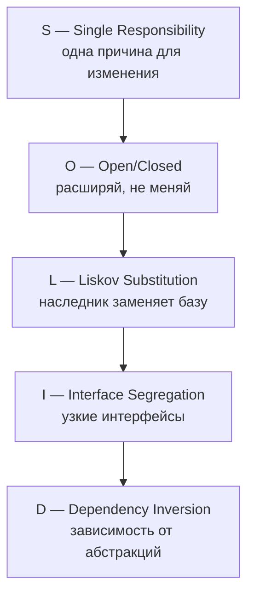
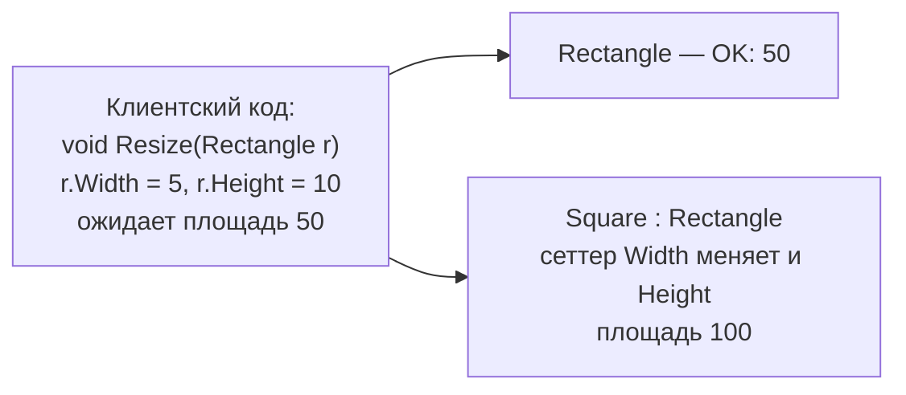
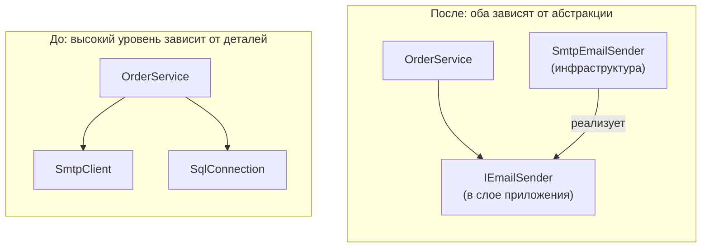

:::tldr
- **S — Single Responsibility**: у класса одна **причина для изменения** (один «владелец» требований). Нарушение — «божественный» `OrderService` на 3000 строк.
- **O — Open/Closed**: открыт для расширения, закрыт для изменения. Новое поведение — новым классом (стратегия, декоратор, обработчик), а не новым `case` в огромном `switch`.
- **L — Liskov Substitution**: наследник должен работать везде, где ожидается базовый тип, **не ломая контракт**. Нарушение — `ReadOnlyCollection` бросает `NotSupportedException` из `ICollection.Add`, `Square : Rectangle`.
- **I — Interface Segregation**: много узких интерфейсов лучше одного «толстого». Клиент не должен зависеть от методов, которые не использует.
- **D — Dependency Inversion**: модули верхнего уровня зависят от **абстракций**, а не от деталей (БД, SMTP, HTTP). В .NET реализуется через интерфейсы + DI-контейнер.
- SOLID — не самоцель: применяются там, где снижают стоимость изменений. Слепое следование порождает «интерфейс на каждый класс» и лишнюю сложность.
:::

## Обзор



## S — Single Responsibility

```csharp Нарушение: класс меняется по многим причинам
public class OrderService
{
    public void PlaceOrder(Order order)
    {
        if (order.Items.Count == 0) throw new Exception("Пустой заказ");        // валидация
        var total = order.Items.Sum(i => i.Price * i.Qty) * (1 - GetDiscount()); // ценообразование
        using var conn = new SqlConnection("...");                             // доступ к данным
        conn.Execute("INSERT INTO orders ...", order);
        var pdf = GenerateInvoicePdf(order, total);                            // генерация документов
        new SmtpClient("smtp.example.uz").Send("shop@x.uz", order.Email, "Счёт", pdf); // рассылка
        File.AppendAllText("log.txt", $"Order {order.Id}");                    // логирование
    }
}
```

Изменения скидок (маркетинг), формата счёта (бухгалтерия), почтового провайдера (DevOps), схемы БД — всё ведёт в этот класс. Любое изменение рискует сломать остальное.

```csharp Исправление: каждая ответственность — у своего компонента
public sealed class PlaceOrderHandler(
    IValidator<PlaceOrder> validator,
    IPricingService pricing,
    IOrderRepository orders,
    IInvoiceGenerator invoices,
    INotificationSender notifications)
{
    public async Task<Guid> Handle(PlaceOrder cmd, CancellationToken ct)
    {
        await validator.ValidateAndThrowAsync(cmd, ct);
        var order = Order.Create(cmd.CustomerId, cmd.Items, pricing.CalculateDiscount(cmd));
        await orders.AddAsync(order, ct);
        var invoice = invoices.Generate(order);
        await notifications.SendInvoiceAsync(order.CustomerEmail, invoice, ct);
        return order.Id;
    }
}
```

:::note SRP — про людей, а не про «одну функцию»
Роберт Мартин уточнял: «модуль должен отвечать перед одним и только одним актором». Класс может иметь много методов, если все они меняются по требованиям одной и той же стороны.
:::

## O — Open/Closed

```csharp Нарушение: каждый новый способ оплаты — правка существующего кода
public decimal CalculateFee(Payment p) => p.Method switch
{
    "card"   => p.Amount * 0.02m,
    "wallet" => p.Amount * 0.01m,
    "cash"   => 0,
    // завтра "installments", послезавтра "crypto" — снова открываем этот файл
    _ => throw new NotSupportedException()
};
```

```csharp Исправление: расширение через новые классы
public interface IPaymentFeePolicy
{
    string Method { get; }
    decimal Calculate(decimal amount);
}

public sealed class CardFeePolicy : IPaymentFeePolicy { public string Method => "card"; public decimal Calculate(decimal a) => a * 0.02m; }
public sealed class WalletFeePolicy : IPaymentFeePolicy { public string Method => "wallet"; public decimal Calculate(decimal a) => a * 0.01m; }

public sealed class FeeCalculator(IEnumerable<IPaymentFeePolicy> policies)
{
    private readonly Dictionary<string, IPaymentFeePolicy> _byMethod = policies.ToDictionary(p => p.Method);
    public decimal Calculate(Payment p) => _byMethod.TryGetValue(p.Method, out var policy)
        ? policy.Calculate(p.Amount)
        : throw new NotSupportedException(p.Method);
}

// Новый способ оплаты = новый класс + регистрация, существующий код не трогаем
builder.Services.AddSingleton<IPaymentFeePolicy, InstallmentsFeePolicy>();
```

В .NET OCP встречается повсюду: middleware, фильтры, `IHostedService`, обработчики MediatR, `IEnumerable<IValidator>` — всё это точки расширения.

## L — Liskov Substitution



Примеры нарушений из .NET и практики:

```csharp
// 1. ReadOnlyCollection<T> реализует ICollection<T>, но Add бросает NotSupportedException.
ICollection<int> items = new ReadOnlyCollection<int>(new List<int>());
items.Add(1);   // NotSupportedException — клиент, получивший ICollection, этого не ожидает

// 2. Массив ковариантен — и может упасть при записи
object[] arr = new string[1];
arr[0] = 42;    // ArrayTypeMismatchException

// 3. Наследник усиливает предусловия
public class FileStorage { public virtual Task SaveAsync(string path, Stream s) => ...; }
public class S3Storage : FileStorage
{
    public override Task SaveAsync(string path, Stream s)
    {
        if (s.Length > 5_000_000) throw new InvalidOperationException("Лимит 5 МБ");   // базовый контракт такого не обещал
        return ...;
    }
}
```

Правила LSP: наследник **не усиливает предусловия**, **не ослабляет постусловия**, **сохраняет инварианты** и не бросает новых неожиданных исключений. Если «является» не выполняется поведенчески — используйте композицию вместо наследования.

## I — Interface Segregation

```csharp Нарушение: «толстый» интерфейс
public interface IRepository<T>
{
    Task<T?> GetAsync(Guid id);
    Task<IReadOnlyList<T>> SearchAsync(string q);
    Task AddAsync(T entity);
    Task UpdateAsync(T entity);
    Task DeleteAsync(Guid id);
    Task BulkImportAsync(Stream csv);
    Task<byte[]> ExportToExcelAsync();
}

// Сервису отчётов нужно только чтение, но он зависит от всего; тестовый фейк реализует 7 методов
public class AuditLogRepository : IRepository<AuditEntry>
{
    public Task DeleteAsync(Guid id) => throw new NotSupportedException();   // журнал аудита нельзя удалять — нарушение LSP как следствие
    // ...
}
```

```csharp Исправление: роли разделены
public interface IReadRepository<T> { Task<T?> GetAsync(Guid id); Task<IReadOnlyList<T>> SearchAsync(string q); }
public interface IWriteRepository<T> { Task AddAsync(T entity); Task UpdateAsync(T entity); }
public interface IDeletable { Task DeleteAsync(Guid id); }

public class AuditLogRepository : IReadRepository<AuditEntry>, IWriteRepository<AuditEntry> { /* без Delete */ }
```

В BCL хороший пример — разделение `IEnumerable<T>` / `IReadOnlyCollection<T>` / `IReadOnlyList<T>` / `IList<T>`: метод принимает ровно то, что ему нужно.

## D — Dependency Inversion



```csharp
// Нарушение
public class ReportService
{
    private readonly SqlConnection _conn = new("Server=prod;...");   // жёсткая зависимость от конкретной БД
    public DateTime Now => DateTime.Now;                              // скрытая зависимость от системных часов
}

// Исправление
public class ReportService(IReportRepository repository, TimeProvider clock)
{
    public async Task<Report> BuildDailyAsync(CancellationToken ct)
    {
        var today = DateOnly.FromDateTime(clock.GetLocalNow().DateTime);
        return new Report(today, await repository.GetSalesAsync(today, ct));
    }
}
```

Важно: абстракция принадлежит **тому, кто её использует** (слой приложения/домена), а не реализации. Это основа Clean/Onion Architecture.

:::warning DI ≠ DIP
Dependency Injection — техника передачи зависимостей. Dependency Inversion — принцип направления зависимостей. Можно внедрять через DI конкретный `SqlOrderRepository` — это DI без DIP.
:::

## Когда SOLID вредит

- **Интерфейс для каждого класса** с единственной реализацией «на всякий случай» — шум. Интерфейс нужен, когда есть несколько реализаций, граница модуля или необходимость подмены в тестах.
- **Дробление до атомов**: 40 классов по 5 строк, логику невозможно проследить.
- **Абстракции ради абстракций** (generic repository поверх EF Core, который уже UoW + репозиторий).

Цель SOLID — **низкая стоимость изменений**. Если принцип делает код сложнее без выгоды — это сигнал остановиться.

## Вопросы на засыпку

:::qa Как SRP соотносится с микросервисами?
Та же идея на другом уровне: сервис должен иметь одну причину для изменения — одну бизнес-возможность (bounded context). Сервис «Заказы», который меняется из-за требований склада, биллинга и маркетинга, нарушает SRP на уровне архитектуры.
:::

:::qa Как проверить, не нарушает ли наследник LSP?
Прогнать тесты базового класса/контракта против наследника (contract tests). Если какие-то тесты приходится отключать или наследник бросает `NotSupportedException` — нарушение. Сигнал в коде: проверки `if (x is Square)` у клиентов.
:::

:::qa Какой принцип нарушает switch по типу?
Обычно OCP (каждый новый тип — правка switch) и часто LSP (клиент знает о конкретных подтипах). Но для закрытых иерархий (discriminated unions) pattern matching по типам — нормальная практика.
:::

:::qa Зачем TimeProvider, если есть DateTime.Now?
`DateTime.Now` — скрытая зависимость от системных часов: код нельзя детерминированно протестировать («завтра истекает подписка»). `TimeProvider` (.NET 8) — абстракция времени, в тестах подменяется `FakeTimeProvider`. Это DIP для времени.
:::

## Итог

SOLID — пять принципов, снижающих стоимость изменений: одна причина для изменения, расширение без модификации, корректная подстановка наследников, узкие интерфейсы и зависимость от абстракций. Показывайте на собеседовании реальные примеры нарушений и помните, что принципы — инструмент, а не догма.
