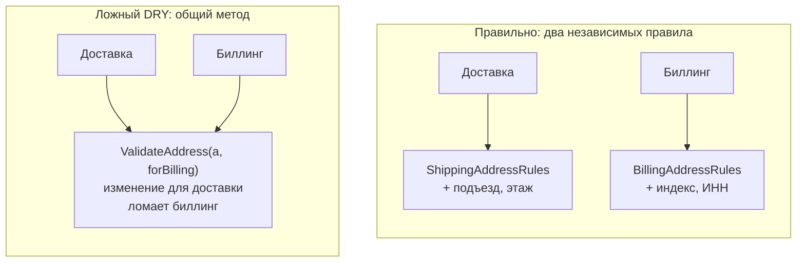
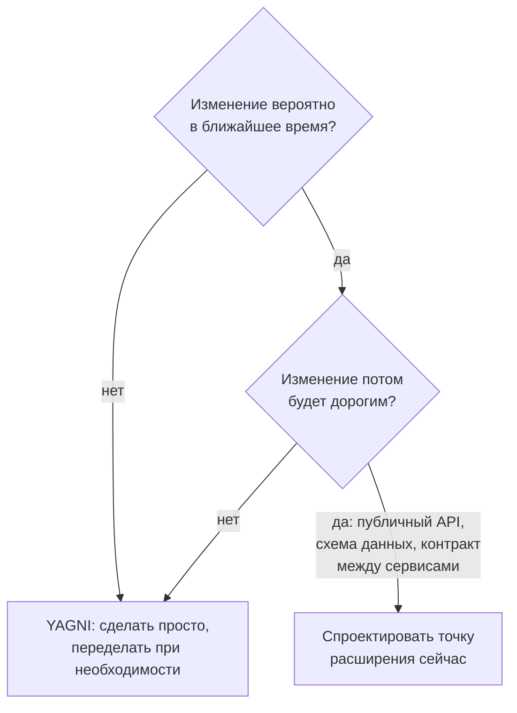

:::tldr
- **DRY (Don't Repeat Yourself)** — каждое **знание** (бизнес-правило, формула, решение) должно иметь **одно авторитетное представление** в системе. Речь о дублировании знаний, а не символов кода.
- **KISS (Keep It Simple, Stupid)** — выбирай самое простое решение, которое решает задачу. Сложность должна быть оправдана требованием.
- **YAGNI (You Aren't Gonna Need It)** — не реализуй функциональность и абстракции «на будущее», пока в них нет реальной потребности.
- **Где грань**: одинаковый код, который меняется **по разным причинам**, — это случайное сходство, а не дублирование; объединение создаёт ложную связанность. Правило трёх: абстрагируй, когда встретил третий повтор. «Дублирование дешевле неправильной абстракции» (Sandi Metz).
- YAGNI не отменяет продуманности: расширяемость важна там, где изменения **вероятны и дороги** (публичные API, схема данных, контракты между сервисами).
:::

## DRY: дублирование знаний

```csharp Нарушение DRY: правило «доставка бесплатна от 500 000» живёт в трёх местах
// Корзина (backend)
var shipping = cart.Total >= 500_000 ? 0 : 25_000;

// Оформление заказа (другой сервис)
if (order.Total < 500_000) order.AddShippingFee(25_000);

// Фронтенд
const freeShipping = total >= 500000;
```

Маркетинг меняет порог на 400 000 — нужно найти все места; пропустили одно → корзина показывает бесплатную доставку, а заказ её списывает.

```csharp Исправление: одно авторитетное представление правила
public sealed class ShippingPolicy(IOptions<ShippingOptions> options)
{
    public decimal Calculate(decimal orderTotal) =>
        orderTotal >= options.Value.FreeShippingThreshold ? 0 : options.Value.StandardFee;
}
// Фронтенд получает порог из API (/config) — знание остаётся в одном месте
```

DRY относится не только к коду: схема БД и классы (генерация/миграции), документация API (OpenAPI из кода), конфигурация окружений (шаблоны Helm), константы и сообщения.

## Ложный DRY: случайное сходство



```csharp Сегодня совпадают, завтра разойдутся
// Валидация адреса доставки и адреса для счёта сейчас одинакова...
bool IsValidShippingAddress(Address a) => !string.IsNullOrEmpty(a.City) && !string.IsNullOrEmpty(a.Street);
bool IsValidBillingAddress(Address a)  => !string.IsNullOrEmpty(a.City) && !string.IsNullOrEmpty(a.Street);
// ...но доставке скоро понадобится этаж и домофон, а биллингу — ИНН организации.
```

Если объединить их в `IsValidAddress`, при изменении требований придётся добавлять флаги (`IsValidAddress(a, forBilling: true)`), и общий метод превратится в клубок условий. Это **связанность**, выдающая себя за переиспользование.

Особенно опасен ложный DRY **между микросервисами**: общая библиотека доменных моделей связывает релизы сервисов, которые должны развиваться независимо. Между сервисами допустимо дублировать DTO — это разные контракты.

:::tip Правило трёх
Первый раз — пишем. Второй раз — морщимся, но дублируем. Третий раз — теперь видно, что действительно общее, и можно выделять абстракцию с правильными границами.
:::

## KISS

```csharp Переусложнено
public interface IGreetingStrategyFactoryProvider { IGreetingStrategyFactory GetFactory(GreetingContext ctx); }
// ... + 6 классов и конфигурация DI, чтобы вывести "Здравствуйте, {name}"

// Просто
public static string Greet(string name) => $"Здравствуйте, {name}!";
```

Проявления нарушения KISS в .NET-проектах:
- Микросервисы для продукта с одной командой и десятком пользователей.
- CQRS + Event Sourcing + MediatR + 5 слоёв для CRUD-админки.
- Собственный DI-контейнер, ORM, фреймворк логирования.
- «Умный» код: цепочка из 12 LINQ-операторов вместо понятного цикла; рефлексия там, где хватит `switch`.

Простота ≠ примитивность. Простое решение: минимальное число движущихся частей, понятное новому разработчику, легко удаляемое и изменяемое.

## YAGNI

```csharp «А вдруг понадобится»
public interface IStorage { }                          // «вдруг перейдём с PostgreSQL на Mongo»
public class Money { public string Currency { get; } } // «вдруг будет мультивалютность» — 3 месяца поддержки валют, которых нет
public class Order { public Dictionary<string, object> ExtraFields { get; } }   // «вдруг клиенты захотят свои поля»
```

Цена преждевременной функциональности:
1. Время на реализацию — вместо реально нужного.
2. Время на поддержку, тестирование, документацию.
3. Сложность, которая тормозит **настоящие** изменения.
4. Часто угадывают неправильно — когда потребность приходит, она выглядит иначе, и заготовку приходится переделывать.



Исключения, где думать наперёд оправдано: **публичные контракты** (версионирование API, поля с запасом для эволюции), **схема данных** (миграции больших таблиц дороги), **безопасность**, **наблюдаемость** (логи и метрики проще заложить сразу).

## Как принципы взаимодействуют

| Ситуация | Что говорит DRY | Что говорит KISS/YAGNI | Решение |
|---|---|---|---|
| Два похожих метода с разными причинами изменения | «Объедини» | «Не усложняй» | Оставить раздельными |
| Бизнес-правило в трёх сервисах | «Одно место» | — | Вынести в одно место (сервис, конфиг, контракт) |
| Абстракция для одного использования | — | «Не нужна» | Не создавать |
| Константа, повторённая 20 раз | «Вынеси» | — | Вынести |

## Вопросы на засыпку

:::qa Является ли копипаста тестового кода нарушением DRY?
В тестах читаемость важнее: тест должен быть понятен сам по себе (DAMP — Descriptive And Meaningful Phrases). Разумно выносить построители данных (Test Data Builders) и фикстуры, но не прятать суть теста за общими хелперами.
:::

:::qa Как YAGNI сочетается с чистой архитектурой, где много интерфейсов?
Интерфейсы на **границах** (БД, внешние сервисы, время, очередь) оправданы сразу — они нужны для тестов и изоляции инфраструктуры. Интерфейс для каждого внутреннего доменного класса «на всякий случай» — нарушение YAGNI.
:::

:::qa Что такое WET?
«Write Everything Twice» / «We Enjoy Typing» — ироничное название кода с дублированием знаний. Противоположная крайность DRY — преждевременная абстракция, иногда называемая AHA: «Avoid Hasty Abstractions».
:::

:::qa Как объяснить YAGNI заказчику, который хочет «гибкую систему»?
Гибкость — это лёгкость изменения, а не заранее построенные «на всякий случай» возможности. Простой, покрытый тестами код с хорошей модульностью меняется быстрее, чем универсальная конструкция, угадавшая будущее неправильно.
:::

## Итог

DRY — про единственный источник истины для знаний, а не про устранение похожих строк. KISS и YAGNI — про минимальную необходимую сложность. Грань проходит по причинам изменения: объединяйте то, что меняется вместе, разделяйте то, что меняется по разным причинам, и закладывайте расширяемость только там, где изменение вероятно и дорого.
