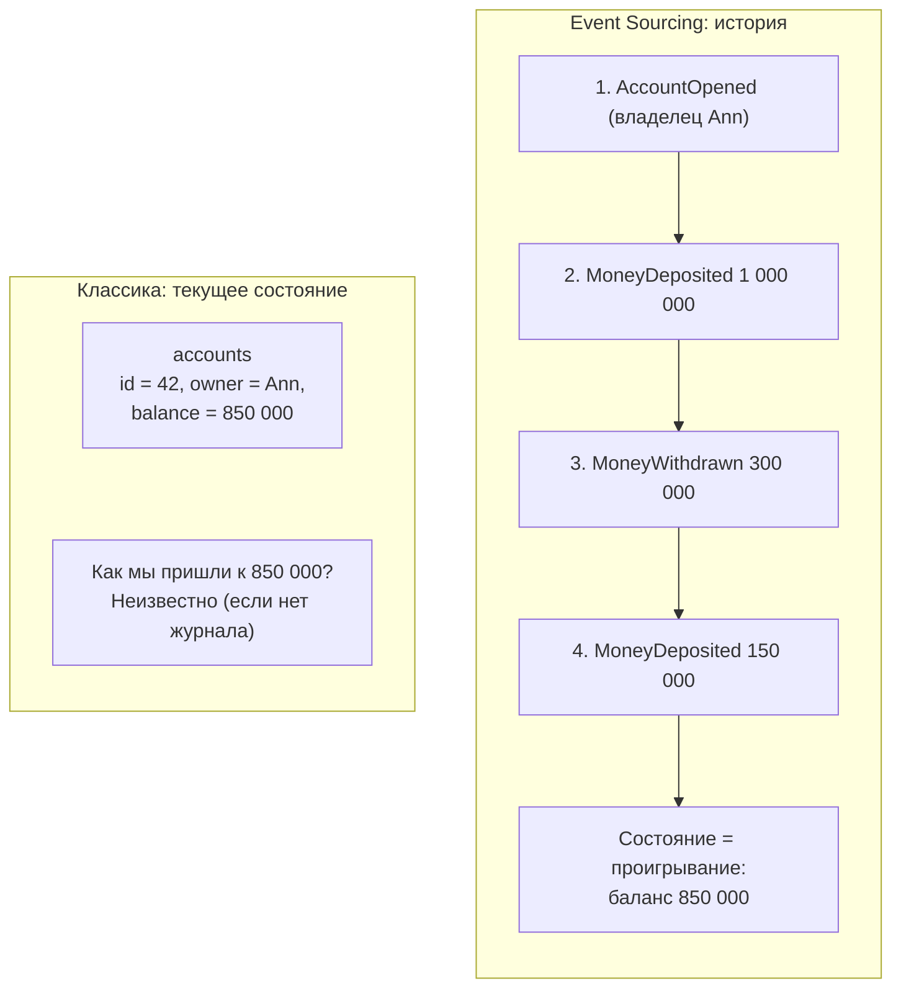
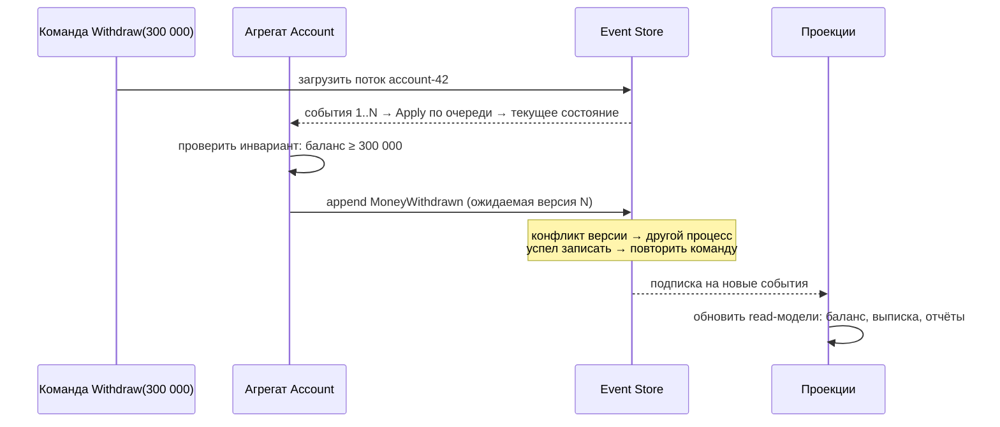
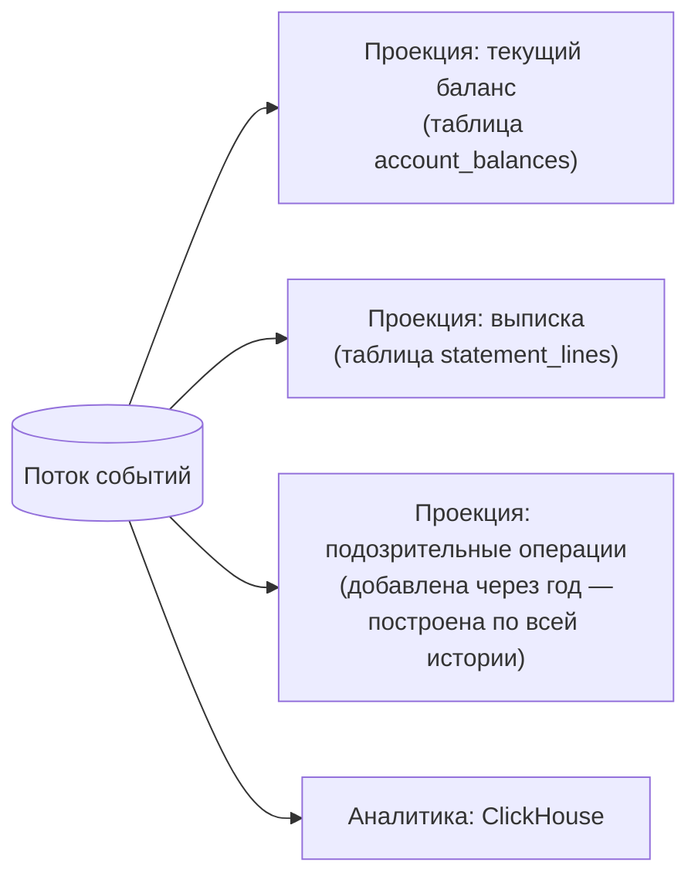
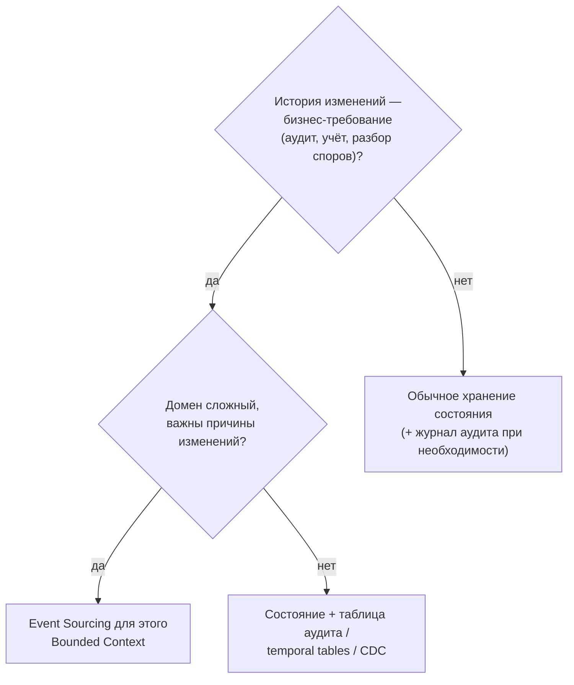

:::tldr
- **Event Sourcing**: вместо хранения **текущего состояния** храним **последовательность событий**, которые к нему привели (`AccountOpened`, `MoneyDeposited`, `MoneyWithdrawn`). Текущее состояние — результат **проигрывания** (fold) событий.
- События **только добавляются** (append-only) и никогда не изменяются — полная история, встроенный **аудит**, «машина времени» (состояние на любую дату), возможность строить **новые проекции** из прошлого.
- Чтение: для запросов строятся **проекции** (read-модели), обычно асинхронно → естественное сочетание с **CQRS** и eventual consistency.
- Оптимизации: **snapshots** (снимок состояния каждые N событий), короткие «потоки» (stream на агрегат).
- Сложности: **версионирование событий** (схема меняется, старые события остаются навсегда), eventual consistency, удаление персональных данных (GDPR — crypto-shredding), кривая обучения, сложнее запросы «по всем данным».
- Применять: финансы и учёт, где важна история; сложные домены с аудитом; системы, где «почему» так же важно, как «что». Не применять: простой CRUD.
:::

## Состояние против событий



## Как устроено



```csharp Агрегат на событиях
public sealed class Account
{
    public Guid Id { get; private set; }
    public decimal Balance { get; private set; }
    public bool IsClosed { get; private set; }
    public int Version { get; private set; }

    private readonly List<object> _uncommitted = [];
    public IReadOnlyList<object> UncommittedEvents => _uncommitted;

    // Восстановление состояния из истории
    public static Account Rehydrate(IEnumerable<object> history)
    {
        var account = new Account();
        foreach (var e in history) account.Apply(e);
        return account;
    }

    // Команды: проверяют правила и порождают события
    public void Withdraw(decimal amount)
    {
        if (IsClosed) throw new DomainException("Счёт закрыт");
        if (amount > Balance) throw new DomainException("Недостаточно средств");
        Raise(new MoneyWithdrawn(Id, amount, DateTimeOffset.UtcNow));
    }

    private void Raise(object e) { Apply(e); _uncommitted.Add(e); }

    // Apply: только изменение состояния, без проверок и побочных эффектов
    private void Apply(object e)
    {
        switch (e)
        {
            case AccountOpened o: Id = o.AccountId; break;
            case MoneyDeposited d: Balance += d.Amount; break;
            case MoneyWithdrawn w: Balance -= w.Amount; break;
            case AccountClosed: IsClosed = true; break;
        }
        Version++;
    }
}

public sealed record AccountOpened(Guid AccountId, string Owner, DateTimeOffset At);
public sealed record MoneyDeposited(Guid AccountId, decimal Amount, DateTimeOffset At);
public sealed record MoneyWithdrawn(Guid AccountId, decimal Amount, DateTimeOffset At);
public sealed record AccountClosed(Guid AccountId, DateTimeOffset At);
```

Ключевое разделение: **команда** решает (может отказать), **событие** — свершившийся факт (`Apply` не может отказать и не должен ничего проверять — иначе старая история может «не проиграться»).

## Хранилище событий

Event store — хранилище с потоками (stream) событий, append с **оптимистичной конкурентностью** (ожидаемая версия потока) и подписками.

```sql Минимальная схема на PostgreSQL
CREATE TABLE events (
    global_position bigserial PRIMARY KEY,
    stream_id       text        NOT NULL,
    version         int         NOT NULL,
    type            text        NOT NULL,
    data            jsonb       NOT NULL,
    metadata        jsonb,                    -- кто, откуда, correlation id
    created_at      timestamptz NOT NULL DEFAULT now(),
    UNIQUE (stream_id, version)               -- конкурентная запись с той же версией отклоняется
);
```

В .NET популярны: **Marten** (event store и документная БД поверх PostgreSQL), **EventStoreDB/KurrentDB**, **Wolverine** + Marten, Azure Cosmos DB change feed как основа.

```csharp Marten
await using var session = store.LightweightSession();
var account = await session.Events.AggregateStreamAsync<Account>(accountId, token: ct);
account!.Withdraw(300_000);
session.Events.Append(accountId, account.Version, account.UncommittedEvents.ToArray());   // проверка версии
await session.SaveChangesAsync(ct);
```

## Проекции



- **Inline** проекции обновляются в той же транзакции, что и запись событий (строгая согласованность, медленнее запись).
- **Async** проекции обновляются фоновым процессом (быстрая запись, eventual consistency).
- Проекцию можно **удалить и перестроить** с нуля — идеально для исправления ошибок и новых отчётов.

## Snapshots

Если у агрегата тысячи событий, проигрывать их на каждую команду долго. Snapshot — сохранённое состояние на версии N; загрузка = snapshot + события после N. Но сначала стоит спросить, не слишком ли долго живёт поток: часто лучше **закрывать** потоки («счёт за месяц», «смена кассира»).

## Сложности

| Проблема | Решение |
|---|---|
| **Версионирование**: `MoneyDeposited` получил новое обязательное поле | Upcasting (преобразование старых событий при чтении), новые типы событий (`MoneyDepositedV2`), слабая схема (опциональные поля) |
| **Eventual consistency** read-моделей | Возвращать результат команды из write-стороны, inline-проекции для критичного, UI с учётом задержки |
| **GDPR / удаление персональных данных** | Не класть ПДн в события или шифровать отдельным ключом на субъекта и удалять ключ (crypto-shredding) |
| **Запросы «по всем»** («все счета с балансом > X») | Только через проекции |
| **Ошибочные события** | Нельзя исправить — только компенсирующие события (`DepositCorrected`) |
| **Сложность для команды** | Обучение, начать с одного подходящего контекста |

## Когда применять



Хорошие кандидаты: платежи и кошельки, бухгалтерия, торговля, логистика (статусы груза), медицинские карты, системы бронирования, workflow-процессы. Применяйте точечно — к одному контексту, а не ко всей системе.

## Вопросы на засыпку

:::qa Чем Event Sourcing отличается от журнала аудита?
В аудите источник истины — текущее состояние, журнал вторичен и может разойтись с данными. В Event Sourcing события — **единственный** источник истины: состояние выводится из них, поэтому история гарантированно полна и согласована.
:::

:::qa Чем событие в Event Sourcing отличается от интеграционного события?
Событие хранилища — внутренний детальный факт агрегата, его схема может меняться вместе с моделью. Интеграционное событие — публичный контракт для других сервисов, стабильный и обычно более крупный. Публиковать внутренние события наружу напрямую — значит связать чужие сервисы со своей внутренней моделью.
:::

:::qa Как обеспечить конкурентность в Event Sourcing?
Оптимистично: при записи указывается ожидаемая версия потока. Если другой процесс уже добавил событие, запись отклоняется, команда повторяется на свежем состоянии. Уникальный индекс `(stream_id, version)` реализует это на уровне БД.
:::

:::qa Можно ли узнать состояние системы на прошлую дату?
Да — проиграть события до нужного момента (или до нужной версии). Это «темпоральные запросы», один из главных плюсов подхода: разбор инцидентов, отчёты «как было на конец квартала».
:::

## Итог

Event Sourcing хранит историю событий вместо текущего состояния: полный аудит, темпоральные запросы и возможность строить новые проекции по всей истории. Цена — версионирование событий, eventual consistency read-моделей и сложность. Применяйте в доменах, где история — бизнес-ценность, и точечно, в отдельных Bounded Context.
