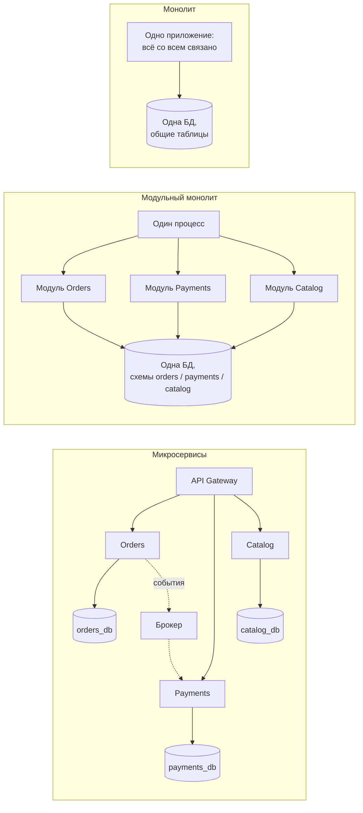
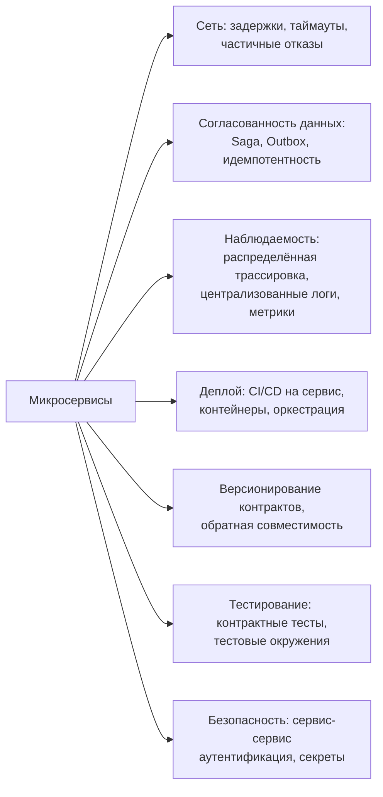
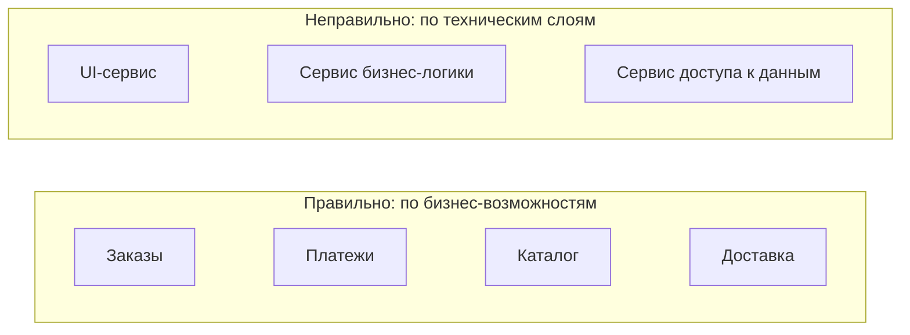
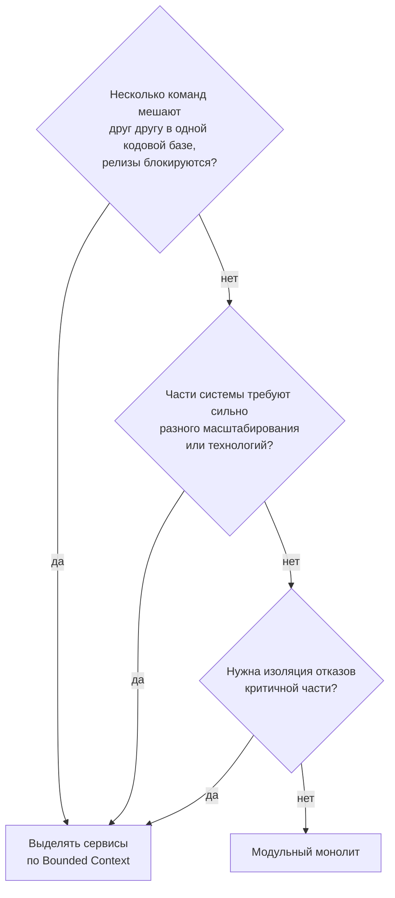

:::tldr
- **Монолит** — одно развёртываемое приложение с общей БД. Просто разрабатывать, тестировать, деплоить и отлаживать; транзакции ACID «бесплатно». Проблемы начинаются с ростом: связанность, долгие сборки, конфликты команд, масштабирование только целиком.
- **Микросервисы** — набор небольших **независимо развёртываемых** сервисов, каждый владеет **своими данными** и бизнес-возможностью (Bounded Context). Плюсы: независимые релизы и масштабирование, автономия команд, изоляция отказов, свобода технологий. Цена: **распределённая система** — сеть ненадёжна, eventual consistency, Saga вместо транзакций, наблюдаемость, DevOps-зрелость.
- **Модульный монолит** — золотая середина: один процесс, но строгие границы модулей (свои схемы БД, публичные контракты, никаких прямых ссылок на внутренности). Легко выделить модуль в сервис позже.
- Правило: **начинайте с (модульного) монолита**, переходите к микросервисам, когда есть конкретная проблема — независимые релизы многих команд, разные требования к масштабированию, изоляция отказов. Микросервисы — прежде всего **организационное** решение (закон Конвея).
:::

## Три варианта



## Сравнение

| Критерий | Монолит | Модульный монолит | Микросервисы |
|---|---|---|---|
| Развёртывание | Всё целиком | Всё целиком | Каждый сервис отдельно |
| Скорость старта проекта | Максимальная | Высокая | Низкая (инфраструктура) |
| Транзакции | ACID | ACID (внутри), события между модулями | Saga, eventual consistency |
| Вызовы между частями | Вызов метода (нс) | Вызов метода через контракт | Сеть (мс), может упасть |
| Масштабирование | Целиком | Целиком | Точечно по сервисам |
| Изоляция отказов | Нет — утечка памяти роняет всё | Нет | Да (при правильной устойчивости) |
| Независимость команд | Низкая | Средняя | Высокая |
| Технологическая свобода | Одна платформа | Одна платформа | Любая на сервис |
| Отладка и тестирование | Просто | Просто | Сложно: трассировка, контракты, e2e |
| Требования к DevOps | Низкие | Низкие | Высокие: CI/CD на каждый, K8s, мониторинг |
| Риск | «Большой ком грязи» | Нарушение границ модулей | **Распределённый монолит** |

## Цена распределённости



**Восемь заблуждений о распределённых вычислениях** (Питер Дойч): сеть надёжна; задержка нулевая; пропускная способность бесконечна; сеть безопасна; топология не меняется; администратор один; транспорт бесплатен; сеть однородна.

## Распределённый монолит — худший вариант

Признаки:
- Сервисы нельзя выкатить независимо — релиз требует синхронного обновления нескольких.
- Общая БД, в которую пишут несколько сервисов.
- Цепочки синхронных HTTP-вызовов: Orders → Customers → Loyalty → Pricing; падение любого роняет всё.
- Общая библиотека доменных моделей, изменение которой требует пересборки всех.

Получаем все минусы и монолита (связанность), и микросервисов (сеть, сложность).

## Как делить: по бизнес-возможностям



- Границы сервиса = **Bounded Context** (см. DDD): высокая связность внутри, слабая связанность снаружи.
- Каждый сервис **владеет своими данными**; другие получают их через API или события, никогда не напрямую из чужой БД.
- **Закон Конвея**: архитектура системы повторяет структуру коммуникаций организации. Микросервисы работают, когда у каждого сервиса есть команда-владелец.

## Модульный монолит в .NET

```text
src/
├── Shop.Host/                          # один ASP.NET Core процесс, composition root
├── Modules/
│   ├── Orders/
│   │   ├── Shop.Orders.Contracts/      # публичный API модуля: интерфейсы, DTO, интеграционные события
│   │   └── Shop.Orders/                # internal-реализация, своя схема БД "orders", свой DbContext
│   ├── Payments/
│   │   ├── Shop.Payments.Contracts/
│   │   └── Shop.Payments/
│   └── Catalog/ ...
└── Shared/Shop.BuildingBlocks/         # инфраструктура: outbox, шина событий в памяти
```

Правила:
- Модули ссылаются только на **Contracts** других модулей (проверяется архитектурными тестами).
- У каждого модуля **своя схема** БД и свой `DbContext`; JOIN-ы между схемами модулей запрещены.
- Взаимодействие — через публичные интерфейсы или **внутрипроцессные события** (с outbox — готово к выносу в брокер).
- Выделение модуля в сервис: заменить in-process вызовы на HTTP/gRPC и шину на брокер.

## Когда переходить на микросервисы



Предпосылки успеха: зрелый CI/CD, контейнеры и оркестрация, наблюдаемость (трассировка, логи, метрики), культура владения сервисами, понятные границы домена.

## Вопросы на засыпку

:::qa Почему нельзя делить базу данных между сервисами?
Общая БД — скрытый контракт: изменение схемы одним сервисом ломает другой, нельзя деплоить независимо, неясно, кто владеет данными и инвариантами. Каждый сервис — владелец своих данных; другие получают их через API или подписываясь на события (и хранят локальную копию нужного).
:::

:::qa Как сервисы получают данные друг друга без синхронных вызовов?
Через события: сервис Orders подписывается на `ProductPriceChanged` и хранит у себя нужную проекцию каталога. Запросы становятся локальными и быстрыми, а отказ Catalog не мешает оформлению заказов. Цена — eventual consistency и дублирование данных.
:::

:::qa Что такое «микросервис правильного размера»?
Не строки кода, а границы: сервис реализует одну бизнес-возможность, может разрабатываться одной командой, деплоиться независимо и не требует синхронных изменений других сервисов. «Слишком маленькие» сервисы (наносервисы) порождают болтливые сетевые взаимодействия и распределённый монолит.
:::

:::qa Правда ли, что микросервисы быстрее?
Нет, сами по себе они медленнее: сетевые вызовы, сериализация. Выигрыш — в независимом масштабировании горячих частей и изоляции. Монолит на хорошем сервере обслуживает огромные нагрузки (Stack Overflow — известный пример).
:::

## Итог

Монолит — лучший старт: просто и быстро. Модульный монолит добавляет строгие границы и сохраняет простоту эксплуатации. Микросервисы решают организационные проблемы масштаба и дают независимость ценой распределённой системы. Переходите к ним осознанно — по бизнес-границам, с владением данными и зрелой инфраструктурой, иначе получите распределённый монолит.
