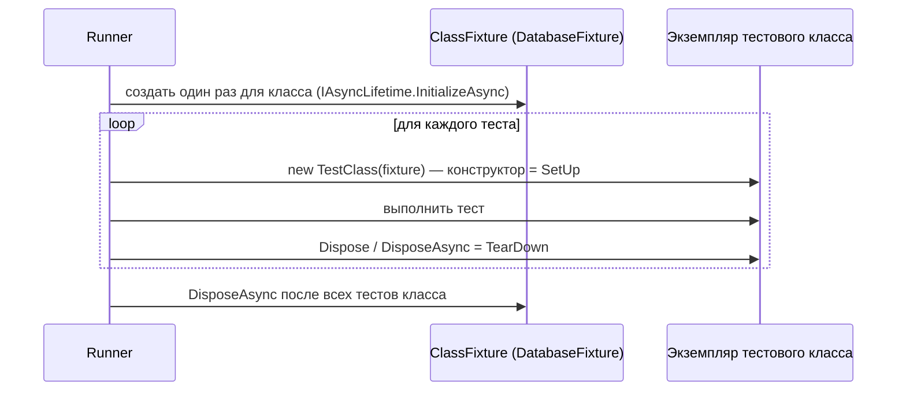

:::tldr
- Все три — полноценные фреймворки для .NET, запускаются через `dotnet test`, поддерживаются IDE и CI. Выбор чаще определяется привычками команды.
- **xUnit** — самый популярный в современных .NET-проектах (им тестируется сам .NET/ASP.NET Core). **Новый экземпляр класса на каждый тест**, нет `[SetUp]` — используются **конструктор** и `IDisposable`/`IAsyncLifetime`; общий контекст — **fixtures** (`IClassFixture`, `ICollectionFixture`). Атрибуты `[Fact]`, `[Theory]` + `[InlineData]`/`[MemberData]`.
- **NUnit** — зрелый, богатый возможностями: `[SetUp]/[TearDown]`, `[OneTimeSetUp]`, `[TestCase]`, `[TestCaseSource]`, мощная модель ограничений `Assert.That(x, Is.EqualTo(5))`. По умолчанию **один экземпляр** класса на все тесты.
- **MSTest** — от Microsoft, `[TestClass]`, `[TestMethod]`, `[DataRow]`, `[TestInitialize]`; сильно модернизирован в v3 (MSTest.Sdk, Microsoft.Testing.Platform).
- Для утверждений часто подключают **FluentAssertions**/**Shouldly** (FluentAssertions с v8 — коммерческая лицензия; альтернативы — Shouldly, AwesomeAssertions).
:::

## Один и тот же тест в трёх фреймворках

```csharp xUnit
public class PriceCalculatorTests
{
    private readonly PriceCalculator _sut = new();      // новый экземпляр на каждый тест — свежее состояние

    [Fact]
    public void Returns_zero_for_empty_cart() => Assert.Equal(0m, _sut.Total([]));

    [Theory]
    [InlineData(100, 1, 100)]
    [InlineData(100, 3, 300)]
    [InlineData(50, 10, 450)]            // скидка 10% от 10 штук
    public void Calculates_total(decimal price, int qty, decimal expected) =>
        Assert.Equal(expected, _sut.Total([new CartLine(price, qty)]));
}
```

```csharp NUnit
[TestFixture]
public class PriceCalculatorTests
{
    private PriceCalculator _sut = null!;

    [SetUp] public void SetUp() => _sut = new PriceCalculator();

    [Test]
    public void Returns_zero_for_empty_cart() => Assert.That(_sut.Total([]), Is.EqualTo(0m));

    [TestCase(100, 1, 100)]
    [TestCase(100, 3, 300)]
    [TestCase(50, 10, 450)]
    public void Calculates_total(decimal price, int qty, decimal expected) =>
        Assert.That(_sut.Total([new CartLine(price, qty)]), Is.EqualTo(expected));
}
```

```csharp MSTest
[TestClass]
public class PriceCalculatorTests
{
    private PriceCalculator _sut = null!;

    [TestInitialize] public void Init() => _sut = new PriceCalculator();

    [TestMethod]
    public void Returns_zero_for_empty_cart() => Assert.AreEqual(0m, _sut.Total([]));

    [DataTestMethod]
    [DataRow(100, 1, 100)]
    [DataRow(100, 3, 300)]
    [DataRow(50, 10, 450)]
    public void Calculates_total(int price, int qty, int expected) =>
        Assert.AreEqual((decimal)expected, _sut.Total([new CartLine(price, qty)]));
}
```

## Сравнение атрибутов и возможностей

| Возможность | xUnit | NUnit | MSTest |
|---|---|---|---|
| Тест | `[Fact]` | `[Test]` | `[TestMethod]` |
| Параметризованный | `[Theory]` + `[InlineData]` | `[TestCase]` | `[DataTestMethod]` + `[DataRow]` |
| Данные из метода/класса | `[MemberData]`, `[ClassData]`, `TheoryData<T>` | `[TestCaseSource]` | `[DynamicData]` |
| Перед каждым тестом | Конструктор | `[SetUp]` | `[TestInitialize]` |
| После каждого теста | `Dispose` / `DisposeAsync` | `[TearDown]` | `[TestCleanup]` |
| Один раз на класс | `IClassFixture<T>` | `[OneTimeSetUp]` | `[ClassInitialize]` |
| Один раз на группу классов | `ICollectionFixture<T>` | `[SetUpFixture]` | `[AssemblyInitialize]` |
| Экземпляр класса | **Новый на каждый тест** | Один на класс (по умолчанию) | Новый на каждый тест |
| Пропуск | `[Fact(Skip = "...")]` | `[Ignore("...")]` | `[Ignore]` |
| Категории | `[Trait("Category", "Slow")]` | `[Category("Slow")]` | `[TestCategory("Slow")]` |
| Параллельность | Коллекции параллельно, тесты внутри класса последовательно | Настраивается `[Parallelizable]` | Настраивается `[Parallelize]` |
| Вывод в лог | `ITestOutputHelper` | `TestContext.WriteLine` | `TestContext` |

## Жизненный цикл в xUnit



```csharp Fixture: дорогой ресурс создаётся один раз
public sealed class PostgresFixture : IAsyncLifetime
{
    private readonly PostgreSqlContainer _pg = new PostgreSqlBuilder().WithImage("postgres:17").Build();
    public string ConnectionString => _pg.GetConnectionString();
    public Task InitializeAsync() => _pg.StartAsync();
    public Task DisposeAsync() => _pg.DisposeAsync().AsTask();
}

[CollectionDefinition("db")]
public sealed class DbCollection : ICollectionFixture<PostgresFixture>;   // общий на несколько классов

[Collection("db")]
public class OrderRepositoryTests(PostgresFixture db, ITestOutputHelper output)
{
    [Fact]
    public async Task Saves_order() { /* использует db.ConnectionString */ }
}
```

Философия xUnit: **изоляция по умолчанию** — новый экземпляр гарантирует, что тесты не делят поля. Общее состояние нужно объявить явно через fixture.

## Утверждения

```csharp
// Встроенные
Assert.Equal(expected, actual);
Assert.Throws<DomainException>(() => order.Pay());
await Assert.ThrowsAsync<NotFoundException>(() => svc.GetAsync(id));

// NUnit constraint model
Assert.That(list, Has.Count.EqualTo(3).And.All.Property("IsActive").True);

// Shouldly / FluentAssertions — читаемые сообщения об ошибках
order.Total.ShouldBe(450m);
result.Should().BeEquivalentTo(expectedDto, o => o.Excluding(x => x.CreatedAt));
```

Хорошее сообщение об ошибке экономит время: `Expected order.Total to be 450, but found 500` против `Assert.Equal() Failure`.

## Как выбрать

- **Новый проект, нет предпочтений** → xUnit (распространённость, примеры, шаблоны ASP.NET Core). Обратите внимание на xUnit v3 — новая версия с собственным runner-ом.
- **Команда знает NUnit / нужны богатые возможности** (параметризованные fixtures, гибкие ограничения) → NUnit.
- **Экосистема Microsoft, Visual Studio, существующие MSTest-проекты** → MSTest v3 вполне современен.
- Смешивать фреймворки в одном решении можно, но лучше единообразие.

## Вопросы на засыпку

:::qa Почему в xUnit нет [SetUp]?
Авторы считали `[SetUp]` источником скрытых зависимостей между тестами и неявного состояния. Конструктор и `Dispose` — естественные механизмы C#, а новый экземпляр на тест гарантирует изоляцию. Общее — только через явные fixtures.
:::

:::qa Как в xUnit выполнить асинхронную инициализацию?
Реализовать `IAsyncLifetime` (`InitializeAsync`/`DisposeAsync`) в тестовом классе или fixture — конструктор не может быть асинхронным.
:::

:::qa Как запускать только часть тестов?
Фильтры `dotnet test --filter "Category=Integration"` (или `Trait`/`FullyQualifiedName~Orders`). Удобно разделять быстрые unit-тесты и медленные интеграционные в CI на разные шаги.
:::

:::qa Почему тесты в одном классе xUnit не выполняются параллельно?
Тестовый класс — это «коллекция» по умолчанию, тесты внутри коллекции выполняются последовательно, а разные коллекции — параллельно. Это защищает от конфликтов при общем fixture класса.
:::

## Итог

xUnit, NUnit и MSTest решают одну задачу с разной философией: xUnit — изоляция через новый экземпляр и явные fixtures, NUnit — богатые атрибуты и модель ограничений, MSTest — интеграция с экосистемой Microsoft. Выбирайте один на решение, используйте параметризованные тесты и читаемые утверждения.
