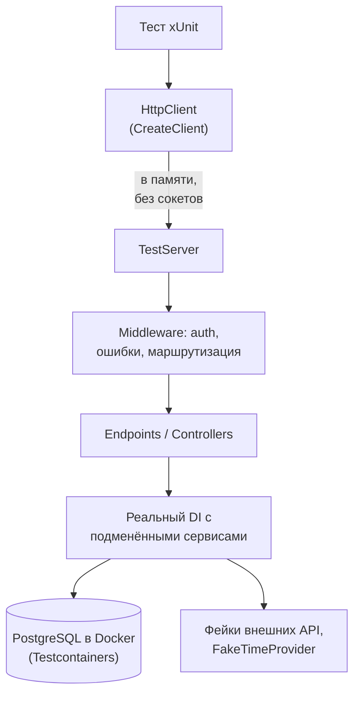
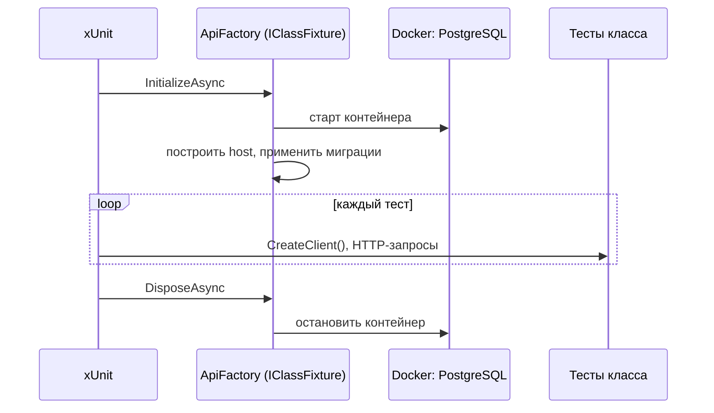

:::tldr
- **`WebApplicationFactory<TEntryPoint>`** (пакет `Microsoft.AspNetCore.Mvc.Testing`) поднимает **всё приложение в памяти**: реальный `Program.cs`, DI, конфигурацию, middleware, маршрутизацию — но вместо Kestrel использует **`TestServer`** (запросы без сети).
- `factory.CreateClient()` возвращает `HttpClient`, отправляющий запросы прямо в конвейер. Тест проверяет поведение через HTTP — как настоящий клиент.
- Подмена зависимостей: `WithWebHostBuilder(b => b.ConfigureTestServices(s => { ... }))` — заменить внешние сервисы фейками, БД — на контейнер (**Testcontainers**), время — на `FakeTimeProvider`.
- Аутентификация в тестах — **тестовая схема** (`AuthenticationHandler`, подставляющий claims), а не реальный Identity Provider.
- Для DI без HTTP (фоновые сервисы, обработчики) — `factory.Services.CreateScope()` и резолв сервиса, или собрать `ServiceCollection` вручную и проверить граф (`ValidateOnBuild`).
:::

## Как это устроено



## Минимальный пример

```csharp Program.cs — сделать класс видимым для тестов
var builder = WebApplication.CreateBuilder(args);
// ... регистрации
var app = builder.Build();
// ... конвейер
app.Run();

public partial class Program;          // для WebApplicationFactory<Program> (или InternalsVisibleTo)
```

```csharp Тест
public class HealthTests(WebApplicationFactory<Program> factory) : IClassFixture<WebApplicationFactory<Program>>
{
    [Fact]
    public async Task Health_returns_ok()
    {
        var client = factory.CreateClient();
        var response = await client.GetAsync("/health/live");
        response.EnsureSuccessStatusCode();
    }
}
```

## Собственная фабрика с подменой зависимостей

```csharp
public sealed class ApiFactory : WebApplicationFactory<Program>, IAsyncLifetime
{
    private readonly PostgreSqlContainer _db = new PostgreSqlBuilder().WithImage("postgres:17-alpine").Build();
    public FakeTimeProvider Clock { get; } = new(new DateTimeOffset(2025, 9, 30, 9, 0, 0, TimeSpan.Zero));
    public FakePaymentGateway Payments { get; } = new();

    protected override void ConfigureWebHost(IWebHostBuilder builder)
    {
        builder.UseEnvironment("Testing");
        builder.UseSetting("ConnectionStrings:Default", _db.GetConnectionString());   // конфигурация

        builder.ConfigureTestServices(services =>
        {
            services.RemoveAll<IPaymentGateway>();
            services.AddSingleton<IPaymentGateway>(Payments);                         // фейк внешнего API
            services.RemoveAll<TimeProvider>();
            services.AddSingleton<TimeProvider>(Clock);                               // управляемое время

            services.AddAuthentication(TestAuthHandler.Scheme)                        // тестовая аутентификация
                .AddScheme<AuthenticationSchemeOptions, TestAuthHandler>(TestAuthHandler.Scheme, _ => { });
        });
    }

    public async Task InitializeAsync()
    {
        await _db.StartAsync();
        using var scope = Services.CreateScope();
        await scope.ServiceProvider.GetRequiredService<ShopDbContext>().Database.MigrateAsync();   // реальные миграции
    }

    public new async Task DisposeAsync() { await _db.DisposeAsync(); await base.DisposeAsync(); }

    public ShopDbContext CreateDbContext() => Services.CreateScope().ServiceProvider.GetRequiredService<ShopDbContext>();
}
```

```csharp Тестовая схема аутентификации
public sealed class TestAuthHandler(IOptionsMonitor<AuthenticationSchemeOptions> o, ILoggerFactory l, UrlEncoder e)
    : AuthenticationHandler<AuthenticationSchemeOptions>(o, l, e)
{
    public const string Scheme = "Test";

    protected override Task<AuthenticateResult> HandleAuthenticateAsync()
    {
        if (!Request.Headers.TryGetValue("X-Test-User", out var userId))
            return Task.FromResult(AuthenticateResult.NoResult());               // анонимный запрос

        var claims = new List<Claim> { new("sub", userId!) };
        claims.AddRange(Request.Headers["X-Test-Roles"].ToString().Split(',', StringSplitOptions.RemoveEmptyEntries).Select(r => new Claim("role", r)));
        var ticket = new AuthenticationTicket(new ClaimsPrincipal(new ClaimsIdentity(claims, Scheme, "sub", "role")), Scheme);
        return Task.FromResult(AuthenticateResult.Success(ticket));
    }
}
```

## Тест сценария

```csharp
public class CheckoutTests(ApiFactory api) : IClassFixture<ApiFactory>
{
    [Fact]
    public async Task Paid_order_changes_status_and_charges_payment()
    {
        var client = api.CreateClient();
        client.DefaultRequestHeaders.Add("X-Test-User", "7f3a");

        var create = await client.PostAsJsonAsync("/api/orders", new { items = new[] { new { sku = "PHONE-1", qty = 1 } } });
        create.StatusCode.Should().Be(HttpStatusCode.Created);
        var orderId = await create.Content.ReadFromJsonAsync<Guid>();

        var pay = await client.PostAsync($"/api/orders/{orderId}/pay", null);
        pay.StatusCode.Should().Be(HttpStatusCode.NoContent);

        api.Payments.Charges.Should().ContainSingle(c => c.OrderId == orderId);
        await using var db = api.CreateDbContext();
        (await db.Orders.SingleAsync(o => o.Id == orderId)).Status.Should().Be(OrderStatus.Paid);
    }

    [Fact]
    public async Task Anonymous_user_gets_401()
    {
        var response = await api.CreateClient().GetAsync("/api/orders");
        response.StatusCode.Should().Be(HttpStatusCode.Unauthorized);
    }
}
```



## Изоляция данных между тестами

Тесты одного класса делят БД. Варианты:

| Способ | Плюсы | Минусы |
|---|---|---|
| **Respawn** — очистка таблиц перед каждым тестом | Просто, быстро | Тесты класса не параллельны |
| Транзакция на тест с откатом | Очень быстро | Не работает, если код сам управляет транзакциями или несколько контекстов |
| Уникальные данные на тест (новые id, email) | Параллельность | Нужна дисциплина, БД растёт |
| Отдельная БД / схема на класс | Полная изоляция | Дольше старт |

```csharp Respawn
private Respawner _respawner = null!;
public async Task ResetDatabaseAsync()
{
    await using var conn = new NpgsqlConnection(_db.GetConnectionString());
    await conn.OpenAsync();
    _respawner ??= await Respawner.CreateAsync(conn, new RespawnerOptions { DbAdapter = DbAdapter.Postgres, SchemasToInclude = ["public"], TablesToIgnore = ["__EFMigrationsHistory"] });
    await _respawner.ResetAsync(conn);
}
```

## Тестирование DI без HTTP

```csharp Проверка графа зависимостей — ловит captive dependency и забытые регистрации
[Fact]
public void All_services_can_be_resolved()
{
    var builder = WebApplication.CreateBuilder();
    builder.Services.AddApplication().AddInfrastructure(builder.Configuration);
    var provider = builder.Services.BuildServiceProvider(new ServiceProviderOptions { ValidateOnBuild = true, ValidateScopes = true });
    // исключение при построении = ошибка регистрации
}

[Fact]
public async Task Background_worker_processes_outbox()
{
    using var scope = api.Services.CreateScope();
    var worker = scope.ServiceProvider.GetRequiredService<OutboxProcessor>();   // из того же DI, что и приложение
    await worker.ProcessBatchAsync(CancellationToken.None);
    // ...проверки
}
```

## Советы

- Не отключайте middleware «для простоты» — тест должен проходить тот же путь, что и продакшен.
- Внешние HTTP-зависимости — **WireMock.Net** или фейковые `HttpMessageHandler`, а не реальные сервисы.
- Фоновые `IHostedService` в тестах могут мешать — отключите их в `ConfigureTestServices` (`services.RemoveAll<IHostedService>()`) или управляйте явно.
- Один контейнер на коллекцию тестов (`ICollectionFixture`) экономит минуты в CI.
- Для CI с Docker: GitHub Actions `ubuntu-latest` поддерживает Testcontainers без настройки.

## Вопросы на засыпку

:::qa Чем TestServer отличается от запуска приложения на Kestrel?
TestServer реализует `IServer`, принимая `HttpContext` напрямую от `HttpClient` без сокетов, TLS и сетевого стека. Весь остальной конвейер — тот же. Это быстрее и не требует свободных портов, но не проверяет настройки Kestrel (лимиты, HTTP/2 на уровне сети).
:::

:::qa Как подменить конфигурацию в тестах?
`builder.UseSetting("Key", "value")`, `ConfigureAppConfiguration(c => c.AddInMemoryCollection(...))`, переменные окружения или `appsettings.Testing.json` с `UseEnvironment("Testing")`. Порядок важен: `ConfigureAppConfiguration` в фабрике выполняется после регистрации провайдеров приложения.
:::

:::qa Почему не InMemory-провайдер EF для интеграционных тестов?
Он не является реляционной БД: нет транзакций, ограничений, SQL-трансляции (LINQ выполняется как LINQ-to-Objects), уникальных индексов, конкурентности. Тесты зелёные, а запрос в PostgreSQL падает. Testcontainers даёт настоящую БД за несколько секунд.
:::

:::qa Как тестировать SignalR или gRPC через WebApplicationFactory?
SignalR: `HubConnectionBuilder().WithUrl(url, o => o.HttpMessageHandlerFactory = _ => factory.Server.CreateHandler())`. gRPC: `GrpcChannel.ForAddress(factory.Server.BaseAddress, new GrpcChannelOptions { HttpHandler = factory.Server.CreateHandler() })`.
:::

## Итог

`WebApplicationFactory` запускает реальное приложение в памяти, позволяя тестировать его через HTTP со всем DI и middleware. Подменяйте только внешние границы (БД — контейнер, внешние API — фейки, время — `FakeTimeProvider`, аутентификация — тестовая схема), следите за изоляцией данных и проверяйте граф DI отдельным тестом.
