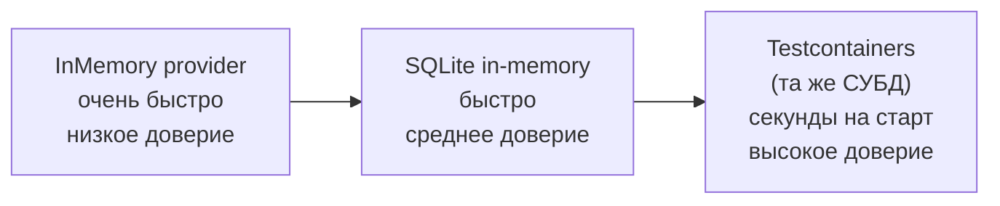
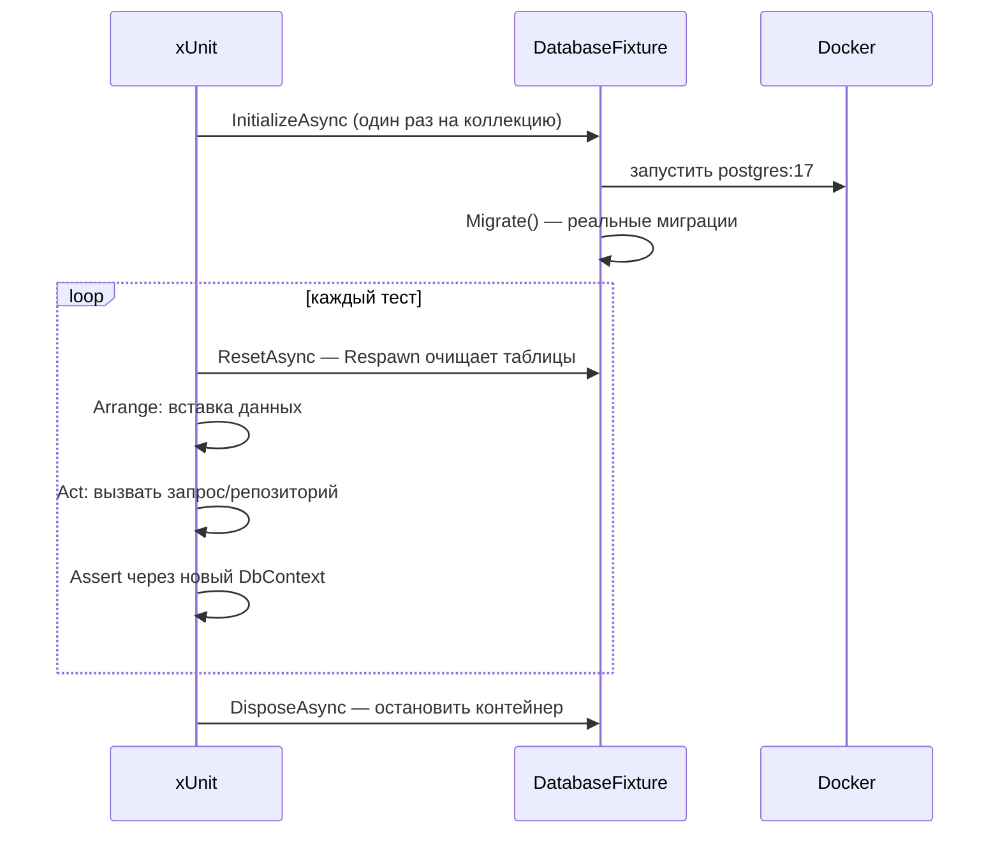
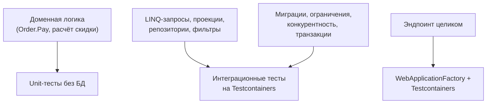

:::tldr
- **InMemory-провайдер** — быстрый, но **не реляционный**: нет транзакций, FK и уникальных ограничений, SQL-трансляции (запросы выполняются как LINQ-to-Objects), `ExecuteUpdate`/raw SQL не работают. Тест зелёный — в продакшене падает. Microsoft **не рекомендует** его для тестирования.
- **SQLite in-memory** — настоящий SQL-движок, ограничения работают, но **другой диалект**: нет специфики PostgreSQL/SQL Server (jsonb, массивы, функции, `FOR UPDATE`, схемы, некоторые типы).
- **Testcontainers** (рекомендуется) — поднимает **ту же СУБД и версию**, что в продакшене, в Docker перед тестами. Тесты проверяют реальный SQL, миграции, ограничения, конкурентность. Старт ~3–10 с на коллекцию тестов.
- Стратегия: доменную логику — unit-тестами **без БД**; запросы, репозитории, маппинг, миграции — интеграционными тестами на **реальной СУБД** в контейнере.
- Изоляция: **Respawn** (очистка таблиц), транзакция с откатом, или уникальные данные на тест.
:::

## Сравнение вариантов



| Возможность | InMemory | SQLite | Testcontainers (PostgreSQL/SQL Server) |
|---|---|---|---|
| Трансляция LINQ → SQL | Нет (LINQ-to-Objects) | Да, SQLite-диалект | **Да, продакшен-диалект** |
| Транзакции | Нет (игнорируются) | Да | Да |
| FK, UNIQUE, CHECK | Нет | Да | Да |
| Регистрозависимость сравнения строк | Как в C# | Своя | Как в проде (collation) |
| Raw SQL, `ExecuteUpdate/Delete` | Нет | Частично | Да |
| Специфика СУБД (jsonb, массивы, полнотекст, `FOR UPDATE`) | Нет | Нет | Да |
| Миграции | Нет | Частично (ограничения ALTER) | **Да, реальные** |
| Конкурентность, rowversion | Нет | Ограниченно | Да |
| Скорость | Мгновенно | Очень быстро | Старт контейнера + быстрые запросы |
| Требования | — | — | Docker |

## Почему InMemory обманывает

```csharp
// Тест проходит с InMemory, но падает на PostgreSQL:

// 1. Метод, который нельзя перевести в SQL
var users = await db.Users.Where(u => IsVip(u)).ToListAsync();      // InMemory: OK; PostgreSQL: InvalidOperationException

// 2. Регистр строк
var u = await db.Users.FirstOrDefaultAsync(x => x.Email == "ANN@X.UZ");   // InMemory: null (C# сравнение); SQL Server (CI collation): находит

// 3. Уникальный индекс
db.Users.Add(new User { Email = "a@x.uz" }); db.Users.Add(new User { Email = "a@x.uz" });
await db.SaveChangesAsync();         // InMemory: OK; PostgreSQL: unique violation

// 4. Транзакция не откатывается
await using var tx = await db.Database.BeginTransactionAsync();   // InMemory: предупреждение, изменения не откатываются

// 5. Каскадное удаление, обязательные связи, precision decimal — всё «работает» не так
```

## Testcontainers

```csharp Фикстура с PostgreSQL
public sealed class DatabaseFixture : IAsyncLifetime
{
    private readonly PostgreSqlContainer _container = new PostgreSqlBuilder()
        .WithImage("postgres:17-alpine")      // та же мажорная версия, что в проде
        .Build();

    private Respawner _respawner = null!;
    public string ConnectionString => _container.GetConnectionString();

    public async Task InitializeAsync()
    {
        await _container.StartAsync();
        await using var db = CreateContext();
        await db.Database.MigrateAsync();                       // применяем РЕАЛЬНЫЕ миграции — заодно тестируем их

        await using var conn = new NpgsqlConnection(ConnectionString);
        await conn.OpenAsync();
        _respawner = await Respawner.CreateAsync(conn, new RespawnerOptions
        {
            DbAdapter = DbAdapter.Postgres,
            TablesToIgnore = ["__EFMigrationsHistory"]
        });
    }

    public ShopDbContext CreateContext() =>
        new(new DbContextOptionsBuilder<ShopDbContext>().UseNpgsql(ConnectionString).Options);

    public async Task ResetAsync()
    {
        await using var conn = new NpgsqlConnection(ConnectionString);
        await conn.OpenAsync();
        await _respawner.ResetAsync(conn);
    }

    public Task DisposeAsync() => _container.DisposeAsync().AsTask();
}

[CollectionDefinition(nameof(DatabaseCollection))]
public sealed class DatabaseCollection : ICollectionFixture<DatabaseFixture>;
```

```csharp Тест запроса
[Collection(nameof(DatabaseCollection))]
public sealed class OrderQueriesTests(DatabaseFixture fx) : IAsyncLifetime
{
    public Task InitializeAsync() => fx.ResetAsync();          // чистая БД перед каждым тестом
    public Task DisposeAsync() => Task.CompletedTask;

    [Fact]
    public async Task Returns_top_customers_by_revenue()
    {
        await using (var db = fx.CreateContext())
        {
            db.Customers.AddRange(TestData.Customer("Ann"), TestData.Customer("Bob"));
            await db.SaveChangesAsync();
            db.Orders.AddRange(TestData.PaidOrder("Ann", 500), TestData.PaidOrder("Bob", 900), TestData.PaidOrder("Ann", 300));
            await db.SaveChangesAsync();
        }

        await using var readDb = fx.CreateContext();                      // новый контекст — без кэша Identity Map
        var top = await new OrderQueries(readDb).TopCustomersAsync(take: 2, default);

        top.Select(x => (x.Name, x.Revenue)).Should().Equal(("Bob", 900m), ("Ann", 800m));
    }
}
```

:::tip Новый контекст для проверки
Проверяйте результат через **новый** экземпляр `DbContext`: иначе Identity Map вернёт объекты из памяти, и тест не заметит, что данные на самом деле не сохранились.
:::



## Что тестировать на каком уровне



## Ускорение

- Один контейнер на **коллекцию** (или на всю сборку), а не на тест.
- Очистка через Respawn (удаляет данные быстрым `DELETE/TRUNCATE` в правильном порядке FK) вместо пересоздания БД.
- Шаблонная БД: мигрировать один раз и клонировать (`CREATE DATABASE test_n TEMPLATE base` в PostgreSQL) для параллельных классов.
- `Testcontainers` reuse (`WithReuse(true)`) при локальной разработке — контейнер переживает прогоны.
- В CI кэшировать Docker-образы.

## Вопросы на засыпку

:::qa Когда SQLite in-memory — разумный компромисс?
Когда продакшен-БД — тоже SQLite (мобильные/десктопные приложения), или когда нужна проверка ограничений FK/UNIQUE без Docker, а специфичные функции СУБД не используются. Для PostgreSQL/SQL Server-проектов лучше контейнер той же СУБД.
:::

:::qa Как тестировать миграции?
Интеграционным тестом, который применяет все миграции к пустой БД в контейнере (`MigrateAsync`) — ловит ошибки SQL. Плюс тест `HasPendingModelChanges()` (миграция не забыта). Для сложных миграций данных — тест: заполнить данными на предыдущей миграции, применить новую, проверить результат.
:::

:::qa Можно ли мокать DbContext или DbSet?
Технически можно (Moq + `IQueryable` из `List`), но это проверяет LINQ-to-Objects, а не SQL — та же проблема, что с InMemory. Мокать стоит интерфейс репозитория в тестах **прикладной логики**, а сам доступ к данным тестировать на реальной БД.
:::

:::qa Как параллелить интеграционные тесты с БД?
Разные коллекции xUnit выполняются параллельно — дайте каждой свою БД (отдельный контейнер или отдельная база в одном контейнере). Внутри коллекции тесты последовательны и очищают данные между собой.
:::

## Итог

InMemory-провайдер создаёт ложное чувство безопасности; SQLite — компромисс с другим диалектом. Для надёжных тестов доступа к данным используйте ту же СУБД в Testcontainers с реальными миграциями и очисткой через Respawn, а доменную логику держите в быстрых unit-тестах без БД.
