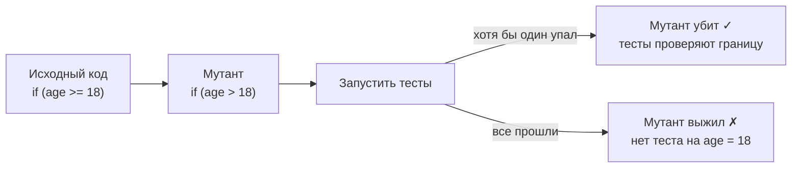
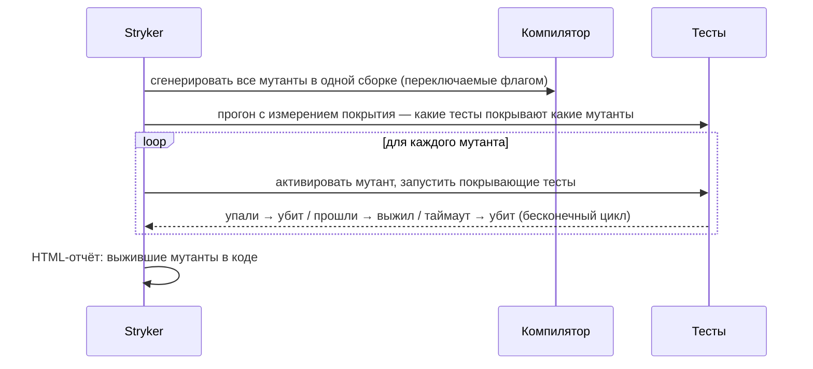
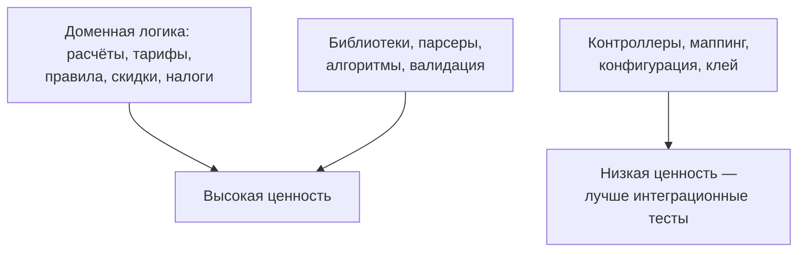

:::tldr
- **Mutation testing** проверяет **качество тестов**, а не кода: инструмент вносит в код маленькие изменения (**мутанты**) — меняет `>` на `>=`, `+` на `-`, `true` на `false`, удаляет вызов — и запускает тесты.
- Если тесты **упали** — мутант **убит** (тесты заметили изменение поведения). Если **прошли** — мутант **выжил**: тесты не проверяют это поведение.
- **Mutation score** = убитые / (все − эквивалентные) × 100%. Это гораздо более честная метрика, чем code coverage: 100% покрытия без проверок даст 0% mutation score.
- В .NET — **Stryker.NET** (`dotnet stryker`), HTML-отчёт с выжившими мутантами прямо в коде.
- Дорого по времени (тесты гоняются много раз) → запускают по расписанию или **только на изменённых файлах** (`--since`), нацеливают на критичную бизнес-логику.
:::

## Идея



```csharp Код и «зелёный» тест со 100% покрытием
public static class AgePolicy
{
    public static bool CanBuyAlcohol(int age) => age >= 18;
}

[Fact]
public void Adult_can_buy() => AgePolicy.CanBuyAlcohol(30).Should().BeTrue();

[Fact]
public void Child_cannot_buy() => AgePolicy.CanBuyAlcohol(10).Should().BeFalse();
// Покрытие строк: 100%.
// Мутант age > 18 — ВЫЖИВАЕТ: ни один тест не проверяет границу 18.
// Мутант age >= 17 — ВЫЖИВАЕТ.
```

Исправление — тесты на границе:

```csharp
[Theory]
[InlineData(17, false)]
[InlineData(18, true)]
public void Boundary_at_18(int age, bool expected) => AgePolicy.CanBuyAlcohol(age).Should().Be(expected);
```

## Какие бывают мутации

| Категория | Исходный код | Мутант |
|---|---|---|
| Арифметические | `a + b` | `a - b`, `a * b` |
| Сравнения | `x >= 18` | `x > 18`, `x < 18` |
| Логические | `a && b` | `a \|\| b` |
| Булевы литералы | `return true;` | `return false;` |
| Отрицание | `if (isValid)` | `if (!isValid)` |
| Удаление вызова | `order.Validate();` | *(удалено)* |
| Строки | `"Заказ оплачен"` | `""` |
| LINQ | `.First()`, `.Any()`, `.OrderBy()` | `.Last()`, `.All()`, `.OrderByDescending()` |
| Присваивания | `total += x` | `total -= x` |
| Инкременты | `i++` | `i--` |
| Блоки | `{ ... }` | `{ }` |

## Stryker.NET

```bash
dotnet tool install -g dotnet-stryker
cd tests/Shop.Domain.Tests
dotnet stryker                                   # весь проект
dotnet stryker --since:main                      # только код, изменённый относительно main (для PR)
dotnet stryker --mutate "**/Pricing/**/*.cs"     # только критичный модуль
```

```json stryker-config.json
{
  "stryker-config": {
    "project": "Shop.Domain.csproj",
    "reporters": ["html", "progress", "dashboard"],
    "thresholds": { "high": 80, "low": 60, "break": 50 },
    "mutation-level": "Standard",
    "ignore-methods": ["*Log*", "ToString"],
    "coverage-analysis": "perTest"
  }
}
```

`break: 50` — сборка упадёт, если mutation score ниже 50%. `coverage-analysis: perTest` — для каждого мутанта запускаются только тесты, покрывающие изменённую строку (сильно ускоряет).



## Результаты и интерпретация

| Статус | Значение |
|---|---|
| **Killed** | Тест упал — хорошо |
| **Survived** | Тесты не заметили — нужен тест или код лишний |
| **No coverage** | Ни один тест не выполняет эту строку |
| **Timeout** | Мутация вызвала зависание — считается убитым |
| **Compile error** | Мутант не скомпилировался — не учитывается |
| **Ignored** | Исключён настройками |

Выживший мутант — это вопрос: «Если бы здесь была ошибка, заметили бы мы?» Возможные ответы:
1. **Нет теста** → добавить (чаще всего граничные случаи и ветки ошибок).
2. **Код не влияет на поведение** → возможно, мёртвый/лишний код — удалить.
3. **Эквивалентный мутант** — изменение не меняет поведение вообще (например, `i < n` → `i != n` в обычном цикле) → игнорировать.

## Где применять



- Запускать в CI **по изменённым файлам** в PR или по ночам для всего проекта.
- Не гнаться за 100%: эквивалентные мутанты и логирование дадут шум. 70–80% на доменном ядре — хороший уровень.

## Вопросы на засыпку

:::qa Почему mutation score лучше code coverage?
Coverage отвечает на вопрос «выполнялась ли строка», mutation score — «заметит ли тест ошибку в строке». Тест без утверждений даёт высокое покрытие и нулевой mutation score. Мутационное тестирование измеряет силу проверок.
:::

:::qa Что такое эквивалентный мутант?
Мутация, которая не меняет наблюдаемое поведение программы, поэтому её невозможно «убить» тестом. Пример: замена `x * 1` на `x / 1`, или изменение порядка независимых операций. Инструменты стараются их не генерировать, остальные помечают вручную.
:::

:::qa Почему mutation testing долгий и как ускорить?
Для каждого мутанта нужно выполнить тесты: сотни мутантов × тесты. Ускорение: запускать только тесты, покрывающие мутант (perTest), только изменённые файлы (`--since`), только быстрые unit-тесты, параллелизм, инкрементальный режим с базовым отчётом.
:::

:::qa Стоит ли применять mutation testing к интеграционным тестам?
Обычно нет: они медленные, и прогон займёт часы. Мутационное тестирование нацеливают на быстрые unit-тесты доменной логики.
:::

## Итог

Mutation testing проверяет, заметят ли тесты ошибку: внесённые мутации должны «убиваться». Stryker.NET показывает выжившие мутанты — непроверенные границы, ветки и лишний код. Это дорогой, но очень честный инструмент: применяйте его к критичной логике и изменённому коду, а не ради процента.
