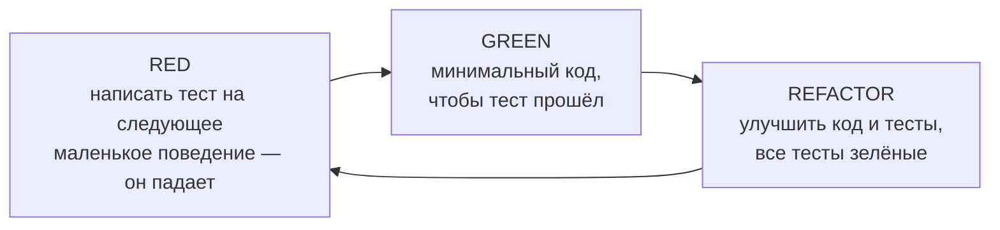
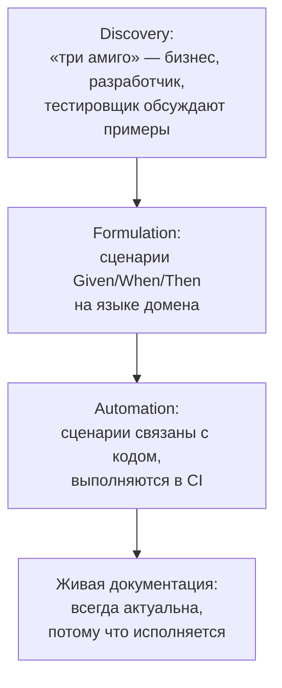
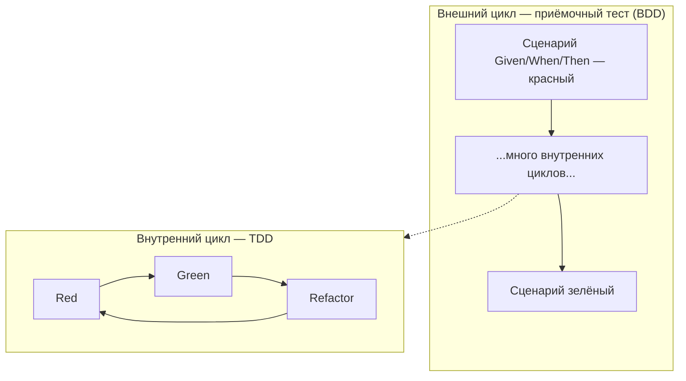

:::tldr
- **TDD (Test-Driven Development)** — техника **разработки**: сначала пишем падающий тест (**Red**), затем минимальный код, чтобы он прошёл (**Green**), затем улучшаем код (**Refactor**). Короткие циклы в минуты. Результат — тестируемый дизайн, покрытие «из коробки», уверенность при рефакторинге.
- **BDD (Behavior-Driven Development)** — практика **совместной формулировки требований** в виде **примеров поведения** на языке бизнеса: `Given / When / Then` (Gherkin). Цель — общее понимание между бизнесом, аналитиками, QA и разработчиками; сценарии становятся исполняемыми спецификациями.
- TDD отвечает на вопрос «**правильно ли** написан код?» (уровень разработчика), BDD — «**тот ли** код мы пишем?» (уровень продукта). Они совместимы: BDD-сценарий снаружи, TDD-циклы внутри (outside-in).
- В .NET: TDD — любой фреймворк (xUnit/NUnit); BDD — **Reqnroll** (преемник SpecFlow), LightBDD, или просто стиль `Given_When_Then` в именах тестов.
- TDD особенно полезен для доменной логики, алгоритмов, исправления багов (сначала тест, воспроизводящий баг). BDD — когда требования сложные и их легко понять неверно.
:::

## TDD: Red — Green — Refactor



### Пример: расчёт стоимости доставки

Требование: доставка 25 000 сум; бесплатно от 500 000; для VIP — всегда бесплатно.

```csharp Шаг 1 — RED
[Fact]
public void Standard_shipping_costs_25000() =>
    ShippingCalculator.Calculate(orderTotal: 100_000, isVip: false).Should().Be(25_000);
// Не компилируется — класса нет. Это тоже «красный».
```

```csharp Шаг 2 — GREEN: самый простой код
public static class ShippingCalculator
{
    public static decimal Calculate(decimal orderTotal, bool isVip) => 25_000;   // да, «глупо» — но тест зелёный
}
```

```csharp Шаг 3 — RED: следующее поведение
[Fact]
public void Free_shipping_from_500000() =>
    ShippingCalculator.Calculate(500_000, isVip: false).Should().Be(0);
```

```csharp Шаг 4 — GREEN
public static decimal Calculate(decimal orderTotal, bool isVip) => orderTotal >= 500_000 ? 0 : 25_000;
```

```csharp Шаг 5 — RED → GREEN → REFACTOR
[Fact]
public void Vip_always_free() => ShippingCalculator.Calculate(10_000, isVip: true).Should().Be(0);

// GREEN + REFACTOR: убрать магические числа, дать имена
public static class ShippingCalculator
{
    private const decimal StandardFee = 25_000;
    private const decimal FreeShippingThreshold = 500_000;

    public static decimal Calculate(decimal orderTotal, bool isVip) =>
        isVip || orderTotal >= FreeShippingThreshold ? 0 : StandardFee;
}
```

Каждый шаг — минуты. Код растёт ровно настолько, насколько его требуют тесты (никакого YAGNI-нарушения), а рефакторинг безопасен — всё покрыто.

### Три закона TDD (Роберт Мартин)

1. Не пишите продакшен-код, пока нет падающего теста.
2. Не пишите тест больше, чем нужно для падения (некомпиляция — тоже падение).
3. Не пишите продакшен-кода больше, чем нужно для прохождения текущего теста.

## BDD: поведение на языке бизнеса

```gherkin features/Shipping.feature
Функция: Стоимость доставки
  Чтобы покупатели понимали итоговую цену
  Как магазин
  Мы рассчитываем стоимость доставки по сумме заказа и статусу клиента

  Сценарий: Обычная доставка
    Дано покупатель без VIP-статуса
    И сумма заказа 100 000 сум
    Когда покупатель оформляет заказ
    Тогда стоимость доставки 25 000 сум

  Структура сценария: Бесплатная доставка
    Дано покупатель со статусом "<статус>"
    И сумма заказа <сумма> сум
    Когда покупатель оформляет заказ
    Тогда стоимость доставки 0 сум

    Примеры:
      | статус  | сумма   |
      | обычный | 500 000 |
      | VIP     | 10 000  |
```

```csharp Привязка шагов (Reqnroll)
[Binding]
public sealed class ShippingSteps
{
    private bool _isVip;
    private decimal _total;
    private decimal _shipping;

    [Given("покупатель без VIP-статуса")] public void NotVip() => _isVip = false;
    [Given("покупатель со статусом {string}")] public void WithStatus(string status) => _isVip = status == "VIP";
    [Given("сумма заказа {decimal} сум")] public void OrderTotal(decimal total) => _total = total;
    [When("покупатель оформляет заказ")] public void Checkout() => _shipping = ShippingCalculator.Calculate(_total, _isVip);
    [Then("стоимость доставки {decimal} сум")] public void ShippingIs(decimal expected) => _shipping.Should().Be(expected);
}
```



Главная ценность BDD — не инструмент Gherkin, а **разговор** (Example Mapping, «три амиго»): примеры выявляют непонимание требований **до** написания кода. Инструмент лишь сохраняет договорённости исполняемыми.

## Сравнение

| | TDD | BDD |
|---|---|---|
| Суть | Техника проектирования кода через тесты | Практика согласования требований через примеры |
| Кто участвует | Разработчик | Бизнес, аналитик, QA, разработчик |
| Язык | Код (C#) | Естественный язык домена (Gherkin) + код |
| Уровень | Unit, иногда интеграционный | Приёмочный / функциональный |
| Вопрос | Правильно ли работает код? | Тот ли продукт мы строим? |
| Результат | Покрытый тестами, модульный дизайн | Общее понимание, живая документация |
| Цикл | Минуты | Фича / user story |
| Инструменты .NET | xUnit, NUnit, MSTest | Reqnroll, LightBDD, стиль Given/When/Then |

## Outside-in: как они сочетаются



## Когда применять

**TDD хорошо работает для:**
- Доменной логики, расчётов, правил, машин состояний, парсеров.
- Исправления багов: сначала тест, воспроизводящий баг, затем исправление — баг не вернётся.
- Кода, где дизайн API неочевиден (тест — первый клиент API).

**TDD сложнее для:**
- Исследовательского кода, прототипов, UI-вёрстки.
- Тонких интеграционных слоёв без логики (лучше интеграционные тесты после).

**BDD оправдан, когда:**
- Требования сложные, много бизнес-правил и исключений (страхование, тарифы, налоги).
- Бизнес реально участвует в формулировке и чтении сценариев.
- Нужна живая документация поведения.

**BDD превращается в накладные расходы**, если сценарии пишут только разработчики для самих себя — тогда проще тесты в стиле `Given_When_Then` на C#.

## Вопросы на засыпку

:::qa Замедляет ли TDD разработку?
На коротком горизонте — немного (пишется больше кода). На длинном — ускоряет: меньше отладки, меньше регрессий, безопасный рефакторинг, лучше дизайн (тестируемый код — слабо связанный). Исследования показывают снижение числа дефектов при умеренном росте времени разработки.
:::

:::qa Как TDD влияет на архитектуру?
Код, написанный под тест, естественно получает явные зависимости (конструктор, интерфейсы на границах), маленькие методы и классы с одной ответственностью — «трудно протестировать» становится сигналом плохого дизайна до того, как код написан.
:::

:::qa Что такое «триангуляция» в TDD?
Приём обобщения: сначала хардкод под один пример («return 25 000»), затем второй тест с другим примером заставляет написать реальную логику. Так код обобщается только тогда, когда тесты этого требуют.
:::

:::qa Что стало со SpecFlow?
SpecFlow прекратил развитие; сообщество продолжило его как **Reqnroll** — практически совместимый форк с поддержкой современных .NET и тестовых фреймворков. Для новых проектов берут Reqnroll.
:::

## Итог

TDD — дисциплина разработки короткими циклами Red–Green–Refactor, дающая тестируемый дизайн и уверенность в коде. BDD — практика совместного определения поведения через примеры на языке бизнеса, превращаемые в исполняемые спецификации. Они отвечают на разные вопросы и прекрасно работают вместе: сценарий снаружи, TDD внутри.
