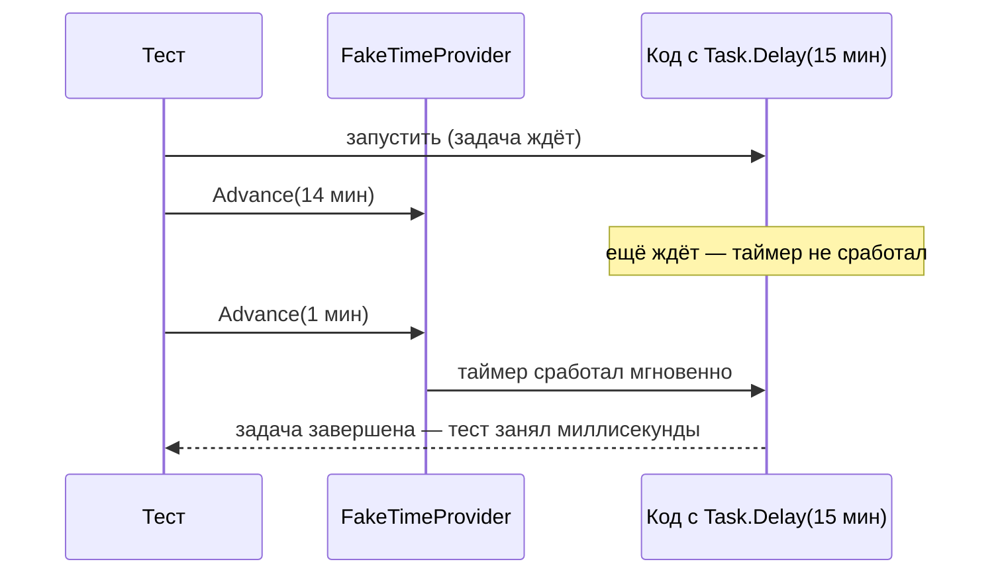

:::tldr
- Тестовые методы — **`async Task`** (не `async void`!), внутри — `await`. Все фреймворки (xUnit, NUnit, MSTest) ждут завершения `Task`.
- Никогда **`.Result` / `.Wait()`** в тестах — риск deadlock-ов (особенно в xUnit с его `SynchronizationContext`) и потеря исходного исключения в `AggregateException`.
- Исключения: `await Assert.ThrowsAsync<T>(() => ...)` / `await act.Should().ThrowAsync<T>()`.
- **Время** — через `TimeProvider` и **`FakeTimeProvider`**: `Advance(TimeSpan)` мгновенно «проматывает» таймеры и `Task.Delay`, без реального ожидания.
- **Отмена** — проверять, что код уважает `CancellationToken` (`OperationCanceledException`, быстрый выход).
- **Фоновые процессы и конкурентность**: избегать `Task.Delay` «на всякий случай» в тестах; ждать **сигнала** (`TaskCompletionSource`, канал, polling с таймаутом), использовать детерминированные фейки.
- Асинхронные моки: `Returns(Task.FromResult(x))`, `ReturnsAsync(x)`; NSubstitute — `.Returns(x)` для `Task<T>` работает напрямую.
:::

## Базовые правила

```csharp
// Правильно
[Fact]
public async Task Returns_order_by_id()
{
    var repo = Substitute.For<IOrderRepository>();
    repo.GetAsync(42, Arg.Any<CancellationToken>()).Returns(new Order(42));   // NSubstitute оборачивает в Task
    var sut = new OrderService(repo);

    var order = await sut.GetAsync(42, CancellationToken.None);

    order!.Id.Should().Be(42);
}

// Неправильно: async void — фреймворк не узнает о падении после await
[Fact]
public async void Bad_test() { await Task.Delay(1); throw new Exception(); }   // xUnit сейчас выдаёт ошибку анализатора

// Неправильно: блокировка
[Fact]
public void Blocking_test() => sut.GetAsync(42, default).Result.Should().NotBeNull();   // риск deadlock, AggregateException
```

```csharp Исключения
[Fact]
public async Task Throws_when_order_not_found()
{
    var sut = new OrderService(Substitute.For<IOrderRepository>());   // вернёт null по умолчанию

    var act = () => sut.PayAsync(99, default);

    await act.Should().ThrowAsync<NotFoundException>().WithMessage("*99*");
    // или: await Assert.ThrowsAsync<NotFoundException>(() => sut.PayAsync(99, default));
}
```

## Время: FakeTimeProvider

```csharp Код, зависящий от времени
public sealed class ReservationService(IReservationStore store, TimeProvider clock)
{
    public async Task<Reservation> ReserveAsync(Guid productId, CancellationToken ct)
    {
        var r = new Reservation(productId, expiresAt: clock.GetUtcNow().AddMinutes(15));
        await store.SaveAsync(r, ct);
        return r;
    }

    public async Task WaitAndReleaseAsync(Reservation r, CancellationToken ct)
    {
        await Task.Delay(r.ExpiresAt - clock.GetUtcNow(), clock, ct);   // перегрузка Task.Delay с TimeProvider (.NET 8)
        await store.ReleaseAsync(r.Id, ct);
    }
}
```

```csharp Тест без реального ожидания 15 минут
[Fact]
public async Task Reservation_is_released_after_15_minutes()
{
    var clock = new FakeTimeProvider(DateTimeOffset.Parse("2025-09-30T10:00:00Z"));
    var store = new InMemoryReservationStore();
    var sut = new ReservationService(store, clock);
    var reservation = await sut.ReserveAsync(Guid.NewGuid(), default);

    var waiting = sut.WaitAndReleaseAsync(reservation, default);    // не await — задача «спит»

    clock.Advance(TimeSpan.FromMinutes(14));
    waiting.IsCompleted.Should().BeFalse();                        // ещё рано

    clock.Advance(TimeSpan.FromMinutes(1));                        // таймер срабатывает мгновенно
    await waiting;
    store.IsReleased(reservation.Id).Should().BeTrue();
}
```



## Отмена

```csharp
[Fact]
public async Task Stops_processing_when_cancelled()
{
    using var cts = new CancellationTokenSource();
    var processor = new BatchProcessor(new SlowFakeSource(itemCount: 1000));

    var run = processor.RunAsync(cts.Token);
    await cts.CancelAsync();

    await FluentActions.Awaiting(() => run).Should().ThrowAsync<OperationCanceledException>();
    processor.ProcessedCount.Should().BeLessThan(1000);
}
```

## BackgroundService и асинхронные эффекты

Проблема: фоновый процесс обрабатывает сообщение «когда-нибудь». `await Task.Delay(1000)` в тесте — медленно и нестабильно (на загруженном CI 1 секунды может не хватить).

```csharp Ожидание условия с таймаутом вместо фиксированной паузы
public static async Task WaitUntilAsync(Func<bool> condition, TimeSpan? timeout = null)
{
    var deadline = DateTime.UtcNow + (timeout ?? TimeSpan.FromSeconds(10));
    while (!condition())
    {
        if (DateTime.UtcNow > deadline) throw new TimeoutException("Условие не выполнилось вовремя");
        await Task.Delay(20);
    }
}

[Fact]
public async Task Worker_processes_queued_message()
{
    var channel = Channel.CreateUnbounded<Job>();
    var handled = new ConcurrentBag<Guid>();
    var worker = new JobWorker(channel.Reader, job => { handled.Add(job.Id); return Task.CompletedTask; });
    using var cts = new CancellationTokenSource();
    await worker.StartAsync(cts.Token);

    var job = new Job(Guid.NewGuid());
    await channel.Writer.WriteAsync(job);

    await WaitUntilAsync(() => handled.Contains(job.Id));
    await worker.StopAsync(default);
}
```

Ещё лучше — сигнал о завершении: обработчик в тесте завершает `TaskCompletionSource`, тест ждёт `tcs.Task.WaitAsync(TimeSpan.FromSeconds(5))`.

```csharp
var processed = new TaskCompletionSource<Guid>(TaskCreationOptions.RunContinuationsAsynchronously);
var worker = new JobWorker(channel.Reader, job => { processed.TrySetResult(job.Id); return Task.CompletedTask; });
// ...
(await processed.Task.WaitAsync(TimeSpan.FromSeconds(5))).Should().Be(job.Id);
```

## Конкурентность и гонки

```csharp Проверка потокобезопасности: много параллельных операций
[Fact]
public async Task Counter_is_thread_safe()
{
    var counter = new RequestCounter();
    await Parallel.ForEachAsync(Enumerable.Range(0, 10_000), async (_, ct) =>
    {
        counter.Increment();
        await Task.Yield();
    });
    counter.Value.Should().Be(10_000);
}
```

Тесты гонок вероятностные: зелёный тест не доказывает отсутствие гонки. Для критичных мест — стресс-тесты с большим числом итераций, анализ кода, использование проверенных примитивов (`Interlocked`, `ConcurrentDictionary`, `Channel`).

## Асинхронные моки

| Библиотека | Задача с результатом | Исключение |
|---|---|---|
| Moq | `.ReturnsAsync(value)` | `.ThrowsAsync(new Exception())` |
| NSubstitute | `.Returns(value)` (для `Task<T>` авто) | `.ThrowsAsync(new Exception())` (NSubstitute.ExceptionExtensions) |
| FakeItEasy | `.Returns(value)` | `.ThrowsAsync(...)` |

Незастроенный мок NSubstitute/Moq для `Task<T>` возвращает завершённую задачу со значением по умолчанию, а не `null` — это удобно, но может маскировать забытую настройку.

## Вопросы на засыпку

:::qa Почему async void в тестах опасен?
Метод `async void` возвращает управление фреймворку на первом `await`; тест считается пройденным, а исключение, возникшее позже, уходит в контекст синхронизации и может уронить процесс или быть потеряно. Всегда `async Task`.
:::

:::qa Как тестировать код с Task.Delay без ожидания?
Внедрить `TimeProvider` и использовать `Task.Delay(delay, timeProvider, ct)`, `timeProvider.CreateTimer(...)`, `PeriodicTimer(period, timeProvider)`. В тестах — `FakeTimeProvider.Advance`. До .NET 8 — собственная абстракция `IDelay`/`IClock`.
:::

:::qa Зачем RunContinuationsAsynchronously в TaskCompletionSource?
Без флага продолжения, ожидающие `tcs.Task`, выполняются синхронно в потоке, вызвавшем `SetResult` — внутри кода фонового обработчика. Это может вызвать неожиданную реентерабельность и deadlock-и в тестах. Флаг отправляет продолжения в пул потоков.
:::

:::qa Как сделать тест с фоновыми задачами детерминированным?
Убрать реальное время (`FakeTimeProvider`), реальные очереди заменить `Channel`/in-memory фейками, ждать сигналов вместо пауз, ограничивать ожидание таймаутом с понятной ошибкой, отключать лишние hosted services в интеграционных тестах.
:::

## Итог

Асинхронные тесты — это `async Task` с `await`, без блокировок. Время управляется через `TimeProvider`/`FakeTimeProvider`, отмена проверяется явно, а фоновые эффекты ожидаются по сигналу или условию с таймаутом, а не фиксированными паузами. Так тесты становятся быстрыми и стабильными даже на загруженном CI.
