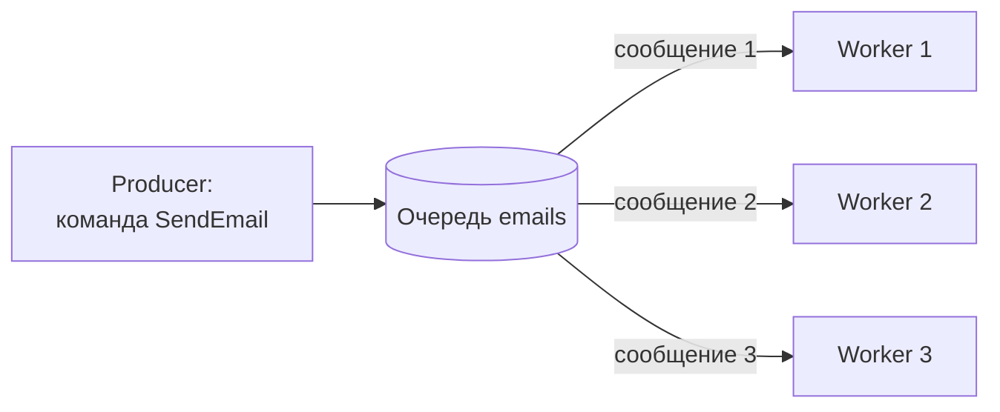
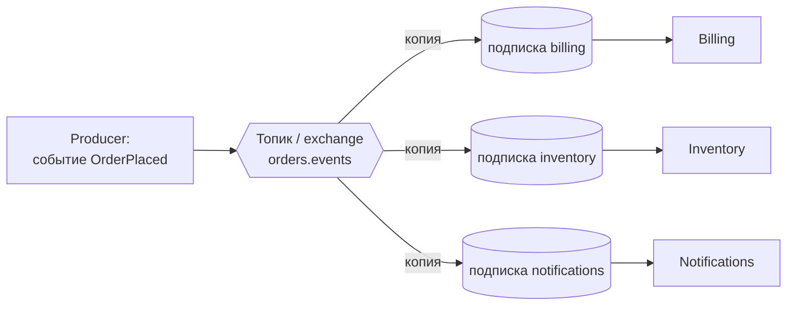
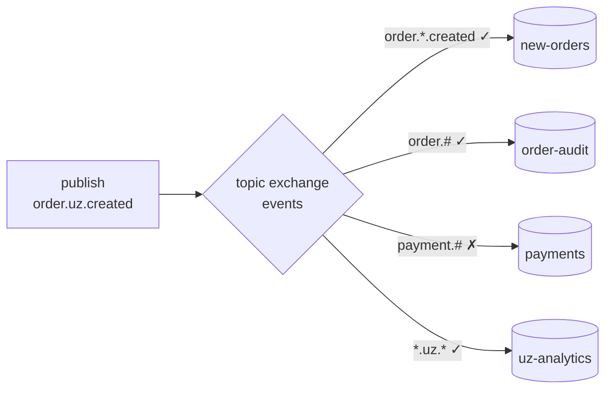
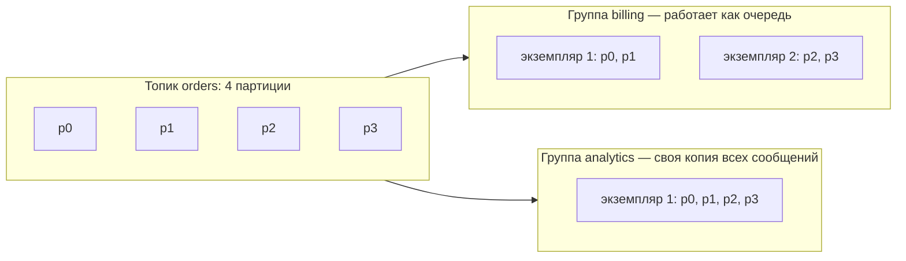

:::tldr
- **Очередь (point-to-point)** — каждое сообщение обрабатывает **ровно один** потребитель из группы (competing consumers). Модель для **команд и задач**: «отправь письмо», «сгенерируй отчёт».
- **Топик (publish/subscribe)** — каждое сообщение получает **каждый подписчик** (каждая подписка — своя копия). Модель для **событий**: «заказ оформлен» — нужно складу, оплате и аналитике.
- В **RabbitMQ** топика как сущности нет: публикация идёт в **exchange**, который копирует сообщение в привязанные **очереди** (типы: direct, topic, fanout, headers). Подписчик = своя очередь.
- В **Azure Service Bus** — Queue и Topic + Subscriptions (у каждой подписки своя «виртуальная очередь» и фильтры).
- В **Kafka** — всё топики; «очередь» получается внутри **consumer group** (партиция читается одним потребителем группы), «pub/sub» — разными группами.
- Комбинация: pub/sub между сервисами + competing consumers внутри сервиса (несколько экземпляров читают одну подписку).
:::

## Две модели доставки





| | Очередь | Топик |
|---|---|---|
| Получателей одного сообщения | Один | Все подписчики |
| Отправитель знает получателя | Обычно да (адресует очередь) | Нет |
| Тип сообщений | Команды, задачи | События |
| Масштабирование | Больше потребителей — быстрее разбор | Больше подписчиков — больше копий |
| Если потребителей нет | Сообщения копятся | Без подписок сообщение теряется (некому доставить) |

## RabbitMQ: exchanges

| Тип exchange | Как маршрутизирует | Пример |
|---|---|---|
| **direct** | Точное совпадение routing key с binding key | `routingKey = "email"` → очередь `emails` |
| **topic** | Шаблоны с `*` (одно слово) и `#` (0+ слов) | `order.*.created`, `order.#` |
| **fanout** | Во все привязанные очереди, ключ игнорируется | Broadcast события |
| **headers** | По заголовкам сообщения | `x-match: all`, `region = uz` |
| default (`""`) | В очередь с именем = routing key | Простая отправка в очередь |



```csharp Объявление топологии (RabbitMQ.Client)
await ch.ExchangeDeclareAsync("events", ExchangeType.Topic, durable: true);

await ch.QueueDeclareAsync("billing.order-placed", durable: true, exclusive: false, autoDelete: false);
await ch.QueueBindAsync("billing.order-placed", "events", routingKey: "order.placed");

await ch.QueueDeclareAsync("audit.all-orders", durable: true, exclusive: false, autoDelete: false);
await ch.QueueBindAsync("audit.all-orders", "events", routingKey: "order.#");

// Публикация: производитель знает только exchange и тип события
await ch.BasicPublishAsync("events", "order.placed", false, props, body);
```

Каждый сервис-подписчик создаёт **свою** очередь и привязывает её к exchange. Несколько экземпляров сервиса читают **одну** его очередь — получаются competing consumers внутри pub/sub.

## Azure Service Bus

```csharp
// Отправка события в топик
await using var sender = client.CreateSender("orders");
await sender.SendMessageAsync(new ServiceBusMessage(BinaryData.FromObjectAsJson(evt))
{
    MessageId = evt.EventId.ToString(),
    Subject = "OrderPlaced",
    ApplicationProperties = { ["region"] = "uz" }
});

// Каждая подписка имеет фильтр (SQL или correlation)
// subscription "notifications": Subject = 'OrderPlaced'
// subscription "uz-analytics":  region = 'uz'
await using var processor = client.CreateProcessor("orders", "notifications", new ServiceBusProcessorOptions { MaxConcurrentCalls = 10 });
```

## Kafka: consumer groups



- Внутри группы: каждая партиция — одному потребителю (очередь).
- Между группами: каждая группа читает все сообщения (pub/sub).
- Потребителей в группе больше, чем партиций? Лишние простаивают.

## Команда в очередь, событие в топик

```csharp MassTransit: Send (команда) против Publish (событие)
// Команда — конкретному получателю, в его очередь
var endpoint = await sendEndpointProvider.GetSendEndpoint(new Uri("queue:generate-invoice"));
await endpoint.Send(new GenerateInvoice(orderId));

// Событие — всем, кто подписан на тип сообщения (exchange по типу)
await publishEndpoint.Publish(new OrderPlaced(orderId, customerId, total));
```

MassTransit на RabbitMQ создаёт exchange на **тип сообщения** и очередь на **endpoint потребителя**, связывая их автоматически — `Publish` превращается в fanout по подписчикам.

## Вопросы на засыпку

:::qa Что будет с событием, если у топика нет подписчиков?
В RabbitMQ сообщение, не попавшее ни в одну очередь, отбрасывается (или возвращается отправителю с флагом `mandatory`, или уходит в alternate exchange). В Service Bus сообщение в топике без подходящих подписок не сохраняется. В Kafka сообщение хранится в топике независимо от потребителей — прочитают позже.
:::

:::qa Почему не отправить событие в несколько очередей самому?
Тогда отправитель должен знать всех получателей — это жёсткая связанность: новый подписчик требует изменения кода отправителя. Exchange/топик переносят знание о подписчиках в конфигурацию брокера.
:::

:::qa Как масштабировать подписчика в pub/sub?
Запустить несколько экземпляров сервиса, читающих **одну и ту же** его очередь/подписку/consumer group — они станут конкурирующими потребителями, каждое сообщение обработает один экземпляр.
:::

:::qa Как в RabbitMQ сделать временного подписчика (например, для WebSocket-уведомлений)?
Очередь с `exclusive: true` / `autoDelete: true` и сгенерированным именем — живёт, пока открыто соединение, привязана к fanout/topic exchange. Каждый экземпляр получает все события, пока работает.
:::

## Итог

Очередь доставляет каждое сообщение одному из потребителей — модель команд и задач с горизонтальным масштабированием. Топик доставляет копию каждому подписчику — модель событий без знания о получателях. В RabbitMQ это exchange + очереди, в Service Bus — topic + subscriptions, в Kafka — consumer groups; на практике модели комбинируют.
