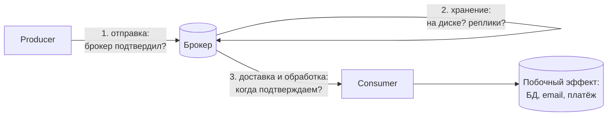
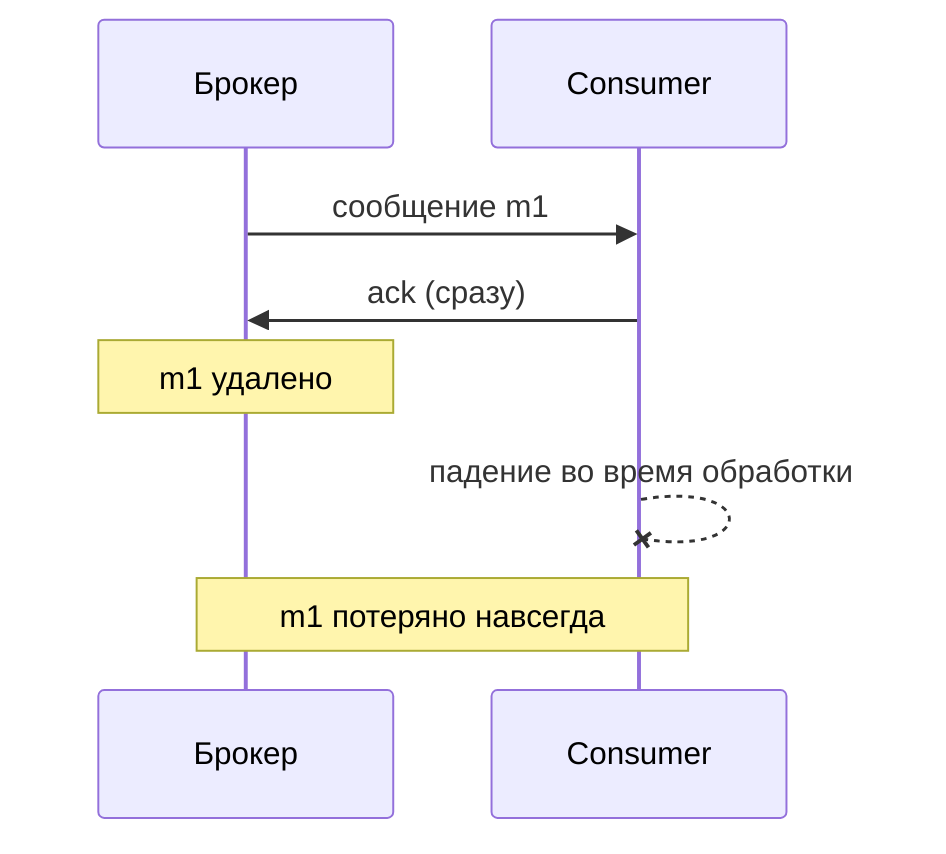
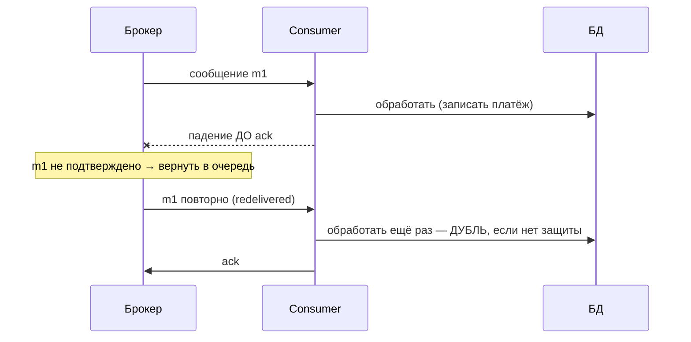
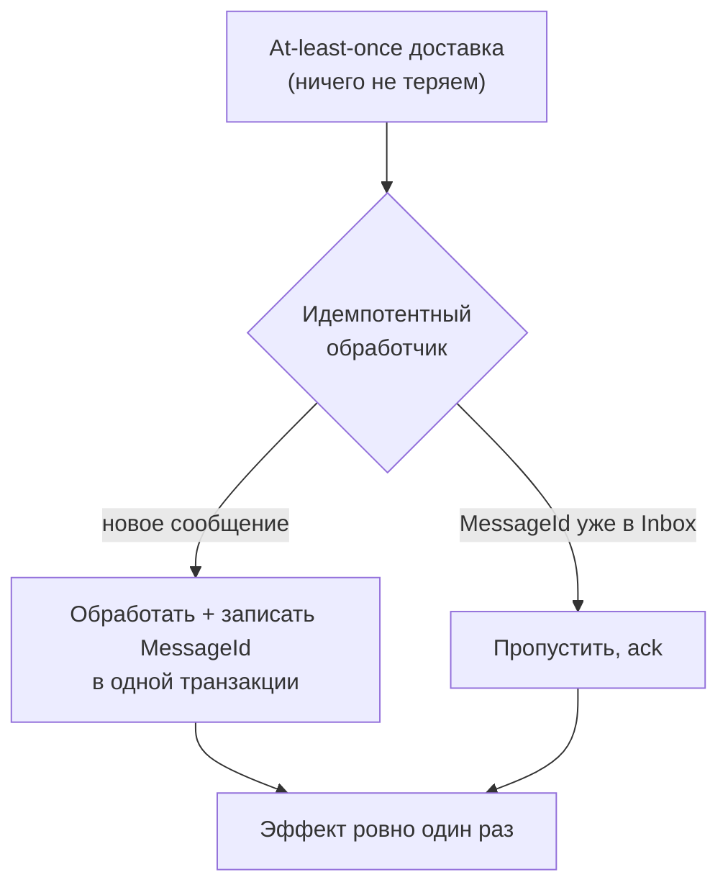

:::tldr
- **At-most-once** — «не больше одного раза»: сообщение может **потеряться**, но не будет дублей. Реализация: подтвердить (ack/commit offset) **до** обработки или вообще без подтверждений. Для некритичных данных (метрики, логи).
- **At-least-once** — «хотя бы раз»: сообщение **не потеряется**, но возможны **дубли**. Реализация: подтверждать **после** успешной обработки; сбой между обработкой и ack → повторная доставка. **Стандартный выбор** для бизнес-событий.
- **Exactly-once** — «ровно один раз»: в распределённой системе **доставка** ровно один раз в общем случае невозможна (Two Generals). Достижим **эффект** ровно одного раза: at-least-once + **идемпотентная обработка** (дедупликация по MessageId, Inbox, уникальные ключи), или транзакции внутри одной системы (Kafka transactions: read-process-write в Kafka).
- Гарантия — свойство **всей цепочки**: producer → брокер → consumer → побочные эффекты (БД, внешние API).
:::

## Где теряются и дублируются сообщения



Каждый участок нужно настроить: подтверждения публикации (publisher confirms / `acks=all`), устойчивое хранение (durable очереди, persistent сообщения, репликация), момент подтверждения потребителем.

## At-most-once



```csharp
// RabbitMQ: autoAck = true — брокер считает сообщение доставленным при отправке
await channel.BasicConsumeAsync("metrics", autoAck: true, consumer);
```

Уместно: телеметрия, метрики, некритичные уведомления, где потеря дешевле дубля или сложности.

## At-least-once



```csharp
await channel.BasicQosAsync(prefetchSize: 0, prefetchCount: 20, global: false);
consumer.ReceivedAsync += async (_, ea) =>
{
    try
    {
        await HandleAsync(ea.Body, ea.BasicProperties.MessageId);
        await channel.BasicAckAsync(ea.DeliveryTag, multiple: false);          // ПОСЛЕ обработки
    }
    catch (Exception)
    {
        await channel.BasicNackAsync(ea.DeliveryTag, false, requeue: false);   // → DLX после исчерпания ретраев
    }
};
await channel.BasicConsumeAsync("payments", autoAck: false, consumer);
```

Источники дублей: падение потребителя после обработки до ack, таймаут подтверждения, ребалансировка партиций в Kafka, повторная публикация продюсером (не получил подтверждение, хотя брокер записал), outbox relay после сбоя.

## Exactly-once: почему «доставки» не бывает

Отправитель не может отличить «сообщение потерялось» от «потерялось подтверждение» (проблема двух генералов). Поэтому он либо повторяет (дубли → at-least-once), либо нет (потери → at-most-once).

Что реально достижимо — **exactly-once processing (effectively-once)**:



```csharp Inbox: дедупликация в той же транзакции, что и эффект
public async Task HandleAsync(PaymentRequested msg, Guid messageId, CancellationToken ct)
{
    await using var tx = await db.Database.BeginTransactionAsync(ct);
    var isNew = await db.Database.ExecuteSqlAsync(
        $"INSERT INTO inbox (message_id, consumer) VALUES ({messageId}, 'payments') ON CONFLICT DO NOTHING", ct) == 1;
    if (isNew)
    {
        db.Payments.Add(Payment.For(msg.OrderId, msg.Amount));
        await db.SaveChangesAsync(ct);
    }
    await tx.CommitAsync(ct);
}
```

### Kafka: exactly-once semantics

- **Идемпотентный продюсер** (`enable.idempotence = true`): брокер отбрасывает дубли повторных отправок (по producer id + sequence number).
- **Транзакции Kafka**: чтение из топика, запись в выходной топик и коммит offset — атомарно (read-process-write). Работает, пока **все** эффекты внутри Kafka (Kafka Streams).
- Как только эффект выходит за пределы Kafka (запись в PostgreSQL, вызов платёжного API) — снова нужна идемпотентность на стороне эффекта.

## Сравнение

| | At-most-once | At-least-once | Exactly-once (эффект) |
|---|---|---|---|
| Потери | Возможны | Нет | Нет |
| Дубли | Нет | Возможны | Нет (устранены обработчиком) |
| Когда ack | До обработки | После обработки | После обработки + дедупликация |
| Сложность | Минимальная | Низкая | Выше: Inbox, ключи идемпотентности, транзакции |
| Применение | Метрики, логи | Большинство интеграций | Платежи, биллинг, остатки |

## Производитель тоже важен

```csharp RabbitMQ: publisher confirms — брокер подтверждает запись
var channel = await connection.CreateChannelAsync(new CreateChannelOptions(publisherConfirmationsEnabled: true, publisherConfirmationTrackingEnabled: true));
await channel.BasicPublishAsync("events", "order.placed", mandatory: true, props, body);   // бросит исключение, если брокер не подтвердил
```

```text Kafka producer
acks=all                      # подтверждение от всех in-sync реплик
enable.idempotence=true       # без дублей при повторной отправке
min.insync.replicas=2         # на стороне топика
```

И конечно — **Outbox**: без него сообщение может потеряться ещё до брокера (сбой между коммитом БД и публикацией).

## Вопросы на засыпку

:::qa Что выбрать по умолчанию?
At-least-once + идемпотентные потребители. Потеря сообщения обычно дороже дубля, а дубль можно сделать безвредным. At-most-once — только для данных, потеря которых допустима.
:::

:::qa Как сделать обработку идемпотентной без таблицы Inbox?
Использовать естественную идемпотентность: `UPSERT` по бизнес-ключу, `UPDATE ... SET status = 'paid' WHERE id = @id AND status = 'pending'`, уникальный индекс на `(order_id, operation)`, idempotency key во внешнем API (платёжные системы поддерживают). Подробнее — в вопросе про идемпотентность.
:::

:::qa Чем redelivery отличается от retry?
Redelivery — брокер повторно доставляет неподтверждённое сообщение (сбой, nack с requeue, таймаут). Retry — потребитель сам повторяет обработку (Polly/MassTransit retry) до подтверждения. Оба источника повторов требуют идемпотентности.
:::

:::qa Гарантирует ли Kafka exactly-once до базы данных?
Нет. Транзакции Kafka покрывают только операции внутри Kafka. Для записи в внешнюю БД — хранить offset в той же БД в одной транзакции с данными, либо идемпотентные записи (upsert по ключу).
:::

## Итог

At-most-once теряет, at-least-once дублирует, а exactly-once как доставка невозможен — возможен только эффект ровно одного раза: надёжная доставка (outbox, подтверждения, durable-хранение) плюс идемпотентная обработка (Inbox, upsert, ключи идемпотентности). Это стандартный рецепт для любых важных бизнес-сообщений.
