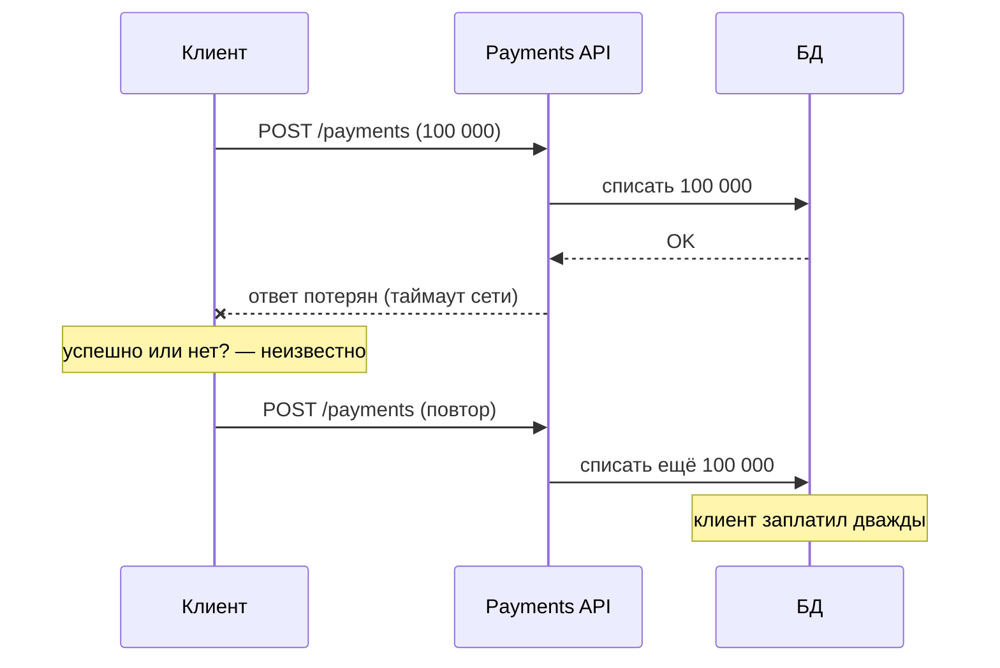
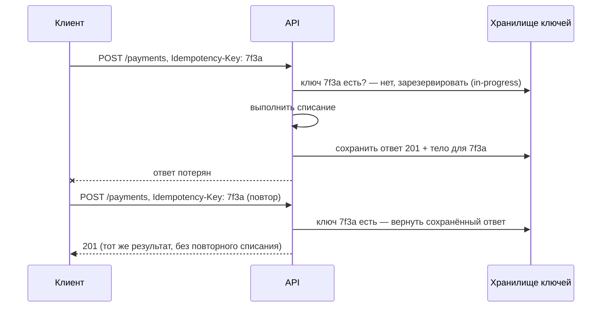
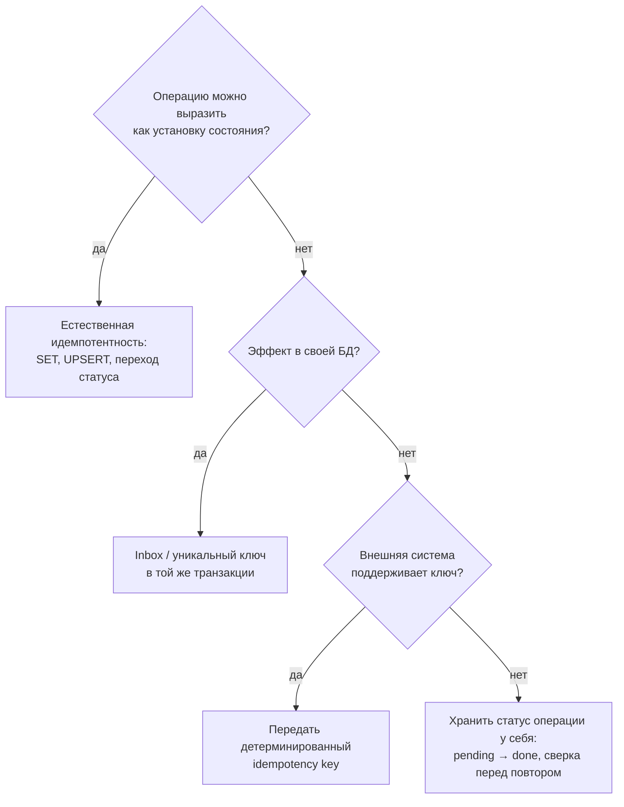

:::tldr
- **Идемпотентная операция** — повторное выполнение с теми же входными данными **даёт тот же результат** и не создаёт дополнительных побочных эффектов: `f(f(x)) = f(x)`.
- Зачем: в распределённых системах **повторы неизбежны** — ретраи клиентов после таймаута, at-least-once доставка сообщений, redelivery, двойной клик пользователя. Без идемпотентности — двойные списания, дублированные заказы.
- HTTP: **GET, PUT, DELETE, HEAD, OPTIONS** идемпотентны по спецификации; **POST** и **PATCH** — нет (нужны дополнительные меры).
- Способы: **естественная идемпотентность** (установить значение, а не прибавить; `UPSERT`), **ключ идемпотентности** (`Idempotency-Key` в HTTP, `MessageId` в сообщениях) + хранение результатов, **Inbox** (таблица обработанных сообщений в той же транзакции), **уникальные ограничения** БД, **проверка состояния** (переход только из ожидаемого статуса), **версии** (optimistic concurrency).
- Дедупликация должна быть **атомарной** с эффектом: проверка «уже обрабатывали?» и запись результата — в одной транзакции, иначе гонка.
:::

## Проблема



Та же проблема с сообщениями: потребитель обработал `ChargeCustomer`, упал до ack — брокер доставит сообщение снова.

## Идемпотентные и неидемпотентные операции

| Операция | Идемпотентна? | Почему |
|---|---|---|
| `SET balance = 500` | Да | Результат не зависит от числа повторов |
| `SET balance = balance - 100` | **Нет** | Каждый повтор уменьшает |
| `UPDATE orders SET status = 'paid' WHERE id = 1` | Да | Повтор даёт тот же статус |
| `INSERT INTO orders ...` (новый id) | **Нет** | Создаёт дубль |
| `INSERT ... ON CONFLICT (id) DO NOTHING` | Да | Второй раз ничего не делает |
| `DELETE FROM carts WHERE id = 5` | Да | Второй раз удалять нечего |
| Отправить email | **Нет** | Два письма |
| HTTP GET / PUT / DELETE | Да (по семантике) | — |
| HTTP POST / PATCH | Нет (по умолчанию) | — |

## Приём 1: естественная идемпотентность

```csharp
// Не идемпотентно
await db.Database.ExecuteSqlAsync($"UPDATE stock SET qty = qty - {msg.Qty} WHERE sku = {msg.Sku}");

// Идемпотентно: переход состояния только из ожидаемого + запись факта с уникальным ключом
var reserved = await db.Database.ExecuteSqlAsync($"""
    INSERT INTO reservations (order_id, sku, qty) VALUES ({msg.OrderId}, {msg.Sku}, {msg.Qty})
    ON CONFLICT (order_id, sku) DO NOTHING
    """);
if (reserved == 1)
    await db.Database.ExecuteSqlAsync($"UPDATE stock SET qty = qty - {msg.Qty} WHERE sku = {msg.Sku}");
// (оба оператора — в одной транзакции)
```

```csharp Доменная модель: повтор команды не меняет состояние
public void MarkPaid(PaymentId paymentId)
{
    if (Status == OrderStatus.Paid && PaymentId == paymentId) return;     // уже оплачено этим платежом — ок
    if (Status != OrderStatus.Placed) throw new DomainException($"Нельзя оплатить заказ в статусе {Status}");
    Status = OrderStatus.Paid;
    PaymentId = paymentId;
}
```

## Приём 2: Idempotency-Key в HTTP API

Клиент генерирует уникальный ключ на **операцию** (не на попытку!) и повторяет запрос с тем же ключом. Сервер запоминает результат первой обработки и возвращает его при повторах. Так работают Stripe, платёжные шлюзы.



```csharp Фильтр эндпоинта для идемпотентности (упрощённо)
public sealed class IdempotencyFilter(IIdempotencyStore store) : IEndpointFilter
{
    public async ValueTask<object?> InvokeAsync(EndpointFilterInvocationContext ctx, EndpointFilterDelegate next)
    {
        var http = ctx.HttpContext;
        if (!http.Request.Headers.TryGetValue("Idempotency-Key", out var key) || !Guid.TryParse(key, out var id))
            return Results.BadRequest("Требуется заголовок Idempotency-Key");

        var existing = await store.TryGetAsync(id, http.RequestAborted);
        if (existing is { IsCompleted: true }) return Results.Json(existing.Body, statusCode: existing.StatusCode);
        if (existing is { IsCompleted: false }) return Results.Conflict("Запрос с этим ключом ещё обрабатывается");

        if (!await store.TryReserveAsync(id, requestHash: Hash(ctx.Arguments), http.RequestAborted))  // атомарно: INSERT ... ON CONFLICT
            return Results.Conflict("Параллельный запрос с тем же ключом");

        var result = await next(ctx);
        await store.CompleteAsync(id, result, http.RequestAborted);
        return result;
    }
}
```

Нюансы:
- Сверять **хэш тела** запроса: тот же ключ с другими данными — ошибка клиента (422).
- Хранить ключи ограниченное время (24 ч – 7 дней).
- Ключ резервировать атомарно — два параллельных запроса с одним ключом не должны оба выполниться.
- Идеально — сохранять результат **в той же транзакции**, что и бизнес-изменения.

## Приём 3: Inbox для сообщений

```csharp
public sealed class ReserveStockConsumer(ShopDbContext db) : IConsumer<OrderPlaced>
{
    public async Task Consume(ConsumeContext<OrderPlaced> context)
    {
        var messageId = context.MessageId ?? throw new InvalidOperationException("Нет MessageId");
        await using var tx = await db.Database.BeginTransactionAsync(context.CancellationToken);

        db.InboxMessages.Add(new InboxMessage(messageId, nameof(ReserveStockConsumer), DateTime.UtcNow));
        try
        {
            await db.SaveChangesAsync(context.CancellationToken);       // PK (message_id, consumer) — дубль упадёт здесь
        }
        catch (DbUpdateException ex) when (ex.IsUniqueViolation())
        {
            return;                                                      // уже обработано — просто подтвердить
        }

        await ReserveAsync(context.Message, context.CancellationToken);  // бизнес-эффект
        await db.SaveChangesAsync(context.CancellationToken);
        await tx.CommitAsync(context.CancellationToken);                 // Inbox и эффект — атомарно
    }
}
```

MassTransit предоставляет готовый **Inbox** (часть Transactional Outbox для EF Core): дедупликация входящих по MessageId на уровне конечной точки.

## Приём 4: ключи идемпотентности во внешних API

Если эффект — вызов внешней системы (платёж, SMS), передавайте ей свой ключ операции: большинство платёжных API принимают `Idempotency-Key` / `external_id` и сами не выполнят операцию дважды. Ключ должен быть **детерминированным** от бизнес-операции (например, `payment:{orderId}`), чтобы повтор после сбоя дал тот же ключ.

## Выбор способа



## Типичные ошибки

- **Проверить, потом сделать** без транзакции: `if (!processed) { Process(); MarkProcessed(); }` — два параллельных потребителя оба увидят «не обработано».
- Ключ идемпотентности генерируется **на каждую попытку** (в retry-обработчике) — теряет смысл.
- Дедупликация в памяти процесса — не переживает рестарт и не работает между экземплярами.
- Идемпотентен обработчик, но **не побочные эффекты** (письмо отправлено до падения — при повторе отправится снова). Порядок: сначала фиксация в БД + outbox для письма.

## Вопросы на засыпку

:::qa Почему POST не идемпотентен, а PUT — да?
PUT по семантике означает «установить ресурс по этому URI в данное состояние» — повтор даёт тот же результат. POST — «создать/выполнить действие», каждый вызов может создать новый ресурс. Поэтому для POST нужны ключи идемпотентности, либо можно использовать PUT с id, сгенерированным клиентом (`PUT /orders/{guid}`).
:::

:::qa Идемпотентен ли DELETE, если второй вызов вернёт 404?
Да: идемпотентность — про **состояние** сервера, а не про код ответа. После первого и после второго вызова ресурс удалён — состояние одно и то же.
:::

:::qa Сколько хранить записи Inbox?
Дольше, чем максимальное окно повторной доставки: время жизни сообщений в очередях и DLQ, окно ретраев, возможные ручные переотправки. Обычно дни–недели, затем очистка по расписанию.
:::

:::qa Чем идемпотентность отличается от дедупликации брокера?
Дедупликация брокера (Azure Service Bus duplicate detection, идемпотентный продюсер Kafka) убирает дубли **публикации** в пределах окна. Но потребитель всё равно может получить сообщение повторно (redelivery после сбоя обработки). Идемпотентность обработчика — последний и обязательный рубеж.
:::

## Итог

Повторы в распределённых системах неизбежны, поэтому операции должны быть идемпотентными: естественно (установка состояния, upsert, переходы статусов) или с помощью ключей идемпотентности, Inbox и уникальных ограничений — атомарно с бизнес-эффектом. Это то, что превращает at-least-once доставку в exactly-once эффект.
