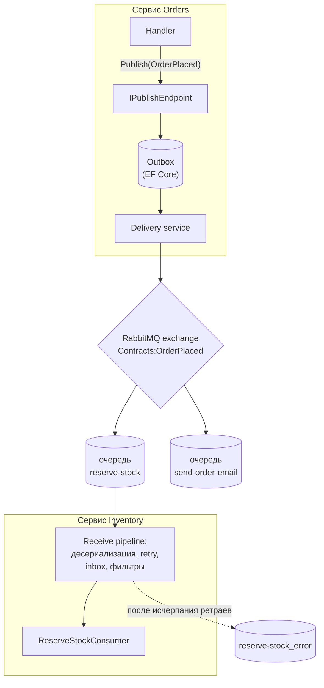
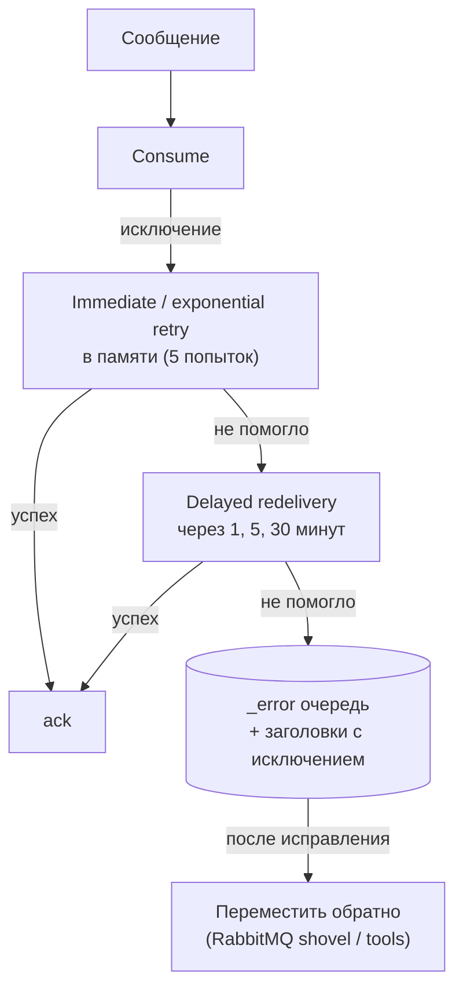

:::tldr
- **MassTransit** — фреймворк сообщений для .NET поверх транспорта (RabbitMQ, Azure Service Bus, Amazon SQS, Kafka-rider, in-memory для тестов). Скрывает низкоуровневые детали: соединения, каналы, сериализацию, топологию.
- Модель: сообщения — **типы C#** (record-ы), обработчики — **`IConsumer<T>`**; `Publish` — событие всем подписчикам (fanout по типу), `Send` — команда в конкретную очередь, **request/response** через `IRequestClient<T>`.
- **Автоматическая топология**: exchange на тип сообщения, очередь на endpoint потребителя, привязки — из регистраций (`ConfigureEndpoints`).
- Встроено: **retry** (немедленные и отложенные — redelivery), **error/skipped очереди** (аналог DLQ), **Transactional Outbox/Inbox** для EF Core, **Saga State Machines**, фильтры (middleware для сообщений), **OpenTelemetry**, **Test Harness** для тестов.
- Лицензия: MassTransit v9 — коммерческая (v8 — Apache 2.0, поддерживается). Альтернативы: **NServiceBus** (коммерческий), **Wolverine** (MIT), **Rebus**, **Brighter**, или «сырые» клиенты (RabbitMQ.Client, Confluent.Kafka, Azure.Messaging.ServiceBus).
:::

## Архитектура



## Сообщения и потребители

```csharp Контракты — общая сборка или копии по соглашению имени
namespace Shop.Contracts;

public sealed record OrderPlaced(Guid OrderId, Guid CustomerId, decimal Total, IReadOnlyList<OrderLine> Lines);
public sealed record OrderLine(string Sku, int Qty);
public sealed record ReserveStock(Guid OrderId, IReadOnlyList<OrderLine> Lines);    // команда
public sealed record StockStatusRequest(string Sku);                                // запрос
public sealed record StockStatusResponse(string Sku, int Available);
```

```csharp Потребитель
public sealed class ReserveStockConsumer(InventoryDbContext db, ILogger<ReserveStockConsumer> log) : IConsumer<OrderPlaced>
{
    public async Task Consume(ConsumeContext<OrderPlaced> ctx)
    {
        foreach (var line in ctx.Message.Lines)
        {
            var item = await db.Stock.SingleAsync(s => s.Sku == line.Sku, ctx.CancellationToken);
            item.Reserve(ctx.Message.OrderId, line.Qty);             // бросит OutOfStockException
        }
        await db.SaveChangesAsync(ctx.CancellationToken);
        await ctx.Publish(new StockReserved(ctx.Message.OrderId));   // событие дальше по цепочке
        log.LogInformation("Резерв для заказа {OrderId} выполнен", ctx.Message.OrderId);
    }
}
```

## Конфигурация

```csharp Program.cs
builder.Services.AddMassTransit(x =>
{
    x.SetKebabCaseEndpointNameFormatter();                          // очередь "reserve-stock"
    x.AddConsumer<ReserveStockConsumer, ReserveStockConsumerDefinition>();
    x.AddConsumer<StockStatusConsumer>();

    x.AddEntityFrameworkOutbox<InventoryDbContext>(o =>
    {
        o.UsePostgres();
        o.UseBusOutbox();                                            // Publish/Send из обработчиков HTTP → в outbox
    });

    x.UsingRabbitMq((ctx, cfg) =>
    {
        cfg.Host("rabbitmq", "/", h => { h.Username("app"); h.Password(builder.Configuration["Rabbit:Password"]!); });

        cfg.UseMessageRetry(r => r.Exponential(5, TimeSpan.FromMilliseconds(200), TimeSpan.FromSeconds(10), TimeSpan.FromMilliseconds(200)));
        cfg.UseDelayedRedelivery(r => r.Intervals(TimeSpan.FromMinutes(1), TimeSpan.FromMinutes(5), TimeSpan.FromMinutes(30)));

        cfg.ConfigureEndpoints(ctx);                                // создать очереди и привязки для всех потребителей
    });
});
```

```csharp Настройки конкретного endpoint
public sealed class ReserveStockConsumerDefinition : ConsumerDefinition<ReserveStockConsumer>
{
    protected override void ConfigureConsumer(IReceiveEndpointConfigurator endpoint,
        IConsumerConfigurator<ReserveStockConsumer> consumer, IRegistrationContext context)
    {
        endpoint.PrefetchCount = 32;
        endpoint.ConcurrentMessageLimit = 8;                        // параллелизм обработки
        endpoint.UseMessageRetry(r => r.Ignore<OutOfStockException>().Interval(3, 500));   // бизнес-ошибку не ретраить
        endpoint.UseEntityFrameworkOutbox<InventoryDbContext>(context);   // inbox + outbox для потребителя
    }
}
```

## Publish, Send, Request

| Операция | Семантика | Топология RabbitMQ |
|---|---|---|
| `Publish<T>(msg)` | Событие: всем подписчикам типа | Exchange `Namespace:Type` (fanout) → очереди подписчиков |
| `Send<T>(msg)` через `ISendEndpoint` | Команда: в конкретную очередь | Exchange/очередь endpoint-а |
| `IRequestClient<TReq>.GetResponse<TResp>()` | Запрос-ответ поверх сообщений | Временный адрес ответа |

```csharp
// Команда
var ep = await sendEndpointProvider.GetSendEndpoint(new Uri("queue:generate-invoice"));
await ep.Send(new GenerateInvoice(orderId), ct);

// Запрос-ответ (с таймаутом)
var response = await stockClient.GetResponse<StockStatusResponse>(new StockStatusRequest("PHONE-1"), ct, timeout: RequestTimeout.After(s: 5));
```

## Обработка ошибок



- **Retry** — быстрые повторы для транзиентных сбоев (deadlock, таймаут БД).
- **Redelivery** — отложенная повторная доставка для длительных проблем (внешний сервис недоступен).
- **Error queue** (`<queue>_error`) — сообщение с деталями исключения ждёт разбора. **Skipped queue** — сообщения, для которых нет потребителя.
- Бизнес-ошибки (`OutOfStockException`) не ретраят — их обрабатывают (публикуют событие отказа).

## Фильтры (middleware для сообщений)

```csharp
public sealed class TenantFilter<T>(ITenantContext tenant) : IFilter<ConsumeContext<T>> where T : class
{
    public Task Send(ConsumeContext<T> ctx, IPipe<ConsumeContext<T>> next)
    {
        tenant.Set(ctx.Headers.Get<string>("tenant-id"));      // контекст из заголовков сообщения
        return next.Send(ctx);
    }
    public void Probe(ProbeContext ctx) => ctx.CreateFilterScope("tenant");
}
cfg.UseConsumeFilter(typeof(TenantFilter<>), ctx);
```

## Тестирование

```csharp Test Harness: in-memory транспорт
[Fact]
public async Task Publishes_StockReserved_after_successful_reservation()
{
    await using var provider = new ServiceCollection()
        .AddDbContext<InventoryDbContext>(o => o.UseNpgsql(fx.ConnectionString))
        .AddMassTransitTestHarness(x => x.AddConsumer<ReserveStockConsumer>())
        .BuildServiceProvider(true);

    var harness = provider.GetRequiredService<ITestHarness>();
    await harness.Start();

    await harness.Bus.Publish(new OrderPlaced(orderId, customerId, 100, [new("PHONE-1", 1)]));

    (await harness.Consumed.Any<OrderPlaced>()).Should().BeTrue();
    (await harness.Published.Any<StockReserved>(m => m.Context.Message.OrderId == orderId)).Should().BeTrue();
}
```

## Сравнение с «сырым» клиентом

| | RabbitMQ.Client / Confluent.Kafka | MassTransit / NServiceBus / Wolverine |
|---|---|---|
| Контроль | Полный | Через абстракции и настройки |
| Код инфраструктуры | Много: соединения, каналы, ack, сериализация, ретраи | Минимум |
| Outbox/Inbox, саги | Писать самому | Встроено |
| Смена транспорта | Переписывать | Конфигурация |
| Производительность | Максимальная | Немного накладных расходов |
| Когда | Особые требования, Kafka-потоки, минимализм | Бизнес-приложения и микросервисы |

## Вопросы на засыпку

:::qa Как MassTransit понимает, в какую очередь доставить событие?
Для RabbitMQ: при `Publish` сообщение отправляется в exchange с именем полного типа (`Shop.Contracts:OrderPlaced`). Каждый endpoint, у которого есть потребитель этого типа, при старте создаёт свою очередь и привязывает её к этому exchange. Поэтому важно, чтобы тип (namespace + имя) совпадал у отправителя и получателя.
:::

:::qa Можно ли использовать одну очередь для нескольких типов сообщений?
Да: endpoint (очередь) может иметь несколько потребителей разных типов — MassTransit привяжет её к нескольким exchange-ам и будет маршрутизировать сообщения по типу внутри процесса.
:::

:::qa Как обеспечить порядок обработки?
Ограничить параллелизм endpoint-а (`ConcurrentMessageLimit = 1`, один экземпляр — медленно), использовать партиционирование по ключу (`UsePartitioner` — сообщения с одним ключом последовательно), сессии Azure Service Bus, или проектировать обработчики, устойчивые к порядку (версии, проверка состояния).
:::

:::qa Что делать с сообщениями в error-очереди?
Мониторить её размер (алерт), анализировать исключение в заголовках, исправлять причину и переотправлять (move messages обратно в рабочую очередь) или компенсировать вручную. Error-очередь — не «корзина», а список задач.
:::

## Итог

MassTransit превращает работу с брокером в работу с типами C#: потребители, Publish/Send/Request, автоматическая топология, ретраи и redelivery, error-очереди, outbox/inbox, саги и тестовый harness. Он экономит много инфраструктурного кода; «сырые» клиенты оправданы при особых требованиях к производительности или контролю.
