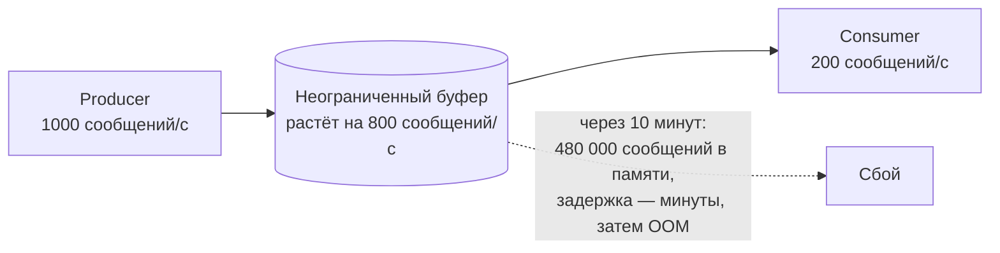
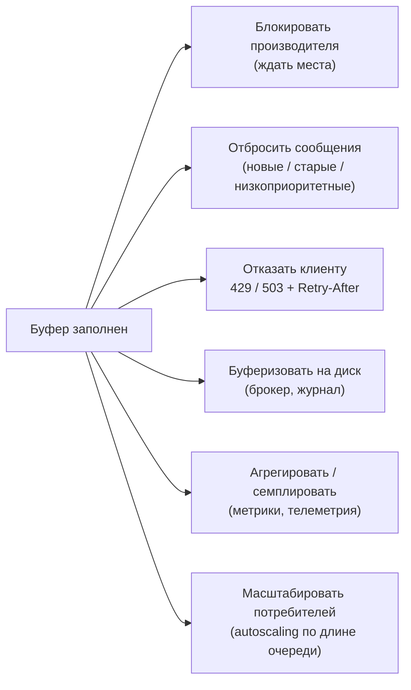
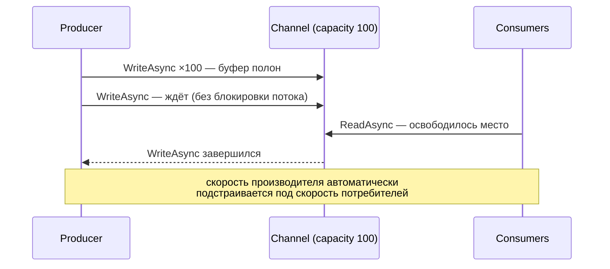
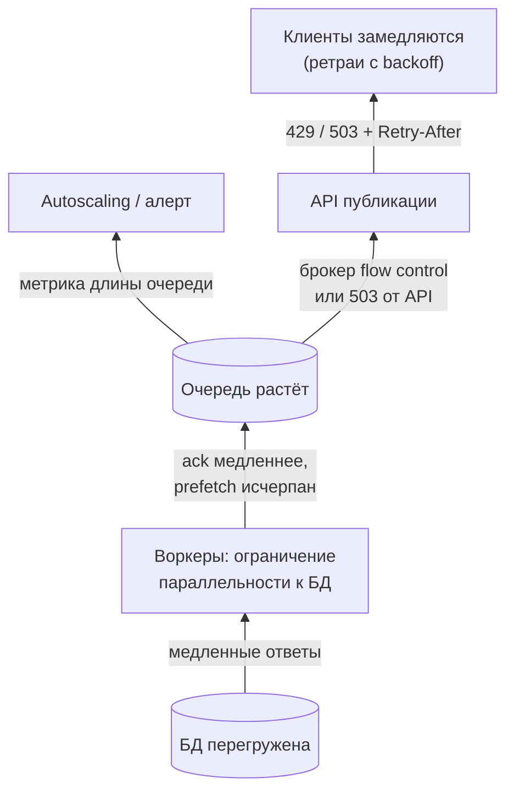

:::tldr
- **Backpressure (противодавление)** — механизм, с помощью которого **медленный потребитель сигнализирует быстрому производителю** притормозить, чтобы система не переполнилась.
- Без него: производитель генерирует больше, чем потребитель успевает → **неограниченные очереди** в памяти → рост задержек, **OutOfMemory**, каскадные отказы.
- Стратегии при переполнении: **блокировать/ждать** производителя (bounded queue), **отбрасывать** (новые, старые, по приоритету — load shedding), **буферизовать** на диск (брокер), **семплировать/агрегировать**, **масштабировать** потребителей, **отказывать** клиенту (429/503).
- В .NET: `Channel.CreateBounded` (`WriteAsync` ждёт места), **prefetch** в RabbitMQ, `MaxConcurrentCalls` в Service Bus, **pull-модель** Kafka и `IAsyncEnumerable`, **rate limiter** и **concurrency limiter** в ASP.NET Core, TCP flow control, `System.IO.Pipelines` (`PauseWriterThreshold`).
:::

## Проблема



Очередь сама по себе не решает проблему — она лишь **откладывает** её. Если средняя скорость производства выше средней скорости потребления, любая конечная очередь переполнится, а бесконечная — съест память.

## Стратегии



| Стратегия | Плюсы | Минусы | Где уместна |
|---|---|---|---|
| Блокировка производителя | Нет потерь | Производитель замедляется (цепочкой до клиента) | Внутренние конвейеры, импорт данных |
| Drop newest / oldest | Система стабильна | Потеря данных | Телеметрия, котировки (важна последняя) |
| Отказ клиенту (load shedding) | Быстрый отказ вместо деградации всех | Клиенты получают ошибки | Публичные API под перегрузкой |
| Диск / брокер | Переживает всплески | Задержка растёт, место конечно | Бизнес-события |
| Масштабирование | Решает причину | Не мгновенно, стоит денег | Облачные воркеры |

## Channels: bounded buffer

```csharp
var channel = Channel.CreateBounded<ImageJob>(new BoundedChannelOptions(capacity: 100)
{
    FullMode = BoundedChannelFullMode.Wait,      // Wait | DropNewest | DropOldest | DropWrite
    SingleReader = false,
    SingleWriter = false
});

// Производитель: WriteAsync «ждёт», пока в канале не освободится место — это и есть backpressure
async Task ProduceAsync(IAsyncEnumerable<ImageJob> source, CancellationToken ct)
{
    await foreach (var job in source.WithCancellation(ct))
        await channel.Writer.WriteAsync(job, ct);
    channel.Writer.Complete();
}

// Потребители: 4 параллельных обработчика
var consumers = Enumerable.Range(0, 4).Select(_ => Task.Run(async () =>
{
    await foreach (var job in channel.Reader.ReadAllAsync(ct))
        await ResizeAsync(job, ct);
}, ct));
```



## Брокеры сообщений

- **RabbitMQ**: `prefetchCount` — сколько неподтверждённых сообщений брокер отдаёт потребителю; больше не пришлёт, пока нет ack. Без ограничения брокер «вывалит» в потребителя всю очередь. Также **flow control** на уровне соединения при нехватке памяти/диска у брокера (публикация блокируется).
- **Kafka**: pull-модель — потребитель сам запрашивает данные (`max.poll.records`), темп задаёт потребитель; брокер хранит журнал на диске.
- **Azure Service Bus**: `MaxConcurrentCalls`, `PrefetchCount`.
- **Длина очереди — ключевая метрика**: рост очереди = потребители не успевают. Масштабирование по ней (KEDA в Kubernetes).

```yaml KEDA: масштабировать воркеры по длине очереди RabbitMQ
apiVersion: keda.sh/v1alpha1
kind: ScaledObject
metadata: { name: image-worker }
spec:
  scaleTargetRef: { name: image-worker }
  minReplicaCount: 1
  maxReplicaCount: 20
  triggers:
    - type: rabbitmq
      metadata: { queueName: images, mode: QueueLength, value: "50" }   # ~50 сообщений на под
```

## HTTP и ASP.NET Core

```csharp Защита сервиса от перегрузки: ограничить параллельность и быстро отказывать
builder.Services.AddRateLimiter(o =>
{
    o.GlobalLimiter = PartitionedRateLimiter.Create<HttpContext, string>(_ =>
        RateLimitPartition.GetConcurrencyLimiter("global", _ => new ConcurrencyLimiterOptions
        {
            PermitLimit = 200,           // одновременно в обработке
            QueueLimit = 100,            // ещё столько ждут
            QueueProcessingOrder = QueueProcessingOrder.OldestFirst
        }));
    o.RejectionStatusCode = StatusCodes.Status503ServiceUnavailable;   // остальным — быстрый отказ
});
```

Лучше быстро отказать части запросов, чем принять все и обслужить всех за 60 секунд (когда клиенты уже ушли по таймауту — «работа впустую»).

Другие уровни: **TCP** (окно получателя), **HTTP/2 flow control**, **Kestrel** (`MaxRequestBodySize`, лимиты соединений), **`System.IO.Pipelines`** (`PauseWriterThreshold` / `ResumeWriterThreshold` — Kestrel перестаёт читать из сокета, когда приложение не успевает обрабатывать тело).

## Сквозной backpressure



Хорошая система пропускает сигнал перегрузки **назад к источнику**, а не накапливает работу в промежуточных буферах.

## Вопросы на засыпку

:::qa Почему неограниченная очередь в памяти — плохая идея?
Она маскирует проблему: при устойчивом перевесе производства память растёт до OutOfMemory, а задержка обработки — до бесконечности (сообщения в конце очереди уже никому не нужны). Bounded-буфер делает перегрузку видимой и управляемой.
:::

:::qa Чем backpressure отличается от rate limiting?
Rate limiting — фиксированное ограничение скорости (квота), задаётся заранее. Backpressure — динамическая обратная связь от фактической пропускной способности потребителя. Rate limiter может быть механизмом реализации backpressure на границе.
:::

:::qa Как IAsyncEnumerable связан с backpressure?
Это pull-модель: производитель выполняет следующий шаг только когда потребитель запросил следующий элемент (`MoveNextAsync`). Потребитель сам задаёт темп — backpressure встроен в модель. В push-модели (события, `IObservable`) его нужно добавлять отдельно.
:::

:::qa Что такое load shedding?
Сознательный отказ части нагрузки при перегрузке, чтобы сохранить работоспособность для остальной: отклонять низкоприоритетные запросы, фоновые задачи, анонимный трафик, запросы, которые уже не успеют уложиться в дедлайн клиента.
:::

## Итог

Backpressure — обратная связь от медленного потребителя к быстрому производителю. Без неё очереди растут до отказа. Используйте ограниченные буферы (bounded channels, prefetch), pull-модели, ограничение параллельности и быстрые отказы (429/503), следите за длиной очередей и масштабируйте потребителей по ней.
