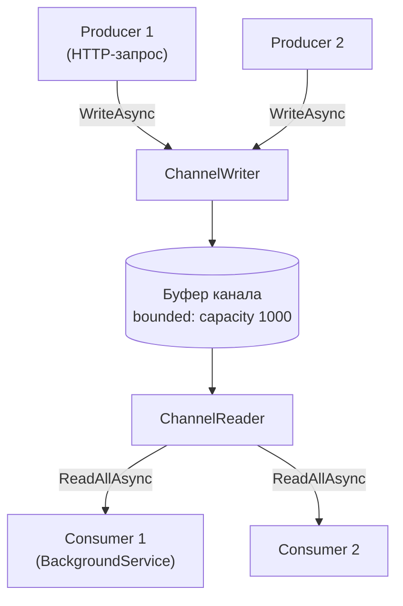
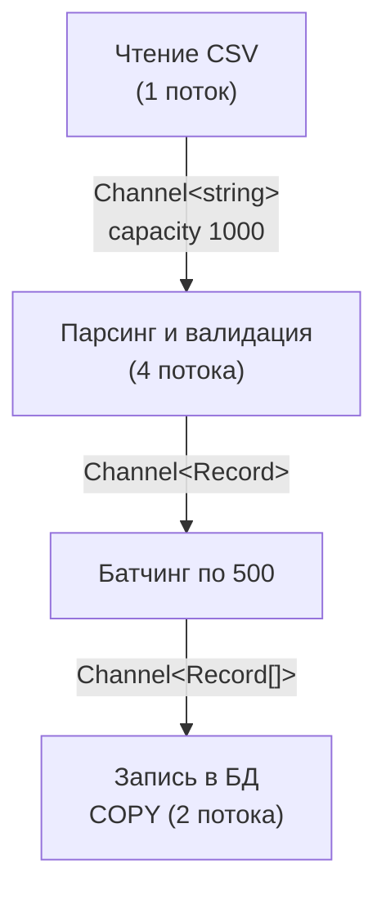

:::tldr
- **`System.Threading.Channels`** — высокопроизводительные **асинхронные очереди в памяти** для паттерна **producer-consumer** внутри процесса.
- `Channel<T>` состоит из **`ChannelWriter<T>`** (`WriteAsync`, `TryWrite`, `Complete`) и **`ChannelReader<T>`** (`ReadAsync`, `TryRead`, `WaitToReadAsync`, `ReadAllAsync` → `IAsyncEnumerable<T>`).
- **Unbounded** — без ограничения размера (риск роста памяти). **Bounded** — с ёмкостью и режимом переполнения: `Wait` (backpressure), `DropNewest`, `DropOldest`, `DropWrite`.
- Преимущества перед `BlockingCollection`/`ConcurrentQueue`: **асинхронное ожидание** без блокировки потоков, backpressure, завершение (`Complete`) и распространение ошибок, оптимизации `SingleReader`/`SingleWriter`, `ValueTask` без аллокаций.
- Применение: фоновая обработка задач из HTTP-запросов (с `BackgroundService`), конвейеры обработки данных (этапы, соединённые каналами), батчинг, разделение быстрого приёма и медленной обработки, внутренняя шина. **Не заменяет** брокер: данные теряются при падении процесса.
:::

## Модель



Разделение на writer и reader позволяет раздавать компонентам только нужную «половину»: API-эндпоинту — writer, фоновому сервису — reader.

## Создание

```csharp
// Неограниченный: запись всегда синхронно успешна
var unbounded = Channel.CreateUnbounded<Job>(new UnboundedChannelOptions
{
    SingleReader = true,                    // оптимизации под одного читателя
    SingleWriter = false
});

// Ограниченный: backpressure
var bounded = Channel.CreateBounded<Job>(new BoundedChannelOptions(capacity: 1_000)
{
    FullMode = BoundedChannelFullMode.Wait, // WriteAsync ждёт места
    SingleReader = false,
    AllowSynchronousContinuations = false   // безопаснее: продолжения не выполняются в потоке писателя
});

// С уведомлением об отброшенных элементах (.NET 6+)
var dropping = Channel.CreateBounded<Metric>(new BoundedChannelOptions(10_000) { FullMode = BoundedChannelFullMode.DropOldest },
    itemDropped: m => droppedCounter.Add(1));
```

| `FullMode` | Поведение при полном канале |
|---|---|
| `Wait` | `WriteAsync` асинхронно ждёт, `TryWrite` возвращает `false` |
| `DropNewest` | Удалить самый новый элемент в буфере, записать текущий |
| `DropOldest` | Удалить самый старый, записать текущий |
| `DropWrite` | Отбросить записываемый элемент |

## Типичный сценарий: фоновая обработка из API

```csharp Очередь задач как сервис
public sealed class EmailQueue
{
    private readonly Channel<EmailJob> _channel = Channel.CreateBounded<EmailJob>(new BoundedChannelOptions(5_000)
    {
        FullMode = BoundedChannelFullMode.Wait
    });

    public ChannelWriter<EmailJob> Writer => _channel.Writer;
    public ChannelReader<EmailJob> Reader => _channel.Reader;
}

builder.Services.AddSingleton<EmailQueue>();
builder.Services.AddHostedService<EmailWorker>();

app.MapPost("/newsletter/subscribe", async (SubscribeRequest req, EmailQueue queue, CancellationToken ct) =>
{
    await queue.Writer.WriteAsync(new EmailJob(req.Email, "welcome"), ct);   // быстро, ответ клиенту не ждёт отправки письма
    return Results.Accepted();
});
```

```csharp Потребитель
public sealed class EmailWorker(EmailQueue queue, IServiceScopeFactory scopes, ILogger<EmailWorker> log) : BackgroundService
{
    protected override async Task ExecuteAsync(CancellationToken stoppingToken)
    {
        // 4 параллельных обработчика читают один канал
        await Parallel.ForEachAsync(queue.Reader.ReadAllAsync(stoppingToken),
            new ParallelOptions { MaxDegreeOfParallelism = 4, CancellationToken = stoppingToken },
            async (job, ct) =>
            {
                try
                {
                    await using var scope = scopes.CreateAsyncScope();
                    await scope.ServiceProvider.GetRequiredService<IEmailSender>().SendAsync(job, ct);
                }
                catch (Exception ex) when (ex is not OperationCanceledException)
                {
                    log.LogError(ex, "Не удалось отправить письмо {Email}", job.Email);   // не роняем воркер
                }
            });
    }
}
```

:::warning Каналы живут в памяти процесса
При перезапуске или падении пода все элементы в канале **теряются**. Для задач, которые нельзя потерять (оплата, заказ), используйте надёжные механизмы: запись в БД + outbox, брокер сообщений, Hangfire/Quartz с хранилищем. Каналы хороши для некритичных или восстанавливаемых задач и для внутренних конвейеров.
:::

## Конвейер обработки (pipeline)



```csharp
static ChannelReader<TOut> Stage<TIn, TOut>(ChannelReader<TIn> input, int workers, Func<TIn, CancellationToken, ValueTask<TOut>> transform, CancellationToken ct)
{
    var output = Channel.CreateBounded<TOut>(1_000);
    var tasks = Enumerable.Range(0, workers).Select(_ => Task.Run(async () =>
    {
        await foreach (var item in input.ReadAllAsync(ct))
            await output.Writer.WriteAsync(await transform(item, ct), ct);
    }, ct)).ToArray();

    _ = Task.WhenAll(tasks).ContinueWith(t => output.Writer.Complete(t.Exception), TaskScheduler.Default);  // завершить и передать ошибку дальше
    return output.Reader;
}
```

Каждый этап работает в своём темпе, ограниченные каналы между ними обеспечивают backpressure: если запись в БД тормозит, парсинг автоматически приостанавливается. (Для сложных конвейеров есть также TPL Dataflow.)

## Батчинг

```csharp
async IAsyncEnumerable<List<T>> ReadBatchesAsync<T>(ChannelReader<T> reader, int size, TimeSpan maxWait, [EnumeratorCancellation] CancellationToken ct = default)
{
    var batch = new List<T>(size);
    while (await reader.WaitToReadAsync(ct))
    {
        using var timeout = CancellationTokenSource.CreateLinkedTokenSource(ct);
        timeout.CancelAfter(maxWait);
        try
        {
            while (batch.Count < size)
            {
                if (reader.TryRead(out var item)) { batch.Add(item); continue; }
                if (!await reader.WaitToReadAsync(timeout.Token)) break;
            }
        }
        catch (OperationCanceledException) when (!ct.IsCancellationRequested) { /* истекло maxWait — отдать неполный пакет */ }

        if (batch.Count > 0) { yield return batch; batch = new List<T>(size); }
    }
}
```

## Сравнение

| | `Channel<T>` | `BlockingCollection<T>` | `ConcurrentQueue<T>` | Брокер (RabbitMQ) |
|---|---|---|---|---|
| Ожидание данных | Асинхронное | Блокирует поток | Нет (polling) | Асинхронное |
| Backpressure | Bounded + Wait | Bounded + блокировка | Нет | Prefetch, flow control |
| Завершение и ошибки | `Complete(exception)` | `CompleteAdding` | Нет | — |
| Надёжность | Память процесса | Память | Память | Диск, репликация |
| Между процессами | Нет | Нет | Нет | Да |

## Вопросы на засыпку

:::qa Когда использовать Unbounded канал?
Когда поток данных гарантированно ограничен (например, по одной записи на редкое событие) или потеря памяти маловероятна, а блокировать писателя нельзя. В остальных случаях — Bounded: он делает перегрузку явной.
:::

:::qa Как корректно остановить потребителей?
Писатель вызывает `writer.Complete()` (или `Complete(exception)` при ошибке). `ReadAllAsync` завершится после чтения оставшихся элементов, `reader.Completion` станет завершённым. При остановке приложения — дочитать остаток (graceful) или отменить через `CancellationToken`.
:::

:::qa Потокобезопасен ли Channel?
Да, для нескольких писателей и читателей одновременно (если не указаны `SingleReader/SingleWriter = true` — тогда вы обещаете, что будет только один, и получаете более быструю реализацию).
:::

:::qa Зачем AllowSynchronousContinuations = false?
Иначе продолжение читателя может выполниться синхронно в потоке писателя внутри `WriteAsync` — писатель внезапно выполняет код обработки, что ведёт к задержкам и реентерабельности. По умолчанию `false` — безопасный выбор.
:::

## Итог

Channels — асинхронные потокобезопасные очереди в памяти для producer-consumer внутри процесса: bounded-режим даёт backpressure, `ReadAllAsync` — удобное потребление, `Complete` — корректное завершение конвейера. Используйте их для фоновых задач и конвейеров обработки, но не для данных, которые нельзя потерять при перезапуске — для этого нужен брокер или БД.
