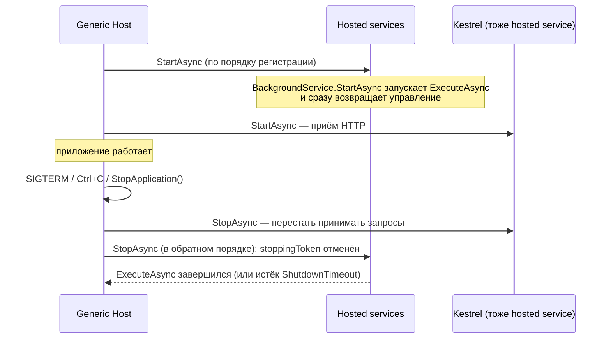
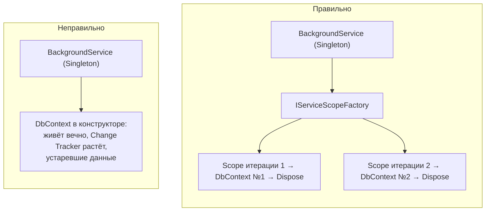
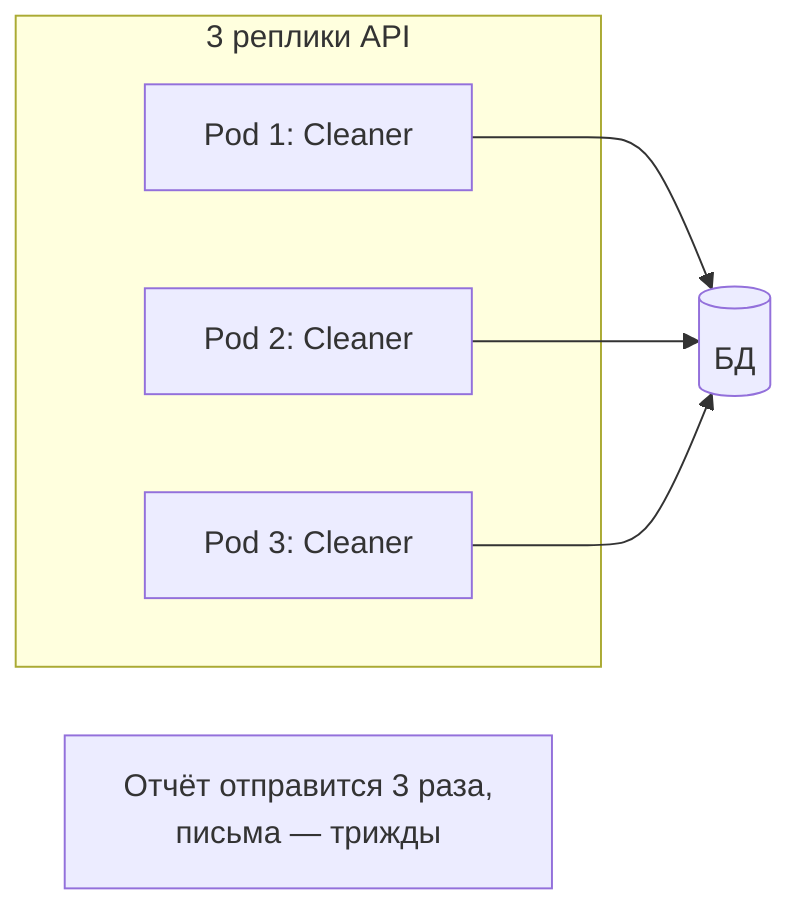

:::tldr
- **`IHostedService`** — интерфейс фонового компонента, которым управляет **Generic Host**: `StartAsync` при старте приложения и `StopAsync` при остановке. Регистрация — `AddHostedService<T>()`.
- **`BackgroundService`** — абстрактный базовый класс поверх `IHostedService` для **долгоживущих циклов**: переопределяется `ExecuteAsync(CancellationToken stoppingToken)`.
- Hosted service — **синглтон**: scoped-зависимости (`DbContext`) получать через **`IServiceScopeFactory.CreateScope()`** на каждую итерацию/сообщение.
- Корректная остановка: уважать `stoppingToken`, укладываться в `HostOptions.ShutdownTimeout` (по умолчанию 30 с). С .NET 8 необработанное исключение в `ExecuteAsync` по умолчанию **останавливает приложение** (`BackgroundServiceExceptionBehavior.StopHost`) — ловите ошибки внутри цикла.
- Периодика — **`PeriodicTimer`**; очереди — **Channels** или брокер; «тяжёлое» расписание с хранением и ретраями — **Hangfire / Quartz.NET**. Помните: при нескольких экземплярах приложения фоновый сервис работает **в каждом** — нужны распределённые блокировки или отдельный воркер.
:::

## Жизненный цикл



Важно: `StartAsync` должен **быстро** возвращаться — иначе приложение (и Kestrel) не стартует, пока он не завершится. `BackgroundService` решает это: `ExecuteAsync` выполняется в фоне.

## IHostedService напрямую

```csharp Инициализация при старте
public sealed class CacheWarmupService(IServiceScopeFactory scopes, CatalogCache cache) : IHostedService
{
    public async Task StartAsync(CancellationToken ct)
    {
        await using var scope = scopes.CreateAsyncScope();
        var db = scope.ServiceProvider.GetRequiredService<ShopDbContext>();
        cache.Load(await db.Categories.AsNoTracking().ToListAsync(ct));     // приложение стартует после загрузки
    }
    public Task StopAsync(CancellationToken ct) => Task.CompletedTask;
}
```

Для таких задач с .NET 8 есть `IHostedLifecycleService` (`StartingAsync`, `StartedAsync`, `StoppingAsync`, `StoppedAsync`) — более тонкие точки жизненного цикла.

## BackgroundService: периодическая задача

```csharp
public sealed class ExpiredReservationsCleaner(
    IServiceScopeFactory scopes, TimeProvider clock, ILogger<ExpiredReservationsCleaner> log) : BackgroundService
{
    protected override async Task ExecuteAsync(CancellationToken stoppingToken)
    {
        using var timer = new PeriodicTimer(TimeSpan.FromMinutes(1), clock);   // не накапливает «пропущенные» тики

        do
        {
            try
            {
                await using var scope = scopes.CreateAsyncScope();                 // новый скоуп на итерацию
                var db = scope.ServiceProvider.GetRequiredService<ShopDbContext>();
                var removed = await db.Reservations
                    .Where(r => r.ExpiresAt < clock.GetUtcNow())
                    .ExecuteDeleteAsync(stoppingToken);
                if (removed > 0) log.LogInformation("Удалено {Count} просроченных резервов", removed);
            }
            catch (OperationCanceledException) when (stoppingToken.IsCancellationRequested)
            {
                break;                                                             // штатная остановка
            }
            catch (Exception ex)
            {
                log.LogError(ex, "Ошибка очистки резервов");                       // не роняем сервис из-за одной итерации
            }
        }
        while (await timer.WaitForNextTickAsync(stoppingToken));
    }
}

builder.Services.AddHostedService<ExpiredReservationsCleaner>();
```

## BackgroundService: потребитель очереди

```csharp
public sealed class OrderEventsConsumer(IConnection rabbit, IServiceScopeFactory scopes, ILogger<OrderEventsConsumer> log) : BackgroundService
{
    protected override async Task ExecuteAsync(CancellationToken stoppingToken)
    {
        await using var channel = await rabbit.CreateChannelAsync(cancellationToken: stoppingToken);
        await channel.BasicQosAsync(0, 16, false, stoppingToken);
        var consumer = new AsyncEventingBasicConsumer(channel);
        consumer.ReceivedAsync += async (_, ea) =>
        {
            await using var scope = scopes.CreateAsyncScope();
            var handler = scope.ServiceProvider.GetRequiredService<IOrderEventHandler>();
            try { await handler.HandleAsync(ea.Body, stoppingToken); await channel.BasicAckAsync(ea.DeliveryTag, false); }
            catch (Exception ex) { log.LogError(ex, "Ошибка обработки"); await channel.BasicNackAsync(ea.DeliveryTag, false, requeue: false); }
        };
        await channel.BasicConsumeAsync("order-events", autoAck: false, consumer, stoppingToken);
        await Task.Delay(Timeout.Infinite, stoppingToken);          // ждать до остановки
    }
}
```

(На практике для этого удобнее MassTransit — он сам является набором hosted services.)

## Scoped-зависимости



Внедрить `DbContext` в конструктор hosted service нельзя (ошибка валидации скоупов) — и не нужно.

## Несколько экземпляров приложения



Решения:
- Задача **идемпотентна** и безопасна при параллельном выполнении (очистка по условию — да; рассылка — нет).
- **Распределённая блокировка / лидер**: `pg_try_advisory_lock`, Redis lock, библиотека DistributedLock, выбор лидера через Kubernetes Lease.
- **Отдельный воркер-сервис** (Worker Service, 1 реплика или конкурирующие потребители очереди).
- **Kubernetes CronJob** для периодических задач.
- **Hangfire / Quartz.NET** с общим хранилищем — сами гарантируют однократный запуск задания в кластере.

## Hangfire и Quartz.NET

| | BackgroundService | Hangfire | Quartz.NET |
|---|---|---|---|
| Хранение задач | Нет (в памяти) | БД (SQL Server, PostgreSQL, Redis) | БД (кластерный режим) или память |
| Переживает перезапуск | Нет | Да | Да (с хранилищем) |
| Ретраи, история, дашборд | Писать самому | Встроены, веб-дашборд | Ретраи — вручную, есть UI сторонние |
| Cron-расписание | Вручную | Да | Да, очень гибкое |
| Кластер без дублей | Вручную | Да | Да |
| Когда | Простые циклы, потребители, инициализация | Fire-and-forget, отложенные и повторяющиеся задания | Сложные расписания |

## Вопросы на засыпку

:::qa Что будет, если ExecuteAsync выбросит исключение?
С .NET 6 и новее по умолчанию (`BackgroundServiceExceptionBehavior.StopHost`) исключение логируется и **приложение останавливается**. Альтернатива — `Ignore` (сервис молча умрёт, остальное продолжит работать — опасно). Поэтому цикл внутри `ExecuteAsync` должен ловить и логировать ошибки итераций.
:::

:::qa Почему не Task.Run в контроллере для фоновой работы?
Запущенная так задача не отслеживается хостом: при остановке приложения она будет прервана, исключения потеряются, `HttpContext` и scoped-сервисы запроса к тому времени уже уничтожены. Правильно — положить задачу в очередь (Channel/брокер) и обработать в hosted service со своим скоупом.
:::

:::qa Чем PeriodicTimer лучше Task.Delay в цикле?
`PeriodicTimer` поддерживает стабильный период (не «дрейфует» на время выполнения тела), не накапливает пропущенные тики, работает с `TimeProvider` (тестируемость) и корректно отменяется. `Task.Delay` в цикле добавляет время работы тела к интервалу.
:::

:::qa Что такое Worker Service?
Шаблон `dotnet new worker` — приложение на Generic Host без веб-сервера, только hosted services. Разворачивается как отдельный процесс/контейнер, служба Windows (`UseWindowsService`) или демон systemd.
:::

## Итог

`IHostedService` встраивает фоновые компоненты в жизненный цикл приложения, `BackgroundService` упрощает долгоживущие циклы. Создавайте скоуп на каждую единицу работы, уважайте `stoppingToken`, ловите исключения итераций, используйте `PeriodicTimer` для периодики и помните о нескольких экземплярах приложения — для надёжных и распределённых заданий подключайте Hangfire/Quartz или брокер.
