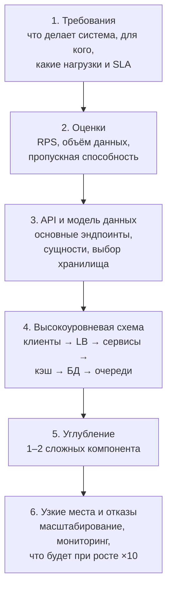
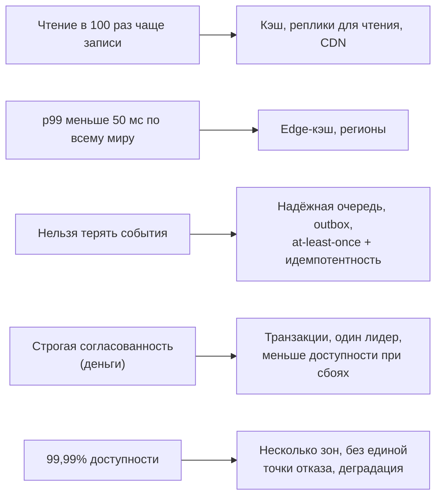
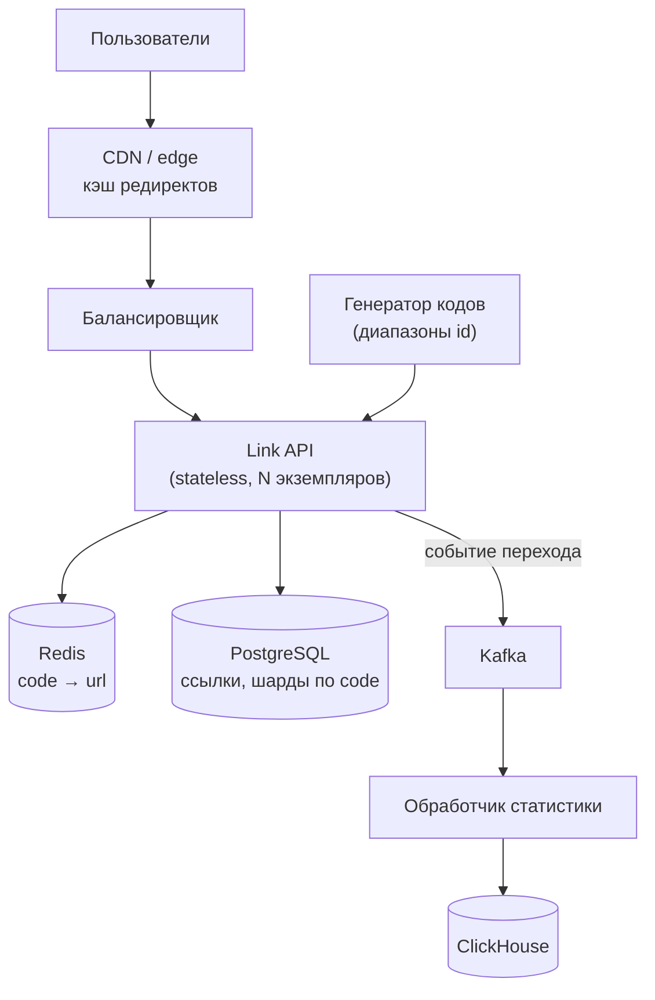
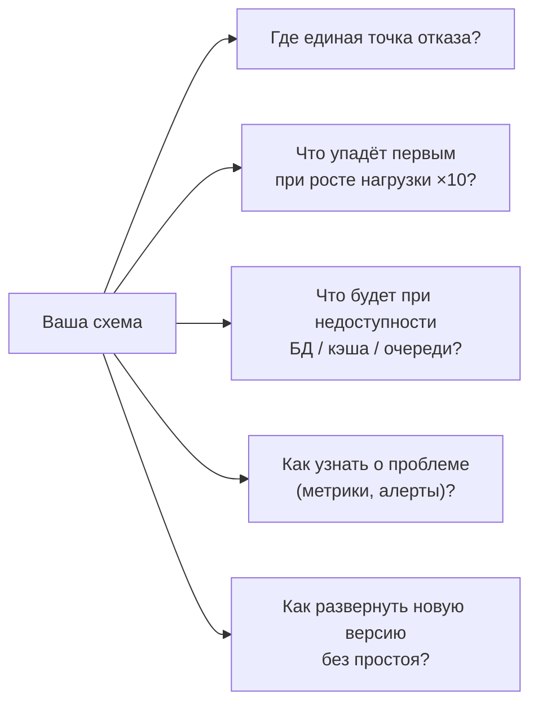

:::tldr
- System design интервью проверяет не «правильный ответ», а **ход мысли**: умение уточнить задачу, оценить масштаб, предложить простую рабочую архитектуру, найти узкие места и **явно назвать компромиссы**.
- Структура ответа (45–60 минут): **1) требования** — функциональные и нефункциональные (5–10 мин) → **2) оценки** нагрузки и данных (5 мин) → **3) API и модель данных** → **4) высокоуровневая схема** → **5) углубление** в 1–2 самых сложных компонента → **6) узкие места, отказы, масштабирование, мониторинг**.
- Нефункциональные требования определяют архитектуру: RPS чтения/записи, объём данных, задержка (p99), доступность (99,9% vs 99,99%), согласованность (строгая или итоговая), география.
- Back-of-the-envelope: 1 день ≈ 10⁵ секунд; 1 млн запросов в день ≈ 12 RPS в среднем, пик ×3–10; чтение из памяти — наносекунды, из SSD — сотни микросекунд, сеть внутри ДЦ — ~0,5 мс, между континентами — ~150 мс.
- Типичные ошибки: сразу рисовать микросервисы и Kafka; не уточнять требования; молчать; углубляться в детали, не построив целого; не обсуждать отказы.
:::

## Структура ответа



## 1. Требования

Начинайте с вопросов, а не с рисования. Пример задачи: «Спроектируйте сервис сокращения ссылок».

| Вопрос | Зачем |
|---|---|
| Какие основные сценарии? Создать короткую ссылку, перейти по ней, статистика? | Границы задачи |
| Сколько пользователей и ссылок в день? Отношение чтения к записи? | Масштаб, где узкое место |
| Нужны ли кастомные ссылки, срок жизни, удаление? | Модель данных |
| Допустимая задержка редиректа? | Кэширование, география |
| Требования к доступности? Что хуже — недоступность или неточная статистика? | Согласованность против доступности |
| Глобальные пользователи или одна страна? | Регионы, CDN |

**Нефункциональные требования** важнее функциональных — они определяют архитектуру:



## 2. Оценки «на салфетке»

```text Пример: сокращатель ссылок
Создание ссылок:  100 млн в месяц ≈ 3,3 млн в день ≈ 40 в секунду (пик ×5 ≈ 200 RPS)
Переходы:         чтение : запись = 100 : 1 → 4 000 RPS, пик ≈ 20 000 RPS
Хранение:         100 млн × 12 мес × 5 лет = 6 млрд ссылок × ~500 байт ≈ 3 ТБ
Длина кода:       base62, 7 символов → 62^7 ≈ 3,5 трлн комбинаций — достаточно
Кэш:              20% ссылок дают 80% трафика → горячий набор помещается в Redis
```

| Ориентир | Значение |
|---|---|
| Секунд в сутках | 86 400 ≈ 10⁵ |
| 1 млн запросов в день | ≈ 12 RPS в среднем |
| Чтение из RAM | ~100 нс |
| Случайное чтение с SSD | ~100 мкс |
| Round-trip внутри ДЦ | ~0,5 мс |
| Round-trip Европа ↔ США | ~80–150 мс |
| Один PostgreSQL на хорошем железе | тысячи–десятки тысяч простых запросов/с |
| Redis | ~100 000+ операций/с на инстанс |
| Kafka | сотни тысяч–миллионы сообщений/с на кластер |

Цель оценок — не точность, а **порядок величины**: понять, хватит ли одной БД, нужен ли шардинг, поместится ли горячий набор в память.

## 3. API и данные

```http
POST /api/links         { "url": "https://...", "customAlias": null, "ttlDays": 365 }  → 201 { "code": "aZ3kP9q" }
GET  /{code}            → 301/302 Location: https://...
GET  /api/links/{code}/stats   → { "clicks": 1520, "byCountry": {...} }
```

Выбор хранилища обосновывайте доступом к данным: «поиск строго по ключу, огромный объём, нет JOIN-ов → подойдёт key-value или PostgreSQL с шардированием по коду; статистика — append-only события → колоночное хранилище (ClickHouse)».

## 4. Высокоуровневая схема



Рисуйте сначала **простую работающую** версию, затем развивайте её под требования. Пояснение каждого компонента: зачем он нужен и что будет без него.

## 5. Углубление

Интервьюер обычно выбирает 1–2 темы. Для сокращателя ссылок:
- **Генерация уникальных кодов**: хэш URL (коллизии) против счётчика + base62 (нужен распределённый счётчик — выдавать диапазоны id каждому экземпляру) против случайных кодов с проверкой.
- **Кэширование редиректов**: cache-aside в Redis, TTL, прогрев популярных; 301 (кэшируется браузером — не посчитаем клики) против 302.
- **Статистика**: синхронная запись счётчика в БД на каждый переход — узкое место; асинхронно через очередь и агрегация батчами.

## 6. Узкие места, отказы, эволюция



Говорите о **компромиссах** явно: «Я выбираю асинхронную статистику: редирект быстрее и не зависит от БД статистики, но счётчики отстают на секунды — для этой задачи приемлемо».

## Чего ждут на уровне Senior

| Аспект | Middle | Senior |
|---|---|---|
| Требования | Отвечает на вопросы интервьюера | **Сам** выявляет требования и ограничения |
| Решение | Знакомые компоненты | Обоснованный выбор с альтернативами |
| Компромиссы | Упоминает | Количественно сравнивает (задержка, стоимость, сложность) |
| Отказы | Если спросят | Проектирует деградацию, ретраи, идемпотентность |
| Эксплуатация | — | Мониторинг, развёртывание, миграции данных, стоимость |
| Коммуникация | Отвечает | Ведёт разговор, проверяет понимание, управляет временем |

## Типичные ошибки

:::warning Что проваливает интервью
- Начать рисовать без уточнения требований.
- «Микросервисы + Kafka + Kubernetes» без обоснования для системы на 50 RPS.
- Застрять в одной детали (схема таблицы) на 20 минут, не построив целого.
- Не делать оценок — непонятно, нужен ли шардинг вообще.
- Игнорировать отказы и мониторинг.
- Не называть недостатки своего решения.
:::

## Вопросы на засыпку

:::qa С чего начать, если задача совсем незнакомая?
С требований и сценариев использования: кто пользователи, что они делают, сколько их. Затем простейшая архитектура «клиент → сервис → БД», которую вы постепенно усложняете там, где оценки показывают проблему. Незнакомая предметная область — нормально; ценится способ рассуждения.
:::

:::qa Как выбрать между SQL и NoSQL на интервью?
Исходя из паттернов доступа: нужны транзакции, JOIN-ы, сложные запросы и строгая согласованность → реляционная БД. Огромный объём, доступ по ключу, гибкая схема, горизонтальное масштабирование записи → key-value/документные/колоночные хранилища. Часто — комбинация. Обоснование важнее выбора.
:::

:::qa Что делать, если интервьюер не согласен с решением?
Выяснить, какое требование или ограничение он видит иначе, обсудить компромиссы и при необходимости изменить решение. Упрямство и молчаливое согласие одинаково плохи; ценится аргументированная дискуссия.
:::

:::qa Сколько деталей нужно про конкретные технологии?
Достаточно, чтобы показать понимание свойств: «Redis — in-memory, данные могут потеряться при падении без персистентности, поэтому он только кэш, а источник истины — PostgreSQL». Названия продуктов без понимания их свойств ничего не дают.
:::

## Итог

System design интервью — разговор о компромиссах. Уточните функциональные и нефункциональные требования, оцените порядок нагрузок и объёмов, предложите API, модель данных и простую схему, углубитесь в самые сложные части и закончите узкими местами, отказами и мониторингом. Обосновывайте выбор требованиями и называйте недостатки своего решения.
