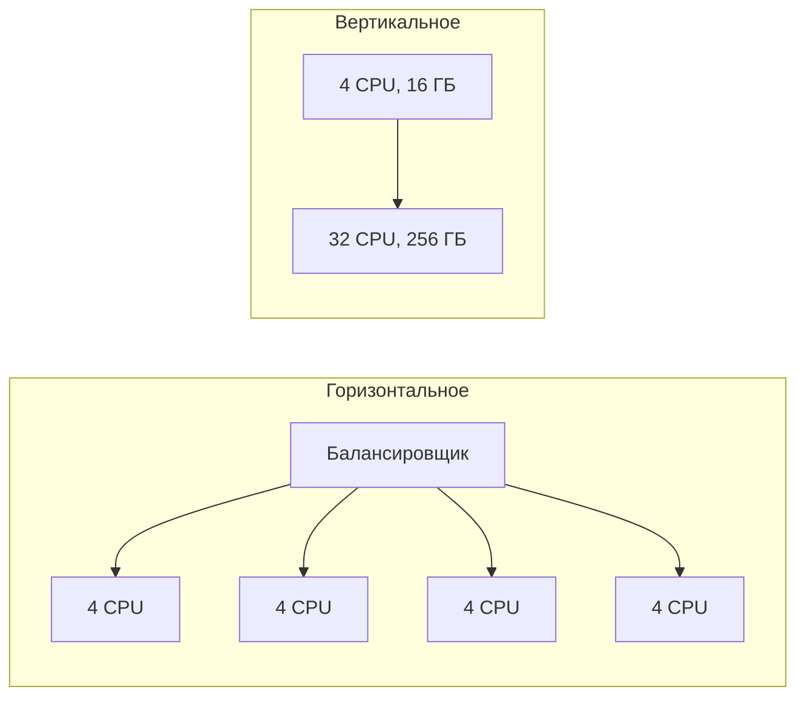
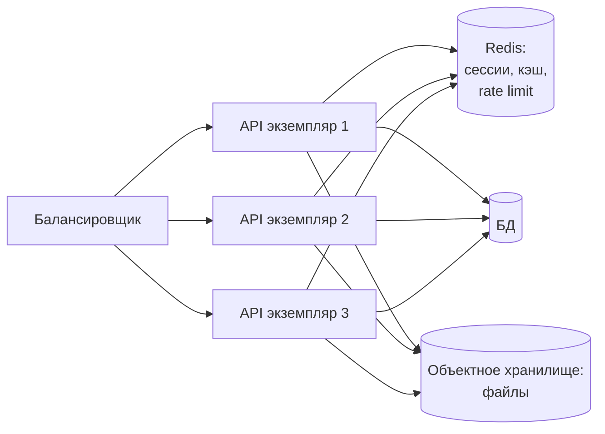
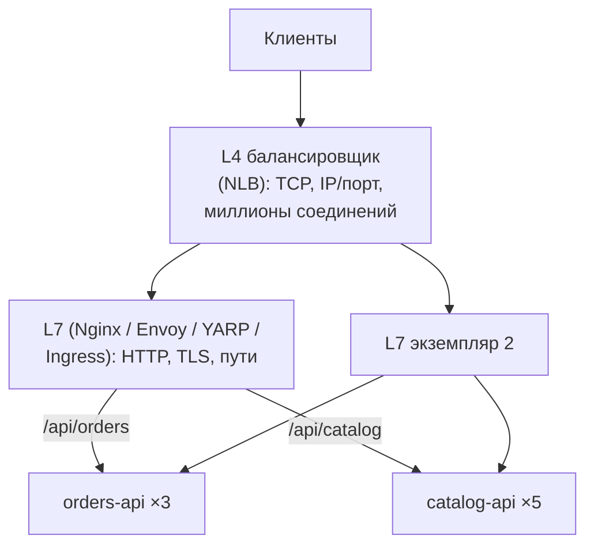
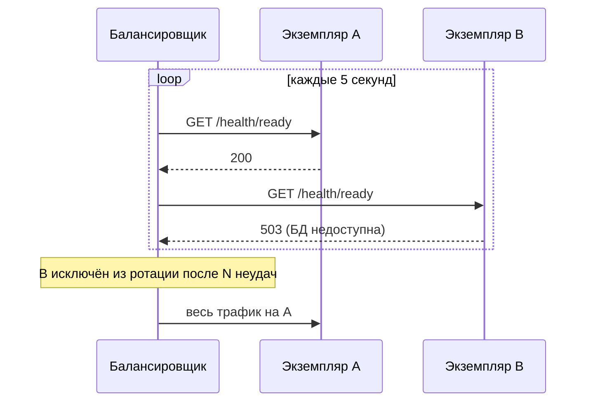
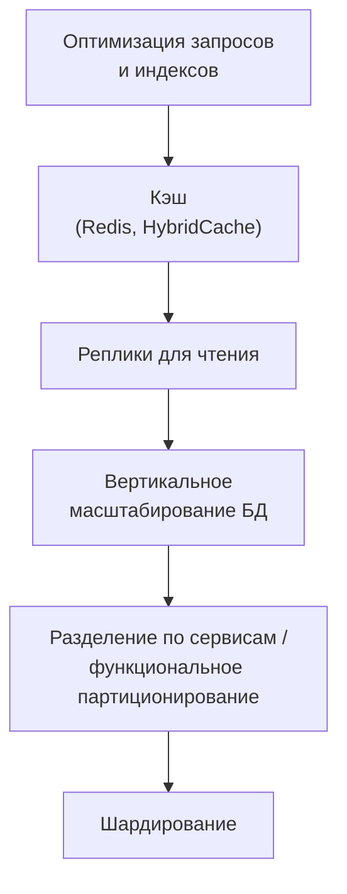

:::tldr
- **Вертикальное** масштабирование (scale up) — больше CPU/RAM на одной машине: просто, но есть потолок, растёт цена, остаётся единая точка отказа. **Горизонтальное** (scale out) — больше экземпляров: практически безгранично, повышает отказоустойчивость, но требует **stateless**-сервисов и распределения нагрузки.
- **Stateless**-сервис не хранит состояние клиента в памяти между запросами: сессии, кэш, файлы — во внешних хранилищах (Redis, БД, S3). Тогда любой экземпляр обработает любой запрос.
- **Балансировщик L4** (TCP/UDP) распределяет соединения по IP/порту — быстро, без понимания HTTP. **L7** (HTTP) видит путь, заголовки, cookie — маршрутизация по URL, TLS-терминация, ретраи, sticky sessions.
- Алгоритмы: round robin, weighted, **least connections**, **least response time**, consistent hashing (для кэшей и шардов). Обязательны **health checks** и вывод больных экземпляров.
- Горизонтально проще всего масштабировать **приложение**; узким местом становится **база данных** — её масштабируют чтением (реплики, кэш), а запись — шардированием или разделением по сервисам.
:::

## Вертикальное и горизонтальное

| | Вертикальное | Горизонтальное |
|---|---|---|
| Сложность | Минимальная | Нужны stateless, балансировка, распределённые данные |
| Предел | Самая мощная машина | Практически нет |
| Стоимость | Растёт нелинейно | Линейно, можно использовать дешёвые машины |
| Отказоустойчивость | Одна машина — одна точка отказа | Отказ узла — снижение мощности, а не простой |
| Обновление | С простоем (или нужна вторая машина) | Rolling update без простоя |
| Где уместно | БД, ранняя стадия продукта | Веб-сервисы, обработчики очередей |

Практический совет: не стесняйтесь вертикально масштабировать **БД** — современный сервер с 64+ ядрами и терабайтом RAM справляется с огромной нагрузкой, а горизонтальное масштабирование записи в БД (шардирование) — одно из самых дорогих решений в архитектуре.

## Stateless-сервисы

Что мешает горизонтальному масштабированию в .NET-приложении:

| Проблема | Решение |
|---|---|
| `IMemoryCache` с данными, которые должны быть общими | `IDistributedCache`/HybridCache на Redis, или локальный кэш с коротким TTL и инвалидацией |
| Сессии в памяти (`AddSession` с in-memory) | Распределённая сессия или stateless JWT/cookie |
| Файлы на локальном диске | S3 / Azure Blob |
| Data Protection keys на диске (cookie не расшифровываются на другом экземпляре) | `PersistKeysToStackExchangeRedis` / Blob / БД |
| Фоновые задачи, выполняемые каждым экземпляром | Распределённая блокировка, очередь, отдельный worker, Quartz с кластерным режимом |
| SignalR-подключения на разных серверах | Redis backplane / Azure SignalR Service |
| In-memory rate limiting | Распределённый лимит (Redis) или на шлюзе |

## Балансировка L4 и L7

| | L4 (транспортный) | L7 (прикладной) |
|---|---|---|
| Видит | IP, порт, TCP/UDP | URL, метод, заголовки, cookie, тело |
| Маршрутизация | По соединению | По запросу: путь, хост, заголовок, вес (canary) |
| TLS | Проходит насквозь (или терминирует) | Терминирует, видит содержимое |
| Производительность | Выше | Ниже (парсинг HTTP) |
| Дополнительно | — | Ретраи, таймауты, rate limiting, кэш, сжатие, аутентификация |
| Примеры | AWS NLB, Azure Load Balancer, IPVS | Nginx, Envoy, HAProxy, AWS ALB, YARP, Kubernetes Ingress |

## Алгоритмы распределения

| Алгоритм | Как работает | Когда |
|---|---|---|
| Round robin | По кругу | Одинаковые экземпляры и запросы |
| Weighted round robin | С весами | Разная мощность серверов, canary (5% на новую версию) |
| Least connections | Туда, где меньше активных соединений | Запросы разной длительности, WebSocket |
| Least response time / EWMA | Туда, где быстрее отвечают | Неоднородная нагрузка, «медленный» экземпляр |
| IP hash / consistent hashing | Один и тот же ключ → один и тот же сервер | Локальные кэши, шардированные данные |
| Power of two choices | Выбрать 2 случайных, взять менее загруженный | Большие кластеры, хорошо и дёшево |

### Sticky sessions

Привязка клиента к экземпляру (по cookie). Нужна, если состояние хранится в памяти (старые приложения, SignalR без backplane). Минусы: неравномерная нагрузка, потеря сессии при падении экземпляра, проблемы при масштабировании вниз. Правильный путь — сделать сервис stateless.

## Health checks и вывод из ротации

Плюс **outlier detection** (Envoy, service mesh): исключать экземпляр, который отвечает ошибками 5xx, даже если health check проходит.

## Автомасштабирование

- **Горизонтальное** (Kubernetes HPA, облачные auto scaling groups): по CPU, памяти, RPS, длине очереди (KEDA для потребителей сообщений).
- Учитывайте **время прогрева**: новый под .NET стартует, JIT-компилирует, прогревает пулы — масштабируйтесь заранее (минимум экземпляров, предиктивное масштабирование), используйте ReadyToRun/Native AOT.
- Масштабирование приложения **переносит нагрузку на зависимости**: 50 экземпляров × пул 100 соединений = 5000 соединений к PostgreSQL. Нужны PgBouncer, лимиты пулов.

## Масштабирование базы данных

Идите слева направо: каждый следующий шаг дороже по сложности. Шардирование — когда всё остальное исчерпано (подробнее — в вопросе о репликации и шардировании).

## Вопросы на засыпку

:::qa Почему stateless-сервисы проще масштабировать?
Любой экземпляр обрабатывает любой запрос: балансировщик может отправлять трафик куда угодно, экземпляры можно добавлять и удалять в любой момент (автомасштабирование, rolling update), падение одного не теряет данные клиентов.
:::

:::qa Что такое закон Амдала применительно к масштабированию?
Ускорение от параллелизма ограничено последовательной частью работы. Если 10% запроса — это обращение к единственной БД, которая не масштабируется, то добавление серверов приложения не ускорит систему больше чем в 10 раз. Узкое место определяет предел масштабирования.
:::

:::qa Как балансировщик понимает, что экземпляр «здоров»?
По активным проверкам (периодические запросы к readiness-эндпоинту) и пассивным (анализ ошибок и таймаутов реальных запросов — outlier detection). Readiness должен проверять готовность обслуживать трафик, но не каскадно все зависимости, иначе сбой одной БД выведет все экземпляры одновременно.
:::

:::qa Чем балансировка на клиенте отличается от серверной?
При клиентской балансировке (gRPC, service mesh sidecar, `HttpClient` с service discovery) клиент сам знает список экземпляров и выбирает. Нет лишнего сетевого перехода и единой точки отказа, но логика распределена по клиентам. Серверная — отдельный балансировщик, проще для клиентов.
:::

## Итог

Вертикальное масштабирование просто, но ограничено; горизонтальное требует stateless-сервисов с состоянием во внешних хранилищах и балансировщика (L4 для скорости, L7 для HTTP-маршрутизации, TLS и ретраев). Выбирайте алгоритм распределения под характер нагрузки, исключайте больные экземпляры health checks и учитывайте, что узким местом обычно становится база данных — её масштабируют поэтапно: индексы, кэш, реплики, вертикально и лишь затем шардирование.
