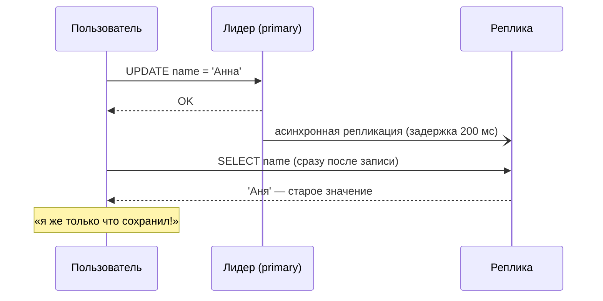
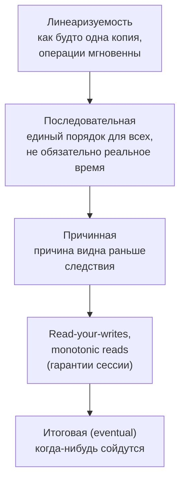
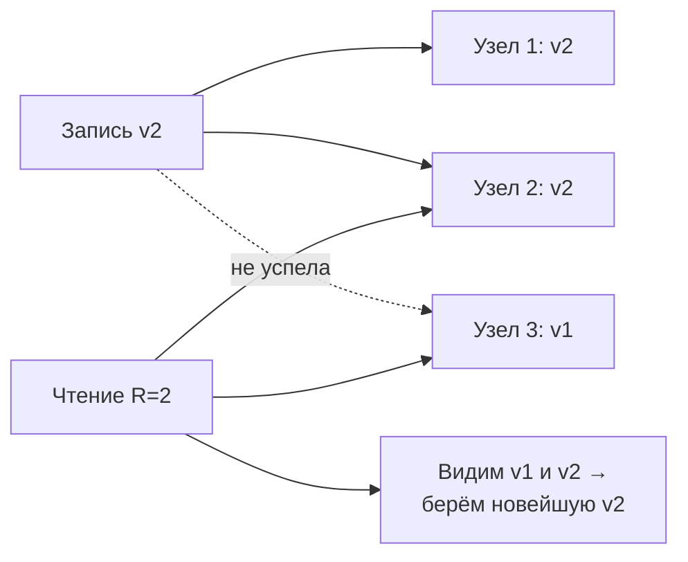
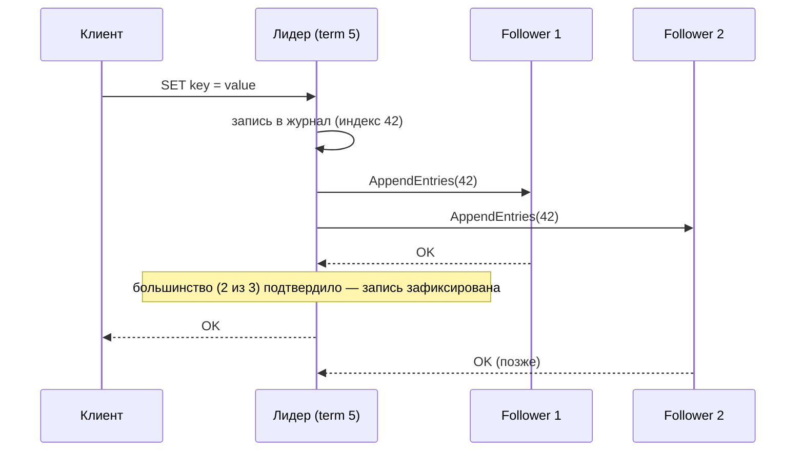
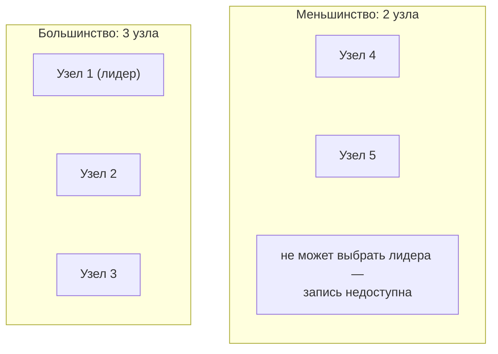

:::tldr
- **Модель согласованности** — гарантия, что увидит чтение после записи в распределённой системе с репликами. От строгой к слабой: **линеаризуемость** (strong) → **последовательная** → **причинная** (causal) → **read-your-writes / monotonic reads** → **итоговая** (eventual).
- **Eventual consistency**: если записи прекратятся, все реплики со временем сойдутся. Быстро и доступно, но чтение может вернуть устаревшие данные. Подходит для лент, счётчиков, каталогов; не подходит для балансов и уникальности.
- **Кворумы**: N реплик, запись подтверждают W, чтение опрашивает R. Если **R + W > N** — чтение пересекается с последней записью (например, N=3, W=2, R=2).
- **Консенсус** (Raft, Paxos) — способ нескольких узлов согласиться на одном значении/порядке операций при отказах: выбор **лидера**, репликация журнала большинству. Работает, пока жив **кворум** (большинство); на нём построены etcd, Consul, ZooKeeper, Kafka KRaft.
- **PACELC**: при разделении сети (P) — выбор между доступностью (A) и согласованностью (C); иначе (E) — между задержкой (L) и согласованностью (C). Senior-ответ — выбирать модель **для каждой операции**, а не для всей системы.
:::

## Проблема

Любая система с репликами должна решить: ждать подтверждения от реплик (медленнее, менее доступно) или отвечать сразу (быстрее, но чтения могут быть устаревшими).

## Модели согласованности

| Модель | Гарантия | Цена | Пример использования |
|---|---|---|---|
| Линеаризуемость | Чтение видит последнюю завершённую запись | Высокая задержка, недоступность при разделении сети | Баланс, остаток на складе при продаже, уникальность логина, распределённые блокировки |
| Причинная | Ответ на комментарий не появится раньше комментария | Средняя | Чаты, комментарии |
| Read-your-writes | Пользователь видит **свои** изменения | Низкая (привязка к лидеру после записи) | Профиль, настройки |
| Monotonic reads | Не «откатывается назад» при повторных чтениях | Низкая (привязка к одной реплике) | Ленты, списки |
| Eventual | Сходимость когда-нибудь | Минимальная | Счётчики просмотров, лайки, рекомендации, поисковый индекс |

### Как обеспечить read-your-writes на практике

- Читать с **лидера** в течение N секунд после записи пользователя (метка времени в сессии/cookie).
- Передавать **позицию репликации** (LSN в PostgreSQL) и читать с реплики, которая её догнала.
- На клиенте: оптимистично показывать отправленные данные, не перечитывая их.

## Кворумы

| Настройка (N=3) | Свойство |
|---|---|
| W=3, R=1 | Быстрое чтение, запись недоступна при падении одного узла |
| W=1, R=3 | Быстрая запись, чтение недоступно при падении узла |
| W=2, R=2 | Баланс; переживает отказ одного узла для обеих операций |
| W=1, R=1 | Максимальная доступность, только eventual |

Так работают Cassandra, ScyllaDB, DynamoDB-подобные системы (с настраиваемым уровнем согласованности на запрос).

## Консенсус и Raft

Консенсус нужен, чтобы несколько узлов **согласованно** приняли решение: кто лидер, в каком порядке применяются операции, кому принадлежит блокировка.

Основные идеи Raft:
- **Выбор лидера**: если follower не получает heartbeat, он становится кандидатом, увеличивает **term** и просит голоса; лидер — тот, кто получил большинство.
- **Репликация журнала**: запись считается зафиксированной, когда её сохранило большинство узлов.
- **Безопасность**: новый лидер обязательно содержит все зафиксированные записи.
- Кластер из **2f+1** узлов переживает отказ **f** узлов: 3 узла — 1 отказ, 5 узлов — 2 отказа. Чётное число узлов не добавляет отказоустойчивости.

Разработчику .NET редко нужно реализовывать Raft, но важно понимать его свойства в инструментах: **etcd** (Kubernetes), **Consul**, **ZooKeeper**, **Kafka KRaft**, **CockroachDB/YugabyteDB**, кластеры PostgreSQL с Patroni.

## Разделение сети: split brain

Без механизма кворума обе половины могли бы выбрать своего лидера и принимать противоречивые записи (**split brain**) — после восстановления связи данные невозможно корректно объединить.

## Как применять в проектировании

- Разделяйте операции: **списание денег** — строгая согласованность и транзакция в одной БД; **счётчик просмотров** — eventual через очередь; **профиль пользователя** — read-your-writes.
- Между микросервисами согласованность почти всегда **итоговая**: события, саги, outbox. Интерфейс должен это учитывать («заказ принят, подтверждение придёт через минуту»).
- Для уникальности (логин, номер заказа) — ограничение уникальности в одной БД или линеаризуемое хранилище, а не проверка «SELECT, затем INSERT» между сервисами.
- Для конфликтующих параллельных записей в eventual-системах — стратегии: last-write-wins (теряет данные), версионные векторы, CRDT (счётчики, множества, которые сходятся математически).

## Вопросы на засыпку

:::qa Чем линеаризуемость отличается от сериализуемости?
Линеаризуемость — свойство **одного объекта** (регистра, ключа) в распределённой системе: операции выглядят мгновенными и упорядоченными по реальному времени. Сериализуемость — свойство **транзакций** над многими объектами: результат как при каком-то последовательном выполнении. Их комбинация — strict serializability (Spanner, CockroachDB).
:::

:::qa Почему в кластере etcd рекомендуют 3 или 5 узлов, а не 4?
Кворум — большинство: для 3 узлов это 2 (переживает 1 отказ), для 4 — 3 (тоже переживает 1 отказ), для 5 — 3 (переживает 2). Четвёртый узел не повышает отказоустойчивость, но увеличивает задержку записи (нужно больше подтверждений).
:::

:::qa Что такое CRDT?
Conflict-free Replicated Data Types — структуры данных, которые можно изменять на разных репликах независимо, а затем объединить без конфликтов с гарантированной сходимостью: счётчики (G-Counter), множества (OR-Set), регистры. Используются в совместном редактировании, офлайн-приложениях, Redis Enterprise active-active.
:::

:::qa Как пользователю объяснить eventual consistency в интерфейсе?
Показывать состояние процесса («платёж обрабатывается»), оптимистично отображать собственные действия, обновлять данные по событиям (SignalR), избегать сценариев, где пользователь сразу проверяет результат на другой странице, читающей с отстающей реплики.
:::

## Итог

Модель согласованности определяет, что увидит чтение после записи: линеаризуемость — как будто одна копия данных, eventual — сходимость со временем, между ними — причинная и гарантии сессии. Кворумы (R + W > N) и консенсус (Raft: лидер, журнал, большинство) обеспечивают согласованность при отказах ценой задержки и доступности меньшинства. Senior-разработчик выбирает уровень согласованности для каждой операции по бизнес-требованиям.
