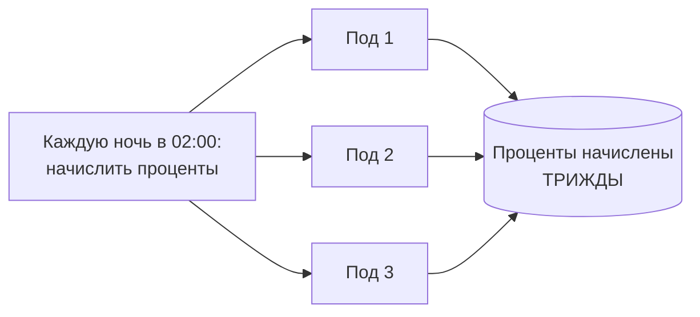
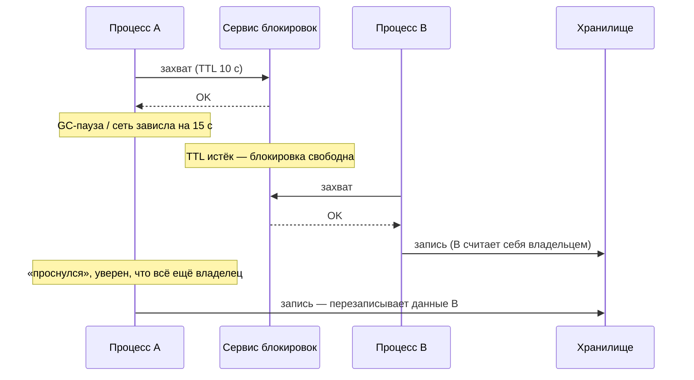
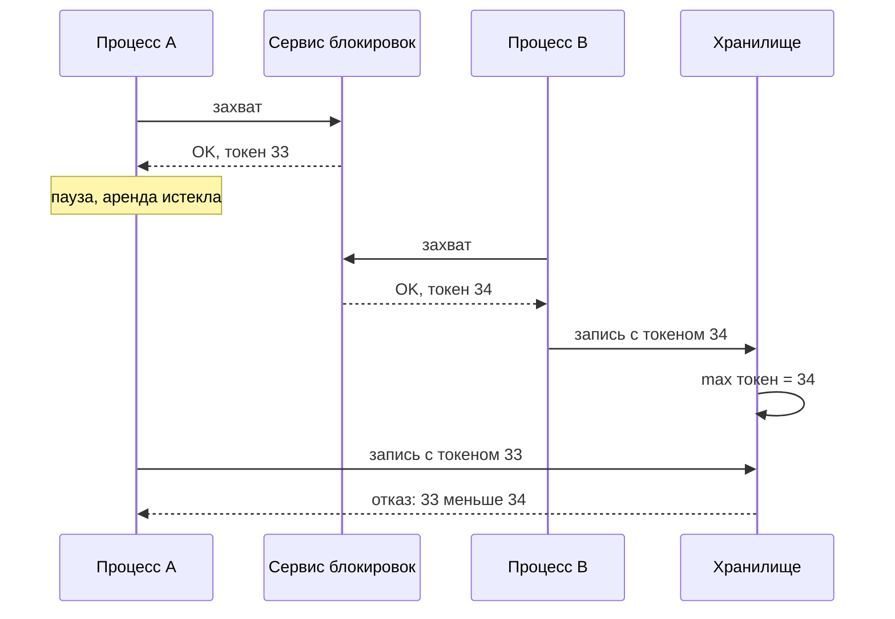
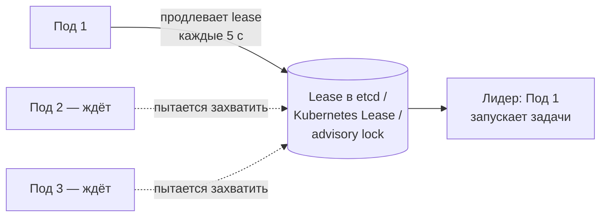

:::tldr
- **Распределённая блокировка** гарантирует, что операцию выполняет **один** экземпляр из многих: фоновая задача по расписанию, обработка одного заказа, миграция, вызов API с жёсткими лимитами.
- Основа — **lease** (аренда): блокировка с **TTL**, чтобы упавший владелец не держал её вечно. Но TTL рождает главную проблему: процесс «заснул» (GC-пауза, сеть), аренда истекла, блокировку взял другой — **оба думают, что владеют**.
- Защита — **fencing token**: монотонно растущий номер, выдаваемый при захвате; хранилище данных отклоняет операции с устаревшим номером. Без него блокировка годится только для **эффективности** (не делать работу дважды), но не для **корректности**.
- Реализации: **PostgreSQL advisory locks** (`pg_try_advisory_lock`, привязаны к сессии/транзакции), **Redis** `SET key value NX PX` (+ Redlock для нескольких узлов — спорен для корректности), **etcd/ZooKeeper/Consul** (консенсус, lease, ревизии как fencing), **Azure Blob lease**. В .NET — библиотека **DistributedLock** (madelson).
- Часто блокировка **не нужна**: уникальные ограничения в БД, оптимистичная конкуренция (версия строки), `SELECT ... FOR UPDATE SKIP LOCKED`, партиционирование очереди по ключу, идемпотентность.
:::

## Зачем и когда



| Цель | Что страшно при сбое блокировки | Требования |
|---|---|---|
| **Эффективность** (не делать дважды дорогую, но безопасную работу) | Лишняя работа | Простой lease в Redis/PostgreSQL достаточно |
| **Корректность** (двойное выполнение портит данные) | Двойные списания, испорченные данные | Fencing tokens или идемпотентность + консенсусное хранилище |

## Проблема истекающей аренды



Проверка «я всё ещё владелец?» перед записью не помогает: между проверкой и записью тоже может произойти пауза.

## Fencing tokens



Токен — номер версии, который хранилище сравнивает с последним виденным. В БД это выглядит как условие `UPDATE ... WHERE fencing_token < @token`. В etcd токеном служит **ревизия** ключа, в ZooKeeper — **zxid**/версия znode.

## PostgreSQL advisory locks

```csharp Блокировка на время выполнения задачи
await using var conn = new NpgsqlConnection(cs);
await conn.OpenAsync(ct);

const long JobLockId = 0x5E11_0001;                       // произвольный идентификатор блокировки
await using (var cmd = new NpgsqlCommand("SELECT pg_try_advisory_lock(@id)", conn))
{
    cmd.Parameters.AddWithValue("id", JobLockId);
    if (!(bool)(await cmd.ExecuteScalarAsync(ct))!) return;   // другой экземпляр уже работает
}
try
{
    await AccrueInterestAsync(ct);
}
finally
{
    await using var unlock = new NpgsqlCommand("SELECT pg_advisory_unlock(@id)", conn);
    unlock.Parameters.AddWithValue("id", JobLockId);
    await unlock.ExecuteNonQueryAsync(ct);
}
```

- Блокировка привязана к **соединению**: если процесс умер, соединение закрылось — блокировка снята автоматически (никакого TTL).
- `pg_advisory_xact_lock` — до конца транзакции.
- Плюс: если данные в той же БД, работа и блокировка согласованы. Минус: держит соединение из пула на всё время задачи; не работает через PgBouncer в transaction-режиме.

## Redis

```csharp Простой lease через SET NX PX
var token = Guid.NewGuid().ToString();
bool acquired = await redis.StringSetAsync("lock:report:2025-09", token, TimeSpan.FromSeconds(30), When.NotExists);
if (!acquired) return;
try { await BuildReportAsync(ct); }
finally
{
    // освобождать только СВОЮ блокировку — атомарно через Lua
    const string script = "if redis.call('get', KEYS[1]) == ARGV[1] then return redis.call('del', KEYS[1]) else return 0 end";
    await redis.ScriptEvaluateAsync(script, ["lock:report:2025-09"], [token]);
}
```

- Значение-токен нужно, чтобы не удалить чужую блокировку после истечения своей.
- Долгая задача — продлевайте аренду (watchdog), но это не устраняет проблему пауз.
- **Redlock** (захват на большинстве из 5 независимых Redis) защищает от падения одного Redis, но полагается на ограниченные паузы и синхронность часов; для задач **корректности** лучше консенсусные системы с fencing.

## Библиотека DistributedLock

```csharp
builder.Services.AddSingleton<IDistributedLockProvider>(_ => new PostgresDistributedSynchronizationProvider(cs));
// или: new RedisDistributedSynchronizationProvider(redis.GetDatabase())

public class NightlyJob(IDistributedLockProvider locks)
{
    public async Task RunAsync(CancellationToken ct)
    {
        await using var handle = await locks.TryAcquireLockAsync("nightly-interest", TimeSpan.Zero, ct);
        if (handle is null) return;                         // уже выполняется на другом экземпляре
        handle.HandleLostToken.Register(() => { /* блокировка потеряна — прервать работу */ });
        await AccrueInterestAsync(ct);
    }
}
```

## Выбор лидера

Лидер — экземпляр, который выполняет «единоличную» работу (планировщик, координатор), пока жив.



В Kubernetes — объект `Lease` (`coordination.k8s.io`), используемый контроллерами; из .NET — через `KubernetesClient` или проще — PostgreSQL advisory lock, удерживаемый лидером.

## Альтернативы блокировкам

| Задача | Вместо распределённой блокировки |
|---|---|
| Не создать дубликат | Уникальный индекс + обработка нарушения |
| Конкурентное изменение одной записи | Оптимистичная конкуренция (`rowversion`, `xmin`) |
| Несколько воркеров разбирают задачи из таблицы | `SELECT ... FOR UPDATE SKIP LOCKED LIMIT 10` |
| Сообщения по одному агрегату — по порядку | Партиционирование очереди по ключу (Kafka key, Service Bus sessions) |
| Повторное выполнение безопасно | Идемпотентность (ключ операции в БД) |
| Задача по расписанию | Отдельный singleton-воркер / Kubernetes CronJob с `concurrencyPolicy: Forbid` |

```sql Очередь задач в PostgreSQL без внешних блокировок
WITH next AS (
    SELECT id FROM jobs
    WHERE status = 'pending'
    ORDER BY created_at
    FOR UPDATE SKIP LOCKED          -- строки, заблокированные другим воркером, пропускаются
    LIMIT 10
)
UPDATE jobs SET status = 'processing', locked_at = now()
FROM next WHERE jobs.id = next.id
RETURNING jobs.*;
```

## Вопросы на засыпку

:::qa Почему нельзя просто проверить «я ещё владелец» перед записью?
Между проверкой и записью процесс может быть приостановлен (GC, планировщик ОС, сеть), и аренда истечёт. Проверка и действие не атомарны. Только хранилище, проверяющее fencing-токен в момент записи, может гарантировать корректность.
:::

:::qa Чем advisory lock лучше Redis-блокировки?
Не нужен TTL — блокировка живёт ровно столько, сколько соединение/транзакция, и освобождается при падении процесса. Если защищаемые данные в той же БД, можно взять блокировку внутри той же транзакции. Минусы — занятое соединение и масштаб одной БД.
:::

:::qa Как выбрать TTL для аренды?
Больше максимальной ожидаемой длительности работы между продлениями плюс запас на паузы, но достаточно маленьким, чтобы при падении владельца работа возобновилась быстро. Обычно — продление каждые TTL/3 и прерывание работы при неудачном продлении. Корректность это не гарантирует — нужны fencing-токены или идемпотентность.
:::

:::qa Что такое «стадный эффект» при ожидании блокировки?
Когда блокировка освобождается, все ожидающие одновременно пытаются её захватить, создавая всплеск нагрузки. Решения — очереди ожидания (ZooKeeper: последовательные эфемерные узлы, каждый следит только за предыдущим), случайные задержки (jitter) при повторных попытках.
:::

## Итог

Распределённая блокировка позволяет выполнять работу одним экземпляром, но из-за аренд с TTL и пауз процессов два владельца возможны — для корректности нужны fencing-токены или идемпотентные операции. Используйте PostgreSQL advisory locks или Redis для эффективности, etcd/ZooKeeper для строгих гарантий, библиотеку DistributedLock в .NET — и прежде всего проверьте, нельзя ли обойтись без блокировки: уникальные индексы, оптимистичная конкуренция, `SKIP LOCKED`, партиционирование очередей.
