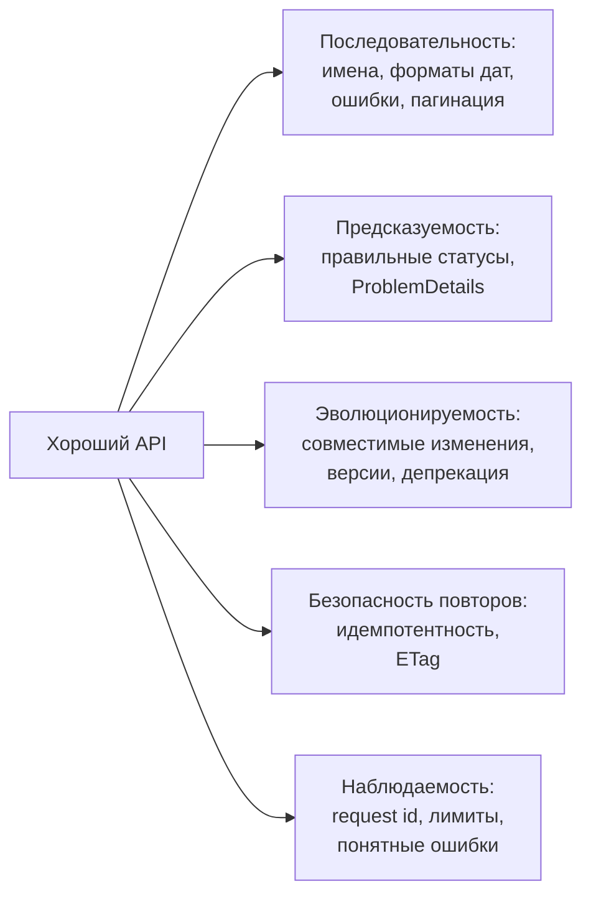
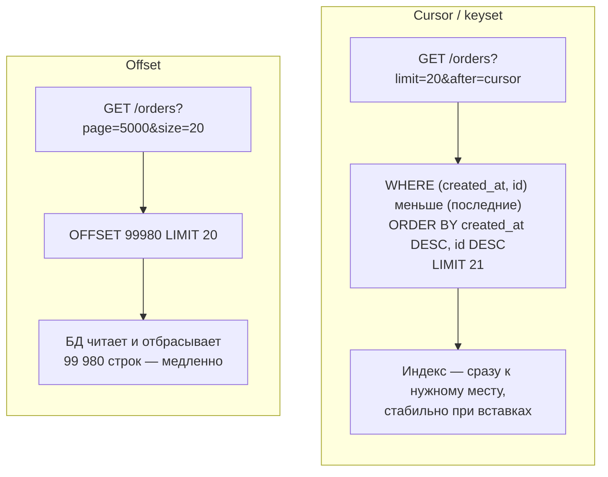
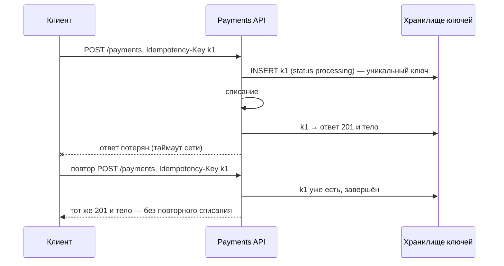

:::tldr
- Публичный API — **контракт**, который трудно менять: клиенты (мобильные приложения, партнёры) обновляются месяцами. Проектируйте его как продукт: последовательные имена, предсказуемые ошибки (ProblemDetails), документация (OpenAPI), явная политика изменений.
- **Пагинация**: offset (`?page=10`) проста, но медленна на больших смещениях и «плывёт» при вставках; **cursor/keyset** (`?after=eyJpZCI6...`) стабильна и быстра — стандарт для лент и больших коллекций.
- **Идемпотентность** небезопасных операций: заголовок **`Idempotency-Key`** — сервер сохраняет результат первой обработки и возвращает его на повтор. Обязательно для платежей и создания заказов.
- **Совместимые** изменения: добавление необязательных полей и новых эндпоинтов. **Ломающие**: удаление/переименование полей, изменение типов и семантики, новые обязательные поля. Клиенты должны **игнорировать неизвестные поля** (tolerant reader).
- **Версионирование** — только для ломающих изменений: в URL (`/v2/`) — просто и наглядно; в заголовке/медиатипе — чище, но сложнее. Устаревшие версии — с объявлением `Deprecation`/`Sunset` и сроком поддержки.
- Конкурентные изменения: **ETag + `If-Match`** (оптимистичная блокировка через HTTP, ответ 412).
:::

## Принципы хорошего API



Соглашения, которые стоит зафиксировать в гайдлайне команды: `camelCase` в JSON, даты в **ISO 8601 UTC** (`2025-09-30T10:15:00Z`), деньги — строкой или минимальными единицами с валютой, идентификаторы — строками (не раскрывать последовательные int), перечисления — строками.

## Пагинация



```csharp Keyset-пагинация в EF Core
public record Page<T>(IReadOnlyList<T> Items, string? NextCursor);

public async Task<Page<OrderDto>> ListAsync(string? after, int limit, CancellationToken ct)
{
    var q = db.Orders.AsNoTracking().OrderByDescending(o => o.CreatedAt).ThenByDescending(o => o.Id).AsQueryable();
    if (Cursor.TryDecode(after, out var c))
        q = q.Where(o => o.CreatedAt < c.CreatedAt || (o.CreatedAt == c.CreatedAt && o.Id.CompareTo(c.Id) < 0));

    var items = await q.Take(limit + 1).Select(o => new OrderDto(o.Id, o.Total, o.CreatedAt)).ToListAsync(ct);
    var next = items.Count > limit ? Cursor.Encode(items[limit - 1].CreatedAt, items[limit - 1].Id) : null;
    return new Page<OrderDto>(items.Take(limit).ToList(), next);   // курсор — непрозрачная base64-строка
}
```

| | Offset | Cursor |
|---|---|---|
| Переход на произвольную страницу | Да | Нет (только вперёд/назад) |
| Производительность на глубине | Деградирует | Постоянная |
| Стабильность при вставках/удалениях | Дубли и пропуски | Стабильна |
| Общее число элементов | Легко (но `COUNT` дорог) | Обычно не возвращают |
| Где | Админки, небольшие таблицы | Ленты, API, большие коллекции, экспорт |

## Идемпотентность



Детали реализации:
- Ключ генерирует **клиент** (UUID) на одну логическую операцию и повторяет его при ретраях.
- Сервер хранит ключ + хэш тела запроса + ответ (TTL, например, 24 ч). Тот же ключ с **другим** телом — 422.
- Параллельный повтор, пока первый ещё обрабатывается, — 409 (или ожидание).
- Запись ключа и бизнес-изменение — в **одной транзакции**, иначе сбой между ними сломает гарантию.

## Эволюция контракта

| Изменение | Совместимо? |
|---|---|
| Новый эндпоинт | Да |
| Новое **необязательное** поле в запросе | Да |
| Новое поле в ответе | Да, если клиенты игнорируют неизвестные поля |
| Новое значение enum в ответе | **Осторожно**: клиент со `switch` без default может упасть |
| Переименование или удаление поля | **Нет** |
| Изменение типа (`int` → `string`), формата даты | **Нет** |
| Новое **обязательное** поле в запросе | **Нет** |
| Изменение семантики (сумма теперь с НДС) | **Нет**, даже если схема та же |
| Ужесточение валидации | **Нет** для существующих клиентов |

Стратегия **expand → migrate → contract**: добавить новое поле рядом со старым, перевести клиентов, затем удалить старое (в новой версии или после срока депрекации).

## Версионирование

```csharp Asp.Versioning
builder.Services.AddApiVersioning(o =>
{
    o.DefaultApiVersion = new ApiVersion(1);
    o.ReportApiVersions = true;                     // заголовок api-supported-versions
    o.ApiVersionReader = new UrlSegmentApiVersionReader();
});

var api = app.NewVersionedApi("Orders");
var v1 = api.MapGroup("/api/v{version:apiVersion}/orders").HasApiVersion(1).HasDeprecatedApiVersion(1);
var v2 = api.MapGroup("/api/v{version:apiVersion}/orders").HasApiVersion(2);
v1.MapGet("/{id}", GetOrderV1);
v2.MapGet("/{id}", GetOrderV2);
```

| Способ | Пример | Плюсы | Минусы |
|---|---|---|---|
| URL | `/api/v2/orders` | Наглядно, легко кэшировать и маршрутизировать | «Версия» не часть ресурса (с точки зрения REST-пуристов) |
| Заголовок | `Api-Version: 2` | Чистые URL | Неочевидно, сложнее тестировать в браузере |
| Медиатип | `Accept: application/vnd.shop.v2+json` | Точное согласование формата | Сложно для клиентов |
| Query | `?api-version=2` | Просто | Смешивается с параметрами |

Депрекация: заголовки `Deprecation` и `Sunset: Sat, 31 Jan 2026 00:00:00 GMT`, ссылки на гайд миграции, метрики использования старой версии по клиентам, уведомления партнёрам.

## Конкурентные изменения: ETag

```http
GET /api/orders/42           → 200, ETag: "v17"
PUT /api/orders/42           If-Match: "v17"    → 200, ETag: "v18"
PUT /api/orders/42           If-Match: "v17"    → 412 Precondition Failed (кто-то уже изменил)
```

ETag удобно строить из версии строки (`xmin`/`rowversion`) — это HTTP-обёртка над оптимистичной конкуренцией EF Core.

## REST, gRPC или GraphQL

| | REST | gRPC | GraphQL |
|---|---|---|---|
| Где | Публичные API, веб и мобильные клиенты | Внутренние вызовы сервис-сервис | Клиенты с разными потребностями в данных (BFF) |
| Контракт | OpenAPI | `.proto`, строгий | Схема GraphQL |
| Эволюция | Версии, совместимые поля | Номера полей protobuf, хорошая совместимость | Депрекация полей без версий |
| Кэширование HTTP | Отлично | Нет | Сложно |
| Сложности | Over/under-fetching | Браузеры (нужен gRPC-Web) | N+1 на сервере, сложность авторизации и лимитов |

## Вопросы на засыпку

:::qa Как добавить новое значение enum, не сломав клиентов?
Документировать, что список значений расширяемый, и требовать от клиентов обработки неизвестных значений (default-ветка). Для старых клиентов можно не отдавать новое значение в старой версии API или маппить его на ближайшее существующее.
:::

:::qa Почему курсор должен быть непрозрачным?
Если клиент начнёт конструировать курсоры сам (например, `after=1042`), сервер не сможет изменить способ пагинации (добавить поле сортировки, сменить тип id). Непрозрачная base64-строка (лучше подписанная) оставляет свободу менять реализацию.
:::

:::qa Нужна ли идемпотентность для PUT и DELETE?
По спецификации они идемпотентны по смыслу, но побочные эффекты (письма, события, аудит) при повторе могут дублироваться, а DELETE на повтор вернёт 404 вместо 204. Клиент должен трактовать 404 на повторном DELETE как успех, а сервер — не генерировать повторных событий.
:::

:::qa Сколько версий API поддерживать одновременно?
Обычно текущую и предыдущую, с объявленным сроком (6–12 месяцев для партнёров). Каждая поддерживаемая версия — стоимость тестирования и сопровождения. Лучшая стратегия — редкие мажорные версии благодаря совместимой эволюции контракта.
:::

## Итог

API — долгоживущий контракт: проектируйте его последовательным и предсказуемым, используйте курсорную пагинацию для больших коллекций, ключи идемпотентности для небезопасных операций и ETag для конкурентных изменений. Развивайте контракт совместимо (добавлять можно, удалять и менять смысл — нет), версионируйте только ломающие изменения и объявляйте депрекацию заранее, со сроками и метриками использования.
