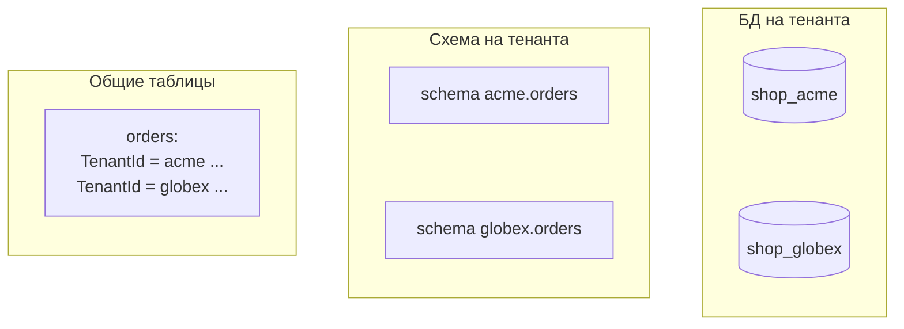
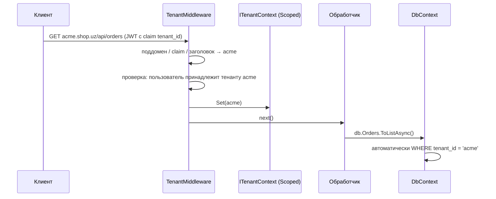
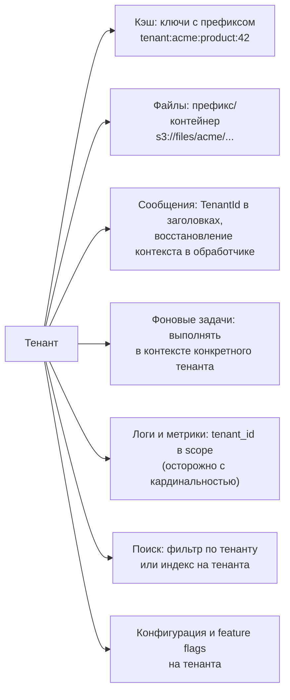

:::tldr
- **Multi-tenancy** — одна система обслуживает много клиентов-организаций (**тенантов**), изолируя их данные, настройки и нагрузку. Главный риск — **утечка данных одного тенанта другому**.
- Модели хранения: **общая БД и общие таблицы** с колонкой `TenantId` (дёшево, сложнее изоляция), **схема на тенанта** (средне), **БД на тенанта** (сильная изоляция, дороже, сложнее миграции). Часто — гибрид: крупные клиенты получают отдельную БД.
- В .NET: определить тенанта в начале запроса (поддомен, заголовок, claim в токене) → `ITenantContext` (Scoped) → **глобальные фильтры запросов EF Core** `HasQueryFilter(e => e.TenantId == tenant.Id)` + автоматическое проставление `TenantId` при сохранении. Дополнительный слой — **Row-Level Security** в PostgreSQL.
- **Noisy neighbor**: один тенант нагружает систему и ухудшает работу остальных → лимиты по тенанту (rate limiting, квоты), отдельные очереди и пулы, вынос крупных тенантов.
- Не забывать: кэш-ключи, файлы, очереди, фоновые задачи, логи и метрики тоже должны учитывать тенанта.
:::

## Модели изоляции



| | Общие таблицы (`TenantId`) | Схема на тенанта | БД на тенанта |
|---|---|---|---|
| Изоляция | Логическая (ошибка в коде = утечка) | Средняя | Сильная |
| Стоимость на тенанта | Минимальная | Средняя | Высокая |
| Число тенантов | Десятки тысяч+ | Сотни–тысячи | Десятки–сотни |
| Миграции схемы | Одна | По числу схем | По числу БД (нужна оркестрация) |
| Бэкап/восстановление одного тенанта | Сложно | Средне | Просто |
| Noisy neighbor | Сильный | Сильный | Слабый (если разные серверы) |
| Требования регуляторов (данные в своей стране, отдельный ключ шифрования) | Сложно | Средне | Просто |
| Отчёты по всем тенантам | Просто | Сложнее | Сложно |

## Определение тенанта



```csharp Контекст тенанта
public interface ITenantContext { Guid TenantId { get; } }

public sealed class TenantContext : ITenantContext
{
    private Guid? _id;
    public Guid TenantId => _id ?? throw new InvalidOperationException("Тенант не определён");
    public void Set(Guid id) => _id = id;
}

app.Use(async (ctx, next) =>
{
    var claim = ctx.User.FindFirst("tenant_id")?.Value;           // источник истины — подписанный токен
    if (claim is null || !Guid.TryParse(claim, out var tenantId)) { ctx.Response.StatusCode = 403; return; }
    ctx.RequestServices.GetRequiredService<TenantContext>().Set(tenantId);
    await next();
});
```

:::warning Не доверяйте тенанту из запроса
Поддомен или заголовок `X-Tenant-Id` можно подменить. Тенант должен подтверждаться аутентификацией: claim в токене, выданном IdP, или проверка членства пользователя в тенанте. Иначе пользователь acme прочитает данные globex, поменяв заголовок.
:::

## EF Core: глобальные фильтры

```csharp
public interface ITenantOwned { Guid TenantId { get; set; } }

public class ShopDbContext(DbContextOptions<ShopDbContext> o, ITenantContext tenant) : DbContext(o)
{
    public DbSet<Order> Orders => Set<Order>();

    protected override void OnModelCreating(ModelBuilder b)
    {
        foreach (var et in b.Model.GetEntityTypes().Where(t => typeof(ITenantOwned).IsAssignableFrom(t.ClrType)))
        {
            // e => e.TenantId == tenant.TenantId — значение берётся из текущего экземпляра контекста на каждый запрос
            var p = Expression.Parameter(et.ClrType, "e");
            var body = Expression.Equal(
                Expression.Property(p, nameof(ITenantOwned.TenantId)),
                Expression.Property(Expression.Constant(this), nameof(CurrentTenantId)));
            b.Entity(et.ClrType).HasQueryFilter(Expression.Lambda(body, p));
            b.Entity(et.ClrType).HasIndex(nameof(ITenantOwned.TenantId));
        }
    }

    private Guid CurrentTenantId => tenant.TenantId;

    public override Task<int> SaveChangesAsync(CancellationToken ct = default)
    {
        foreach (var e in ChangeTracker.Entries<ITenantOwned>())
        {
            if (e.State == EntityState.Added) e.Entity.TenantId = tenant.TenantId;
            else if (e.Property(x => x.TenantId).IsModified)
                throw new InvalidOperationException("Нельзя менять тенанта у существующей записи");
        }
        return base.SaveChangesAsync(ct);
    }
}
```

Нюансы:
- `IgnoreQueryFilters()` отключает фильтр — используйте только в осознанных местах (админка платформы) и ищите в ревью.
- Сырой SQL (`FromSql`, Dapper) фильтры **не применяет** — нужен `tenant_id` в каждом запросе.
- Составные индексы и уникальность — с `TenantId` первым: `(TenantId, Email)` уникален, а не просто `Email`.

## Второй рубеж: Row-Level Security в PostgreSQL

```sql
ALTER TABLE orders ENABLE ROW LEVEL SECURITY;
ALTER TABLE orders FORCE ROW LEVEL SECURITY;

CREATE POLICY tenant_isolation ON orders
    USING (tenant_id = current_setting('app.tenant_id')::uuid)
    WITH CHECK (tenant_id = current_setting('app.tenant_id')::uuid);
```

```csharp Установка тенанта для соединения (interceptor EF Core)
public sealed class TenantConnectionInterceptor(ITenantContext tenant) : DbConnectionInterceptor
{
    public override async Task ConnectionOpenedAsync(DbConnection conn, ConnectionEndEventData data, CancellationToken ct = default)
    {
        await using var cmd = conn.CreateCommand();
        cmd.CommandText = "SELECT set_config('app.tenant_id', @t, false)";
        var p = cmd.CreateParameter(); p.ParameterName = "t"; p.Value = tenant.TenantId.ToString(); cmd.Parameters.Add(p);
        await cmd.ExecuteNonQueryAsync(ct);
    }
}
```

Даже если разработчик забудет фильтр в Dapper-запросе, БД не вернёт чужие строки. Приложение должно подключаться пользователем **без** права `BYPASSRLS`.

## Не только БД



## Noisy neighbor

- **Rate limiting** по тенанту (`PartitionedRateLimiter` с ключом `tenant_id`), квоты на хранилище и API.
- **Справедливые очереди**: отдельные очереди или партиции для крупных тенантов, ограничение параллелизма обработки на тенанта.
- **Вынос** крупных тенантов на выделенные ресурсы (отдельная БД, отдельный пул воркеров) — гибридная модель.
- **Метрики по тенантам** (с ограничением кардинальности — топ-N) для обнаружения аномалий.

## Вопросы на засыпку

:::qa Как применять миграции в модели «БД на тенанта»?
Оркестрация: список тенантов с версией схемы, миграции применяются пакетами (сначала внутренние/тестовые тенанты, затем остальные), с мониторингом и возможностью остановки. Схема должна быть обратно совместимой (expand/contract), потому что в какой-то момент часть БД уже обновлена, а часть — нет.
:::

:::qa Как тестировать изоляцию тенантов?
Интеграционные тесты, создающие данные двух тенантов и проверяющие, что каждый эндпоинт под пользователем A не видит данных B (включая поиск, экспорт, файлы). Архитектурные тесты: все сущности, кроме явного списка, реализуют `ITenantOwned`; запрет `IgnoreQueryFilters` вне разрешённых сборок.
:::

:::qa Что делать с данными, общими для всех тенантов?
Справочники (страны, валюты) хранить в отдельных таблицах без `TenantId` и без фильтра, явно помеченных как глобальные. Важно, чтобы тенант не мог их изменять, а общие сущности не смешивались с тенантскими в одной таблице.
:::

:::qa Как перенести тенанта из общей БД в выделенную?
Экспорт всех строк с его `TenantId` в новую БД (снапшот + догоняющая синхронизация через CDC или двойную запись), переключение маршрутизации тенанта на новую строку подключения в момент короткой паузы записи, проверка и удаление данных из общей БД. Для этого ключи должны быть глобально уникальны (GUID), а не автоинкременты.
:::

## Итог

Multi-tenancy — баланс между стоимостью и изоляцией: общие таблицы с `TenantId` дёшевы и масштабируются на тысячи клиентов, отдельные БД дают сильную изоляцию для крупных и регулируемых. В .NET тенант определяется из аутентифицированного контекста, хранится в Scoped-сервисе и применяется глобальными фильтрами EF Core, а Row-Level Security страхует на уровне БД. Не забывайте про кэш, файлы, очереди, фоновые задачи и защиту от noisy neighbor.
