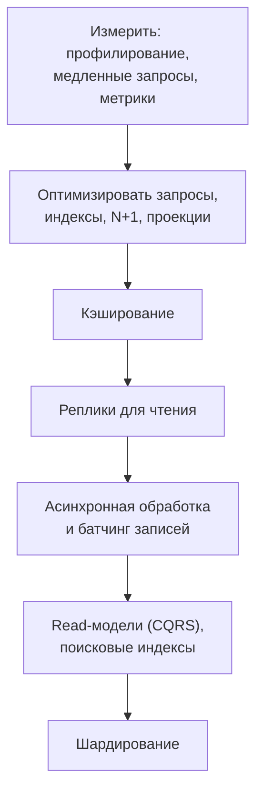
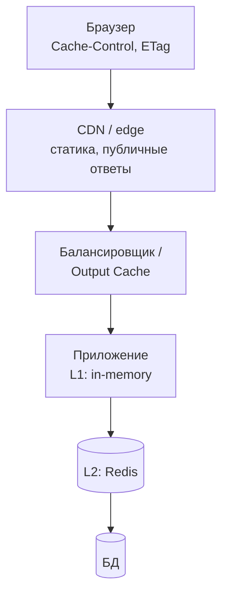
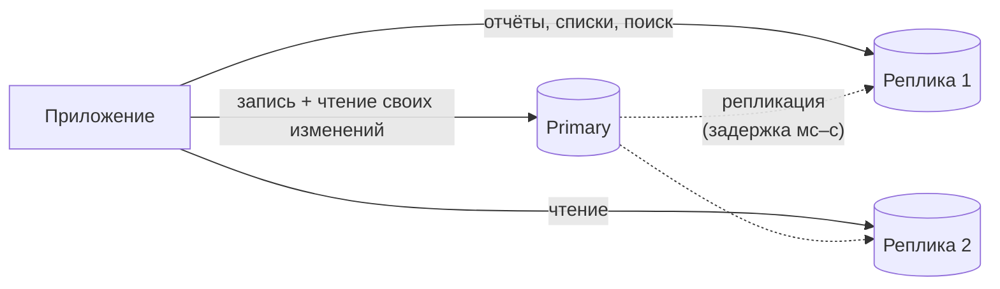
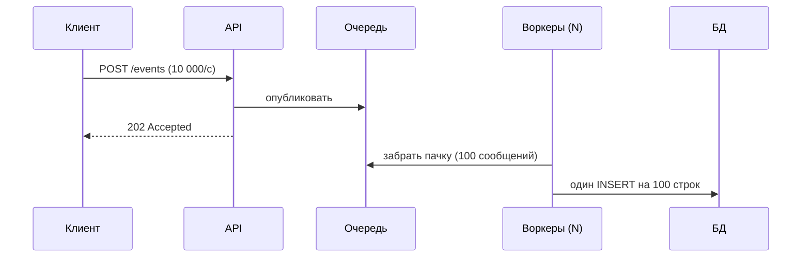
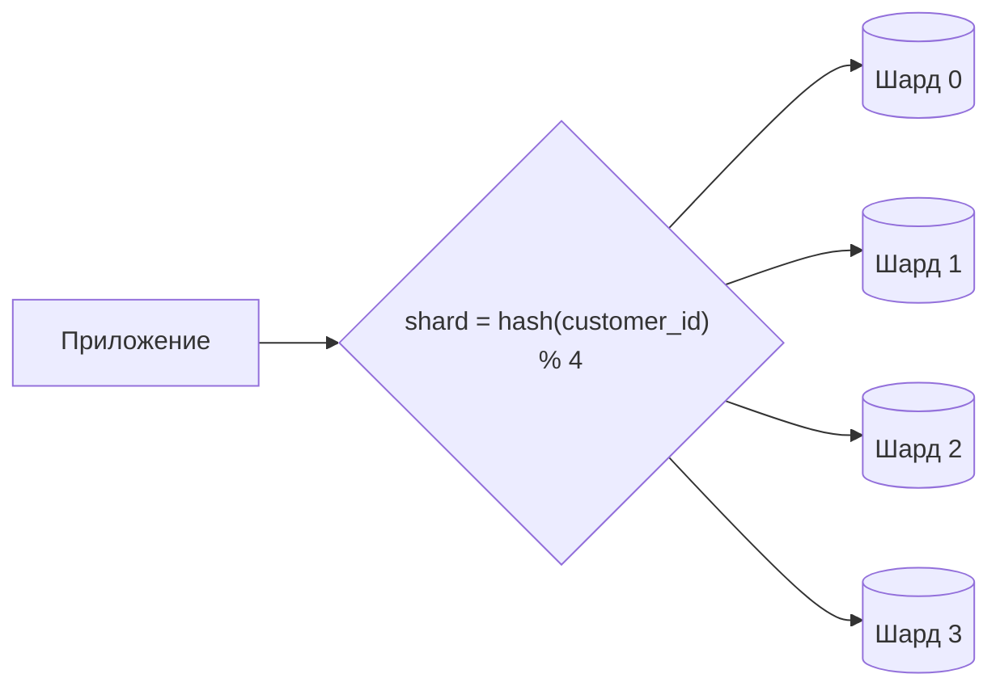
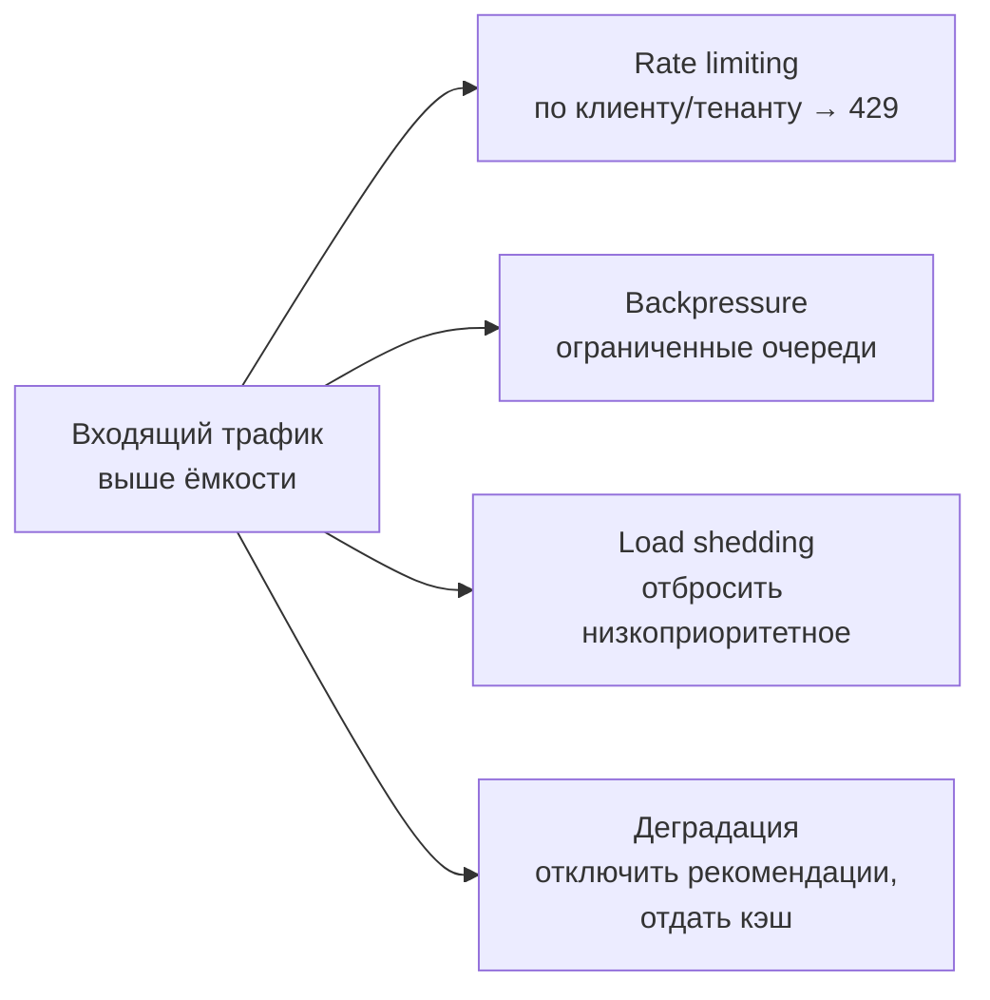

:::tldr
- Сначала **измерьте**: где узкое место (CPU приложения, БД, сеть, блокировки), какое отношение чтения к записи, какие запросы самые тяжёлые. Оптимизация запросов и индексов часто даёт больше, чем любая архитектура.
- **Чтение** масштабируется проще: многоуровневый кэш (браузер/CDN → in-memory → Redis), **реплики** для чтения, **денормализованные read-модели** (CQRS), поисковые индексы (Elasticsearch/OpenSearch), предвычисленные агрегаты.
- **Запись** масштабируется сложнее: **асинхронность** (принять в очередь и обработать позже), **батчинг** (группировать мелкие записи), append-only журналы, снижение конкуренции за «горячие» строки (шардированные счётчики), **шардирование** по ключу.
- Главные компромиссы: кэш и реплики → **устаревшие данные**; очереди → **итоговая согласованность** и сложность; шардирование → потеря JOIN-ов и транзакций между шардами, сложные миграции.
- Защита от пиков: **rate limiting**, **backpressure**, **load shedding** (отказывать части запросов, чтобы обслужить остальные), деградация функциональности.
:::

## Стратегия по шагам



## Масштабирование чтения

### Многоуровневый кэш



| Уровень | Что кэшировать | Риски |
|---|---|---|
| Браузер / CDN | Статика, публичные страницы и ответы API (каталог) | Персональные данные в публичном кэше, инвалидация |
| Output cache | Целые HTTP-ответы | Вариации по пользователю/языку |
| In-memory (L1) | Горячие, редко меняющиеся данные; микросекунды | Расхождение между экземплярами |
| Redis (L2) | Общие данные для всех экземпляров; ~1 мс | Отказ Redis, «стадо» при промахе |

`HybridCache` (.NET 9) объединяет L1 + L2 и защищает от **cache stampede** (одновременная перезагрузка одного ключа множеством запросов).

### Реплики



```csharp Два контекста: для записи и для чтения
builder.Services.AddDbContext<ShopDbContext>(o => o.UseNpgsql(cfg.GetConnectionString("Primary")));
builder.Services.AddDbContext<ShopReadDbContext>(o => o
    .UseNpgsql(cfg.GetConnectionString("Replica"))
    .UseQueryTrackingBehavior(QueryTrackingBehavior.NoTracking));
```

Помните о **задержке репликации**: после записи пользователь может не увидеть изменения на реплике (решения — в вопросе о моделях согласованности).

### Read-модели и предвычисление

Вместо тяжёлого запроса с пятью JOIN-ами и агрегатами на каждый просмотр — **денормализованная таблица или документ**, обновляемые при изменениях (событиями) или периодически. Примеры: счётчики на карточке товара, лента пользователя, дашборд продаж (материализованные представления, ClickHouse), поисковый индекс каталога.

## Масштабирование записи

### Асинхронность и очереди



Очередь сглаживает пики: БД получает постоянную комфортную нагрузку, а не всплески. Цена — задержка обработки и необходимость идемпотентности.

### Батчинг

```csharp Накопление записей и пакетная вставка
var channel = Channel.CreateBounded<ClickEvent>(new BoundedChannelOptions(50_000) { FullMode = BoundedChannelFullMode.DropOldest });

// фоновой обработчик: до 1000 событий или каждые 500 мс
await foreach (var batch in channel.Reader.ReadAllAsync(ct).Chunk(1000))
{
    await using var writer = await conn.BeginBinaryImportAsync("COPY clicks (link_id, at, country) FROM STDIN (FORMAT BINARY)", ct);
    foreach (var e in batch) await writer.WriteRowAsync(ct, e.LinkId, e.At, e.Country);
    await writer.CompleteAsync(ct);
}
```

Одна вставка 1000 строк через `COPY` на порядки дешевле 1000 отдельных `INSERT` с транзакциями.

### Горячие строки

Счётчик просмотров популярного товара, остаток популярного товара во время распродажи — все записи конкурируют за **одну строку** (блокировки).

| Приём | Как |
|---|---|
| Шардированный счётчик | N строк-счётчиков, запись в случайную, чтение — сумма |
| Агрегация в памяти/Redis | `INCR` в Redis, периодический сброс в БД |
| Append-only | Записывать события, а итог считать агрегацией |
| Резервирование пачками | Выдавать воркерам «квоты» остатка вместо списания по одному |

### Шардирование



Выбор ключа — самое важное решение: запросы должны в основном затрагивать **один** шард (все данные клиента — в его шарде), ключ должен равномерно распределять нагрузку (не дата — все записи «сегодня» попадут в один шард). Используйте consistent hashing или таблицу маршрутизации, чтобы перераспределение не требовало переноса всех данных. Готовые решения: Citus для PostgreSQL, Vitess для MySQL, распределённые SQL-БД (CockroachDB, YugabyteDB).

## Защита при перегрузке



Система, которая под перегрузкой пытается обслужить **всех**, обычно не обслуживает **никого**: растут очереди, таймауты, ретраи клиентов усиливают нагрузку (retry storm). Лучше быстро отказать части запросов.

## Пример: лента новостей

| Подход | Как работает | Плюсы | Минусы |
|---|---|---|---|
| Fan-out on read | При открытии ленты собрать посты всех подписок | Дешёвая запись | Дорогое чтение |
| Fan-out on write | При публикации записать пост в ленты всех подписчиков | Мгновенное чтение | Знаменитость с 10 млн подписчиков — 10 млн записей |
| Гибрид | Обычным — fan-out on write, знаменитостей подмешивать при чтении | Баланс | Сложность |

## Вопросы на засыпку

:::qa Почему кэш может уронить базу данных?
При массовом истечении ключей или перезапуске Redis все запросы одновременно идут в БД (cache stampede / thundering herd). Защита: случайный разброс TTL, блокировка перезагрузки одного ключа (single flight, HybridCache), прогрев кэша, ограничение параллелизма запросов к БД.
:::

:::qa Когда реплики не помогают?
Когда узкое место — **запись** (реплики её только увеличивают: каждая запись применяется на всех), когда нужна строгая согласованность чтения, или когда тяжёлые запросы можно убрать оптимизацией. Реплики масштабируют только чтение.
:::

:::qa Чем партиционирование отличается от шардирования?
Партиционирование — разделение таблицы на части внутри **одного** сервера БД (по дате, по диапазону): ускоряет запросы и обслуживание (удаление старых партиций). Шардирование — распределение данных по **разным** серверам: масштабирует запись и объём, но усложняет запросы между шардами.
:::

:::qa Как оценить, хватит ли одной базы данных?
Посчитать пиковые RPS записи и чтения, объём данных и рабочего набора, сравнить с возможностями сервера (с запасом 2–3×). Учесть, что большую часть чтения можно снять кэшем и репликами. Многие системы с миллионами пользователей живут на одном хорошо настроенном primary с репликами.
:::

## Итог

Масштабирование начинается с измерений и оптимизации запросов. Чтение масштабируют кэшами на нескольких уровнях, репликами и предвычисленными read-моделями; запись — асинхронной обработкой через очереди, батчингом, снижением конкуренции за горячие строки и, в крайнем случае, шардированием по правильно выбранному ключу. Каждый шаг покупается ценой согласованности и сложности, а под перегрузкой лучше быстро отказывать и деградировать, чем падать целиком.
