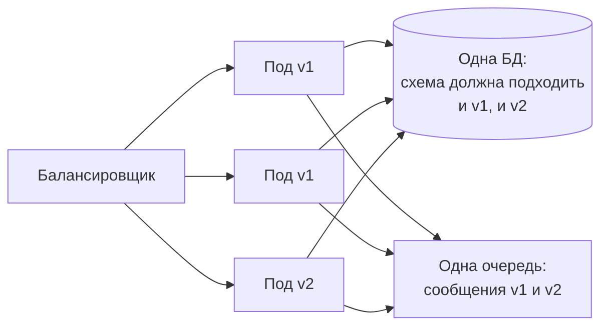
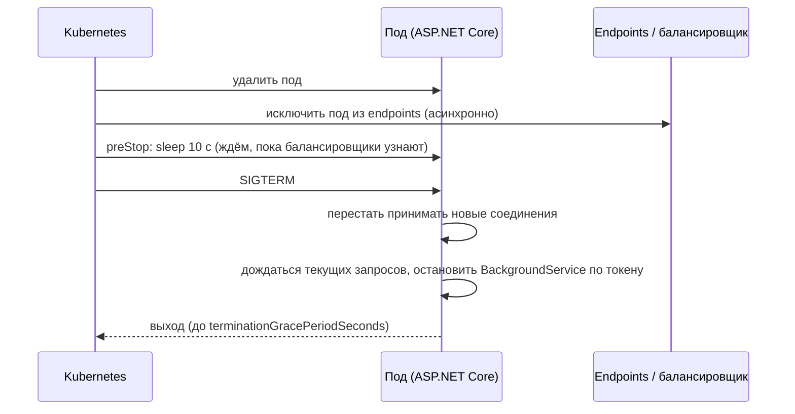
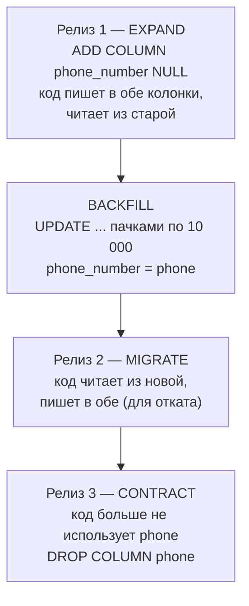
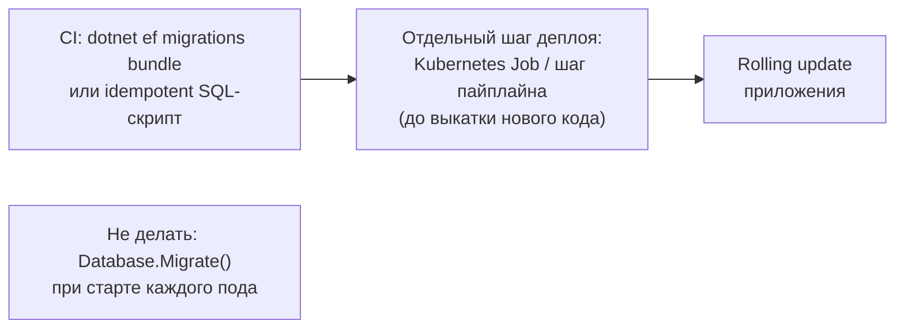

:::tldr
- Развёртывание без простоя требует, чтобы **старая и новая версии работали одновременно**: при rolling update часть подов уже новая, часть ещё старая — и обе ходят в одну БД и читают одни очереди.
- **Graceful shutdown**: под перестают отправлять трафик (readiness → not ready), приложение дорабатывает текущие запросы и сообщения, затем останавливается. В .NET — `HostOptions.ShutdownTimeout`, `CancellationToken` в `BackgroundService`, `preStop`-пауза в Kubernetes.
- Схема БД меняется по шаблону **expand → migrate → contract**: сначала **совместимое расширение** (новая колонка, nullable), затем код пишет в оба места и данные переносятся (**backfill** пачками), затем код переключается на новое, и только в следующем релизе удаляется старое.
- Нельзя за один релиз: переименовать колонку, удалить используемую колонку, добавить NOT NULL без значения по умолчанию, изменить тип. Долгие блокирующие DDL на больших таблицах — тоже простой: `CREATE INDEX CONCURRENTLY`, батчи, онлайн-инструменты.
- То же для контрактов сообщений и API: новые поля — необязательные, потребители обновляются раньше производителей, удаление — последним шагом.
:::

## Почему это сложно



Миграция, применённая перед деплоем, должна работать со **старым** кодом; новый код должен работать со схемой и сообщениями, которые ещё может производить **старый** код. Плюс откат: если v2 откатывается к v1, схема уже изменена.

## Graceful shutdown



```csharp
builder.Services.Configure<HostOptions>(o => o.ShutdownTimeout = TimeSpan.FromSeconds(25));

public sealed class OrderConsumer(IMessageQueue queue) : BackgroundService
{
    protected override async Task ExecuteAsync(CancellationToken stoppingToken)
    {
        while (!stoppingToken.IsCancellationRequested)
        {
            var msg = await queue.ReceiveAsync(stoppingToken);   // при остановке новые сообщения не берём
            await HandleAsync(msg, CancellationToken.None);       // текущее — доработать (или сделать идемпотентным)
            await queue.AckAsync(msg);
        }
    }
}
```

```yaml
spec:
  terminationGracePeriodSeconds: 40
  containers:
    - name: api
      lifecycle:
        preStop:
          exec: { command: ["sleep", "10"] }     # или sleep-действие в новых версиях Kubernetes
      readinessProbe:
        httpGet: { path: /health/ready, port: 8080 }
```

Без `preStop`-паузы под получает SIGTERM раньше, чем Ingress и kube-proxy перестали на него маршрутизировать, — часть запросов получает ошибки соединения.

## Expand → Migrate → Contract

Задача: переименовать колонку `customers.phone` в `phone_number` (или изменить её формат).



На каждом шаге **предыдущая версия кода** продолжает работать с текущей схемой, поэтому любой релиз можно откатить.

```sql Backfill пачками, чтобы не держать долгие блокировки
UPDATE customers SET phone_number = phone
WHERE id IN (
    SELECT id FROM customers
    WHERE phone_number IS NULL AND phone IS NOT NULL
    LIMIT 10000
);
-- повторять до 0 затронутых строк, с паузами; следить за репликацией и нагрузкой
```

## Опасные операции и безопасные альтернативы (PostgreSQL)

| Опасно | Почему | Безопасно |
|---|---|---|
| `ADD COLUMN x NOT NULL` без default | Ошибка или перезапись таблицы | `ADD COLUMN x NULL` → backfill → `SET NOT NULL` (через `CHECK ... NOT VALID` + `VALIDATE`) |
| `CREATE INDEX` | Блокирует запись на время построения | `CREATE INDEX CONCURRENTLY` (вне транзакции) |
| `ALTER COLUMN TYPE` | Перезапись таблицы под эксклюзивной блокировкой | Новая колонка + backfill + переключение |
| `ADD FOREIGN KEY` | Проверка всей таблицы под блокировкой | `NOT VALID` + отдельно `VALIDATE CONSTRAINT` |
| `RENAME COLUMN` / `DROP COLUMN` за один релиз | Старый код упадёт | Expand/contract |
| Любой DDL при долгих транзакциях | Очередь блокировок останавливает все запросы к таблице | `SET lock_timeout = '3s'` и повтор |

## Миграции EF Core в процессе деплоя



- Не применяйте миграции при старте приложения в нескольких экземплярах: гонки, долгий старт, права DDL у приложения.
- Ревьюйте сгенерированный SQL (`migrations script`): EF Core может сгенерировать переименование как DROP + ADD (потеря данных) или перестроить таблицу.
- Разделяйте **схемные** миграции (быстрые, совместимые) и **миграции данных** (backfill — фоновой задачей, пачками).

## Контракты сообщений и API


## Feature flags: отделить деплой от релиза

Код новой функциональности выкатывается выключенным, включается постепенно (1% → 10% → 100%) и мгновенно выключается при проблемах — без отката деплоя. Это снимает напряжение «большого релиза» и упрощает откат: откатывается флаг, а не схема БД.

## Вопросы на засыпку

:::qa Как откатить релиз, если миграция уже применена?
Если миграции следовали expand/contract, предыдущая версия кода совместима с новой схемой — откатывается только код. «Down»-миграции в продакшене опасны (могут потерять данные, записанные новой версией) и применяются редко; обычно исправляют ошибку новым релизом (fix forward).
:::

:::qa Почему потребители сообщений обновляются раньше производителей?
Если производитель начнёт отправлять сообщения нового формата раньше, чем потребители научатся их понимать, старые потребители упадут или отправят сообщения в DLQ. Обратный порядок безопасен: новый потребитель понимает и старый, и новый формат.
:::

:::qa Что такое blue-green деплой и чем он помогает с БД?
Две полные среды (blue — текущая, green — новая), переключение трафика целиком. Код переключается мгновенно и легко откатывается, но **БД обычно общая** — поэтому требования к совместимости схемы те же, что и при rolling update.
:::

:::qa Как удалить колонку, которую EF Core всё ещё знает в старой версии?
Сначала релиз, где модель EF больше не содержит свойства (код не читает и не пишет колонку; если колонка NOT NULL без default — сначала сделать её nullable или задать default). После того как старая версия больше нигде не запущена — миграция с `DROP COLUMN`.
:::

## Итог

Развёртывание без простоя основано на совместимости: старая и новая версии одновременно работают с одной схемой, очередями и API. Обеспечьте graceful shutdown (readiness, preStop, токены отмены), меняйте схему по шаблону expand → migrate → contract с backfill пачками и неблокирующими DDL, применяйте миграции отдельным шагом до выкатки кода, обновляйте потребителей раньше производителей и отделяйте деплой от релиза через feature flags.
