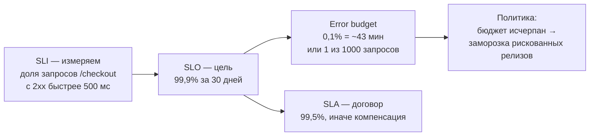
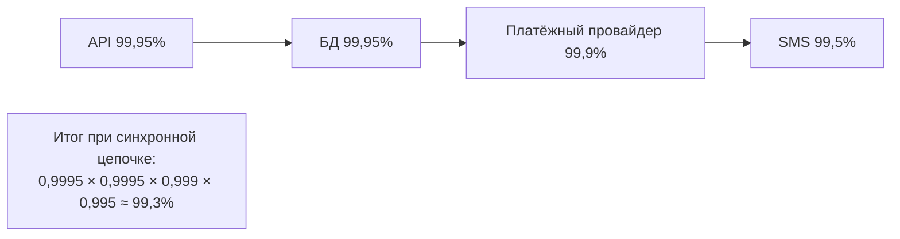
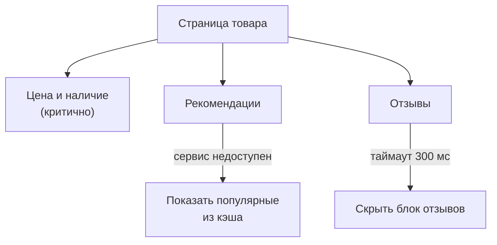
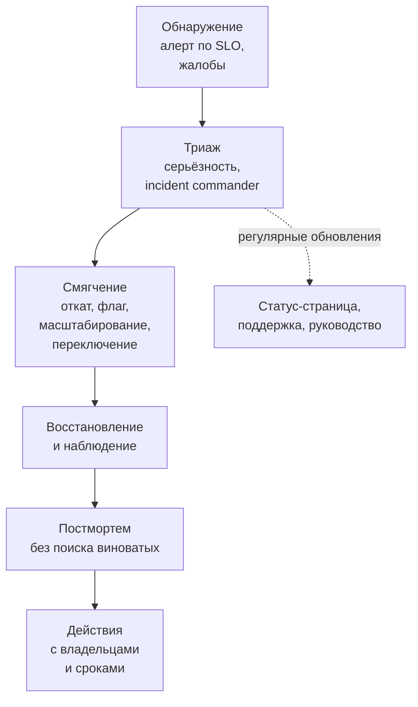

:::tldr
- **SLI** — измеряемый показатель качества (доля успешных запросов, p99 задержки), **SLO** — целевое значение (99,9% за 30 дней), **SLA** — договорное обязательство перед клиентом со штрафами (мягче SLO). **Error budget** = 100% − SLO: сколько «плохих» событий допустимо.
- Error budget превращает надёжность в **управляемый ресурс**: бюджет есть — выпускаем фичи быстрее; бюджет исчерпан — фокус на стабильности.
- Каждая «девятка» дороже на порядок: 99,9% — 43 мин простоя в месяц, 99,99% — 4,3 мин. Доступность системы из последовательных зависимостей **перемножается**.
- Проектирование для отказов: **без единой точки отказа** (несколько экземпляров и зон), таймауты, ретраи с backoff, circuit breaker, bulkhead, **graceful degradation** (без рекомендаций, но магазин работает), идемпотентность, резервное копирование с проверкой восстановления (**RPO/RTO**).
- **Инцидент**: обнаружить (алерты по симптомам) → назначить **incident commander** → **смягчить** (откат, флаг, переключение) — сначала восстановить, потом разбираться → коммуникация → **постмортем без поиска виноватых** с конкретными действиями.
:::

## SLI, SLO, SLA, error budget



| Доступность | Простой в месяц | Простой в год |
|---|---|---|
| 99% | 7,3 ч | 3,65 дня |
| 99,9% | 43,8 мин | 8,8 ч |
| 99,95% | 21,9 мин | 4,4 ч |
| 99,99% | 4,4 мин | 52,6 мин |
| 99,999% | 26 с | 5,3 мин |

Хорошие SLI отражают **опыт пользователя**: не «CPU < 80%», а «доля успешных оформлений заказа» и «p99 задержки поиска». SLO не должен быть 100%: это недостижимо, бесконечно дорого и не нужно — пользователь не отличит 99,99% от 100% из-за собственной сети.

### Алерты по скорости сжигания бюджета

Вместо «ошибок > 1%» — **burn rate**: как быстро тратится бюджет. Быстрое сжигание (бюджет месяца за 2 дня) — срочный пейдж; медленное (за 10 дней) — тикет. Это уменьшает шум и ловит и острые, и медленные деградации.

## Доступность зависимостей перемножается



Как повышать: убирать синхронные зависимости из критического пути (SMS — асинхронно через очередь), дублировать (два провайдера), кэшировать ответы, деградировать (без SMS заказ всё равно оформляется).

## Проектирование для отказов

| Отказ | Защита |
|---|---|
| Падение экземпляра | Несколько реплик, health checks, автоматический перезапуск |
| Падение зоны доступности | Распределение по зонам (pod anti-affinity, multi-AZ БД) |
| Медленная зависимость | **Таймауты** на всё, circuit breaker, bulkhead (отдельные пулы) |
| Кратковременные сбои | Ретраи с экспоненциальной задержкой и jitter, только для идемпотентных операций |
| Перегрузка | Rate limiting, load shedding, автомасштабирование, очереди |
| Плохой релиз | Canary, feature flags, быстрый откат, автоматические проверки после деплоя |
| Потеря данных | Бэкапы + **регулярная проверка восстановления**, PITR, репликация |
| Ошибка оператора | Автоматизация, ревью изменений инфраструктуры (IaC), ограниченные права |
| Отказ региона | Multi-region (дорого): active-passive с репликацией, DNS failover |

```csharp Стандартная устойчивость HttpClient (.NET 8+)
builder.Services.AddHttpClient<PaymentsClient>(c => c.BaseAddress = new("https://payments.internal"))
    .AddStandardResilienceHandler(o =>
    {
        o.AttemptTimeout.Timeout = TimeSpan.FromSeconds(2);        // таймаут попытки
        o.TotalRequestTimeout.Timeout = TimeSpan.FromSeconds(8);   // общий таймаут с ретраями
        o.Retry.MaxRetryAttempts = 2;                              // экспоненциально с jitter
        o.CircuitBreaker.FailureRatio = 0.2;                       // размыкание при 20% ошибок
    });
```

### Graceful degradation



Разделите функциональность на **критичную** и **второстепенную**; второстепенная не должна ронять критичную (отдельные таймауты, fallback, асинхронная загрузка).

### RPO и RTO

- **RPO** (Recovery Point Objective) — сколько данных допустимо потерять: «не более 5 минут» → непрерывная архивация WAL / point-in-time recovery.
- **RTO** (Recovery Time Objective) — за сколько восстановиться: «за 1 час» → автоматизированное восстановление, проверенные runbook-и.
- Бэкап, восстановление которого ни разу не проверялось, — не бэкап.

## Управление инцидентом



Принципы:
- **Сначала остановить кровотечение**, потом искать корневую причину. Откат последнего релиза — первая гипотеза.
- **Роли**: incident commander (координирует и принимает решения, не чинит сам), ответственный за коммуникацию, исследователи.
- **Один канал** для инцидента, хронология с временными метками.
- Уровни серьёзности (SEV1–SEV4) с понятными критериями и ожидаемой реакцией.

## Постмортем

```markdown Шаблон
# Постмортем: недоступность оформления заказов 2025-09-14

Серьёзность: SEV2 · Длительность: 47 мин · Затронуто: ~18% попыток оформления

## Хронология (UTC)
14:02 Релиз 3.18 с новым запросом расчёта доставки
14:09 Алерт: burn rate SLO checkout ×14
14:15 Назначен IC, гипотеза — релиз
14:21 Откат на 3.17, ошибки сохраняются (пул соединений исчерпан)
14:40 Перезапуск подов, восстановление
14:49 Метрики в норме

## Причины
Новый запрос без индекса выполнялся 4 с и удерживал соединения;
пул (100) исчерпался; таймаут команд не был задан.

## Что сработало / что нет
+ Алерт по SLO сработал за 7 минут
− Откат не помог сразу: зависшие соединения остались

## Действия
1. Индекс на shipments(zone_id, created_at) — @anna, до 20.09
2. CommandTimeout 5 с по умолчанию — @bob, до 22.09
3. Проверка планов новых запросов в CI на копии данных — @team, Q4
```

**Blameless**: людей не наказывают за ошибки — иначе их будут скрывать. Вопрос не «кто виноват», а «почему система позволила ошибке произойти и не обнаружила её раньше».

## Вопросы на засыпку

:::qa Чем SLO отличается от SLA?
SLO — внутренняя цель команды, SLA — внешнее договорное обязательство с последствиями (компенсации). SLA обычно мягче SLO (например, SLO 99,9%, SLA 99,5%), чтобы нарушение внутренней цели было сигналом задолго до нарушения договора.
:::

:::qa Почему ретраи могут ухудшить инцидент?
Если зависимость перегружена, ретраи умножают нагрузку (каждый слой повторяет 3 раза → 27 запросов вместо одного) — retry storm. Нужны ограниченные ретраи только на одном уровне, экспоненциальная задержка с jitter, бюджет ретраев и circuit breaker.
:::

:::qa Что такое chaos engineering?
Контролируемое внесение отказов в систему (убить под, добавить задержку сети, отключить зависимость), чтобы проверить, что механизмы устойчивости работают и команда умеет реагировать, — до того, как это случится в реальном инциденте. Начинают со стейджинга и game days.
:::

:::qa Как Senior-инженеру влиять на надёжность команды?
Вводить SLO для ключевых пользовательских сценариев и политику error budget, добиваться алертов по симптомам с runbook-ами, проводить постмортемы и следить за выполнением действий, закладывать таймауты, идемпотентность и деградацию в дизайн, регулярно проверять восстановление из бэкапов.
:::

## Итог

Надёжность управляется через SLI/SLO и error budget, а не через «чтобы никогда не падало». Проектируйте для отказов: избыточность, таймауты, ретраи с backoff, circuit breaker, деградация второстепенного, проверенные бэкапы с понятными RPO/RTO. При инциденте сначала смягчайте последствия, координируйтесь через incident commander и коммуницируйте, а после проводите постмортем без поиска виноватых с конкретными действиями.
