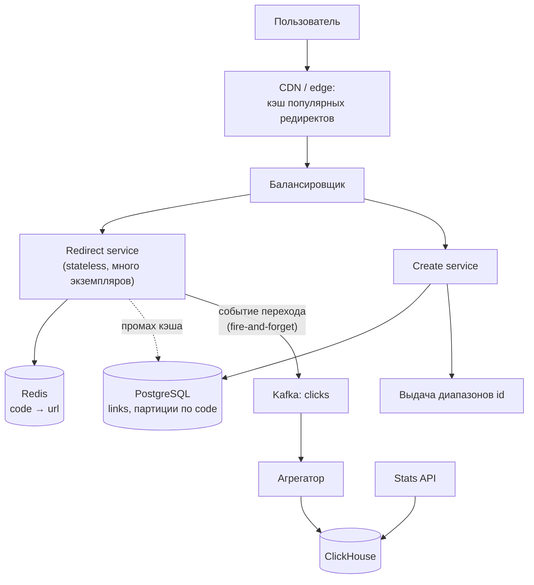
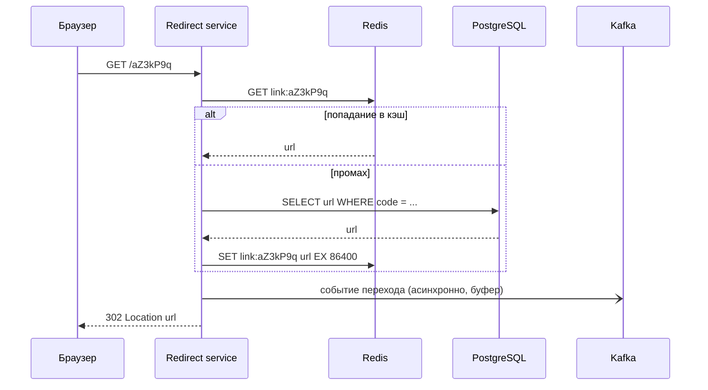

:::tldr
- Классическая задача, на которой проверяют весь цикл: требования → оценки → API → хранение → генерация кодов → кэширование → аналитика → масштабирование и отказы.
- Ключевые свойства: **чтение доминирует** (100:1), задержка редиректа важна, данные — простые пары «код → URL», объём — миллиарды записей.
- **Генерация кодов**: счётчик + base62 с выдачей **диапазонов** id экземплярам (без координации на каждый запрос, без коллизий) — основной вариант; хэш URL — коллизии и предсказуемость; случайный код — проверка уникальности.
- **Редирект**: CDN/edge → Redis (cache-aside, горячие ссылки) → БД; **302** если нужна статистика каждого перехода, **301** если важнее снизить нагрузку.
- **Аналитика** — асинхронно: событие перехода в Kafka → агрегация → ClickHouse. Редирект не должен зависеть от аналитики.
:::

## 1. Требования

**Функциональные**: создать короткую ссылку (опционально — свой алиас, срок жизни), перейти по ней (редирект), посмотреть статистику переходов.

**Нефункциональные** (уточнены с интервьюером):
- 100 млн новых ссылок в месяц, переходов в 100 раз больше.
- Редирект p99 < 50 мс, доступность редиректа 99,99% (важнее, чем создание).
- Ссылки хранятся 5 лет, коды не должны быть легко перебираемыми.
- Статистика может отставать на минуты.

## 2. Оценки

```text
Запись:   100 млн / мес ≈ 40 RPS, пик ≈ 200 RPS
Чтение:   ×100 → ≈ 4 000 RPS, пик ≈ 20 000 RPS
Хранение: 6 млрд ссылок × ~500 Б ≈ 3 ТБ за 5 лет
Код:      base62, 7 символов = 62^7 ≈ 3,5 трлн вариантов
Кэш:      20% ссылок → 80% переходов; горячие ссылки за сутки:
          ~70 млн переходов в сутки по ~1–5 млн уникальным ссылкам × 500 Б ≈ 2,5 ГБ — помещается в Redis
События:  20 000/с × ~200 Б ≈ 4 МБ/с в аналитический поток
```

Вывод: запись невелика (одна БД справится), чтение высокое, но отлично кэшируется; хранение — терабайты, нужен план партиционирования/шардирования; аналитика — отдельный поток.

## 3. API

```http
POST /api/links
{ "url": "https://example.uz/very/long/path?utm=...", "alias": null, "expiresAt": null }
→ 201 { "code": "aZ3kP9q", "shortUrl": "https://sh.uz/aZ3kP9q" }

GET /aZ3kP9q            → 302 Location: https://example.uz/very/long/path?utm=...
GET /api/links/aZ3kP9q/stats?from=2025-09-01&to=2025-09-30
```

## 4. Архитектура



Разделение редиректа и создания: у них разные требования к нагрузке и доступности, их можно масштабировать и деплоить независимо.

## 5. Генерация коротких кодов

| Подход | Как | Плюсы | Минусы |
|---|---|---|---|
| Хэш URL (MD5 → base62, первые 7 символов) | Детерминированно | Одинаковые URL → один код | Коллизии (нужна проверка), предсказуемо |
| Случайный код + проверка | `RandomNumberGenerator` → base62 | Не перебирается | Проверка уникальности на каждую вставку, растёт вероятность коллизий |
| Глобальный счётчик + base62 | Последовательность БД | Нет коллизий | Узкое место, последовательные коды легко перебрать |
| **Диапазоны счётчика** | Каждый экземпляр берёт блок из 10 000 id и выдаёт локально | Нет коллизий, нет координации на каждый запрос | При падении экземпляра «теряется» остаток блока (не страшно) |

```csharp Выдача кодов из диапазонов + перемешивание
public sealed class CodeGenerator(IIdRangeStore store)
{
    private long _next, _end;
    private readonly SemaphoreSlim _gate = new(1, 1);

    public async Task<string> NextAsync(CancellationToken ct)
    {
        await _gate.WaitAsync(ct);
        try
        {
            if (_next >= _end) (_next, _end) = await store.ReserveAsync(size: 10_000, ct);   // UPDATE ... RETURNING
            var id = _next++;
            return Base62.Encode(Feistel.Permute(id));   // обратимая перестановка: коды не идут подряд
        }
        finally { _gate.Release(); }
    }
}
```

Перестановка (например, сеть Фейстеля по 42 битам) делает последовательные id «случайными» на вид, сохраняя уникальность — коды нельзя перебрать по порядку. Пользовательские алиасы проверяются уникальным индексом.

## 6. Редирект и кэширование



- **Отрицательный кэш**: несуществующие коды тоже кэшировать коротко, иначе перебор кодов бьёт по БД.
- **301 против 302**: 301 кэшируется браузером навсегда — переходы не дойдут до сервера (меньше нагрузки, но нет статистики и нельзя изменить ссылку). 302/307 — каждый переход через сервер.
- Публикация события **не должна блокировать** редирект: локальный буфер (`Channel`) и пакетная отправка; при недоступности Kafka — потеря части статистики допустима по требованиям.

## 7. Хранение

```sql
CREATE TABLE links (
    code        VARCHAR(16) PRIMARY KEY,
    url         TEXT NOT NULL,
    owner_id    UUID,
    created_at  TIMESTAMPTZ NOT NULL DEFAULT now(),
    expires_at  TIMESTAMPTZ
) PARTITION BY HASH (code);
```

- Доступ только по ключу → хорошо подходит и PostgreSQL с hash-партициями, и key-value хранилища (DynamoDB, Cassandra).
- 3 ТБ за 5 лет — один кластер PostgreSQL с репликами справится; при росте — шардирование по `code` (Citus) без изменения логики доступа.
- Истёкшие ссылки — фоновая очистка пачками или TTL-механизм хранилища.

## 8. Аналитика

Событие: `{code, timestamp, country (по IP), referrer, userAgentFamily}`. ClickHouse с материализованными представлениями по дням/странам → ответы на статистику за миллисекунды по миллиардам событий. Уникальные посетители — приближённо (HyperLogLog), если точность не критична.

## 9. Узкие места и отказы

| Сценарий | Поведение |
|---|---|
| Падение Redis | Редирект из БД (реплики), рост задержки; защита БД от стада — ограничение параллелизма |
| Недоступность primary БД | Редиректы продолжают работать из кэша и реплик; создание ссылок недоступно |
| Недоступность Kafka | Редиректы работают, статистика частично теряется (буфер с ограничением) |
| Вирусная ссылка (миллионы переходов в минуту) | CDN/edge-кэш, L1 in-memory кэш горячих ключей |
| Злоупотребления (фишинг) | Проверка URL по спискам (Safe Browsing), rate limiting создания, блокировка кодов |

## Вопросы на засыпку

:::qa Почему бы не генерировать код из хэша URL?
Короткий префикс хэша даёт коллизии (разные URL — один код), которые нужно обнаруживать и разрешать, а одинаковые URL от разных пользователей получат общий код (проблема для статистики и удаления). Диапазоны счётчика с перестановкой проще и надёжнее.
:::

:::qa Как обеспечить 99,99% для редиректа, если БД доступна на 99,95%?
Убрать БД с критического пути для большинства запросов: многоуровневый кэш (edge, Redis, in-memory), реплики для чтения в нескольких зонах, отдельный сервис редиректа без зависимостей от создания и аналитики. Создание ссылок может иметь более низкий SLO.
:::

:::qa Как защититься от перебора коротких кодов?
Неупорядоченные коды (перестановка id или случайные), достаточная длина, rate limiting по IP на несуществующие коды, отрицательный кэш, мониторинг аномалий 404. Для приватных ссылок — более длинные коды или требование аутентификации.
:::

:::qa Что изменится, если ссылки должны редактироваться?
301 использовать нельзя (браузеры закэшируют старый адрес), кэш нужно инвалидировать при изменении (удаление ключа в Redis + короткий TTL на edge), а изменение — проверять на права владельца и логировать.
:::

## Итог

Сервис коротких ссылок — система с доминирующим чтением: редирект обслуживается из многоуровневого кэша и не зависит от аналитики, коды генерируются из диапазонов счётчика с перестановкой, данные хранятся по ключу с возможностью шардирования, статистика собирается асинхронно через Kafka в колоночное хранилище. На интервью важно связать каждое решение с требованиями и оценками и обсудить отказы.
