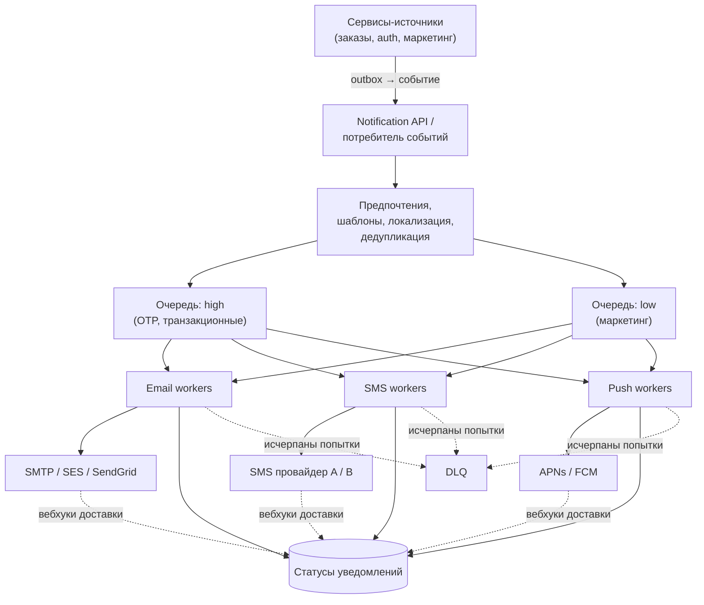
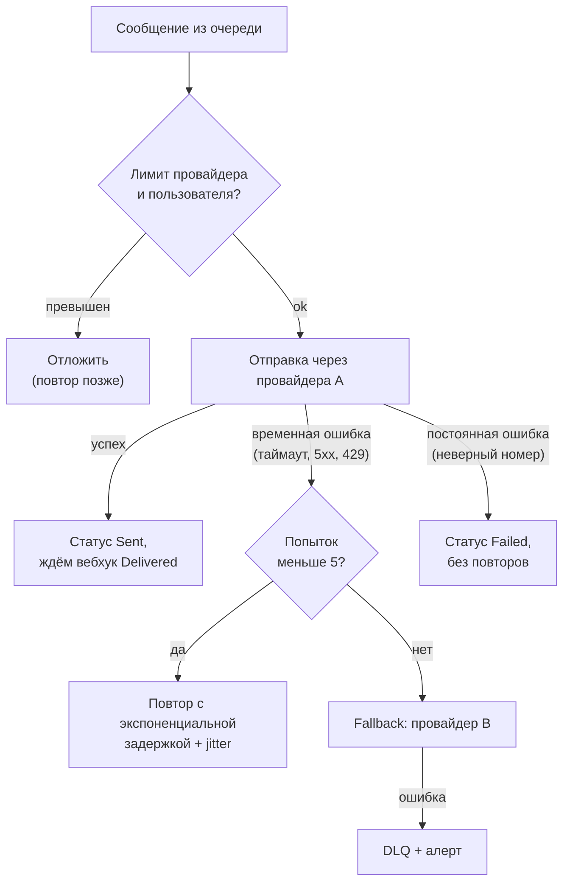

:::tldr
- Задача проверяет асинхронную архитектуру: **приём** запросов → **очередь** → **обработчики по каналам** → **внешние провайдеры** с ретраями, лимитами и отслеживанием статусов.
- Ключевые решения: **outbox** у сервисов-источников (событие не теряется), **идемпотентность** по ключу уведомления (пользователь не получает SMS дважды), **приоритеты** (код подтверждения важнее рассылки), **предпочтения пользователя** и «тихие часы», **rate limiting** провайдеров и пользователей.
- Отказы провайдеров — норма: ретраи с экспоненциальной задержкой, **fallback** на второго провайдера, **DLQ** для исчерпавших попытки, circuit breaker.
- Наблюдаемость: статус каждого уведомления (создано → отправлено → доставлено/ошибка), метрики по каналам и провайдерам, вебхуки о доставке.
:::

## 1. Требования

- Каналы: email, SMS, push (iOS/Android), in-app.
- Типы: **транзакционные** (код подтверждения, статус заказа — срочно, обязательно) и **маркетинговые** (рассылки — можно задержать, нужна отписка).
- Объём: 50 млн уведомлений в день, пики в 10 раз (распродажа, массовая рассылка).
- Код подтверждения — доставка за секунды; рассылка — за часы допустимо.
- Уважать предпочтения пользователя (отписка, каналы, тихие часы), не дублировать.

## 2. Оценки

```text
50 млн / сутки ≈ 580/с в среднем, пик ≈ 6 000/с
SMS-провайдер: лимит, например, 100 SMS/с на аккаунт → нужны очереди и несколько провайдеров
Хранение статусов: 50 млн × 1 КБ ≈ 50 ГБ/сутки → хранить 30–90 дней, партиции по дате
```

## 3. Архитектура



## 4. Приём и дедупликация

```csharp Обработка запроса на уведомление
public async Task HandleAsync(NotificationRequested e, CancellationToken ct)
{
    // идемпотентность: тот же ключ от источника — не создаём повторно
    var inserted = await db.Database.ExecuteSqlAsync($"""
        INSERT INTO notifications (id, idempotency_key, user_id, type, status, created_at)
        VALUES ({Guid.NewGuid()}, {e.IdempotencyKey}, {e.UserId}, {e.Type}, 'Pending', now())
        ON CONFLICT (idempotency_key) DO NOTHING
        """, ct);
    if (inserted == 0) return;

    var prefs = await preferences.GetAsync(e.UserId, ct);
    var channels = router.SelectChannels(e.Type, prefs);          // отписки, тихие часы, доступные каналы
    foreach (var ch in channels)
        await bus.Publish(new SendNotification(e.IdempotencyKey, e.UserId, ch, e.TemplateId, e.Data),
            ctx => ctx.SetPriority(e.IsTransactional ? 9 : 1), ct);
}
```

Ключ идемпотентности формирует **источник** из бизнес-смысла: `order-42-shipped`, `otp-<requestId>` — повтор события не создаёт второе уведомление.

## 5. Отправка, ретраи и fallback



- Различайте **временные** (повторять) и **постоянные** (не повторять) ошибки.
- Перед отправкой — проверка, не отправлено ли уже (статус в БД) — защита от повторной доставки сообщения брокером (at-least-once).
- Код подтверждения с истёкшим сроком действия **не отправлять** — проверять TTL перед отправкой.

## 6. Приоритеты и справедливость

- Отдельные очереди (или приоритеты сообщений) для транзакционных и маркетинговых: массовая рассылка на 10 млн не должна задерживать OTP.
- Маркетинг — с ограничением скорости (throttling), распределением по времени и учётом часовых поясов.
- Лимиты на пользователя: не более N уведомлений в час (кроме критичных), агрегация («у вас 5 новых сообщений» вместо пяти пушей).

## 7. Шаблоны и локализация

```text
Шаблон order_shipped (uz, ru, en) + данные { orderId, trackingUrl }
→ рендеринг на стороне сервиса уведомлений (Scriban/Razor/Fluid)
→ версия шаблона сохраняется вместе с уведомлением (для аудита)
```

## 8. Статусы и наблюдаемость

| Статус | Значение |
|---|---|
| Pending | Создано, ждёт отправки |
| Sent | Принято провайдером |
| Delivered | Подтверждено вебхуком провайдера |
| Opened / Clicked | Для email/push, если отслеживается |
| Failed | Постоянная ошибка или исчерпаны попытки |
| Suppressed | Не отправлено из-за предпочтений/лимитов |

Метрики: скорость отправки и задержка по каналам и приоритетам, доля ошибок по провайдерам, глубина очередей, размер DLQ, время доставки OTP (p99). Алерт: OTP доставляются дольше 30 секунд.

## 9. Отказы

| Сценарий | Поведение |
|---|---|
| Провайдер недоступен | Circuit breaker, переключение на резервного, накопление в очереди |
| Пик рассылки | Очередь поглощает, workers масштабируются по длине очереди (KEDA), транзакционные — отдельно |
| Падение воркера во время отправки | Сообщение возвращается в очередь, проверка статуса предотвращает дубль (с небольшой вероятностью дубль возможен — at-least-once) |
| Ошибка в шаблоне | Валидация шаблона при публикации, Failed + алерт, не блокировать остальные |

## Вопросы на засыпку

:::qa Можно ли гарантировать отправку ровно одного SMS?
Строго — нет: если провайдер принял запрос, а ответ потерялся, неизвестно, ушло ли сообщение. Приближения: идемпотентные ключи на стороне провайдера (если поддерживаются), проверка статуса у провайдера перед повтором, хранение статуса до вызова. Для OTP повтор допустим (код тот же), для платёжных уведомлений важнее не потерять.
:::

:::qa Почему не отправлять уведомление прямо из сервиса заказов?
Вызов внешнего провайдера в транзакции заказа делает оформление зависимым от SMS-провайдера (задержки, отказы), а повторы сложно контролировать. Асинхронная отдельная система изолирует отказы, централизует предпочтения, лимиты, шаблоны и статусы.
:::

:::qa Как учитывать «тихие часы» пользователя?
Хранить часовой пояс и предпочтения; при попадании маркетингового уведомления в тихий период — откладывать до разрешённого времени (отложенные сообщения/scheduled delivery), транзакционные критичные — отправлять сразу.
:::

:::qa Как масштабировать отправку push на 10 млн устройств?
Разбить аудиторию на пачки (сегменты по 1000 токенов), использовать пакетные API провайдеров (FCM multicast), масштабировать воркеры по длине очереди, обрабатывать ответы о недействительных токенах и удалять их, распределять рассылку во времени.
:::

## Итог

Система уведомлений — асинхронный конвейер: события с идемпотентными ключами, обогащение предпочтениями и шаблонами, раздельные очереди по приоритету, воркеры по каналам с лимитами, ретраями, fallback-провайдерами и DLQ, и хранилище статусов с вебхуками доставки. Главное — не терять важное, не дублировать и не позволять массовым рассылкам задерживать критичные уведомления.
