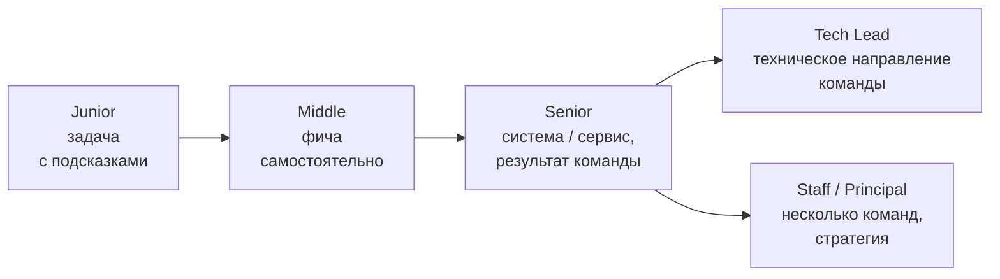
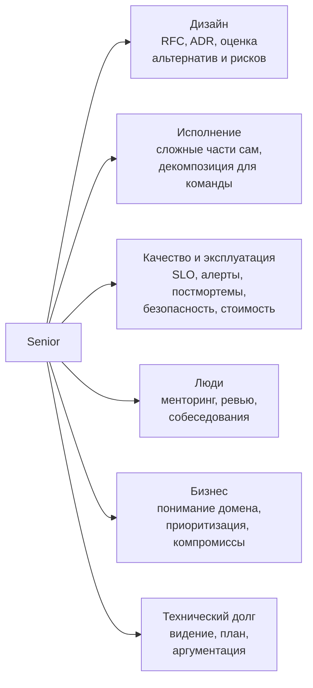
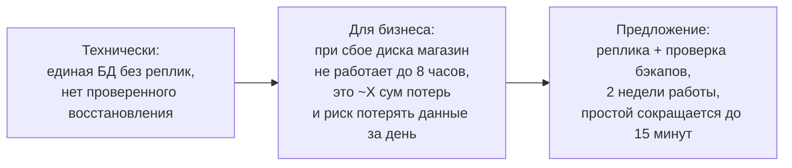

:::tldr
- Разница не в количестве известных технологий, а в **масштабе ответственности и влияния**: Middle самостоятельно решает поставленные задачи; Senior **определяет, какие задачи решать**, отвечает за результат на уровне системы/команды и делает команду сильнее.
- Senior работает с **неопределённостью**: из размытой бизнес-проблемы формирует техническое решение, оценивает риски, разбивает на этапы, договаривается со смежными командами.
- **Мультипликатор**: ревью, менторинг, документирование решений (ADR/RFC), инструменты и стандарты, которые ускоряют всю команду, — важнее собственного объёма кода.
- **Ответственность за эксплуатацию**: надёжность, наблюдаемость, безопасность, стоимость инфраструктуры, технический долг — не «после релиза», а часть дизайна.
- **Коммуникация**: объяснять технические компромиссы бизнесу на языке денег, сроков и рисков; говорить «нет» и предлагать альтернативы; признавать ошибки и неопределённость.
:::

## Уровни: что меняется

| Аспект | Junior | Middle | Senior |
|---|---|---|---|
| Задачи | Чётко поставленные, с помощью | Фичи целиком, самостоятельно | Неясные проблемы → план и решение |
| Решения | Как написать код | Как реализовать фичу | Какой подход выбрать для системы, что **не** делать |
| Качество | Работает | Протестировано, читаемо | Надёжно в эксплуатации, наблюдаемо, безопасно, поддерживаемо |
| Влияние | Свои задачи | Свои фичи и ревью | Команда и смежные команды |
| Неопределённость | Просит уточнений | Уточняет сам | Работает с ней: гипотезы, прототипы, этапы |
| Ошибки | Учится на них | Исправляет свои | Строит систему, где ошибки ловятся раньше |
| Коммуникация | С ментором | С командой | С бизнесом, другими командами, руководством |

## Чем занимается Senior

### Пример: как Middle и Senior решают одну задачу

Задача: «Отчёт по продажам долго грузится, ускорьте».

- **Middle**: профилирует запрос, добавляет индекс, переписывает запрос с проекцией — отчёт грузится за 2 секунды вместо 30. Хорошая работа.
- **Senior** делает то же или делегирует, но дополнительно спрашивает: кто и как пользуется отчётом? Выясняет, что 20 менеджеров открывают его утром одновременно и нагружают основную БД, мешая покупателям. Предлагает переносить отчёт на реплику и предвычислять ночью, договаривается с аналитиками о допустимой задержке данных, добавляет метрику времени отчёта и алерт, пишет ADR о разделении аналитической и транзакционной нагрузки, — и следующий отчёт команда делает уже по этому шаблону.

## Техническое лидерство без формальной власти

- **Влиять через аргументы и данные**, а не через должность: прототипы, замеры, сравнение вариантов в RFC.
- **Делать решения явными**: ADR, гайдлайны, шаблоны проектов, архитектурные тесты — чтобы правильный путь был самым простым.
- **Делегировать** интересные задачи с поддержкой, а не забирать всё сложное себе: bus factor и рост команды важнее личной скорости.
- **Disagree and commit**: высказать несогласие с аргументами, а после решения — поддерживать его.
- **Защищать фокус команды**: помогать менеджменту приоритизировать, говорить «нет» лишнему, предлагая альтернативы.

## Коммуникация с бизнесом

Структура: проблема в цифрах → риск → варианты с ценой → рекомендация → как измерим результат.

## Типичные ловушки на пути к Senior

:::warning Чего избегать
- **Герой**: решает все пожары сам, становится незаменимым — команда не растёт, сам выгорает.
- **Архитектор в башне**: проектирует идеальные системы, не участвуя в реализации и эксплуатации.
- **Технологии ради технологий**: Kafka и микросервисы там, где хватило бы монолита и таблицы-очереди.
- **Перфекционизм**: блокирует релизы ради идеального кода; не различает обратимые и необратимые решения.
- **Молчаливое несогласие**: видит риск, но не озвучивает его или озвучивает слишком поздно.
:::

## Как показать уровень Senior на собеседовании

- Рассказывать о проектах в формате **STAR** (ситуация, задача, действия, результат) с **цифрами** и **своей ролью**: «я предложил», «я договорился», «мы снизили p99 с 800 до 120 мс».
- Говорить о **компромиссах и ошибках**: что не сработало, что бы сделали иначе.
- Показывать мышление об **эксплуатации**: как узнали о проблеме, как мониторили, как откатывали.
- В system design — вести разговор, уточнять требования, называть недостатки решений.
- Спрашивать интервьюера о процессах, техническом долге, ожиданиях от роли — это тоже сигнал зрелости.

## Вопросы на засыпку

:::qa Чем Senior отличается от Tech Lead?
Senior — уровень инженерной зрелости (глубина, самостоятельность, влияние). Tech Lead — роль: ответственность за техническое направление конкретной команды (архитектура, качество, планирование технической работы, координация). Tech Lead обычно Senior или выше, но не каждый Senior — тимлид; часть Senior-инженеров растёт в глубину (Staff/Principal) без управления людьми.
:::

:::qa Должен ли Senior писать меньше кода?
Обычно пишет меньше «рядового» кода, но больше критичного: сложные части, прототипы, инфраструктурные компоненты, шаблоны для команды. Полный уход от кода быстро снижает качество технических решений — важно оставаться в контакте с кодовой базой.
:::

:::qa Как Senior принимает решения при неопределённости?
Отделяет обратимые решения (принимать быстро, экспериментировать) от необратимых (исследовать, прототипировать, обсуждать), формулирует гипотезы и критерии успеха, разбивает работу на этапы с проверкой предположений, явно фиксирует допущения и риски, пересматривает решения при новых данных.
:::

:::qa Как измерить влияние Senior-инженера?
По результатам команды и системы: скорость поставки, надёжность (SLO, инциденты), качество решений (сколько из них пришлось переделывать), рост людей вокруг (кто стал самостоятельнее), устранённые классы проблем (а не отдельные баги), принятые командой стандарты и инструменты.
:::

## Итог

Senior отличается масштабом ответственности: он превращает размытые проблемы в технические решения, отвечает за систему в эксплуатации, а не только за код, и усиливает команду через ревью, менторинг, документирование решений и стандарты. Он говорит с бизнесом на языке рисков и денег, работает с неопределённостью, различает обратимые и необратимые решения и ведёт за собой аргументами, а не должностью.
