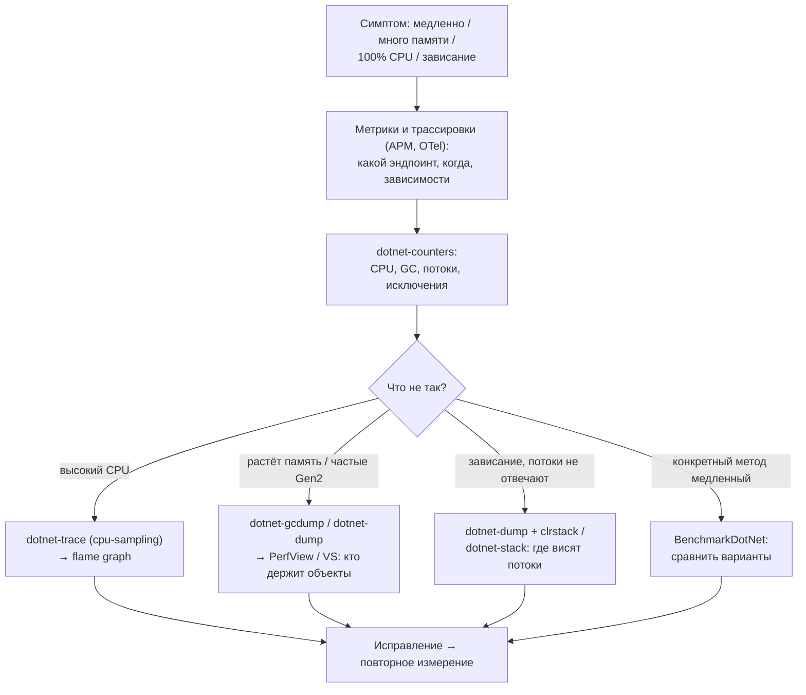
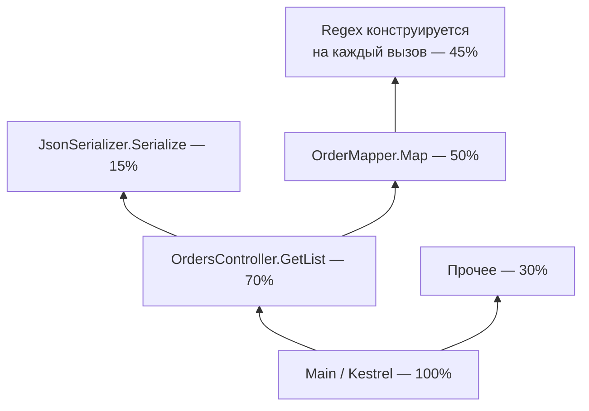

:::tldr
- **Правило №1: сначала измерь**. Интуиция о «медленном месте» ошибается чаще, чем кажется.
- **dotnet-counters** — метрики в реальном времени (CPU, GC, потоки пула, исключения, запросы/с) — первый взгляд «что вообще происходит».
- **dotnet-trace** — сбор трассировки (CPU-сэмплирование, события GC, аллокации, contention) в файл `.nettrace` → анализ в **PerfView**, Visual Studio, **speedscope** (flame graph).
- **dotnet-dump** / **dotnet-gcdump** — снимок памяти процесса / кучи для поиска утечек и зависаний (`dumpheap -stat`, `gcroot`, `clrstack`).
- **PerfView** — мощный бесплатный анализатор от Microsoft: CPU stacks, GC stats, аллокации, сравнение снимков кучи.
- **BenchmarkDotNet** — **микробенчмарки**: прогрев, множество итераций, статистика, `[MemoryDiagnoser]` для аллокаций. Для сравнения реализаций, а не для профилирования всего приложения.
- В продакшене — постоянная **наблюдаемость** (OpenTelemetry, APM), а профилировщики — для точечного расследования; инструменты работают в Linux-контейнерах без перезапуска.
:::

## Процесс расследования



## Инструменты .NET diagnostics

```bash
dotnet tool install -g dotnet-counters
dotnet tool install -g dotnet-trace
dotnet tool install -g dotnet-dump
dotnet tool install -g dotnet-gcdump
dotnet tool install -g dotnet-stack

dotnet-counters ps                           # список .NET-процессов
```

### dotnet-counters

```bash
dotnet-counters monitor -p 1234 --counters System.Runtime,Microsoft.AspNetCore.Hosting
```

```text Что смотреть
[System.Runtime]
    CPU Usage (%)                                  87
    GC Heap Size (MB)                           1 420     ← растёт без остановки? утечка
    Gen 0 GC Count (Count / 1 sec)                 45
    Gen 2 GC Count (Count / 1 sec)                  3     ← частые Gen2 — дорого
    % Time in GC since last GC (%)                 22     ← > 10–20% — много аллокаций
    Allocation Rate (B / 1 sec)               850 MB
    ThreadPool Thread Count                       180     ← растёт — возможно, starvation
    ThreadPool Queue Length                       950     ← работа ждёт потоков
    Monitor Lock Contention Count (/ 1 sec)       300     ← конкуренция за lock
    Exception Count (Count / 1 sec)               120     ← исключения как поток управления?
[Microsoft.AspNetCore.Hosting]
    Requests / sec                              2 300
    Current Requests                              410
```

### dotnet-trace

```bash
# CPU-профиль на 30 секунд
dotnet-trace collect -p 1234 --profile cpu-sampling --duration 00:00:30 -o cpu.nettrace

# Конвертация для speedscope.app (flame graph в браузере)
dotnet-trace convert cpu.nettrace --format Speedscope

# Аллокации и GC
dotnet-trace collect -p 1234 --profile gc-verbose
```

**Flame graph**: ширина «пламени» — доля времени CPU в функции (включая вызываемые). Ищите самые широкие «плато» вверху стека — там тратится время.



### dotnet-dump и dotnet-gcdump

```bash
dotnet-gcdump collect -p 1234 -o heap.gcdump        # только управляемая куча, быстро, файл небольшой
dotnet-dump collect -p 1234 -o full.dmp             # полный дамп процесса

dotnet-dump analyze full.dmp
> dumpheap -stat                                     # какие типы занимают память
> dumpheap -type Shop.Orders.OrderDto -min 1000     # экземпляры
> gcroot 00007f1a2b3c4d50                            # кто удерживает объект (путь до корня)
> clrthreads                                         # управляемые потоки
> clrstack -all                                      # стеки всех потоков — где зависли
> syncblk                                            # кто владеет блокировками
```

Дамп также можно снять автоматически при сбое: `DOTNET_DbgEnableMiniDump=1`, или по порогу через `dotnet-monitor`.

### dotnet-monitor

Сайдкар/агент, предоставляющий HTTP API для сбора трассировок, дампов, метрик и логов из контейнеров по запросу или по триггерам (например, «CPU > 80% в течение минуты → снять трассировку»). Удобен в Kubernetes.

## PerfView

Бесплатный инструмент Microsoft (Windows GUI, но анализирует и трассировки с Linux):
- **CPU Stacks** — где тратится CPU, группировка, фильтры.
- **GC Stats** — паузы, частота, размеры поколений, причины сборок.
- **GC Heap Alloc Stacks** — кто аллоцирует.
- **Heap Snapshots** + **Diff** — сравнение двух снимков кучи: что выросло (поиск утечек).
- **Wall Clock / Thread Time** — время ожидания (I/O, блокировки), а не только CPU.

## BenchmarkDotNet

```csharp
[MemoryDiagnoser]                        // аллокации и сборки GC
[SimpleJob(RuntimeMoniker.Net90)]
public class ParsingBenchmarks
{
    private const string Input = "2025-09-30";

    [Benchmark(Baseline = true)]
    public int Substring() => int.Parse(Input.Substring(0, 4)) + int.Parse(Input.Substring(5, 2));

    [Benchmark]
    public int Span() => int.Parse(Input.AsSpan(0, 4)) + int.Parse(Input.AsSpan(5, 2));
}

// Program.cs
BenchmarkRunner.Run<ParsingBenchmarks>();
// dotnet run -c Release
```

```text Результат
| Method    | Mean      | Ratio | Gen0   | Allocated | Alloc Ratio |
|---------- |----------:|------:|-------:|----------:|------------:|
| Substring | 38.12 ns  |  1.00 | 0.0076 |      64 B |        1.00 |
| Span      | 19.45 ns  |  0.51 |      - |         - |        0.00 |
```

Почему не `Stopwatch` в цикле:
- JIT: Tier-0 / Tier-1, прогрев, OSR — первые вызовы медленнее.
- Оптимизации: мёртвый код может быть удалён, если результат не используется.
- Шум: GC, другие процессы, частота CPU — нужна статистика по многим итерациям.
BenchmarkDotNet решает всё это: отдельный процесс, прогрев, пилотные прогоны, выбросы, доверительные интервалы.

:::warning Бенчмарки — только в Release
Debug-сборка отключает оптимизации JIT — результаты бессмысленны. BenchmarkDotNet предупредит об этом. И помните: микробенчмарк показывает стоимость операции в изоляции — важна ли она для приложения, покажет только профилирование реальной нагрузки.
:::

## Другие инструменты

| Инструмент | Для чего |
|---|---|
| Visual Studio Diagnostic Tools / Performance Profiler | CPU, память, async, БД — в IDE |
| JetBrains dotTrace / dotMemory | Коммерческие профилировщики CPU и памяти с удобным UI |
| Application Insights Profiler, Datadog, Pyroscope | Непрерывное профилирование в продакшене |
| OpenTelemetry + Jaeger/Tempo | Где время тратится между сервисами |
| MiniProfiler | Время SQL и шагов на странице |
| k6, NBomber, JMeter | Нагрузочное тестирование (воспроизвести проблему) |

## Вопросы на засыпку

:::qa Чем сэмплирующий профилировщик отличается от инструментирующего?
Сэмплирующий периодически (≈1 мс) снимает стеки потоков — низкие накладные расходы, подходит для продакшена, но статистический. Инструментирующий вставляет замеры в каждый вызов — точные счётчики вызовов, но сильно замедляет и искажает картину. `dotnet-trace cpu-sampling` — сэмплирующий.
:::

:::qa Как профилировать приложение в Docker/Kubernetes?
Установить инструменты в образ (или использовать отдельный debug-контейнер с общим `/tmp` и PID namespace — `kubectl debug`), либо `dotnet-monitor` как сайдкар. Диагностический IPC работает через Unix-сокет в `/tmp`. Файлы трассировок копировать `kubectl cp` и анализировать локально.
:::

:::qa Что такое Wall Clock vs CPU time?
CPU time — время, когда поток реально исполнял инструкции. Wall clock — полное время, включая ожидание I/O, блокировок, сна. Если запрос долгий, а CPU низкий — ищите ожидание (БД, HTTP, lock contention), а не «медленный код».
:::

:::qa Как найти, кто аллоцирует больше всего?
`dotnet-trace --profile gc-verbose` (события AllocationTick) → PerfView «GC Heap Alloc Stacks» или VS/dotMemory allocation view. В бенчмарках — `[MemoryDiagnoser]`. В счётчиках — `Allocation Rate`.
:::

## Итог

Профилирование — последовательность: метрики (dotnet-counters, APM) показывают, **что** не так, трассировки (dotnet-trace + flame graph/PerfView) — **где** тратится CPU, дампы (dotnet-gcdump/dump) — **кто** держит память и где висят потоки, BenchmarkDotNet — **какой вариант** реализации быстрее. Измеряйте до и после каждого изменения.
