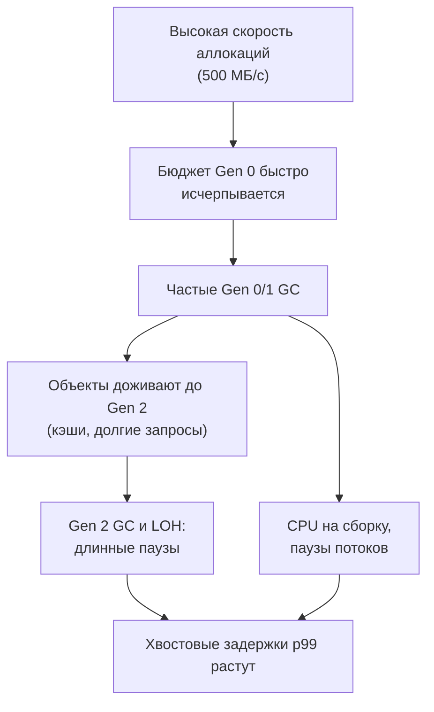
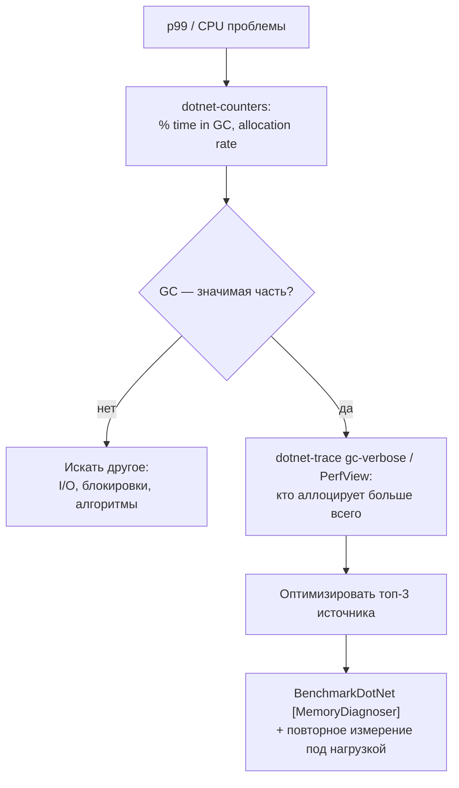

:::tldr
- **GC-пауза** — время, когда сборщик **приостанавливает** управляемые потоки (фазы пометки и уплотнения). Эфемерные сборки (Gen 0/1) — доли–единицы мс; **Gen 2 / LOH** — десятки–сотни мс. Для API это напрямую **хвостовые задержки** (p99).
- Частота сборок пропорциональна **скорости аллокаций**; стоимость — объёму **выживших** объектов. Меньше аллокаций → реже GC → меньше пауз и CPU на сборку.
- Главные источники лишних аллокаций: строки (конкатенация, `Substring`, `ToString`, форматирование), LINQ в горячих путях (итераторы, замыкания), boxing, `params object[]`, большие временные массивы (LOH), `async`-методы (state machine при реальной приостановке), лишние `ToList()`.
- Приёмы: `Span<T>`/`ReadOnlySpan<char>`, `ArrayPool`/`RecyclableMemoryStream`, `StringBuilder` и `string.Create`, кэширование (`static readonly`, `FrozenDictionary`), `struct`/`readonly struct`, `ValueTask`, `[LoggerMessage]`, пулинг объектов (`ObjectPool<T>`), `static`-лямбды, предварительный размер коллекций.
- Настройки GC: **Server GC** (throughput), **Concurrent/Background** (меньше пауз Gen 2), **DATAS** (.NET 8+ для контейнеров), `GCHeapHardLimit`, режим `SustainedLowLatency`. Но **первое — уменьшить аллокации**.
:::

## Как аллокации превращаются в паузы



```bash Как увидеть
dotnet-counters monitor -p <pid> --counters System.Runtime
# % Time in GC, Allocation Rate, Gen 0/1/2 GC Count, GC Pause Time (.NET 8+ счётчик)
```

Метрики OpenTelemetry (`dotnet.gc.pause.time`, `dotnet.gc.collections`) в Grafana позволяют связать всплески p99 с Gen 2 сборками.

## Главные источники аллокаций и замены

### Строки

```csharp
// Плохо: новая строка на каждой итерации
string csv = "";
foreach (var item in items) csv += item.Id + ",";

// Хорошо
var sb = new StringBuilder(items.Count * 8);
foreach (var item in items) sb.Append(item.Id).Append(',');
var csv2 = string.Join(',', items.Select(i => i.Id));     // тоже нормально

// Разбор без Substring
ReadOnlySpan<char> line = "2025-09-30;42;paid";
int sep = line.IndexOf(';');
var date = DateOnly.Parse(line[..sep]);                    // без промежуточной строки

// Сравнение без ToLower() (аллокация новой строки)
bool eq = string.Equals(a, b, StringComparison.OrdinalIgnoreCase);

// Интерполяция в C# 10+ не боксит и использует пул буферов
logger.LogInformation("Order {Id}", id);                  // лучше — шаблоны логов, а не интерполяция
```

### LINQ и замыкания в горячих путях

```csharp
// Каждый вызов: итераторы Where/Select + замыкание (захват threshold) + List
public List<int> Hot(List<Order> orders, decimal threshold) =>
    orders.Where(o => o.Total > threshold).Select(o => o.Id).ToList();

// Горячий путь (миллионы вызовов): цикл с заранее заданной ёмкостью
public List<int> Hot2(List<Order> orders, decimal threshold)
{
    var result = new List<int>(orders.Count);
    foreach (var o in orders)                     // foreach по List<T> — struct-энумератор, без аллокации
        if (o.Total > threshold) result.Add(o.Id);
    return result;
}
```

LINQ в обычном коде — нормально и читаемо; оптимизировать стоит только измеренные горячие места. (В .NET 8–10 многие LINQ-операции существенно оптимизированы.)

### Boxing

```csharp
object o = 42;                                          // boxing
var list = new ArrayList { 1, 2, 3 };                   // boxing каждого
Dictionary<MyStruct, int> dict;                         // struct без IEquatable<T> → Equals(object) → boxing
string.Format("{0}", 42);                                // params object[] + boxing

// Решения: generic-коллекции, IEquatable<T> на struct, generic-методы с ограничениями
public readonly record struct Key(int A, int B);        // record struct реализует IEquatable<T>
```

### Большие буферы → LOH

```csharp
// Плохо: 1 МБ на каждый запрос → LOH → Gen 2 сборки
var buffer = new byte[1024 * 1024];

// Хорошо
var rented = ArrayPool<byte>.Shared.Rent(1024 * 1024);
try { /* ... */ } finally { ArrayPool<byte>.Shared.Return(rented); }

// MemoryStream → RecyclableMemoryStream
private static readonly RecyclableMemoryStreamManager Streams = new();
await using var ms = Streams.GetStream();
```

### Кэширование неизменяемого

```csharp
// Плохо: новые объекты на каждый вызов
var options = new JsonSerializerOptions { PropertyNamingPolicy = JsonNamingPolicy.CamelCase };   // ещё и сбрасывает кэш метаданных!
var regex = new Regex(@"^\d+$");

// Хорошо
private static readonly JsonSerializerOptions JsonOptions = new() { PropertyNamingPolicy = JsonNamingPolicy.CamelCase };
[GeneratedRegex(@"^\d+$")] private static partial Regex Digits();
private static readonly FrozenSet<string> AllowedCurrencies = new[] { "UZS", "USD" }.ToFrozenSet();
```

### Пулинг объектов

```csharp
builder.Services.AddSingleton<ObjectPoolProvider, DefaultObjectPoolProvider>();
builder.Services.AddSingleton(sp => sp.GetRequiredService<ObjectPoolProvider>().CreateStringBuilderPool());

public string Render(ObjectPool<StringBuilder> pool, Order o)
{
    var sb = pool.Get();
    try { return sb.Append("Order ").Append(o.Id).ToString(); }
    finally { pool.Return(sb); }
}
```

## Сводная таблица

| Источник | Замена |
|---|---|
| `+` в цикле для строк | `StringBuilder`, `string.Join`, `string.Create` |
| `Substring`, `Split` для разбора | `Span`, `MemoryExtensions.Split` (.NET 8), `IndexOf` |
| `ToLower()` для сравнения | `StringComparison.OrdinalIgnoreCase` |
| LINQ + лямбды с захватом в горячем цикле | `foreach`, `static`-лямбды, предвычисление |
| `new byte[]` больших размеров | `ArrayPool`, `RecyclableMemoryStream`, Pipelines |
| Boxing value types | Generics, `IEquatable<T>`, record struct |
| `new JsonSerializerOptions()` / `new Regex()` на вызов | `static readonly`, source generators |
| Логи с интерполяцией | `[LoggerMessage]`, шаблоны |
| `Task<T>` для часто синхронных результатов | `ValueTask<T>` |
| Коллекции без ёмкости | `new List<T>(capacity)`, `EnsureCapacity` |
| Лишние `ToList()`/`ToArray()` | Стриминг, `IEnumerable`, `CollectionsMarshal.AsSpan` |

## Настройки GC

```xml
<PropertyGroup>
  <ServerGarbageCollector>true</ServerGarbageCollector>          <!-- по умолчанию для ASP.NET Core -->
  <ConcurrentGarbageCollection>true</ConcurrentGarbageCollection> <!-- фоновая Gen 2 -->
  <GarbageCollectionAdaptationMode>1</GarbageCollectionAdaptationMode>  <!-- DATAS: подстройка числа куч (по умолчанию в .NET 9) -->
</PropertyGroup>
```

```csharp Временный режим низкой задержки для критичной секции
var old = GCSettings.LatencyMode;
GCSettings.LatencyMode = GCLatencyMode.SustainedLowLatency;   // избегать блокирующих Gen 2, пока возможно
try { RunLatencySensitiveWork(); }
finally { GCSettings.LatencyMode = old; }
```

Также `GC.TryStartNoGCRegion(size)` — выполнить участок без сборок (если аллокации укладываются в бюджет) — для очень специфичных сценариев.

## Как подходить к оптимизации



## Вопросы на засыпку

:::qa Почему короткоживущие объекты «дешёвые», а долгоживущие — «дорогие»?
Аллокация в .NET — сдвиг указателя, очень быстро. Сборка Gen 0 обходит только живые объекты; если почти всё умерло — сборка тривиальна. Дорого, когда объекты **выживают**: их копируют при уплотнении, продвигают в старшие поколения, и в итоге нужны дорогие Gen 2 сборки. Особенно вредны объекты «среднего» времени жизни (кэши с TTL в минуты, долгие запросы).
:::

:::qa Создаёт ли async-метод аллокации?
Если метод завершился синхронно (без реальной приостановки), state machine остаётся на стеке — аллокаций нет (кроме `Task<T>` результата; для частых значений кэшируется, либо используйте `ValueTask`). При первой реальной приостановке state machine упаковывается в кучу.
:::

:::qa Помогает ли GC.Collect() уменьшить паузы?
Нет — наоборот: он запускает полную блокирующую сборку в произвольный момент и продвигает живые объекты в старшие поколения. Исключения — очень специфичные сценарии (после загрузки огромного разового набора данных, в тестах).
:::

:::qa Что такое DATAS?
Dynamic Adaptation To Application Sizes (.NET 8+, по умолчанию в .NET 9 для Server GC): GC динамически меняет число куч и бюджеты в зависимости от нагрузки. В контейнерах с небольшими лимитами памяти снижает потребление, сохраняя пропускную способность Server GC.
:::

## Итог

GC-паузы — прямое следствие скорости аллокаций и числа выживающих объектов. Измеряйте `% time in GC` и allocation rate, находите главные источники аллокаций профилировщиком и заменяйте их: `Span`, пулы, кэширование неизменяемого, отсутствие boxing и лишних коллекций. Настройки GC — вторичный рычаг после уменьшения аллокаций в горячих путях.
