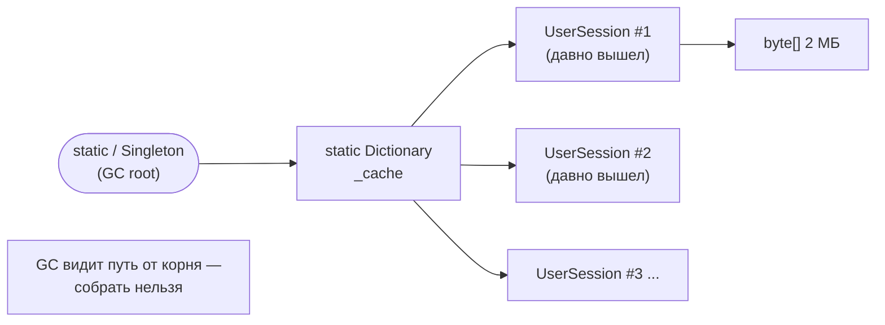
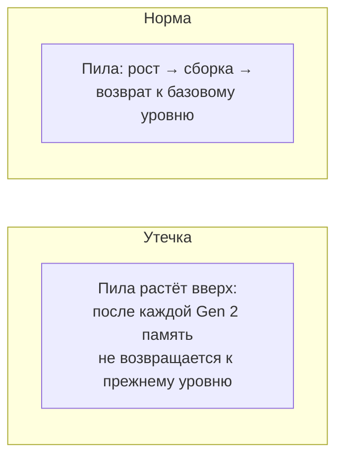
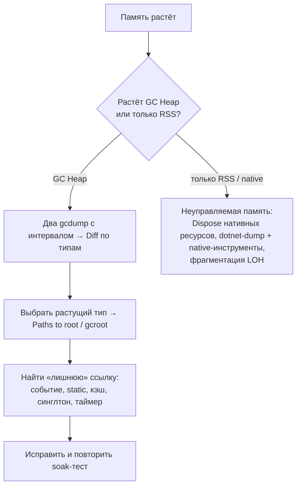

:::tldr
- В .NET утечка — это объекты, которые **больше не нужны, но остаются достижимыми** от корней GC (статик, синглтон, живой поток, таймер), поэтому GC не может их собрать. Плюс утечки **неуправляемых** ресурсов без `Dispose`.
- Типичные причины: **подписки на события** долгоживущих объектов без отписки; **статические/синглтон-коллекции и кэши** без вытеснения; **captive dependencies** в DI; незакрытые **таймеры** (`System.Threading.Timer` держит колбэк); **замыкания**, захватившие большие объекты; `IDisposable` без `Dispose` (потоки, соединения, `CancellationTokenSource` с регистрациями); **`IOptionsMonitor.OnChange`** без отписки; неограниченные **Channels**/очереди; `AsyncLocal`/`ThreadLocal` с большими объектами; фрагментация **LOH**; нативная память (SkiaSharp, сжатие, P/Invoke).
- Признаки: `GC Heap Size` растёт между сборками Gen 2 и не возвращается; частые Gen 2; OOMKilled в Kubernetes.
- Поиск: снять **два снимка кучи** (`dotnet-gcdump`) с интервалом → **сравнить** по типам (PerfView/VS/dotMemory) → для растущего типа найти **путь до корня** (`gcroot`) → исправить ссылку.
:::

## Что такое утечка в управляемом мире



GC собирает только **недостижимые** объекты. Любая «забытая» ссылка из долгоживущего места продлевает жизнь объекту и всему, на что он ссылается.

## Типичные причины

### 1. События

```csharp
public sealed class PriceWidget
{
    public PriceWidget(PriceFeed feed) => feed.PriceChanged += OnPriceChanged;   // feed — синглтон
    private void OnPriceChanged(object? s, decimal p) { }
    // нет отписки → каждый созданный виджет живёт вечно
}
```

Решение: `IDisposable` + `-=`, слабые события, `IObservable` с `IDisposable`-подпиской.

### 2. Кэши без ограничений

```csharp
public sealed class ReportCache                    // Singleton
{
    private readonly ConcurrentDictionary<string, Report> _cache = new();
    public Report Get(string key) => _cache.GetOrAdd(key, Build);   // ключ содержит дату/параметры → бесконечный рост
}
```

Решение: `IMemoryCache` с `SizeLimit` и TTL, `HybridCache`, LRU-кэш, ограничение числа ключей.

### 3. Captive dependency

Scoped `DbContext` внутри синглтона: Change Tracker копит все загруженные сущности всё время работы приложения.

### 4. Таймеры

```csharp
public class Poller
{
    private readonly Timer _timer;
    public Poller() => _timer = new Timer(_ => Poll(), null, 0, 1000);   // таймер держит this через делегат
    // без Dispose таймер (и Poller) живут, пока таймер активен
}
```

### 5. HttpClient и соединения

```csharp
// Утечка сокетов/хэндлеров и исчерпание портов (TIME_WAIT)
public async Task<string> Get(string url) { using var client = new HttpClient(); return await client.GetStringAsync(url); }
// Решение: IHttpClientFactory / один статический HttpClient с PooledConnectionLifetime
```

### 6. CancellationTokenSource и регистрации

```csharp
var cts = CancellationTokenSource.CreateLinkedTokenSource(appStoppingToken);   // регистрация в долгоживущем токене
// без cts.Dispose() регистрация остаётся в appStoppingToken навсегда
```

### 7. Прочее

- `IOptionsMonitor.OnChange(...)` — возвращает `IDisposable`, который нужно хранить и освобождать.
- Неограниченные `Channel.CreateUnbounded` / `ConcurrentQueue`, когда потребитель медленнее производителя.
- `AsyncLocal<T>` с большими объектами, «утекающими» в фоновые задачи через `ExecutionContext`.
- Статические списки «для отладки», логгеры-накопители в памяти.
- Динамическая генерация типов/сборок (Reflection.Emit, `XmlSerializer` с нестандартным конструктором) без выгрузки.
- Нативная память: изображения (System.Drawing, SkiaSharp), `Marshal.AllocHGlobal`, сжатие — видна не в GC Heap, а в RSS процесса.

## Как обнаружить



- Метрики: `dotnet.gc.heap.total_allocated`, `GC Heap Size`, `process.memory.working_set`, число Gen 2 сборок; графики за часы/дни.
- Kubernetes: рестарты с `OOMKilled`, рост памяти пода до лимита.
- Нагрузочный тест на длительное время (soak test) с постоянной нагрузкой — память должна стабилизироваться.

## Как найти причину

```bash
# 1. Снимок кучи в «нормальном» состоянии
dotnet-gcdump collect -p <pid> -o before.gcdump

# 2. Дать поработать под нагрузкой (утечка должна вырасти)

# 3. Второй снимок
dotnet-gcdump collect -p <pid> -o after.gcdump

# 4. Открыть оба в Visual Studio / PerfView → сравнить (Diff): какие типы выросли по количеству и размеру
```

```text dotnet-dump analyze — ручной анализ
> dumpheap -stat
      MT    Count    TotalSize Class Name
...
7f1a2b3c   184 321    58 982 720 Shop.Web.PriceWidget          ← подозрительно много
7f1a2b40   184 321   386 074 112 System.Byte[]

> dumpheap -mt 7f1a2b3c -short | head -3
00007f0c10a2b3c8
> gcroot 00007f0c10a2b3c8
HandleTable:
    ... (static) Shop.Pricing.PriceFeed._instance
    -> Shop.Pricing.PriceFeed
    -> System.EventHandler`1[[System.Decimal]]          ← делегат события
    -> System.Object[]  (invocation list)
    -> Shop.Web.PriceWidget                               ← вот кто держит
```

Путь до корня (`gcroot`, «Paths to root» в VS/dotMemory) — главный ответ на вопрос «почему не собирается».



## Профилактика

- Всё `IDisposable` — в `using`; свои классы с подписками — `IDisposable`.
- Кэши — только с ограничением размера и временем жизни.
- `ValidateScopes`/`ValidateOnBuild` — ловить captive dependencies.
- `IHttpClientFactory` вместо `new HttpClient()`.
- Долгие нагрузочные тесты перед релизом, алерты на рост памяти.
- Код-ревью: подписки, `static`-коллекции, `Timer`, `CancellationTokenSource`.

## Вопросы на засыпку

:::qa Может ли утечь память, если объект не достижим?
Управляемая — нет, GC её соберёт. Но объект мог держать неуправляемые ресурсы: без `Dispose` они освободятся только финализатором (если он есть) — позже и не гарантированно быстро. Утечка неуправляемой памяти/дескрипторов возможна при отсутствии финализатора или `SafeHandle`.
:::

:::qa Почему после пика нагрузки процесс не отдаёт память ОС?
Это не обязательно утечка: GC может сохранять выделенные сегменты для будущих аллокаций (особенно Server GC). Показатель утечки — рост **живых** объектов после полных сборок. В контейнерах помогает `GCHeapHardLimit`/DATAS, `GCConserveMemory`.
:::

:::qa Чем gcdump отличается от полного дампа?
`dotnet-gcdump` содержит только граф управляемой кучи (типы, размеры, ссылки) — маленький, безопасный (без содержимого строк и секретов в полном объёме), снимается быстро. Полный дамп (`dotnet-dump`) содержит всю память процесса — стеки потоков, значения полей, нативную память; большой и может содержать секреты.
:::

:::qa Как утечь память через AsyncLocal?
`AsyncLocal` значения копируются в `ExecutionContext` всех асинхронных продолжений и задач, запущенных из этого контекста (включая долгоживущие фоновые задачи и таймеры). Большой объект в `AsyncLocal` может жить, пока жива любая такая задача. Очищайте значения и не запускайте долгоживущие задачи с «грязным» контекстом (`ExecutionContext.SuppressFlow`).
:::

## Итог

Утечка в .NET — забытая ссылка из долгоживущего места (события, static, кэши, синглтоны, таймеры) или неосвобождённый ресурс. Находите её сравнением снимков кучи и путём до корня, предотвращайте дисциплиной `Dispose`, ограниченными кэшами, проверкой скоупов DI и длительными нагрузочными тестами.
