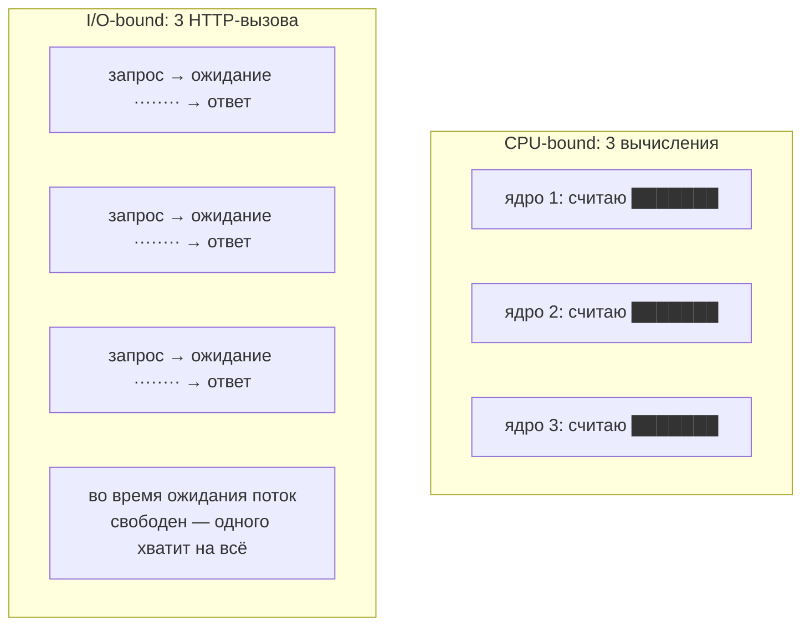
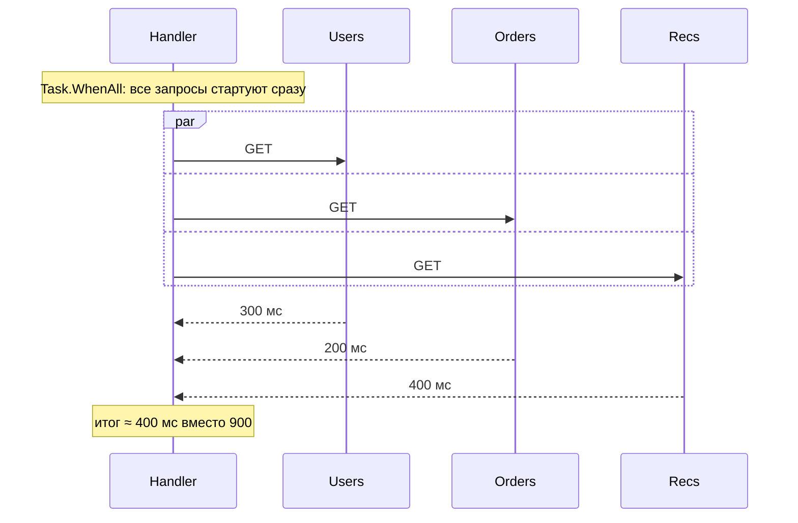
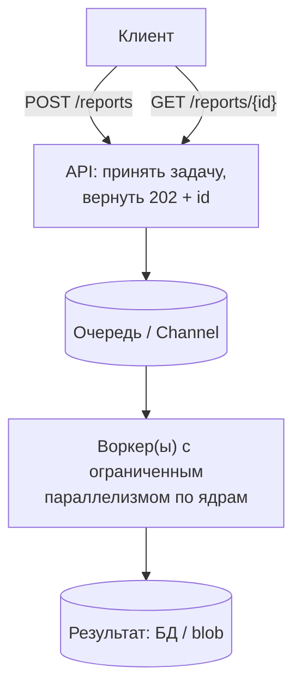
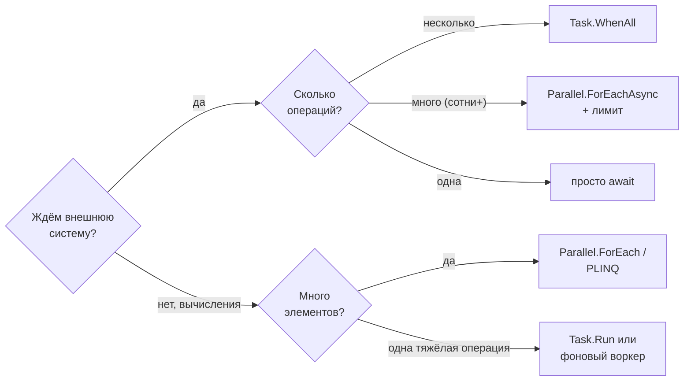

:::tldr
- **I/O-bound** — время уходит на **ожидание** внешних систем (БД, HTTP, диск, сеть). Решение — **асинхронность**: `async/await`, `Task.WhenAll` для параллельных независимых вызовов. Потоки во время ожидания **не заняты**, можно выполнять тысячи операций одновременно.
- **CPU-bound** — время уходит на **вычисления** (хэширование, сжатие, обработка изображений, парсинг, ML). Решение — **параллелизм** на ядрах: `Parallel.For/ForEach`, PLINQ, `Task.Run`. Больше, чем ядер, — не поможет.
- Ошибки: `Task.Run` вокруг I/O («фейковая асинхронность»), `Parallel.ForEach` с async-лямбдой (`async void`!), неограниченный параллелизм к внешнему сервису (перегрузка, 429), CPU-тяжёлая работа прямо в веб-запросе (голодание пула для остальных запросов).
- Для **асинхронной работы с ограничением параллельности** — `Parallel.ForEachAsync` (.NET 6) с `MaxDegreeOfParallelism` или `SemaphoreSlim`.
- В ASP.NET Core запросы и так обрабатываются параллельно; CPU-тяжёлое — в фоновые воркеры/очереди.
:::

## Разница



| | I/O-bound | CPU-bound |
|---|---|---|
| Узкое место | Ожидание сети, диска, БД | Процессорное время |
| Инструмент | `async/await`, `Task.WhenAll` | `Parallel`, PLINQ, `Task.Run` |
| Потоки во время работы | Не заняты (ожидание через ОС: IOCP/epoll) | Заняты вычислениями |
| Предел параллельности | Внешняя система (лимиты, соединения) | Число ядер |
| Ошибка | Блокировать поток ожиданием | Запускать больше потоков, чем ядер |

## I/O-bound: асинхронность и WhenAll

```csharp
// Последовательно: 300 + 200 + 400 = 900 мс
var user = await users.GetAsync(id, ct);
var orders = await ordersApi.GetForUserAsync(id, ct);
var recs = await recommendations.GetAsync(id, ct);

// Параллельно: max(300, 200, 400) = 400 мс
var userTask = users.GetAsync(id, ct);
var ordersTask = ordersApi.GetForUserAsync(id, ct);
var recsTask = recommendations.GetAsync(id, ct);
await Task.WhenAll(userTask, ordersTask, recsTask);
var profile = new Profile(await userTask, await ordersTask, await recsTask);
```



:::warning Один DbContext — не параллельно
`DbContext` не поддерживает параллельные операции. Для параллельных запросов к БД — отдельные контексты (`IDbContextFactory`) или один запрос, возвращающий всё.
:::

### Много I/O-операций с ограничением

```csharp
// 10 000 URL — нельзя отправить все одновременно (исчерпание сокетов, 429 от сервиса)
await Parallel.ForEachAsync(urls, new ParallelOptions { MaxDegreeOfParallelism = 20, CancellationToken = ct },
    async (url, token) =>
    {
        var html = await http.GetStringAsync(url, token);
        await store.SaveAsync(url, html, token);
    });
```

## CPU-bound: параллелизм на ядрах

```csharp
// Parallel.For / ForEach: делит работу между потоками пула по числу ядер
Parallel.ForEach(images, new ParallelOptions { MaxDegreeOfParallelism = Environment.ProcessorCount }, image =>
{
    var thumb = ImageProcessor.Resize(image, 200, 200);     // чистые вычисления
    thumbnails[image.Id] = thumb;                            // ConcurrentDictionary
});

// PLINQ
var hashes = files.AsParallel()
    .WithDegreeOfParallelism(Environment.ProcessorCount)
    .Select(f => (f.Name, Hash: SHA256.HashData(f.Content)))
    .ToList();

// Одна тяжёлая операция, не блокируя вызывающий поток (UI, или чтобы не держать поток запроса)
var report = await Task.Run(() => ReportBuilder.BuildHeavy(data), ct);
```

Ещё один рычаг CPU-bound — **векторизация** (SIMD через `Vector128/256<T>`, `TensorPrimitives`) и алгоритмическая оптимизация: часто дают больше, чем распараллеливание.

## Типичные ошибки

```csharp
// 1. Фейковая асинхронность: занимаем поток пула, чтобы... ждать I/O
public Task<string> LoadAsync(string path) => Task.Run(() => File.ReadAllText(path));   // → File.ReadAllTextAsync

// 2. Parallel.ForEach с async-лямбдой: лямбда становится async void, ForEach не ждёт завершения!
Parallel.ForEach(ids, async id => await SendAsync(id));   // исключения теряются, работа не завершена к концу вызова
// → Parallel.ForEachAsync

// 3. Неограниченный Task.WhenAll на тысячи элементов
await Task.WhenAll(ids.Select(id => api.CallAsync(id)));   // 10 000 одновременных запросов → 429, исчерпание соединений
// → Parallel.ForEachAsync с MaxDegreeOfParallelism или батчи

// 4. Parallel.For внутри обработки HTTP-запроса
app.MapPost("/resize", (Image img) => Parallel.For(0, 100, i => ...));
// каждый запрос забирает все ядра и потоки пула → остальные запросы голодают
```

## CPU-тяжёлая работа в веб-приложении



- ASP.NET Core уже распараллеливает **запросы** между потоками пула. Добавлять `Parallel` внутрь каждого запроса — значит конкурировать за ядра с другими запросами.
- Долгие вычисления (секунды+) — в фоновую обработку с очередью: API отвечает сразу (`202 Accepted`), клиент опрашивает статус или получает уведомление (SignalR, webhook).

## Выбор инструмента



## Вопросы на засыпку

:::qa Сколько потоков нужно для 10 000 одновременных HTTP-запросов?
При асинхронном коде — единицы: во время ожидания ответа поток не занят, ОС уведомит о готовности данных. Ограничение будет в соединениях, сокетах и лимитах удалённого сервиса, а не в потоках.
:::

:::qa Почему Parallel.ForEach не ускоряет I/O-операции?
Он рассчитан на CPU-работу и держит поток на каждый элемент. Синхронные I/O-вызовы внутри будут блокировать потоки пула (давление на пул), а async-лямбда превращается в `async void`. Для I/O — `Parallel.ForEachAsync` или `Task.WhenAll`.
:::

:::qa Как выбрать MaxDegreeOfParallelism?
Для CPU-bound — около числа ядер (`Environment.ProcessorCount`), в контейнере — с учётом CPU-лимита. Для I/O-bound — по возможностям внешней системы: лимит соединений, rate limit API, нагрузка на БД; подбирается замерами (часто 10–50).
:::

:::qa Что такое Amdahl's law?
Ускорение от параллелизма ограничено последовательной частью программы: если 20% работы нельзя распараллелить, максимальное ускорение — 5×, сколько бы ядер ни было. Поэтому сначала устраняют последовательные узкие места и синхронизацию.
:::

## Итог

Сначала определите природу задачи: ожидание (I/O) лечится асинхронностью и `Task.WhenAll`, вычисления (CPU) — параллелизмом на ядрах. Ограничивайте параллельность к внешним системам (`Parallel.ForEachAsync`), не используйте `Task.Run` для I/O и `Parallel` с async-лямбдами, а тяжёлые вычисления в веб-приложении выносите в фоновые воркеры.
