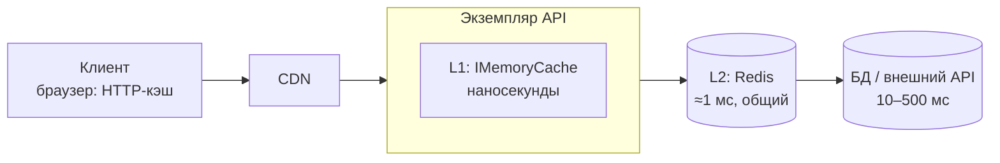
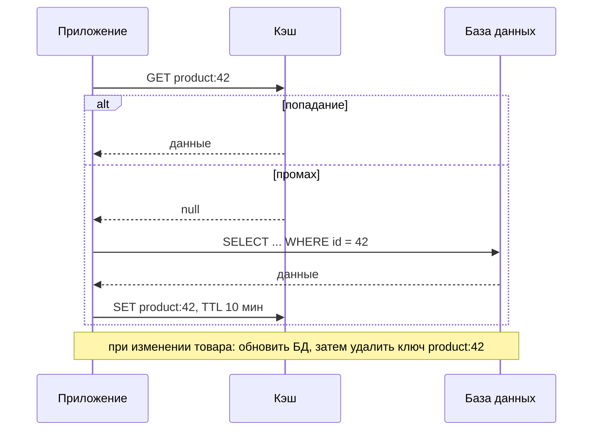
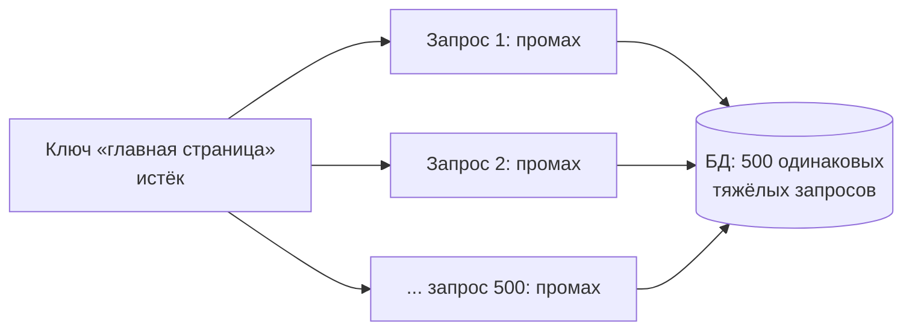

:::tldr
- **Кэш** хранит результаты дорогих операций (запросы к БД, вызовы API, вычисления) ближе к месту использования. Эффект: меньше задержка, меньше нагрузка на источник. Цена — **устаревшие данные** и сложность инвалидации.
- **`IMemoryCache`** — в памяти процесса: наносекунды, хранит объекты (без сериализации), но **у каждого экземпляра свой** кэш (несогласованность между подами), теряется при рестарте, занимает память процесса. Всегда задавайте **TTL и SizeLimit**.
- **`IDistributedCache`** (Redis, SQL Server, NCache) — общий для всех экземпляров, переживает рестарты приложения, но: сетевой вызов (~0,5–2 мс), **сериализация** (`byte[]`), нет встроенной защиты от stampede.
- **`HybridCache`** (.NET 9) — L1 (память) + L2 (распределённый) с **защитой от cache stampede**, тегами и единым API `GetOrCreateAsync`. Рекомендуемый выбор для новых проектов.
- **Redis** — не только кэш: атомарные операции (INCR, SETNX), TTL, Pub/Sub, структуры (hash, sorted set), распределённые блокировки, rate limiting.
- Паттерн по умолчанию — **Cache-Aside**. Главные риски: **stampede** (одновременный промах), **устаревание** (инвалидация), кэширование персональных данных в общий ключ.
:::

## Уровни кэша



| | IMemoryCache | IDistributedCache (Redis) | HybridCache |
|---|---|---|---|
| Где | Память процесса | Отдельный сервер | L1 память + L2 распределённый |
| Скорость | Наносекунды | ≈1 мс (сеть) | L1-попадание — наносекунды |
| Общий между экземплярами | Нет | Да | L2 — да |
| Переживает рестарт | Нет | Да | L2 — да |
| Хранение | Объекты | `byte[]` (сериализация) | Объекты + сериализация для L2 |
| Защита от stampede | `GetOrCreate` — нет гарантии одного вызова | Нет | **Да** |
| Теги / групповая инвалидация | Через `CancellationChangeToken` | Нет | **Да** (.NET 9+) |

## Cache-Aside



### IMemoryCache

```csharp
builder.Services.AddMemoryCache(o => o.SizeLimit = 10_000);   // единицы размера задаёте вы

public async Task<Product?> GetAsync(int id, CancellationToken ct) =>
    await cache.GetOrCreateAsync($"product:{id}", async entry =>
    {
        entry.AbsoluteExpirationRelativeToNow = TimeSpan.FromMinutes(10);
        entry.SlidingExpiration = TimeSpan.FromMinutes(2);
        entry.Size = 1;
        return await db.Products.AsNoTracking().FirstOrDefaultAsync(p => p.Id == id, ct);
    });
```

:::warning GetOrCreate не защищает от stampede
Если 100 запросов одновременно получили промах, фабрика может выполниться 100 раз. Для дорогих фабрик — `HybridCache`, `Lazy<Task<T>>` в `ConcurrentDictionary` или `SemaphoreSlim` на ключ.
:::

### IDistributedCache + Redis

```csharp
builder.Services.AddStackExchangeRedisCache(o =>
{
    o.Configuration = builder.Configuration.GetConnectionString("Redis");
    o.InstanceName = "shop:";
});

public async Task<ProductDto?> GetAsync(int id, CancellationToken ct)
{
    var key = $"product:{id}";
    var bytes = await cache.GetAsync(key, ct);
    if (bytes is not null) return JsonSerializer.Deserialize<ProductDto>(bytes);

    var dto = await LoadFromDbAsync(id, ct);
    if (dto is not null)
        await cache.SetAsync(key, JsonSerializer.SerializeToUtf8Bytes(dto),
            new DistributedCacheEntryOptions { AbsoluteExpirationRelativeToNow = TimeSpan.FromMinutes(10) }, ct);
    return dto;
}
```

### HybridCache (.NET 9)

```csharp
builder.Services.AddStackExchangeRedisCache(o => o.Configuration = redisConn);   // L2 подхватится автоматически
builder.Services.AddHybridCache(o =>
{
    o.DefaultEntryOptions = new HybridCacheEntryOptions
    {
        Expiration = TimeSpan.FromMinutes(10),          // L2
        LocalCacheExpiration = TimeSpan.FromMinutes(1)  // L1 — короче, чтобы экземпляры меньше расходились
    };
});

public ValueTask<ProductDto?> GetAsync(int id, CancellationToken ct) =>
    hybridCache.GetOrCreateAsync($"product:{id}",
        async token => await LoadFromDbAsync(id, token),       // выполнится ОДИН раз при конкурентных промахах
        tags: ["products", $"category:{categoryId}"],
        cancellationToken: ct);

// Инвалидация
await hybridCache.RemoveAsync($"product:{id}", ct);
await hybridCache.RemoveByTagAsync("products", ct);
```

## Cache stampede (thundering herd)



Решения:
- **Coalescing (single flight)** — один запрос строит значение, остальные ждут результат (HybridCache, `Lazy`, блокировка на ключ; в распределённом варианте — Redis lock).
- **Jitter в TTL** — ключи истекают не одновременно (`TTL = 10 мин ± 10%`).
- **Ранний фоновый refresh** (stale-while-revalidate, вероятностное раннее обновление): отдавать чуть устаревшее значение, пока в фоне строится новое.
- **Прогрев** кэша при старте/деплое.

## Что и как кэшировать

- Кэшируйте то, что **часто читается и редко меняется**: справочники, каталог, настройки, результаты тяжёлых агрегаций, ответы внешних API.
- Ключи — однозначные и с версией схемы: `v2:product:42:lang:ru`.
- **Персональные данные** — только с идентификатором пользователя/тенанта в ключе. Ошибка в ключе = утечка чужих данных.
- **Отрицательное кэширование**: кэшировать «не найдено» на короткое время, чтобы защитить БД от запросов несуществующих ключей (cache penetration).
- **Сериализация для Redis**: System.Text.Json (source generator), MessagePack/protobuf — компактнее и быстрее.
- **Размер значений**: Redis однопоточный по командам — большие значения (мегабайты) тормозят всех.

## Redis — больше, чем кэш

```csharp StackExchange.Redis: атомарные операции
var db = redis.GetDatabase();

await db.StringIncrementAsync($"views:product:{id}");                                    // счётчик
bool acquired = await db.StringSetAsync($"lock:report:{id}", instanceId, TimeSpan.FromSeconds(30), When.NotExists);  // SETNX-блокировка
await db.SortedSetIncrementAsync("top:products:today", id, 1);                            // рейтинг
var top10 = await db.SortedSetRangeByRankAsync("top:products:today", 0, 9, Order.Descending);
await db.PublishAsync(RedisChannel.Literal("cache-invalidation"), $"product:{id}");       // уведомить экземпляры
```

`IConnectionMultiplexer` — **один на приложение** (Singleton): он потокобезопасен и мультиплексирует команды через одно соединение.

## Вопросы на засыпку

:::qa Почему IMemoryCache опасен при нескольких экземплярах приложения?
У каждого экземпляра свой кэш: после изменения данных один под отдаёт новое значение, другие — старое до истечения TTL. Пользователь видит «мигающие» данные в зависимости от того, на какой под попал запрос. Решения: короткий TTL, распределённый кэш, рассылка инвалидации через Redis Pub/Sub или HybridCache с коротким L1.
:::

:::qa Что делать, если Redis недоступен?
Кэш не должен становиться единой точкой отказа: при ошибке кэша — идти в источник (с таймаутом на Redis ~100–200 мс и circuit breaker), логировать и мониторить. Но учитывать, что без кэша источник может не выдержать нагрузку — нужен запас или деградация функций.
:::

:::qa Чем absolute expiration отличается от sliding?
Absolute — запись истекает через фиксированное время после создания. Sliding — продлевается при каждом обращении; если к записи не обращались N минут — удаляется. Sliding без absolute опасен: «горячая» запись может жить вечно с устаревшими данными — комбинируйте их.
:::

:::qa Что такое cache penetration и cache avalanche?
Penetration — запросы к несуществующим ключам всегда проходят в БД (атака или ошибка) — лечится отрицательным кэшированием и bloom-фильтрами. Avalanche — массовое одновременное истечение многих ключей (или падение кэша) → лавина запросов в БД — лечится jitter в TTL, прогревом, отказоустойчивым кэшем.
:::

## Итог

`IMemoryCache` — самый быстрый, но локальный; `IDistributedCache`/Redis — общий, но с сетью и сериализацией; `HybridCache` объединяет оба уровня и защищает от stampede. Кэшируйте часто читаемые и редко меняющиеся данные по паттерну cache-aside, всегда задавайте TTL и лимиты, продумайте ключи (особенно для персональных данных) и стратегию инвалидации — ей посвящён следующий вопрос.
