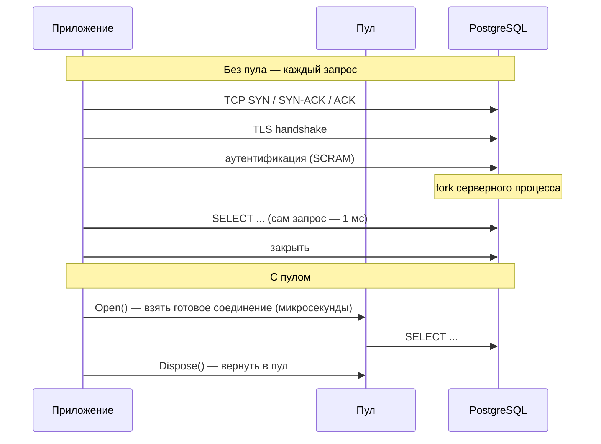
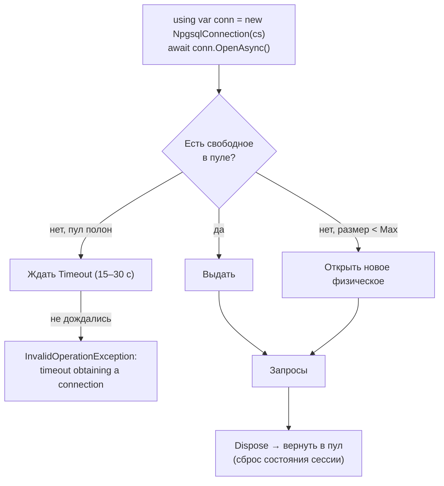
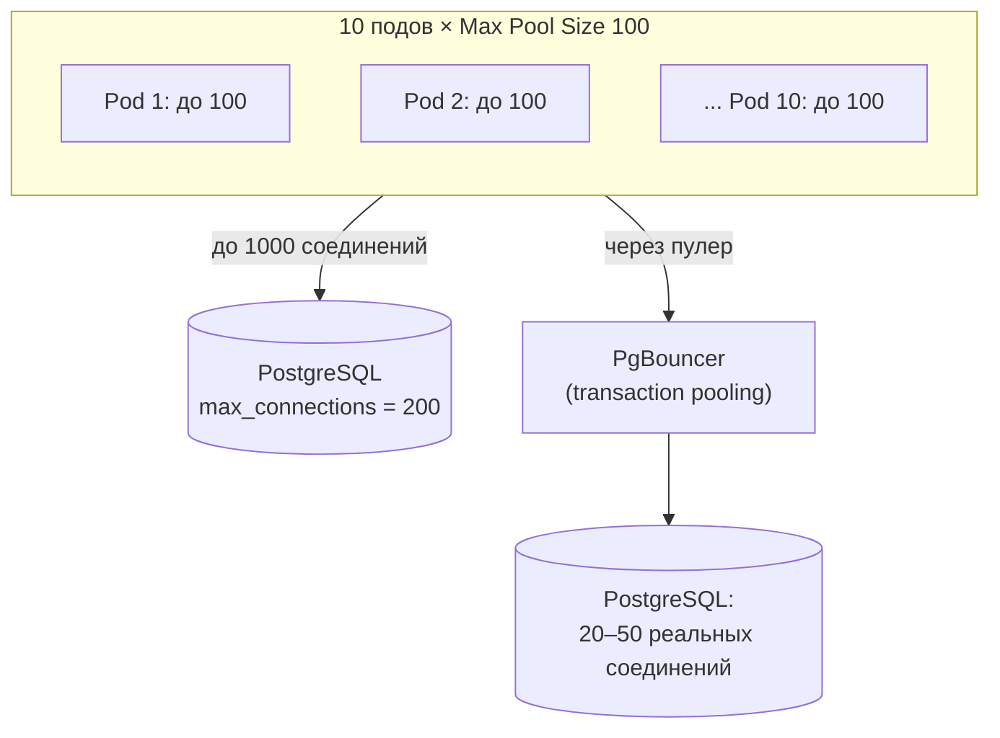
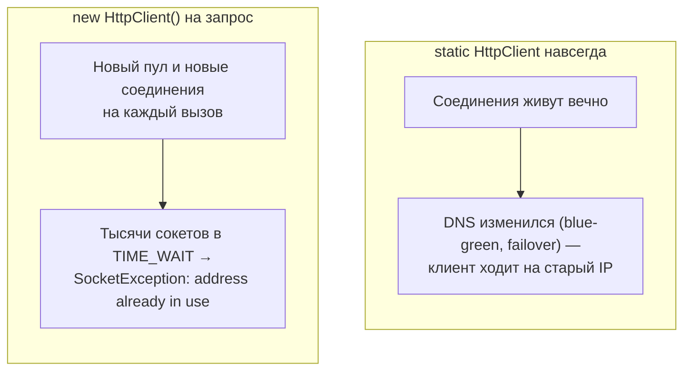

:::tldr
- Установка соединения дорогая: **TCP handshake + TLS + аутентификация** (для БД ещё и создание серверного процесса/сессии) — единицы–десятки миллисекунд. **Пул** держит открытые соединения и **переиспользует** их.
- **ADO.NET** (SqlClient, Npgsql): пул включён по умолчанию, **отдельный пул на каждую уникальную строку подключения**. `connection.Open()` берёт соединение из пула, `Dispose()`/`Close()` — **возвращает** его (не закрывает). `Max Pool Size` по умолчанию 100; при исчерпании — ожидание и `Timeout expired... obtaining a connection from the pool`.
- Причины исчерпания: **не вызван Dispose** (утечка соединений), долгие транзакции, медленные запросы под нагрузкой, sync-over-async, слишком маленький пул относительно нагрузки.
- **HTTP**: `HttpClient` использует `SocketsHttpHandler` с пулом соединений к каждому хосту. `new HttpClient()` на каждый запрос → **исчерпание сокетов** (TIME_WAIT); вечный статический `HttpClient` → **устаревший DNS**. Решение — **`IHttpClientFactory`** или один `HttpClient` с `PooledConnectionLifetime`.
- Масштабирование БД-соединений: у PostgreSQL каждое соединение — процесс (дорого), поэтому при многих экземплярах приложения используют **PgBouncer** (пулер на стороне БД). Считайте: `экземпляры × Max Pool Size ≤ лимит БД`.
:::

## Зачем нужен пул



## Пул соединений ADO.NET



```text Параметры строки подключения (Npgsql / SqlClient)
Host=db;Database=shop;Username=app;Password=***;
Pooling=true;                 # по умолчанию true
Minimum Pool Size=0;          # держать открытыми минимум N
Maximum Pool Size=100;        # по умолчанию 100
Connection Idle Lifetime=300; # закрывать простаивающие (Npgsql)
Timeout=15;                   # ожидание соединения из пула / установки
Command Timeout=30;           # таймаут команды
```

Важно:
- Пул — **на строку подключения** (и на процесс). Разные строки (даже порядок параметров, другой пароль, другая БД) → разные пулы.
- `Dispose` обязателен — `using`/`await using`. Без него соединение вернётся в пул только после финализации — практически утечка.
- EF Core сам открывает и закрывает соединение на время запроса/`SaveChanges` (или на время транзакции) — пулом пользуется автоматически.

### Диагностика исчерпания

```csharp Типичная утечка
public async Task<int> CountAsync()
{
    var conn = new NpgsqlConnection(_cs);          // нет using!
    await conn.OpenAsync();
    return (int)(long)(await new NpgsqlCommand("SELECT count(*) FROM orders", conn).ExecuteScalarAsync())!;
}   // соединение не возвращено в пул
```

- Счётчики: Npgsql/SqlClient публикуют метрики (`db.client.connections.usage`, idle/used, pending requests) через OpenTelemetry.
- На стороне БД: `SELECT state, count(*) FROM pg_stat_activity GROUP BY state;` — много `idle in transaction`? Долгие транзакции держат соединения.
- Долгие запросы под нагрузкой: каждый держит соединение дольше → при 100 одновременных медленных запросах пул исчерпан.

## Сколько соединений нужно



- Больше соединений ≠ быстрее: БД эффективна при числе активных соединений порядка «ядра × 2–4». Сотни активных соединений конкурируют за CPU, память и блокировки.
- **PgBouncer / Odyssey / RDS Proxy / Azure PgBouncer**: тысячи клиентских соединений → десятки серверных. Режим **transaction pooling** несовместим с session-состоянием (prepared statements на уровне сессии, `SET`, advisory locks уровня сессии) — Npgsql: `No Reset On Close=true`, осторожно с `Max Auto Prepare`.
- **Multiplexing** Npgsql: несколько команд по одному соединению — меньше соединений при высокой нагрузке.

## HTTP connection pooling



```csharp Правильно: IHttpClientFactory
builder.Services.AddHttpClient<ICatalogClient, CatalogClient>(c =>
{
    c.BaseAddress = new Uri("https://catalog.internal");
    c.Timeout = TimeSpan.FromSeconds(10);
})
.ConfigurePrimaryHttpMessageHandler(() => new SocketsHttpHandler
{
    PooledConnectionLifetime = TimeSpan.FromMinutes(2),       // пересоздавать соединения → подхватывать изменения DNS
    PooledConnectionIdleTimeout = TimeSpan.FromMinutes(1),
    MaxConnectionsPerServer = 100                              // лимит одновременных соединений к хосту (HTTP/1.1)
})
.AddStandardResilienceHandler();

public sealed class CatalogClient(HttpClient http) : ICatalogClient    // typed client: HttpClient создаётся фабрикой
{
    public Task<ProductDto?> GetAsync(int id, CancellationToken ct) => http.GetFromJsonAsync<ProductDto>($"/products/{id}", ct);
}
```

```csharp Правильно без DI: один клиент с ограниченным временем жизни соединений
private static readonly HttpClient Http = new(new SocketsHttpHandler { PooledConnectionLifetime = TimeSpan.FromMinutes(2) });
```

`IHttpClientFactory` кэширует и переиспользует `HttpMessageHandler`-ы (с пулами соединений), периодически ротируя их (`HandlerLifetime`, по умолчанию 2 минуты), а сами `HttpClient` — дешёвые обёртки, которые можно создавать часто.

## Другие пулы

| Ресурс | Пул / переиспользование |
|---|---|
| Redis (StackExchange.Redis) | Один `ConnectionMultiplexer` на приложение (мультиплексирование) |
| RabbitMQ | Одно `IConnection` на приложение, каналы — на поток/потребителя |
| gRPC | Один `GrpcChannel` на адрес (HTTP/2 мультиплексирование) |
| `DbContext` | `AddDbContextPool` — пул объектов контекста (не соединений) |
| Массивы, объекты | `ArrayPool<T>`, `ObjectPool<T>` |

## Вопросы на засыпку

:::qa Закрывает ли Dispose соединения физическое TCP-соединение?
Нет, при включённом пуле — возвращает его в пул (сбрасывая состояние сессии). Физически соединение закрывается по истечении idle-времени, `ClearPool`, при ошибке соединения или выключенном пуле.
:::

:::qa Почему после failover БД приложение долго сыплет ошибками?
В пуле остаются «мёртвые» соединения к старому primary. Драйверы обнаруживают их при использовании (ошибка) и удаляют; можно вызвать `NpgsqlConnection.ClearAllPools()`/`SqlConnection.ClearAllPools()`, настроить keepalive, ограничить время жизни соединений (`Connection Lifetime`), использовать retry-стратегию.
:::

:::qa Сколько ставить Max Pool Size?
Исходя из пропускной способности БД и числа экземпляров: сумма по всем экземплярам не должна превышать разумного числа активных соединений БД (или идти через пулер). Увеличение пула — не лекарство от медленных запросов: оно лишь переносит очередь из приложения в БД.
:::

:::qa Что такое TIME_WAIT и почему new HttpClient его вызывает?
После закрытия TCP-соединения сторона-инициатор держит сокет в состоянии TIME_WAIT (до нескольких минут), чтобы корректно обработать запоздавшие пакеты. Новый `HttpClient` с новым handler-ом на каждый запрос открывает и закрывает соединения массово — эфемерные порты заканчиваются.
:::

## Итог

Пул соединений убирает дорогую установку соединения из каждого запроса. Для БД — всегда `Dispose`, короткие транзакции, разумный `Max Pool Size` с учётом числа экземпляров и пулер (PgBouncer) при масштабировании. Для HTTP — `IHttpClientFactory` или один клиент с `PooledConnectionLifetime`, но никогда не `new HttpClient()` на запрос.
