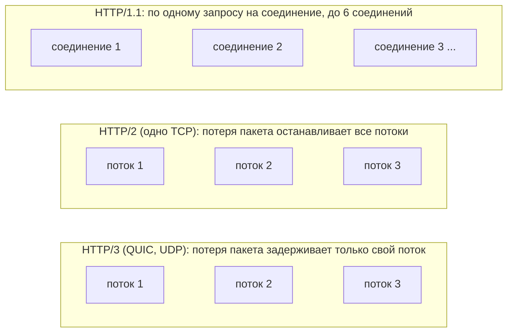
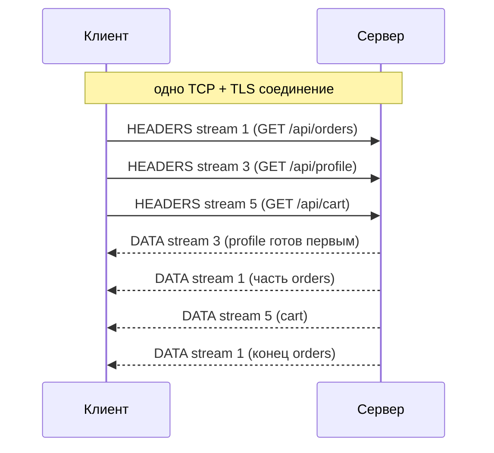
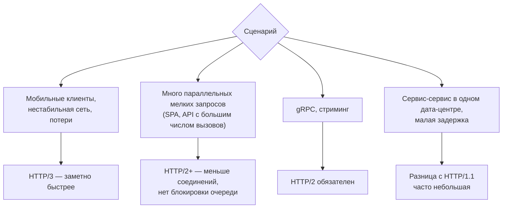

:::tldr
- **HTTP/1.1**: текстовый протокол, **один запрос за раз** на соединение (pipelining на практике не используется) → браузеры открывают 6 соединений на хост, заголовки повторяются в каждом запросе.
- **HTTP/2** (поверх TCP, обычно с TLS): **бинарные фреймы**, **мультиплексирование** — много параллельных потоков (streams) в одном соединении, сжатие заголовков **HPACK**, приоритеты, flow control. Основа **gRPC**.
- Проблема HTTP/2 — **head-of-line blocking на уровне TCP**: потеря одного пакета задерживает **все** потоки соединения.
- **HTTP/3** — поверх **QUIC** (UDP): потоки независимы на транспортном уровне (потеря пакета блокирует только свой поток), **быстрое установление** соединения (1-RTT, 0-RTT при возобновлении, TLS 1.3 встроен), **миграция соединения** при смене сети (Wi-Fi → LTE), сжатие заголовков **QPACK**.
- В .NET: Kestrel поддерживает HTTP/2 по умолчанию с TLS, HTTP/3 — `HttpProtocols.Http1AndHttp2AndHttp3` (нужен `libmsquic` на Linux). `HttpClient` умеет HTTP/2 и HTTP/3 (`DefaultRequestVersion`, `VersionPolicy`).
- Выгода: мобильные клиенты и нестабильные сети (HTTP/3), много мелких параллельных запросов, gRPC-стриминг, меньше соединений между сервисами. Внутри дата-центра разница HTTP/1.1 vs 2 часто невелика.
:::

## Эволюция



| | HTTP/1.1 | HTTP/2 | HTTP/3 |
|---|---|---|---|
| Транспорт | TCP | TCP (+TLS) | **QUIC (UDP)** + TLS 1.3 встроен |
| Формат | Текст | Бинарные фреймы | Бинарные фреймы |
| Параллельные запросы | По одному на соединение | **Мультиплексирование** в одном соединении | Мультиплексирование, **независимые потоки** |
| Head-of-line blocking | На уровне HTTP | На уровне TCP | Нет (на уровне потока) |
| Сжатие заголовков | Нет | HPACK | QPACK |
| Установка соединения | TCP + TLS: 2–3 RTT | То же | **1 RTT**, 0-RTT при возобновлении |
| Смена сети клиента | Новое соединение | Новое соединение | **Миграция** соединения (connection ID) |
| Server push | — | Был, фактически устарел | Нет на практике |

## HTTP/2: мультиплексирование и HPACK



- Не нужно ждать ответа на предыдущий запрос — ответы приходят по мере готовности.
- **HPACK**: повторяющиеся заголовки (`authorization`, `user-agent`, cookies) передаются индексом из динамической таблицы — экономия особенно заметна для API с большими JWT.
- Меньше соединений → меньше TLS-рукопожатий и нагрузка на балансировщики.

## HTTP/3 и QUIC

- QUIC реализует надёжность, порядок и контроль перегрузки **на каждый поток** поверх UDP — потеря пакета одного потока не останавливает остальные. Критично для мобильных сетей с потерями.
- TLS 1.3 встроен в рукопожатие QUIC: 1 RTT до первого запроса (TCP+TLS1.3 — 2 RTT), при возобновлении — 0-RTT (с оговорками о replay-атаках для неидемпотентных запросов).
- **Connection ID** позволяет продолжить соединение при смене IP клиента.
- Обнаружение: сервер объявляет поддержку заголовком `Alt-Svc: h3=":443"`; браузер/клиент переключается на HTTP/3 для следующих запросов.
- Требует открытого **UDP/443** на всём пути (некоторые корпоративные сети блокируют — клиенты откатываются на HTTP/2).

## Настройка Kestrel

```csharp
builder.WebHost.ConfigureKestrel(k =>
{
    k.ListenAnyIP(443, listen =>
    {
        listen.Protocols = HttpProtocols.Http1AndHttp2AndHttp3;   // HTTP/3 требует TLS
        listen.UseHttps();
    });

    k.Limits.Http2.MaxStreamsPerConnection = 100;
    k.Limits.Http2.InitialConnectionWindowSize = 1024 * 1024;
    k.Limits.Http3.MaxRequestHeaderFieldSize = 16 * 1024;
});
```

- HTTP/2 **без TLS** (h2c) браузеры не поддерживают, но для внутреннего gRPC за прокси можно: `listen.Protocols = HttpProtocols.Http2` на отдельном порту.
- HTTP/3 на Linux требует пакет `libmsquic`; в официальных образах .NET может потребоваться доустановка.
- За reverse proxy (Nginx, облачный LB) версию протокола с клиентом определяет **прокси**; до Kestrel может идти HTTP/1.1 — это нормально.

## HttpClient

```csharp
var client = new HttpClient(new SocketsHttpHandler { EnableMultipleHttp2Connections = true })
{
    DefaultRequestVersion = HttpVersion.Version30,
    DefaultVersionPolicy = HttpVersionPolicy.RequestVersionOrLower     // пробовать HTTP/3, откатываться на 2 / 1.1
};

var response = await client.GetAsync("https://api.example.uz/products");
Console.WriteLine(response.Version);    // 3.0, 2.0 или 1.1
```

`EnableMultipleHttp2Connections` — если лимит потоков одного соединения (обычно 100) исчерпан, открыть дополнительное соединение (важно для интенсивного gRPC).

## Где выигрыш заметен



## Вопросы на засыпку

:::qa Почему HTTP/2 может быть медленнее HTTP/1.1 на сетях с потерями?
Все потоки идут через одно TCP-соединение. TCP гарантирует порядок байтов: при потере пакета весь поток данных ждёт ретрансмиссии — останавливаются все HTTP-потоки (TCP head-of-line blocking). У HTTP/1.1 с 6 соединениями потеря влияет только на одно из них. HTTP/3 решает это, перенося потоки в транспорт.
:::

:::qa Зачем gRPC нужен HTTP/2?
gRPC использует мультиплексирование для множества параллельных вызовов по одному соединению, двусторонние потоки (client/bidi streaming) и **трейлеры** HTTP/2 для передачи статуса вызова после тела ответа. В HTTP/1.1 этого нет (отсюда gRPC-Web как обходной путь для браузеров).
:::

:::qa Что такое 0-RTT и чем он опасен?
Клиент, уже общавшийся с сервером, может отправить данные в первом же пакете, не дожидаясь рукопожатия. Но такие данные могут быть перехвачены и **повторены** злоумышленником (replay). Поэтому 0-RTT допустим только для идемпотентных запросов (GET), и серверы часто его ограничивают.
:::

:::qa Нужно ли включать HTTP/2 между Nginx и Kestrel?
Обычно нет: внутри дата-центра задержки малы, прокси держит пул keep-alive соединений к бэкенду по HTTP/1.1. HTTP/2 до бэкенда нужен для gRPC (или при большом числе параллельных запросов на одно соединение).
:::

## Итог

HTTP/2 мультиплексирует запросы в одном соединении и сжимает заголовки, но страдает от TCP head-of-line blocking; HTTP/3 на QUIC делает потоки независимыми, ускоряет установку соединения и переживает смену сети. Kestrel и HttpClient поддерживают обе версии: включайте HTTP/3 для внешних клиентов (особенно мобильных), HTTP/2 — обязательно для gRPC, а внутри дата-центра оценивайте выгоду замерами.
