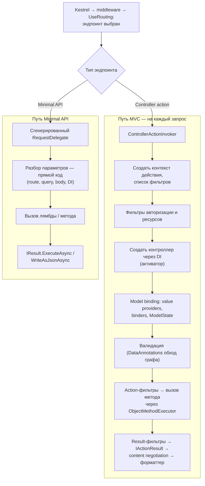
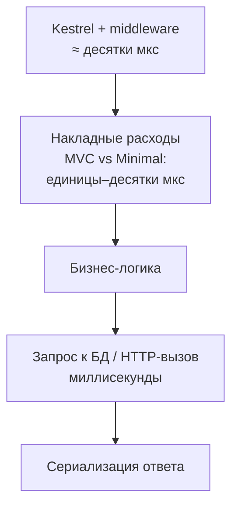

:::tldr
- Minimal API и контроллеры используют **один и тот же** Kestrel, конвейер middleware и endpoint routing. Разница — в том, **что происходит после выбора эндпоинта**.
- **Контроллеры (MVC)**: `ControllerActionInvoker` → создание **контроллера** через DI, **фильтры** (authorization, resource, action, exception, result — даже пустой конвейер фильтров имеет цену), **model binding** через провайдеры и `ModelState`, **валидация**, `IActionResult` → **выбор форматтера** (content negotiation). Много абстракций и аллокаций на запрос.
- **Minimal API**: при старте для каждого обработчика строится **специализированный `RequestDelegate`** под его сигнатуру (через expression trees или **Request Delegate Generator** — source generator). Привязка параметров «вшита» в сгенерированный код, нет контроллера, нет фильтров MVC (если не добавлены), результат пишется напрямую (`IResult`, JSON через System.Text.Json).
- Итог — меньше аллокаций и косвенных вызовов на запрос: в микробенчмарках десятки процентов выше пропускная способность; для реального приложения с БД разница обычно **незаметна** на фоне I/O.
- Дополнительно: Minimal API совместим с **NativeAOT** и trimming (RDG + JSON source generation) — быстрый старт и меньше памяти, чего MVC не поддерживает.
:::

## Где расходятся пути



## Что генерируется для Minimal API

Для обработчика:

```csharp
app.MapGet("/products/{id:int}", async (int id, [FromQuery] string? lang, IProductService svc, CancellationToken ct) =>
    await svc.GetAsync(id, lang, ct) is { } p ? TypedResults.Ok(p) : TypedResults.NotFound());
```

`RequestDelegateFactory` (или RDG на этапе компиляции) строит код примерно такого вида:

```csharp Сгенерированный делегат (упрощённо)
async Task Handler(HttpContext httpContext)
{
    // route value → int без рефлексии и провайдеров
    if (!int.TryParse((string?)httpContext.Request.RouteValues["id"], out var id))
    { httpContext.Response.StatusCode = 400; return; }

    var lang = (string?)httpContext.Request.Query["lang"];
    var svc = httpContext.RequestServices.GetRequiredService<IProductService>();
    var ct = httpContext.RequestAborted;

    var result = await userHandler(id, lang, svc, ct);   // прямой вызов лямбды
    await result.ExecuteAsync(httpContext);              // Ok<T> → JSON через System.Text.Json
}
```

Вся «магия» model binding разрешена **заранее**: для каждого параметра известен источник и способ разбора. В рантайме — прямые вызовы, без обхода провайдеров, без `ModelStateDictionary`, без создания контроллера.

## Request Delegate Generator и AOT

```xml
<PropertyGroup>
  <PublishAot>true</PublishAot>                       <!-- включает RDG автоматически -->
  <!-- или явно: <EnableRequestDelegateGenerator>true</EnableRequestDelegateGenerator> -->
</PropertyGroup>
```

```csharp
var builder = WebApplication.CreateSlimBuilder(args);        // минимальный набор сервисов
builder.Services.ConfigureHttpJsonOptions(o => o.SerializerOptions.TypeInfoResolverChain.Insert(0, AppJsonContext.Default));

[JsonSerializable(typeof(ProductDto))]
internal partial class AppJsonContext : JsonSerializerContext;
```

- RDG генерирует делегаты **при компиляции** → нет expression trees и рефлексии при старте, быстрее запуск, совместимо с NativeAOT.
- Контроллеры построены на рефлексии (обнаружение, активация, привязка) и **не поддерживают** NativeAOT.

## Насколько быстрее

| Сценарий | Разница Minimal API vs Controllers |
|---|---|
| «Hello world» / JSON-сериализация без I/O (TechEmpower-подобные тесты) | Заметная: десятки процентов RPS, меньше аллокаций на запрос |
| Реальный эндпоинт с запросом к БД 5–50 мс | Единицы процентов или незаметно — время доминирует I/O |
| Время старта и память (с NativeAOT) | Существенная: старт в десятки мс, меньший working set |



Вывод: переход на Minimal API ради скорости оправдан для очень нагруженных, «тонких» эндпоинтов (прокси, шлюзы, кэшированные ответы, high-RPS сервисы) и для AOT-сценариев (serverless, быстрое масштабирование). Для типичного CRUD-сервиса выбор делается по удобству и стилю кода.

## Что уравнивает шансы

- **Фильтры эндпоинтов** в Minimal API тоже имеют цену — добавляйте их осознанно.
- Контроллеры можно ускорить: убрать лишние глобальные фильтры, использовать `System.Text.Json` source generation, `[ApiController]` без лишних провайдеров, избегать тяжёлой валидации больших графов.
- Главные выигрыши производительности почти всегда в другом: запросы к БД, кэширование, аллокации, сериализация, сеть.

## Вопросы на засыпку

:::qa Почему у контроллеров есть накладные расходы, даже если фильтров нет?
MVC-конвейер универсален: на каждый запрос создаётся контекст действия, проверяется набор фильтров (глобальные фильтры и соглашения часто добавляются фреймворком — например, для `[ApiController]`, антифоргери, форматтеров), активируется контроллер, выполняется привязка через систему провайдеров и заполняется `ModelState`. Всё это аллокации и косвенные вызовы.
:::

:::qa Что делает CreateSlimBuilder?
Создаёт `WebApplicationBuilder` с минимальным набором функций: без IIS-интеграции, без HTTPS-конфигурации по умолчанию, без Regex-ограничений маршрутов, с ограниченными провайдерами логирования — меньше размер приложения и быстрее старт, особенно с NativeAOT.
:::

:::qa Как Minimal API обрабатывает ошибки привязки параметров?
Сгенерированный код при неудачном разборе (например, `id` не число, нет обязательного тела) возвращает 400 (в Development — с описанием в логах и ответе, настраивается `RouteHandlerOptions.ThrowOnBadRequest`). Модель `ModelState` не используется.
:::

:::qa Стоит ли переписывать существующие контроллеры на Minimal API ради производительности?
Обычно нет: выигрыш для I/O-bound эндпоинтов мал, а переписывание стоит времени и рисков. Сначала профилируйте — узкое место почти наверняка в БД, сериализации или внешних вызовах. Новые высоконагруженные или AOT-сервисы — хороший кандидат для Minimal API.
:::

## Итог

Minimal API быстрее контроллеров потому, что вместо универсального MVC-конвейера (фильтры, активация контроллера, провайдеры привязки, content negotiation) выполняется заранее сгенерированный под сигнатуру обработчика делегат. Это заметно в высоконагруженных «тонких» эндпоинтах и открывает NativeAOT, но для типичного сервиса с базой данных разница теряется на фоне I/O.
