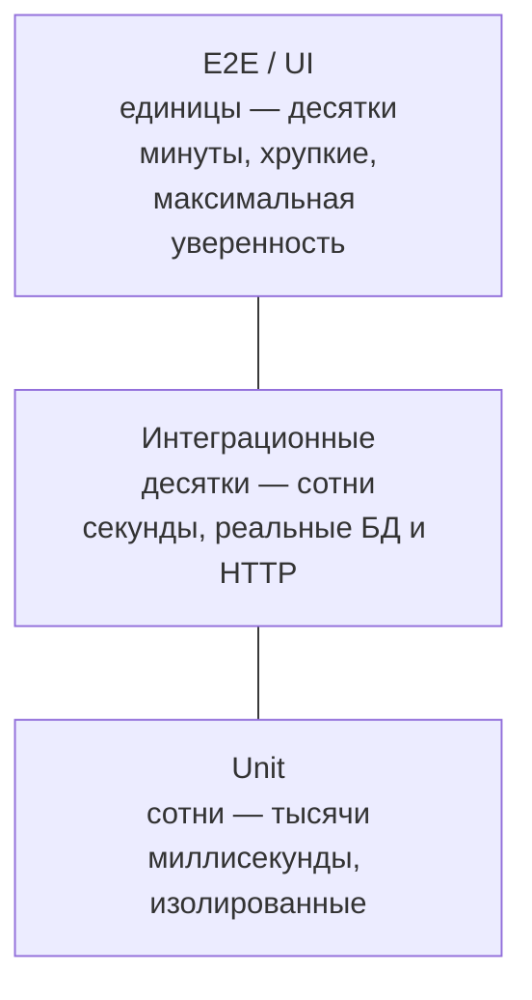
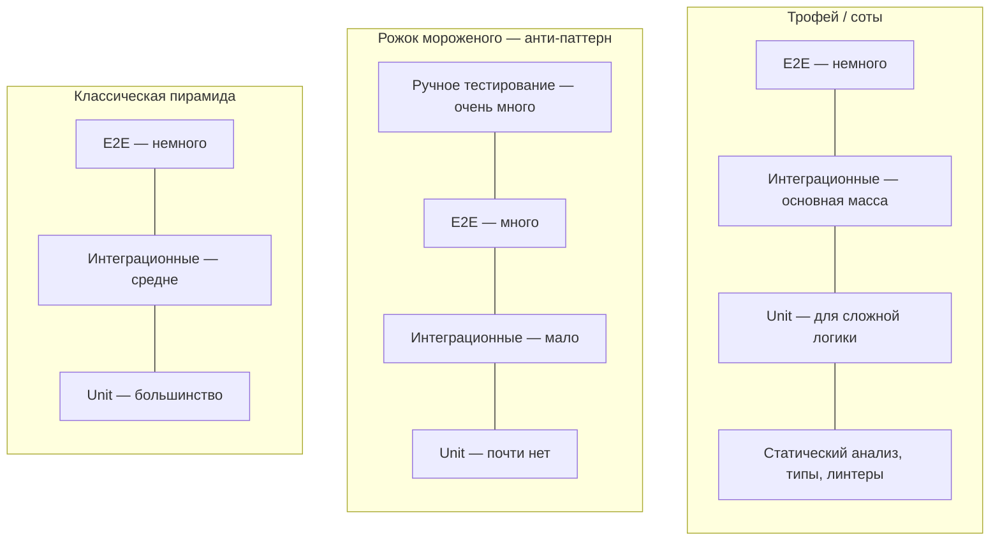
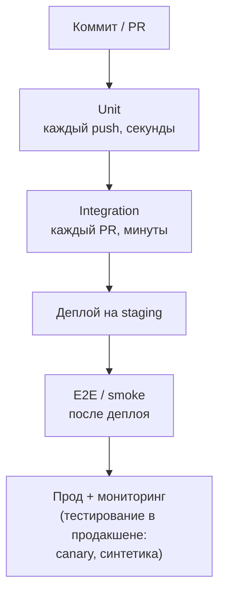

:::tldr
- **Пирамида** (Майк Кон): внизу — **много** быстрых и дешёвых **unit-тестов**, в середине — **меньше** интеграционных, наверху — **немного** медленных и хрупких **E2E**.
- **Unit** — логика одного класса/функции в изоляции, миллисекунды, без I/O. **Integration** — взаимодействие с реальными зависимостями (БД, HTTP-конвейер, брокер), секунды. **E2E** — вся система глазами пользователя (браузер, API), минуты.
- Чем выше уровень — тем выше **уверенность** в работе системы, но медленнее, дороже, хрупче и сложнее диагностика.
- Анти-паттерн — **«рожок мороженого»**: много ручных и E2E-тестов, мало unit-тестов → медленная обратная связь.
- Для современных .NET API популярна **«трофей»/«сота»** (testing trophy/honeycomb): основной вес на **интеграционных** тестах через `WebApplicationFactory` + Testcontainers — они дёшевы и проверяют реальное поведение.
:::

## Пирамида



| Уровень | Что проверяет | Скорость | Стоимость поддержки | Что находит |
|---|---|---|---|---|
| **Unit** | Функцию/класс, доменную логику | Мс | Низкая | Ошибки логики, граничные случаи |
| **Integration** | Компонент + реальные зависимости: SQL, маппинг EF, сериализация, middleware, DI | Секунды | Средняя | Ошибки конфигурации, запросов, контрактов между слоями |
| **Contract** | Совместимость API между сервисами (Pact) | Секунды | Средняя | Ломающие изменения контрактов |
| **E2E** | Сценарий пользователя через всю систему | Минуты | Высокая | Ошибки интеграции всего со всем, окружения |
| **Manual / exploratory** | То, что сложно автоматизировать | Часы | Высокая | UX, неожиданные сценарии |

## Примеры каждого уровня

```csharp Unit: доменная логика без зависимостей
public class OrderTests
{
    [Fact]
    public void Cannot_add_item_to_paid_order()
    {
        var order = Order.Create(CustomerId.New());
        order.AddItem(ProductId.New(), 1, new Money(1000, "UZS"));
        order.MarkPaid();

        var act = () => order.AddItem(ProductId.New(), 1, new Money(500, "UZS"));

        act.Should().Throw<DomainException>().WithMessage("*оплаченный*");
    }
}
```

```csharp Integration: весь HTTP-конвейер + реальная БД в контейнере
public class OrdersApiTests(ApiFactory factory) : IClassFixture<ApiFactory>
{
    [Fact]
    public async Task Post_order_returns_201_and_persists()
    {
        var client = factory.CreateClient();

        var response = await client.PostAsJsonAsync("/api/orders", new { customerId = SeedData.CustomerId, items = new[] { new { sku = "A-1", qty = 2 } } });

        response.StatusCode.Should().Be(HttpStatusCode.Created);
        await using var db = factory.CreateDbContext();
        (await db.Orders.CountAsync()).Should().Be(1);
    }
}
```

```csharp E2E: браузер через Playwright
[Test]
public async Task Customer_can_checkout()
{
    await Page.GotoAsync("https://staging.shop.uz");
    await Page.GetByRole(AriaRole.Button, new() { Name = "В корзину" }).First.ClickAsync();
    await Page.GetByRole(AriaRole.Link, new() { Name = "Оформить заказ" }).ClickAsync();
    await Page.GetByLabel("Телефон").FillAsync("+998901234567");
    await Page.GetByRole(AriaRole.Button, new() { Name = "Подтвердить" }).ClickAsync();
    await Expect(Page.GetByText("Заказ оформлен")).ToBeVisibleAsync();
}
```

## Пирамида, трофей, соты



Почему в .NET-сервисах часто выбирают «трофей»:
- Много кода — «клей»: маппинг, запросы EF, конфигурация, сериализация. Unit-тест с моками всего этого проверяет лишь, что вызваны моки.
- `WebApplicationFactory` + Testcontainers дают интеграционный тест за секунды на реальной PostgreSQL.
- Такие тесты устойчивы к рефакторингу: проверяют поведение через публичный API, а не внутреннюю структуру.

При этом **сложная доменная логика** (расчёты, правила, машины состояний) — идеальный кандидат для многочисленных быстрых unit-тестов.

## Свойства хорошего теста

- **Быстрый** — запускается при каждом изменении.
- **Изолированный / независимый** — не зависит от порядка и других тестов, не делит состояние.
- **Повторяемый / детерминированный** — одинаковый результат всегда (никаких `DateTime.Now`, случайностей без seed, внешних сервисов).
- **Самопроверяющийся** — сам говорит pass/fail.
- **Своевременный** — написан вместе с кодом.
- **Проверяет поведение, а не реализацию** — не ломается при рефакторинге без изменения поведения.

(Первые пять — акроним **FIRST**.)

## Тесты в CI



Быстрые тесты — раньше, медленные — позже; падение на раннем этапе останавливает конвейер.

## Вопросы на засыпку

:::qa Почему E2E-тестов должно быть мало?
Они медленные (минуты), хрупкие (зависят от UI, данных, окружения, сети), а при падении трудно найти причину. Они нужны для проверки ключевых пользовательских сценариев («оформить заказ»), а не каждого граничного случая — те проверяются на нижних уровнях.
:::

:::qa Что такое flaky-тест и что с ним делать?
Тест, который иногда проходит, иногда падает без изменений кода. Причины: гонки и таймауты, общее состояние между тестами, зависимость от времени/порядка/сети. Такие тесты подрывают доверие к CI — их нужно чинить или временно изолировать с задачей на исправление, а не перезапускать до зелёного.
:::

:::qa Что такое контрактные тесты?
Проверяют совместимость потребителя и поставщика API без развёртывания обоих: потребитель описывает ожидания (Pact-контракт), поставщик в своём CI проверяет, что им соответствует. Замена части дорогих E2E-тестов в микросервисах.
:::

:::qa Нужны ли unit-тесты на контроллеры?
Обычно нет: контроллер — тонкий слой маршрутизации, привязки и сериализации, которые лучше проверяет интеграционный тест через `WebApplicationFactory`. Unit-тесты — на логику, которая в контроллере жить не должна.
:::

## Итог

Пирамида учит балансу: много быстрых тестов внизу, мало медленных наверху. В .NET-сервисах центр тяжести часто смещается к интеграционным тестам на реальной инфраструктуре в контейнерах, а unit-тесты концентрируются на сложной доменной логике. Главное — быстрая, надёжная обратная связь и тесты, проверяющие поведение, а не реализацию.
