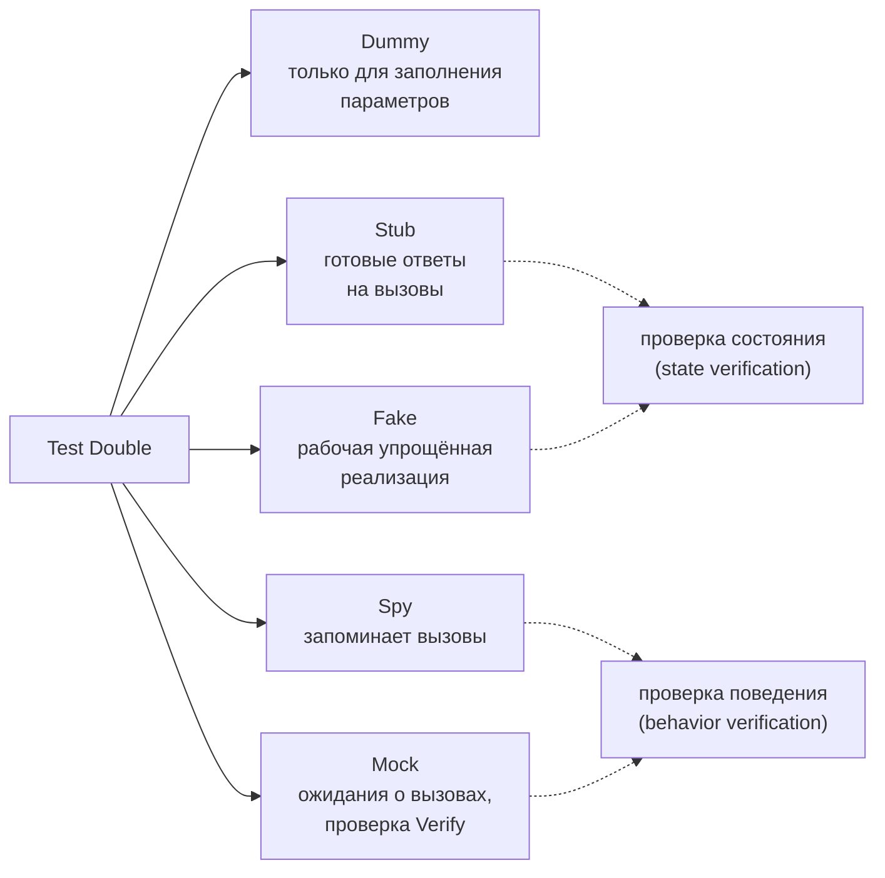
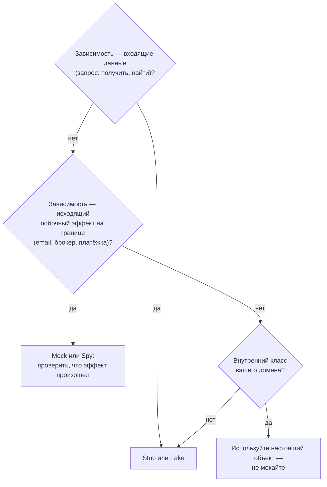

:::tldr
- **Test double** — общее название объектов-заменителей реальных зависимостей в тестах (термин Джерарда Месароша).
- **Dummy** — заглушка, которую передают, но не используют (параметр конструктора).
- **Stub** — возвращает **заранее заданные ответы**; используется для **состояния** входа («репозиторий вернёт этот заказ»). Проверяем результат теста, а не стаб.
- **Fake** — **рабочая упрощённая реализация**: in-memory репозиторий, `FakeTimeProvider`, фейковый email-сервис со списком писем.
- **Spy** — записывает, как его вызывали, чтобы потом проверить (часто — фейк/стаб с журналом вызовов).
- **Mock** — объект с **ожиданиями о взаимодействии**: тест проверяет, что метод был вызван с нужными аргументами (`Verify`). Используется для **поведения** — когда результат теста и есть побочный эффект (отправка письма, публикация события).
- Правило: **стабы для запросов (queries), моки — для команд (commands) на границе системы**; не мокайте то, чем не владеете, и не проверяйте каждый вызов — тесты станут хрупкими.
:::

## Классификация



## Примеры

Тестируемый код:

```csharp
public sealed class RegisterUserHandler(IUserRepository users, IPasswordHasher hasher, IEmailSender email, TimeProvider clock)
{
    public async Task<Result<Guid>> Handle(RegisterUser cmd, CancellationToken ct)
    {
        if (await users.ExistsAsync(cmd.Email, ct)) return Result<Guid>.Fail("Email занят");
        var user = new User(cmd.Email, hasher.Hash(cmd.Password), clock.GetUtcNow());
        await users.AddAsync(user, ct);
        await email.SendWelcomeAsync(cmd.Email, ct);
        return Result<Guid>.Ok(user.Id);
    }
}
```

### Stub (NSubstitute / Moq)

```csharp
[Fact]
public async Task Fails_when_email_taken()
{
    var users = Substitute.For<IUserRepository>();
    users.ExistsAsync("ann@x.uz", Arg.Any<CancellationToken>()).Returns(true);      // stub: готовый ответ

    var sut = new RegisterUserHandler(users, Substitute.For<IPasswordHasher>(),        // dummy
                                      Substitute.For<IEmailSender>(), TimeProvider.System);

    var result = await sut.Handle(new RegisterUser("ann@x.uz", "P@ssw0rd"), default);

    result.IsSuccess.Should().BeFalse();                                             // проверяем РЕЗУЛЬТАТ
}
```

### Fake

```csharp
public sealed class InMemoryUserRepository : IUserRepository
{
    public List<User> Users { get; } = [];
    public Task<bool> ExistsAsync(string email, CancellationToken ct) => Task.FromResult(Users.Any(u => u.Email == email));
    public Task AddAsync(User user, CancellationToken ct) { Users.Add(user); return Task.CompletedTask; }
}

public sealed class FakeEmailSender : IEmailSender          // fake + spy: запоминает отправленные письма
{
    public List<string> Sent { get; } = [];
    public Task SendWelcomeAsync(string to, CancellationToken ct) { Sent.Add(to); return Task.CompletedTask; }
}

[Fact]
public async Task Registers_user_and_sends_welcome_email()
{
    var users = new InMemoryUserRepository();
    var email = new FakeEmailSender();
    var clock = new FakeTimeProvider(new DateTimeOffset(2025, 9, 30, 10, 0, 0, TimeSpan.Zero));   // Microsoft.Extensions.TimeProvider.Testing
    var sut = new RegisterUserHandler(users, new FakeHasher(), email, clock);

    await sut.Handle(new RegisterUser("ann@x.uz", "P@ssw0rd"), default);

    users.Users.Should().ContainSingle(u => u.Email == "ann@x.uz" && u.CreatedAt == clock.GetUtcNow());
    email.Sent.Should().Equal("ann@x.uz");
}
```

### Mock

```csharp
[Fact]
public async Task Sends_welcome_email()
{
    var email = new Mock<IEmailSender>();
    var sut = new RegisterUserHandler(new InMemoryUserRepository(), new FakeHasher(), email.Object, TimeProvider.System);

    await sut.Handle(new RegisterUser("ann@x.uz", "P@ssw0rd"), default);

    email.Verify(e => e.SendWelcomeAsync("ann@x.uz", It.IsAny<CancellationToken>()), Times.Once);   // проверка ВЗАИМОДЕЙСТВИЯ
}
```

## Сравнение

| | Stub | Fake | Spy | Mock |
|---|---|---|---|---|
| Содержит логику | Нет, фиксированные ответы | Да, упрощённую | Минимальную + журнал | Нет, ожидания |
| Что проверяем | Результат SUT | Результат и состояние фейка | Записанные вызовы | Вызовы (`Verify`) |
| Устойчивость к рефакторингу | Высокая | Высокая | Средняя | Низкая |
| Типичное применение | Запросы: репозиторий «вернёт X» | Репозитории, время, файловая система, брокер | Отправленные письма, события | Команды на внешнюю систему |
| Инструменты | Moq, NSubstitute, FakeItEasy | Рукописные классы, `FakeTimeProvider`, `FakeLogger` | Рукописные, `Received()` в NSubstitute | Moq `Verify`, NSubstitute `Received` |

## Когда что использовать



:::warning Типичные ошибки
- **Мокать всё подряд**, включая доменные объекты и value objects — тесты проверяют реализацию, а не поведение, и ломаются при любом рефакторинге.
- **Verify на запросы** (`repo.Verify(r => r.GetAsync(...))`) — не важно, как код получил данные, важно, что он сделал правильный вывод.
- **Мокать `DbContext`/`IQueryable`** — LINQ-to-Objects ведёт себя не как SQL; такие тесты зелёные, а в продакшене запрос падает. Для БД — интеграционные тесты.
- **Мокать сторонние типы** (`HttpClient`, SDK облака) напрямую — оборачивайте их своим интерфейсом-адаптером и мокайте его, а адаптер проверяйте интеграционно. Для `HttpClient` — фейковый `HttpMessageHandler` или WireMock.Net.
- Слишком строгие моки (`MockBehavior.Strict`) — любой новый вызов ломает тест.
:::

## Лондонская и детройтская школы

| | Детройтская (классическая, Кент Бек) | Лондонская (mockist, «Growing OO Software») |
|---|---|---|
| Единица теста | Поведение, может включать несколько классов | Один класс |
| Зависимости | Настоящие, двойники только для внешних/медленных | Двойники для всех соседей |
| Проверка | Состояние и результат | Взаимодействия |
| Плюсы | Устойчивость к рефакторингу | Точная локализация ошибки, дизайн «от интерфейсов» |
| Минусы | Падение может быть «далеко» от причины | Хрупкость, тесты повторяют реализацию |

Современная практика в .NET склоняется к классической школе с двойниками на **границах** (БД → контейнер, внешние API → фейки/WireMock, время → `FakeTimeProvider`).

## Вопросы на засыпку

:::qa Что такое «мокать то, чем не владеешь» и почему это плохо?
Мокая чужой API (SDK, `HttpClient`), вы фиксируете в тесте своё предположение о его поведении. Если предположение неверно или API изменится — тесты останутся зелёными. Правильно: свой интерфейс-адаптер (порт), мок/фейк этого интерфейса в unit-тестах и интеграционные тесты адаптера с настоящим API или его эмулятором.
:::

:::qa Как тестировать код, использующий DateTime.Now?
Ввести абстракцию времени: `TimeProvider` (.NET 8) — `clock.GetUtcNow()`. В тестах — `FakeTimeProvider` с управляемым временем (`Advance(TimeSpan)`), включая таймеры и `Task.Delay`.
:::

:::qa Чем Moq отличается от NSubstitute?
Оба создают динамические прокси. Moq: `new Mock<T>()`, `Setup(...).Returns(...)`, `.Object`, `Verify`. NSubstitute: `Substitute.For<T>()` сразу возвращает объект интерфейса, `x.Method().Returns(...)`, `Received()` — синтаксис короче. Выбор — дело вкуса команды.
:::

:::qa Как проверить логирование в тестах?
`FakeLogger<T>` из `Microsoft.Extensions.Diagnostics.Testing` собирает записи (`logger.Collector.GetSnapshot()`), можно проверить уровень и сообщение. Но проверяйте логи только если они — часть требований (аудит), а не каждую строку.
:::

## Итог

Stub и fake подставляют данные и упрощённое поведение, spy и mock — фиксируют взаимодействия. Используйте стабы и фейки для входящих зависимостей, моки — только для важных исходящих эффектов на границе системы, не мокайте свой домен, `DbContext` и чужие типы. Чем меньше тест знает о реализации, тем дольше он живёт.
