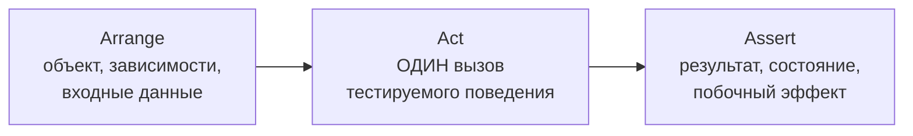

:::tldr
- **AAA** — структура теста из трёх частей: **Arrange** (подготовить объект, зависимости, данные), **Act** (выполнить **одно** действие), **Assert** (проверить результат).
- Цель — **читаемость**: по тесту сразу видно, что проверяется, при каких условиях и какой ожидается результат.
- Правила: одна секция Act (одно действие), нет логики (`if`, циклов) в тесте, в Assert — проверка **одного поведения** (можно несколько утверждений об одном результате), нет Arrange/Act после Assert.
- Эквивалент в BDD — **Given / When / Then**.
- Помогают: хорошие **имена тестов** (`Method_Condition_ExpectedResult` или предложение), **Test Data Builders** / Object Mother для громоздкого Arrange, переменная `sut` (system under test).
:::

## Структура

```csharp
[Fact]
public void Apply_discount_reduces_total_by_percentage()
{
    // Arrange — подготовка
    var order = new OrderBuilder()
        .WithItem(price: 100_000, qty: 2)
        .Build();
    var discount = new PercentageDiscount(10);

    // Act — одно действие
    order.ApplyDiscount(discount);

    // Assert — проверка результата
    order.Total.Should().Be(180_000);
}
```



## Given / When / Then

То же самое в терминах BDD — удобно, когда тест читают не только разработчики:

```csharp
[Fact]
public void Given_paid_order_when_cancel_then_refund_is_requested()
{
    // Given
    var order = OrderBuilder.Paid(total: 500_000);
    var payments = new FakePaymentGateway();
    var sut = new CancelOrderHandler(payments);

    // When
    sut.Handle(order);

    // Then
    order.Status.Should().Be(OrderStatus.Cancelled);
    payments.Refunds.Should().ContainSingle(r => r.Amount == 500_000);
}
```

## Правила хорошего AAA

| Правило | Почему |
|---|---|
| **Одно действие в Act** | Два действия = два теста; при падении непонятно, что сломалось |
| **Нет логики в тесте** (`if`, `for`, `try`) | Тест с логикой сам требует тестов; используйте параметризацию (`[Theory]`) |
| **Assert проверяет одно поведение** | Несколько утверждений об одном результате — нормально; про разные поведения — отдельные тесты |
| **Секции видны** (пустые строки или комментарии) | Быстро понять структуру |
| **Arrange — только необходимое** | Лишние детали скрывают суть; значения по умолчанию — в билдерах |
| **Нет зависимостей между тестами** | Каждый тест сам готовит своё состояние |
| **Детерминированность** | Время через `FakeTimeProvider`, случайности с фиксированным seed |

:::warning Признаки проблемного теста
```csharp
[Fact]
public async Task Test1()                                  // имя ничего не говорит
{
    var svc = CreateService();
    var id = await svc.CreateAsync(new("ann@x.uz"));      // Act №1
    Assert.NotEqual(Guid.Empty, id);
    await svc.ActivateAsync(id);                           // Act №2 после Assert
    var user = await svc.GetAsync(id);                     // Act №3
    if (user != null)                                      // логика в тесте
        Assert.True(user.IsActive);                        // может не выполниться вовсе!
}
```
:::

## Именование тестов

| Стиль | Пример |
|---|---|
| `Method_Scenario_Expected` | `Withdraw_AmountGreaterThanBalance_ThrowsInsufficientFunds` |
| Предложение | `Withdrawing_more_than_balance_is_rejected` |
| Given/When/Then | `Given_empty_cart_When_checkout_Then_error` |
| Should | `Checkout_should_fail_for_empty_cart` |

Главное — имя описывает **поведение** в терминах домена, а не реализацию («CallsRepositoryTwice» — плохо). Хорошее имя вместе с сообщением об ошибке позволяет понять проблему, не открывая код.

## Как сократить Arrange

### Test Data Builder

```csharp
public sealed class OrderBuilder
{
    private CustomerId _customer = CustomerId.New();
    private readonly List<(decimal price, int qty)> _items = [];
    private OrderStatus _status = OrderStatus.Draft;

    public OrderBuilder ForCustomer(CustomerId id) { _customer = id; return this; }
    public OrderBuilder WithItem(decimal price = 10_000, int qty = 1) { _items.Add((price, qty)); return this; }
    public OrderBuilder Paid() { _status = OrderStatus.Paid; return this; }

    public Order Build()
    {
        var order = Order.Create(_customer);
        foreach (var (price, qty) in _items.DefaultIfEmpty((10_000, 1)))
            order.AddItem(ProductId.New(), qty, new Money(price, "UZS"));
        if (_status == OrderStatus.Paid) order.MarkPaid();
        return order;
    }

    public static Order Paid(decimal total) => new OrderBuilder().WithItem(total).Paid().Build();
}
```

Тест указывает только то, что важно для проверяемого поведения («заказ оплачен на 500 000»), остальное — разумные значения по умолчанию. Для генерации «любых» данных — AutoFixture или Bogus.

### SUT-фабрика

```csharp
private static (CancelOrderHandler sut, FakePaymentGateway payments) CreateSut()
{
    var payments = new FakePaymentGateway();
    return (new CancelOrderHandler(payments), payments);
}
```

## Параметризация вместо циклов

```csharp
[Theory]
[InlineData(0, false)]
[InlineData(17, false)]
[InlineData(18, true)]
[InlineData(65, true)]
public void Can_buy_alcohol_depends_on_age(int age, bool expected)
{
    var customer = new CustomerBuilder().WithAge(age).Build();
    var result = AgePolicy.CanBuyAlcohol(customer);
    result.Should().Be(expected);
}
```

Каждый случай — отдельный тест в отчёте; падение одного не скрывает остальные.

## Вопросы на засыпку

:::qa Можно ли иметь несколько Assert в тесте?
Да, если они проверяют **одно поведение** (например, свойства одного результата). Проблема — когда тест проверяет несколько разных поведений: первое падение скрывает остальные. Для группы проверок удобно `using (new AssertionScope())` в FluentAssertions — отчёт покажет все несоответствия сразу.
:::

:::qa Что делать, если Arrange занимает 30 строк?
Это сигнал: либо тестируемый класс имеет слишком много зависимостей (нарушение SRP), либо нужны билдеры и фабрики тестовых данных. Иногда — что тест проверяет слишком большой сценарий и его стоит разделить.
:::

:::qa Где в AAA проверка вызова мока?
В секции Assert: `email.Verify(...)` или `email.Received().Send(...)` — это проверка побочного эффекта. Настройка мока (`Setup/Returns`) — в Arrange.
:::

:::qa Чем AAA отличается от Four-Phase Test?
Four-Phase (Месарош): Setup, Exercise, Verify, **Teardown**. Последняя фаза — освобождение ресурсов; в xUnit она выполняется через `Dispose`/`IAsyncLifetime`, поэтому в теле теста обычно не видна.
:::

## Итог

AAA делает тест историей из трёх частей: условия, действие, ожидаемый результат. Одно действие, никакой логики, проверка одного поведения, говорящее имя и билдеры тестовых данных — и тест становится документацией, которую легко читать и поддерживать.
