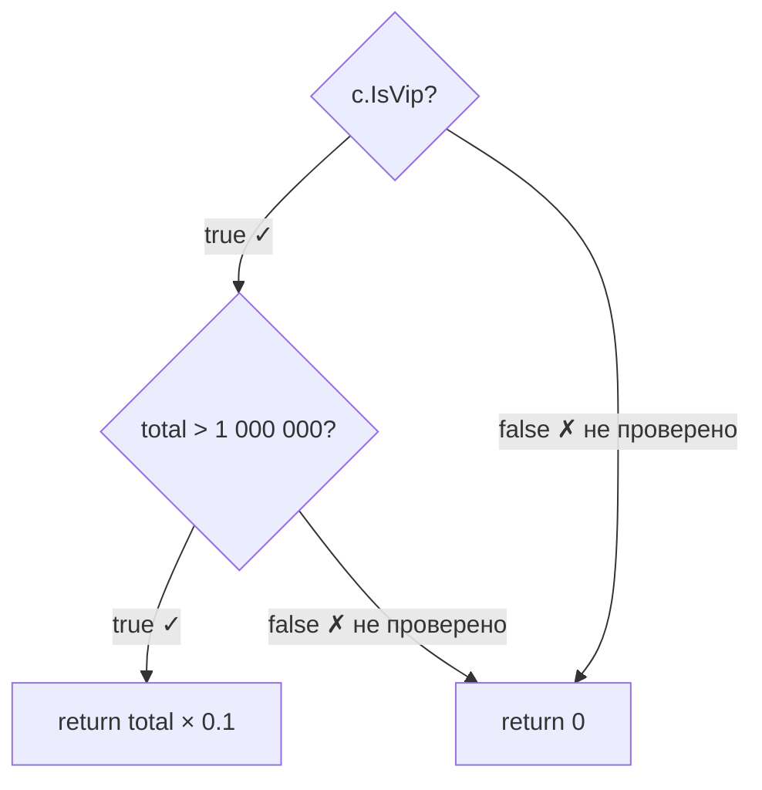
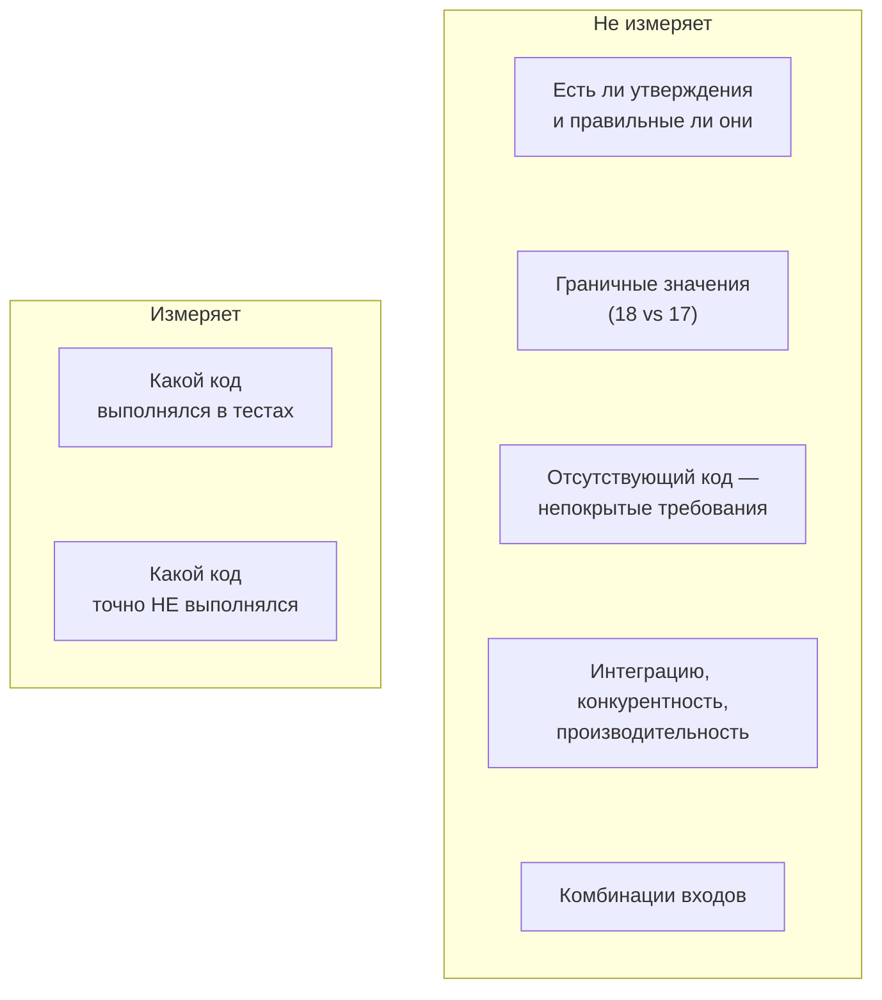

:::tldr
- **Code coverage** — доля кода, **выполненного** во время тестов. Виды: **line** (строки), **branch** (ветки `if`/`switch`/`&&`/`?:`), method, statement.
- Инструменты .NET: **Coverlet** (сбор, `--collect:"XPlat Code Coverage"`), **Microsoft.CodeCoverage** / `dotnet-coverage`, **ReportGenerator** (HTML-отчёты), интеграция с SonarQube, Codecov, Azure DevOps.
- Покрытие показывает, **что точно НЕ протестировано**, но **не** доказывает, что покрытый код протестирован хорошо: тест без утверждений даёт покрытие, граничные значения и комбинации входов не учитываются.
- Не измеряет: корректность утверждений, пропущенные требования (кода нет — покрывать нечего), интеграцию, конкурентность, производительность, качество тестовых данных.
- Разумные ориентиры — ~**70–85%** для бизнес-логики, **branch coverage важнее line**, контроль **покрытия нового кода** (diff coverage) в PR. 100% как цель — анти-паттерн (Закон Гудхарта). Для оценки качества тестов — **mutation testing**.
:::

## Что считается

```csharp
public decimal CalculateDiscount(Customer c, decimal total)
{
    if (c.IsVip && total > 1_000_000)         // 3 ветки логики: IsVip=false; IsVip=true & total ≤ 1M; оба true
        return total * 0.10m;
    return 0;
}

[Fact]
public void Vip_with_big_order_gets_10_percent() =>
    new Calc().CalculateDiscount(new Customer { IsVip = true }, 2_000_000).Should().Be(200_000);
```

| Метрика | Значение для этого теста |
|---|---|
| Line coverage | 3 из 4 строк (75%) — строка `return 0` не выполнялась |
| Branch coverage | 1 из 4 веток (25%) — не проверены: не-VIP, VIP с маленькой суммой, выход из `if` |



Branch coverage честнее: он показывает непроверенные решения.

## Сбор покрытия

```bash
# Coverlet collector (подключён в шаблонах xunit по умолчанию)
dotnet test --collect:"XPlat Code Coverage" --results-directory ./coverage

# HTML-отчёт
dotnet tool install -g dotnet-reportgenerator-globaltool
reportgenerator -reports:"coverage/**/coverage.cobertura.xml" -targetdir:"coverage/report" -reporttypes:"Html;Cobertura;MarkdownSummaryGithub"
```

```xml Исключения из покрытия
<!-- coverlet.runsettings -->
<RunSettings>
  <DataCollectionRunSettings>
    <DataCollectors>
      <DataCollector friendlyName="XPlat code coverage">
        <Configuration>
          <Format>cobertura</Format>
          <Exclude>[*]*.Migrations.*,[*]Program</Exclude>
          <ExcludeByAttribute>GeneratedCodeAttribute,CompilerGeneratedAttribute,ExcludeFromCodeCoverageAttribute</ExcludeByAttribute>
        </Configuration>
      </DataCollector>
    </DataCollectors>
  </DataCollectionRunSettings>
</RunSettings>
```

Исключайте то, что не имеет смысла тестировать unit-тестами: миграции, сгенерированный код, `Program.cs`, DTO без логики.

## Чего покрытие не видит

```csharp 100% покрытия — 0 пользы
[Fact]
public void Covers_everything()
{
    var calc = new Calc();
    calc.CalculateDiscount(new Customer { IsVip = true }, 2_000_000);
    calc.CalculateDiscount(new Customer { IsVip = true }, 10);
    calc.CalculateDiscount(new Customer { IsVip = false }, 10);
    // ни одного Assert — все ветки «покрыты», ошибки не будут обнаружены
}
```



Самое ценное в отчёте покрытия — **непокрытые** места: «вот ветка обработки ошибки оплаты, которую никто никогда не запускал».

## Покрытие как цель: закон Гудхарта

«Когда мера становится целью, она перестаёт быть хорошей мерой». Требование «90% покрытия» без культуры тестирования приводит к:
- тестам без утверждений и тестам геттеров/сеттеров;
- тестам, повторяющим реализацию (моки всего), ломающимся при рефакторинге;
- исключению «неудобного» кода из подсчёта.

Лучшие практики:
- **Diff/patch coverage**: новый и изменённый код в PR должен быть покрыт (например, ≥ 80%) — это стимулирует писать тесты вместе с кодом, не требуя «догонять» legacy.
- **Не допускать снижения** общего покрытия (ratchet).
- Смотреть на **branch coverage** и отчёты по критичным модулям, а не на одно число по решению.
- Проверять **качество** тестов mutation testing-ом на ключевой логике.

## Покрытие в CI

```yaml GitHub Actions (фрагмент)
- name: Test
  run: dotnet test --configuration Release --collect:"XPlat Code Coverage" --results-directory ./coverage
- name: Report
  run: reportgenerator -reports:"coverage/**/coverage.cobertura.xml" -targetdir:"coverage/report" -reporttypes:"MarkdownSummaryGithub;Cobertura"
- name: Summary
  run: cat coverage/report/SummaryGithub.md >> $GITHUB_STEP_SUMMARY
- name: Upload to Codecov
  uses: codecov/codecov-action@v4
  with: { files: coverage/report/Cobertura.xml }
```

## Сравнение метрик качества тестов

| Метрика | Что показывает | Слабость |
|---|---|---|
| Line coverage | Выполнялись ли строки | Не видит веток и проверок |
| Branch coverage | Выполнялись ли ветки решений | Не видит проверок и граничных значений |
| Mutation score | Замечают ли тесты изменения поведения | Долго считается |
| Число багов, пропущенных в прод | Реальная эффективность тестов | Запаздывающая метрика |
| Время/стабильность прогона | Полезность тестов как обратной связи | Не про полноту |

## Вопросы на засыпку

:::qa Какой процент покрытия «правильный»?
Универсального нет. Для доменной логики и библиотек разумно 80%+ по веткам; для «клея» (контроллеры, конфигурация) важнее интеграционные тесты, чем проценты. Важнее тренд, покрытие нового кода и отсутствие непокрытых критичных путей.
:::

:::qa Считается ли покрытие от интеграционных тестов?
Да, если собирать покрытие при их прогоне (Coverlet работает для любых тестов в процессе). Интеграционные тесты через `WebApplicationFactory` дают большое покрытие реального поведения — это нормально и полезно.
:::

:::qa Почему покрытие async-методов иногда выглядит странно?
Компилятор генерирует state machine, и инструменты могут показывать непокрытые «ветки» в сгенерированном коде (например, путь синхронного завершения). Coverlet умеет их скрывать, но небольшие артефакты возможны — смотрите на смысл, а не на каждую ветку.
:::

:::qa Чем diff coverage лучше общего порога?
Общий порог в legacy-проекте либо недостижим, либо слишком низок, чтобы что-то значить. Diff coverage требует тестов именно для кода, который меняется сейчас, — постепенно улучшает покрытие там, где идёт работа, и не наказывает за историю.
:::

## Итог

Покрытие показывает, какой код выполнялся в тестах, и главное — какой не выполнялся никогда. Оно не говорит о качестве проверок, граничных случаях и пропущенных требованиях. Используйте branch coverage и покрытие нового кода как индикаторы, не превращайте процент в цель, а качество тестов оценивайте mutation testing-ом и реальными инцидентами.
