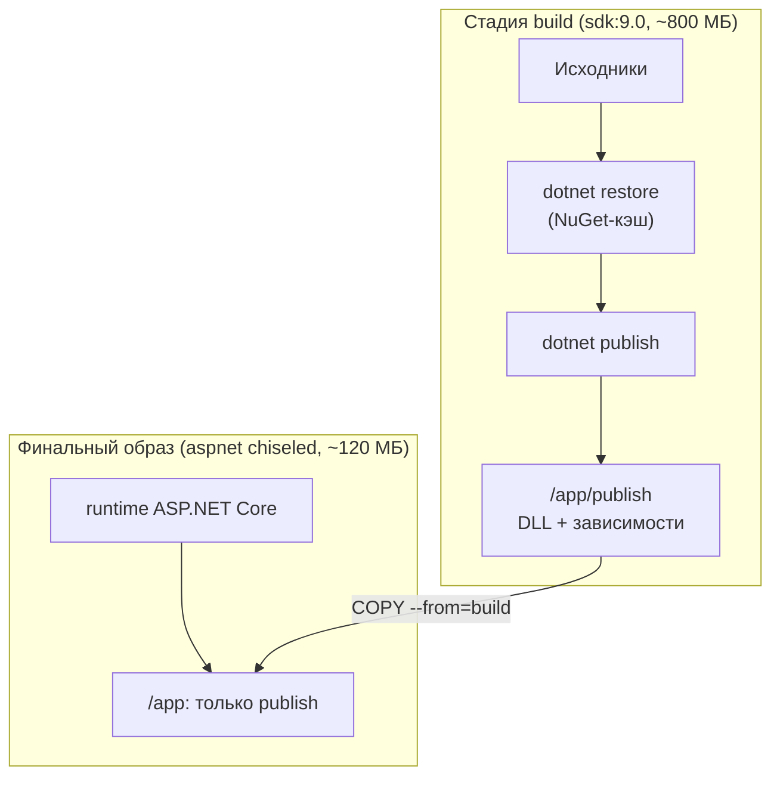
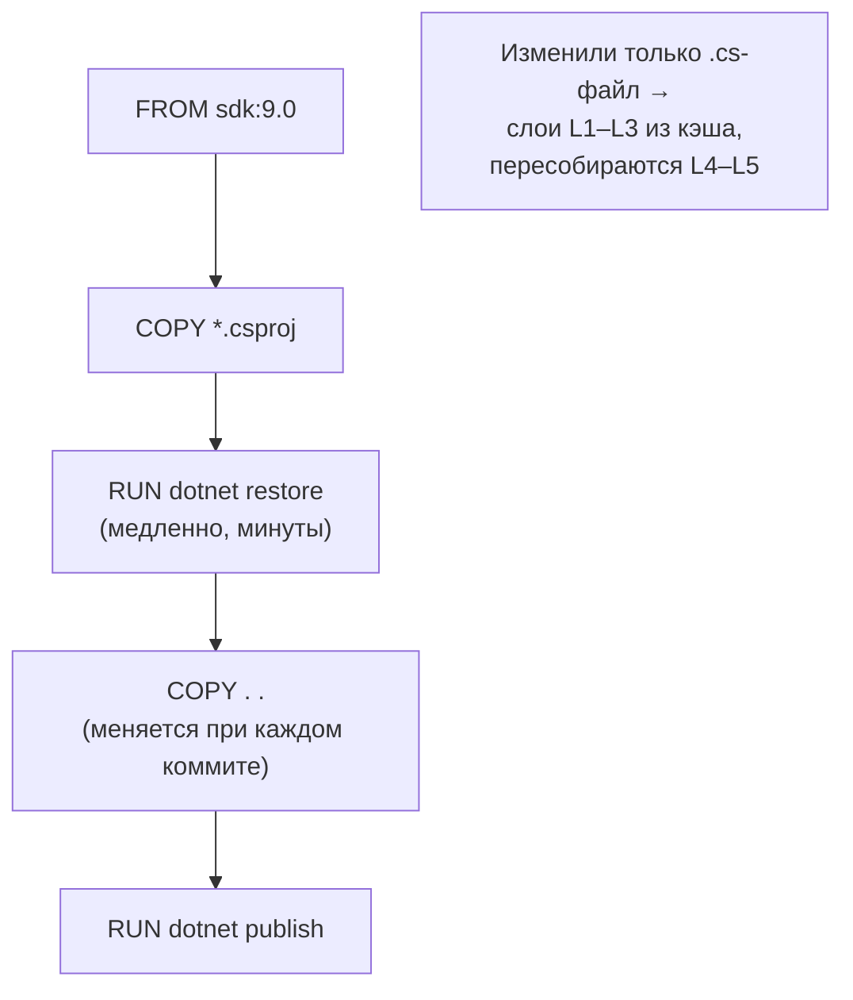

:::tldr
- **Контейнер** упаковывает приложение со всеми зависимостями в неизменяемый **образ**: одинаково работает на ноутбуке, в CI и в продакшене. Образ собирается из **слоёв**, каждая инструкция Dockerfile — слой, слои кэшируются.
- **Multi-stage build**: стадия `build` на образе **SDK** (~800 МБ) компилирует и публикует, финальная стадия на образе **runtime/aspnet** (~100–220 МБ) получает только результат `dotnet publish`. В продакшен-образ не попадают SDK, исходники, NuGet-кэш.
- **Кэширование слоёв**: сначала копировать `*.csproj` и делать `dotnet restore`, потом — остальной код. Изменение кода не инвалидирует слой с пакетами.
- Оптимизация: **chiseled / distroless**-образы Ubuntu (без shell и пакетного менеджера, ~меньше уязвимостей), **Alpine**, **NativeAOT** (`runtime-deps`, образ ~10–30 МБ), **trimming**, `.dockerignore`, запуск **не от root** (в .NET 8+ пользователь `app`, порт **8080**).
- Альтернатива Dockerfile: **`dotnet publish /t:PublishContainer`** — SDK сам собирает образ без Docker-файла.
:::

## Образы .NET

| Образ | Что внутри | Размер (примерно) | Для чего |
|---|---|---|---|
| `mcr.microsoft.com/dotnet/sdk:9.0` | SDK, компиляторы, CLI | ~800 МБ | Стадия сборки, CI |
| `mcr.microsoft.com/dotnet/aspnet:9.0` | ASP.NET Core runtime | ~220 МБ | Веб-приложения |
| `mcr.microsoft.com/dotnet/runtime:9.0` | .NET runtime | ~190 МБ | Консоль, воркеры |
| `aspnet:9.0-alpine` | Alpine + runtime | ~110 МБ | Меньший размер (musl) |
| `aspnet:9.0-noble-chiseled` | Ubuntu chiseled: только нужные файлы, без shell | ~110 МБ | Безопасный продакшен |
| `runtime-deps:9.0-noble-chiseled` | Только нативные зависимости | ~20 МБ | Self-contained и **NativeAOT** |

## Multi-stage Dockerfile

```dockerfile Dockerfile
# ---------- Стадия 1: сборка ----------
FROM mcr.microsoft.com/dotnet/sdk:9.0 AS build
WORKDIR /src

# 1) Только файлы проектов → restore кэшируется, пока не меняются зависимости
COPY Directory.Packages.props Directory.Build.props ./
COPY src/Shop.Api/Shop.Api.csproj src/Shop.Api/
COPY src/Shop.Application/Shop.Application.csproj src/Shop.Application/
COPY src/Shop.Domain/Shop.Domain.csproj src/Shop.Domain/
COPY src/Shop.Infrastructure/Shop.Infrastructure.csproj src/Shop.Infrastructure/
RUN dotnet restore src/Shop.Api/Shop.Api.csproj

# 2) Остальной код — меняется часто
COPY . .
RUN dotnet publish src/Shop.Api/Shop.Api.csproj -c Release -o /app/publish --no-restore /p:UseAppHost=false

# ---------- Стадия 2: финальный образ ----------
FROM mcr.microsoft.com/dotnet/aspnet:9.0-noble-chiseled AS final
WORKDIR /app
COPY --from=build /app/publish .
EXPOSE 8080
USER $APP_UID                                   # не root (пользователь app, UID 1654)
ENTRYPOINT ["dotnet", "Shop.Api.dll"]
```



## Слои и кэширование



Если сделать `COPY . .` до `restore`, любое изменение кода будет заново качать все пакеты.

```text .dockerignore
**/bin/
**/obj/
**/.vs/
**/node_modules/
.git/
*.md
**/appsettings.Development.json
**/*.user
Dockerfile*
docker-compose*
```

Без `.dockerignore` в контекст сборки уйдут `bin/obj` (конфликты при restore) и `.git` (медленно, риск утечки).

## Оптимизация размера и безопасности

```dockerfile NativeAOT: образ ~15–30 МБ, мгновенный старт
FROM mcr.microsoft.com/dotnet/sdk:9.0 AS build
RUN apt-get update && apt-get install -y clang zlib1g-dev      # нужен нативный линковщик
WORKDIR /src
COPY . .
RUN dotnet publish src/Shop.Api/Shop.Api.csproj -c Release -r linux-x64 -p:PublishAot=true -o /app

FROM mcr.microsoft.com/dotnet/runtime-deps:9.0-noble-chiseled
WORKDIR /app
COPY --from=build /app .
USER $APP_UID
ENTRYPOINT ["./Shop.Api"]
```

| Приём | Эффект |
|---|---|
| Multi-stage | Нет SDK и исходников в итоговом образе |
| Chiseled / distroless | Нет shell, apt, лишних библиотек → меньше CVE и поверхность атаки |
| Alpine | Меньше размер (внимание: musl, ICU/культуры — `InvariantGlobalization`) |
| Trimming (`PublishTrimmed`) + self-contained | Меньше размер, нужен `runtime-deps` |
| NativeAOT | Минимальный размер и старт; ограничения рефлексии |
| `USER app` / `$APP_UID` | Не root — компрометация приложения не даёт root в контейнере |
| Фиксированные теги или digest | `aspnet:9.0.4-noble-chiseled` или `@sha256:...` — воспроизводимость |
| Сканирование | Trivy, Grype, Docker Scout в CI |

## Сборка без Dockerfile

```bash
dotnet publish src/Shop.Api -c Release /t:PublishContainer \
  -p:ContainerRepository=registry.example.uz/shop-api \
  -p:ContainerImageTag=1.4.2 \
  -p:ContainerBaseImage=mcr.microsoft.com/dotnet/aspnet:9.0-noble-chiseled
```

SDK сам собирает OCI-образ (без Docker daemon), выбирает базовый образ, выставляет non-root пользователя и порт. Удобно для простых сервисов.

## Запуск и конфигурация

```bash
docker build -t shop-api:1.4.2 .
docker run -d -p 8080:8080 \
  -e ASPNETCORE_ENVIRONMENT=Production \
  -e ConnectionStrings__Default="Host=db;Database=shop;Username=app;Password=***" \
  --memory=512m --cpus=1 \
  shop-api:1.4.2
```

```yaml docker-compose.yml для локальной разработки
services:
  api:
    build: .
    ports: ["8080:8080"]
    environment:
      ConnectionStrings__Default: Host=db;Database=shop;Username=app;Password=dev
    depends_on:
      db: { condition: service_healthy }
  db:
    image: postgres:17-alpine
    environment: { POSTGRES_USER: app, POSTGRES_PASSWORD: dev, POSTGRES_DB: shop }
    healthcheck: { test: ["CMD-SHELL", "pg_isready -U app"], interval: 5s, retries: 10 }
```

.NET учитывает **ограничения контейнера** (cgroups): число доступных CPU для пула потоков и GC, лимит памяти для размера кучи (`GCHeapHardLimit` по умолчанию 75% лимита).

## Вопросы на засыпку

:::qa Почему в .NET 8+ контейнер слушает порт 8080, а не 80?
Официальные образы запускают приложение от непривилегированного пользователя `app`, а порты ниже 1024 требуют root-привилегий. Поэтому по умолчанию `ASPNETCORE_HTTP_PORTS=8080`.
:::

:::qa Зачем /p:UseAppHost=false?
Отключает создание нативного исполняемого файла-обёртки (`Shop.Api` рядом с `Shop.Api.dll`) — в контейнере запускаем через `dotnet Shop.Api.dll`, apphost не нужен и лишь увеличивает образ.
:::

:::qa Как отлаживать chiseled-образ без shell?
Через `docker debug` / `kubectl debug` с эфемерным отладочным контейнером, разделяющим пространство процессов; или собирать отдельный debug-вариант образа. Диагностические инструменты .NET (dotnet-trace, dotnet-dump) можно запускать из сайдкар-контейнера через общий `/tmp`.
:::

:::qa Чем образ отличается от контейнера?
Образ — неизменяемый шаблон из слоёв (файловая система + метаданные). Контейнер — запущенный экземпляр образа с собственным записываемым слоем, процессами, сетью. Из одного образа запускается сколько угодно контейнеров.
:::

## Итог

Хороший Dockerfile для .NET — multi-stage: сборка на SDK, запуск на минимальном runtime-образе, restore в отдельном слое для кэша, `.dockerignore`, non-root пользователь и фиксированные версии. Для максимальной компактности и безопасности — chiseled-образы и NativeAOT, для простоты — `PublishContainer` прямо из SDK.
