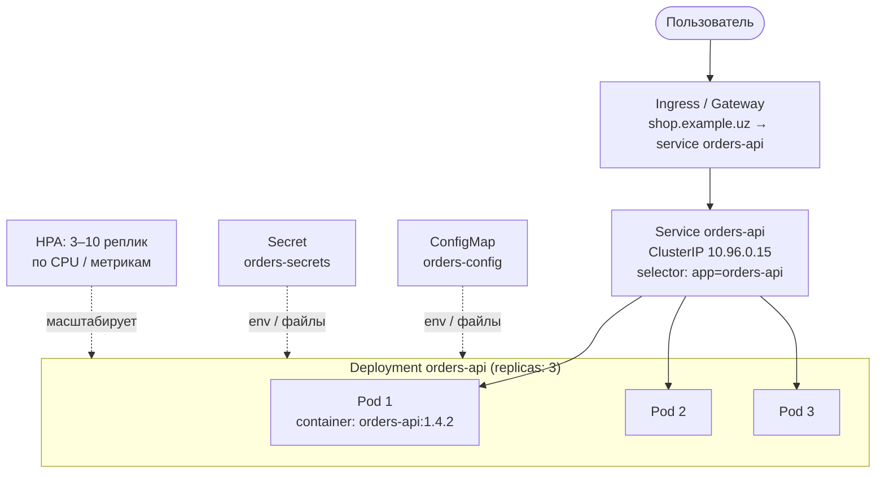

:::tldr
- **Kubernetes** — оркестратор контейнеров: вы описываете **желаемое состояние** (YAML-манифесты), контроллеры постоянно приводят кластер к нему (перезапуск упавших, масштабирование, раскатка версий).
- **Pod** — минимальная единица: один (или несколько тесно связанных) контейнеров с общей сетью и томами. Эфемерен: его IP меняется, его пересоздают.
- **Deployment** — управляет ReplicaSet-ами и поддерживает **N реплик** пода, выполняет **rolling update** и откат (`rollout undo`).
- **Service** — стабильное DNS-имя и виртуальный IP для набора подов (по **label selector**) + балансировка. Типы: `ClusterIP` (внутри кластера), `NodePort`, `LoadBalancer`. Внешний HTTP — через **Ingress** / Gateway API.
- **ConfigMap** — неконфиденциальная конфигурация; **Secret** — пароли, ключи (по умолчанию лишь base64 — нужно шифрование etcd, RBAC или внешние хранилища). Передаются в под как **переменные окружения** или **файлы**.
- Также: **probes** (liveness/readiness/startup), **resources** (requests/limits), **HPA** (автомасштабирование), **Namespace**, **StatefulSet**, **Job/CronJob**.
:::

## Общая картина



## Pod

```yaml
apiVersion: v1
kind: Pod
metadata:
  name: orders-api-debug
  labels: { app: orders-api }
spec:
  containers:
    - name: orders-api
      image: registry.example.uz/orders-api:1.4.2
      ports: [{ containerPort: 8080 }]
```

Поды напрямую почти не создают — ими управляют контроллеры (Deployment, StatefulSet, Job). Несколько контейнеров в поде — для **сайдкаров** (прокси service mesh, сборщик логов, dotnet-monitor).

## Deployment

```yaml deployment.yaml
apiVersion: apps/v1
kind: Deployment
metadata:
  name: orders-api
  namespace: shop
spec:
  replicas: 3
  selector:
    matchLabels: { app: orders-api }
  strategy:
    type: RollingUpdate
    rollingUpdate: { maxSurge: 1, maxUnavailable: 0 }     # не уменьшать число работающих реплик при раскатке
  template:
    metadata:
      labels: { app: orders-api, version: "1.4.2" }
    spec:
      containers:
        - name: orders-api
          image: registry.example.uz/orders-api:1.4.2
          ports: [{ containerPort: 8080 }]
          envFrom:
            - configMapRef: { name: orders-config }
          env:
            - name: ConnectionStrings__Default
              valueFrom: { secretKeyRef: { name: orders-secrets, key: db-connection } }
          resources:
            requests: { cpu: "250m", memory: "256Mi" }    # для планировщика: сколько гарантировать
            limits:   { memory: "512Mi" }                  # превышение памяти → OOMKilled
          readinessProbe:
            httpGet: { path: /health/ready, port: 8080 }
          livenessProbe:
            httpGet: { path: /health/live, port: 8080 }
          securityContext:
            runAsNonRoot: true
            readOnlyRootFilesystem: true
            allowPrivilegeEscalation: false
```

```mermaid Rolling update: замена подов по одному
sequenceDiagram
    participant D as Deployment
    participant Old as ReplicaSet v1.4.1 (3 пода)
    participant New as ReplicaSet v1.4.2
    D->>New: создать 1 под (maxSurge: 1)
    New-->>D: под готов (readiness OK)
    D->>Old: удалить 1 под
    D->>New: создать ещё 1
    New-->>D: готов
    D->>Old: удалить ещё 1
    Note over D: ... пока все поды не станут v1.4.2
    Note over D,New: если новые поды не проходят readiness —<br/>раскатка останавливается; kubectl rollout undo
```

## Service

```yaml service.yaml
apiVersion: v1
kind: Service
metadata: { name: orders-api, namespace: shop }
spec:
  type: ClusterIP
  selector: { app: orders-api }          # все поды с этой меткой — бэкенды сервиса
  ports:
    - port: 80                           # порт сервиса
      targetPort: 8080                   # порт контейнера
```

Другие поды обращаются по DNS: `http://orders-api` (в том же namespace) или `http://orders-api.shop.svc.cluster.local`. Под, не прошедший **readiness**, исключается из балансировки.

| Тип Service | Доступ |
|---|---|
| `ClusterIP` | Только внутри кластера (по умолчанию) |
| `NodePort` | Порт на каждой ноде (30000–32767) |
| `LoadBalancer` | Внешний балансировщик облака |
| `Headless` (`clusterIP: None`) | DNS возвращает IP подов напрямую (StatefulSet, клиентская балансировка gRPC) |

## Ingress

```yaml ingress.yaml
apiVersion: networking.k8s.io/v1
kind: Ingress
metadata:
  name: shop
  annotations: { cert-manager.io/cluster-issuer: letsencrypt }
spec:
  ingressClassName: nginx
  tls: [{ hosts: [shop.example.uz], secretName: shop-tls }]
  rules:
    - host: shop.example.uz
      http:
        paths:
          - { path: /api/orders, pathType: Prefix, backend: { service: { name: orders-api, port: { number: 80 } } } }
          - { path: /, pathType: Prefix, backend: { service: { name: web, port: { number: 80 } } } }
```

## ConfigMap и Secret

```yaml
apiVersion: v1
kind: ConfigMap
metadata: { name: orders-config, namespace: shop }
data:
  ASPNETCORE_ENVIRONMENT: Production
  Features__NewCheckout: "true"
  appsettings.Production.json: |          # можно смонтировать как файл
    { "Logging": { "LogLevel": { "Default": "Information" } } }
---
apiVersion: v1
kind: Secret
metadata: { name: orders-secrets, namespace: shop }
type: Opaque
stringData:                                # в etcd хранится base64 — это НЕ шифрование
  db-connection: "Host=pg;Database=orders;Username=orders;Password=***"
```

Двойное подчёркивание `__` в имени переменной — разделитель секций конфигурации .NET. Для секретов в продакшене — шифрование etcd, RBAC, и внешние хранилища (Vault, Azure Key Vault через CSI driver или External Secrets Operator) — подробнее в вопросе про секреты.

## Ресурсы и автомасштабирование

- **requests** — сколько ресурсов планировщик гарантирует поду (используется для размещения и HPA).
- **limits** — потолок: превышение памяти → контейнер убивается (OOMKilled), CPU — троттлинг. .NET подстраивает GC и пул потоков под лимиты контейнера.

```yaml hpa.yaml
apiVersion: autoscaling/v2
kind: HorizontalPodAutoscaler
metadata: { name: orders-api }
spec:
  scaleTargetRef: { apiVersion: apps/v1, kind: Deployment, name: orders-api }
  minReplicas: 3
  maxReplicas: 10
  metrics:
    - type: Resource
      resource: { name: cpu, target: { type: Utilization, averageUtilization: 70 } }
```

## Прочие объекты

| Объект | Назначение |
|---|---|
| **Namespace** | Логическое разделение (команды, окружения), квоты, RBAC |
| **StatefulSet** | Поды со стабильными именами и томами (БД, брокеры) |
| **DaemonSet** | Под на каждой ноде (агенты логов и метрик) |
| **Job / CronJob** | Разовые и периодические задачи (миграции БД, отчёты) |
| **PersistentVolumeClaim** | Запрос постоянного хранилища |
| **PodDisruptionBudget** | Минимум доступных подов при обслуживании нод |
| **NetworkPolicy** | Правила сетевого доступа между подами |

## Базовые команды

```bash
kubectl apply -f k8s/                              # применить манифесты
kubectl get pods -n shop -o wide                    # поды, ноды, IP
kubectl describe pod orders-api-7d9f -n shop        # события: почему не стартует (ImagePullBackOff, OOMKilled)
kubectl logs -f deploy/orders-api -n shop           # логи
kubectl rollout status deploy/orders-api -n shop    # ход раскатки
kubectl rollout undo deploy/orders-api -n shop      # откат
kubectl port-forward svc/orders-api 8080:80 -n shop # доступ локально
kubectl exec -it orders-api-7d9f -n shop -- sh      # (если в образе есть shell)
```

## Вопросы на засыпку

:::qa Почему нельзя обращаться к поду по IP?
Поды эфемерны: при перезапуске, раскатке или переносе на другую ноду IP меняется. Service даёт стабильное имя и адрес и сам знает актуальный список готовых подов (через Endpoints/EndpointSlices).
:::

:::qa Что будет, если не указать resources?
Планировщик не знает, сколько ресурсов нужно поду, может «упаковать» слишком много подов на ноду; под без лимита памяти может занять всю память ноды и вызвать вытеснение других. HPA по CPU не работает без requests. .NET без лимитов увидит все ядра и память ноды.
:::

:::qa Чем ConfigMap отличается от Secret?
Технически — почти ничем (оба — пары ключ-значение, Secret в base64). Разница в обращении: Secret можно защитить RBAC, шифрованием в etcd, не показывать в выводе, монтировать в tmpfs. Для реальной защиты секретов нужны дополнительные меры.
:::

:::qa Что происходит при kubectl delete pod у Deployment?
ReplicaSet замечает, что подов меньше желаемого, и создаёт новый. Удаление пода — способ «перезапустить» его. Чтобы остановить приложение, меняют `replicas` Deployment или удаляют сам Deployment.
:::

## Итог

Kubernetes управляет желаемым состоянием: Deployment поддерживает нужное число подов и раскатывает версии, Service даёт им стабильный адрес и балансировку, Ingress открывает HTTP наружу, ConfigMap и Secret передают конфигурацию. Для .NET-сервиса обязательны probes, requests/limits, non-root, конфигурация через переменные окружения и корректный graceful shutdown.
