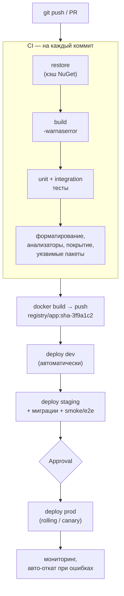

:::tldr
- **CI (Continuous Integration)** — каждый push/PR автоматически: restore → build → **тесты** → анализ (линтеры, форматирование, уязвимости, покрытие). Цель — быстро узнать, что изменение что-то сломало.
- **CD (Continuous Delivery/Deployment)** — артефакт, прошедший CI, автоматически доставляется в окружения: сборка **образа** → публикация в registry → деплой в **dev → staging → prod** (с ручным подтверждением для Delivery или полностью автоматически для Deployment).
- Принципы: **собрать один раз** — один и тот же неизменяемый артефакт (образ с тегом по commit SHA) продвигается по окружениям; конфигурация — от окружения. Быстрая обратная связь (кэш NuGet, параллельные джобы), **quality gates**, секреты — в хранилище CI, не в репозитории.
- **GitHub Actions** — `.github/workflows/*.yml`, jobs/steps, marketplace actions, environments с approvals. **GitLab CI** — `.gitlab-ci.yml`, stages, runners. **Azure DevOps** — `azure-pipelines.yml`, stages/jobs/tasks, environments.
- Миграции БД — отдельным шагом (bundle/скрипт) перед раскаткой, **smoke-тесты** после деплоя, возможность **отката**.
:::

## Конвейер целиком



## GitHub Actions

```yaml .github/workflows/ci-cd.yml
name: ci-cd

on:
  push: { branches: [main] }
  pull_request:

env:
  DOTNET_VERSION: "9.0.x"
  IMAGE: ghcr.io/${{ github.repository_owner }}/shop-api

jobs:
  build-test:
    runs-on: ubuntu-latest
    steps:
      - uses: actions/checkout@v4
      - uses: actions/setup-dotnet@v4
        with:
          dotnet-version: ${{ env.DOTNET_VERSION }}
          cache: true                                   # кэш NuGet по packages.lock.json
          cache-dependency-path: "**/packages.lock.json"
      - run: dotnet restore --locked-mode
      - run: dotnet format --verify-no-changes --no-restore
      - run: dotnet build -c Release --no-restore -warnaserror
      - run: dotnet test -c Release --no-build --collect:"XPlat Code Coverage" --logger trx --results-directory ./tests
        # интеграционные тесты с Testcontainers работают на ubuntu-latest без доп. настройки
      - run: dotnet list package --vulnerable --include-transitive 2>&1 | tee vuln.txt && ! grep -q "has the following vulnerable packages" vuln.txt
      - uses: actions/upload-artifact@v4
        if: always()
        with: { name: test-results, path: ./tests }

  image:
    needs: build-test
    if: github.ref == 'refs/heads/main'
    runs-on: ubuntu-latest
    permissions: { contents: read, packages: write }
    outputs: { tag: "${{ steps.meta.outputs.tag }}" }
    steps:
      - uses: actions/checkout@v4
      - id: meta
        run: echo "tag=sha-${GITHUB_SHA::7}" >> "$GITHUB_OUTPUT"
      - uses: docker/login-action@v3
        with: { registry: ghcr.io, username: "${{ github.actor }}", password: "${{ secrets.GITHUB_TOKEN }}" }
      - uses: docker/build-push-action@v6
        with:
          push: true
          tags: ${{ env.IMAGE }}:${{ steps.meta.outputs.tag }}
          cache-from: type=gha
          cache-to: type=gha,mode=max

  deploy-staging:
    needs: image
    runs-on: ubuntu-latest
    environment: staging                          # секреты и правила окружения
    steps:
      - uses: actions/checkout@v4
      - run: ./deploy/migrate.sh "${{ secrets.STAGING_DB }}"           # migration bundle / SQL-скрипт
      - run: helm upgrade --install shop-api ./deploy/chart --set image.tag=${{ needs.image.outputs.tag }} -f deploy/values-staging.yaml --wait
      - run: ./deploy/smoke-test.sh https://staging.shop.example.uz

  deploy-prod:
    needs: [image, deploy-staging]
    runs-on: ubuntu-latest
    environment: production                       # required reviewers → ручное подтверждение
    steps:
      - uses: actions/checkout@v4
      - run: helm upgrade --install shop-api ./deploy/chart --set image.tag=${{ needs.image.outputs.tag }} -f deploy/values-prod.yaml --wait --atomic
```

`--atomic` у Helm откатывает релиз, если раскатка не завершилась успешно.

## GitLab CI

```yaml .gitlab-ci.yml
stages: [build, test, package, deploy]

variables:
  DOTNET_IMAGE: mcr.microsoft.com/dotnet/sdk:9.0
  NUGET_PACKAGES: $CI_PROJECT_DIR/.nuget

default:
  image: $DOTNET_IMAGE
  cache:
    key: { files: ["**/packages.lock.json"] }
    paths: [.nuget/]

build:
  stage: build
  script:
    - dotnet restore --locked-mode
    - dotnet build -c Release --no-restore -warnaserror

test:
  stage: test
  services: [docker:dind]                      # для Testcontainers
  variables: { DOCKER_HOST: tcp://docker:2375, DOCKER_TLS_CERTDIR: "" }
  script:
    - dotnet test -c Release --logger "junit;LogFilePath=../../test-results/{assembly}.xml"
  artifacts:
    reports: { junit: test-results/*.xml }

package:
  stage: package
  image: docker:27
  services: [docker:dind]
  rules: [{ if: $CI_COMMIT_BRANCH == "main" }]
  script:
    - docker login -u $CI_REGISTRY_USER -p $CI_REGISTRY_PASSWORD $CI_REGISTRY
    - docker build -t $CI_REGISTRY_IMAGE:$CI_COMMIT_SHORT_SHA .
    - docker push $CI_REGISTRY_IMAGE:$CI_COMMIT_SHORT_SHA

deploy_prod:
  stage: deploy
  environment: production
  when: manual                                  # ручной запуск
  rules: [{ if: $CI_COMMIT_BRANCH == "main" }]
  script:
    - helm upgrade --install shop-api ./chart --set image.tag=$CI_COMMIT_SHORT_SHA --wait --atomic
```

## Azure DevOps (кратко)

```yaml azure-pipelines.yml
trigger: [main]
pool: { vmImage: ubuntu-latest }
stages:
  - stage: Build
    jobs:
      - job: BuildTest
        steps:
          - task: UseDotNet@2
            inputs: { version: 9.0.x }
          - script: dotnet test -c Release --logger trx --collect:"XPlat Code Coverage"
          - task: PublishTestResults@2
            inputs: { testResultsFormat: VSTest, testResultsFiles: "**/*.trx" }
          - task: Docker@2
            inputs: { command: buildAndPush, repository: shop-api, containerRegistry: acr-connection, tags: $(Build.BuildId) }
  - stage: Prod
    dependsOn: Build
    jobs:
      - deployment: Deploy
        environment: production                   # approvals и checks настраиваются на окружении
        strategy: { runOnce: { deploy: { steps: [ { script: "helm upgrade --install ..." } ] } } }
```

## Сравнение платформ

| | GitHub Actions | GitLab CI | Azure DevOps |
|---|---|---|---|
| Конфигурация | `.github/workflows/*.yml` | `.gitlab-ci.yml` | `azure-pipelines.yml` |
| Единицы | workflow → jobs → steps | pipeline → stages → jobs | pipeline → stages → jobs → steps/tasks |
| Переиспользование | Actions из marketplace, reusable workflows | `include`, templates, CI/CD components | Templates, extensions |
| Раннеры | GitHub-hosted, self-hosted | Shared, self-hosted runners | Microsoft-hosted, self-hosted agents |
| Окружения и approvals | Environments + required reviewers | Environments + manual / protected | Environments + approvals & checks |
| Сильная сторона | Экосистема, open source | Всё-в-одном (repo, registry, CI) | Интеграция с Azure, корпоративные процессы |

## Хорошие практики

- **Быстрый CI**: кэш NuGet (lock-файлы + `--locked-mode`), кэш слоёв Docker, параллельные джобы, разделение unit/integration, только затронутые проекты в монорепо.
- **Воспроизводимость**: фиксированные версии SDK (`global.json`), lock-файлы пакетов, теги образов по SHA (не `latest`).
- **Quality gates**: форматирование (`dotnet format`), анализаторы (`TreatWarningsAsErrors`), покрытие нового кода, SAST (CodeQL), сканирование образов (Trivy), уязвимые пакеты.
- **Безопасность**: секреты в хранилище CI/окружения, OIDC-федерация к облаку вместо долгоживущих ключей, минимальные `permissions`, защита основной ветки (обязательные проверки, review).
- **Деплой**: миграции отдельным шагом, стратегия раскатки (rolling/blue-green/canary), smoke-тесты, автоматический откат, уведомления.
- **Trunk-based + feature flags** — частые маленькие релизы безопаснее редких больших.

## Вопросы на засыпку

:::qa Чем Continuous Delivery отличается от Continuous Deployment?
Delivery — каждое изменение **готово** к выпуску (прошло все проверки, развернуто на staging), но выпуск в прод — ручное решение. Deployment — каждое изменение, прошедшее конвейер, **автоматически** уходит в прод без ручного шага.
:::

:::qa Почему нужно «собирать один раз»?
Если собирать отдельно для staging и prod, в прод может попасть не тот код/зависимости, что тестировались. Один артефакт (образ с неизменяемым тегом) гарантирует: в проде ровно то, что прошло проверки; различается только конфигурация окружения.
:::

:::qa Где хранить секреты для пайплайна?
В защищённых переменных/секретах платформы (GitHub Secrets, GitLab CI variables masked/protected, Azure DevOps variable groups + Key Vault), привязанных к окружениям. Лучше — OIDC workload identity federation к облаку (без статических ключей). Никогда — в YAML или репозитории.
:::

:::qa Как ускорить интеграционные тесты в CI?
Один контейнер БД на коллекцию тестов, Respawn вместо пересоздания, параллельные коллекции с отдельными базами, кэш Docker-образов, запуск медленных тестов отдельной джобой параллельно с unit-тестами.
:::

## Итог

CI проверяет каждое изменение (build, тесты, анализ), CD доставляет один и тот же неизменяемый артефакт по окружениям с миграциями, smoke-тестами, approvals и откатом. Платформы (GitHub Actions, GitLab CI, Azure DevOps) различаются синтаксисом и экосистемой, но принципы одинаковы: быстро, воспроизводимо, безопасно и автоматически.
